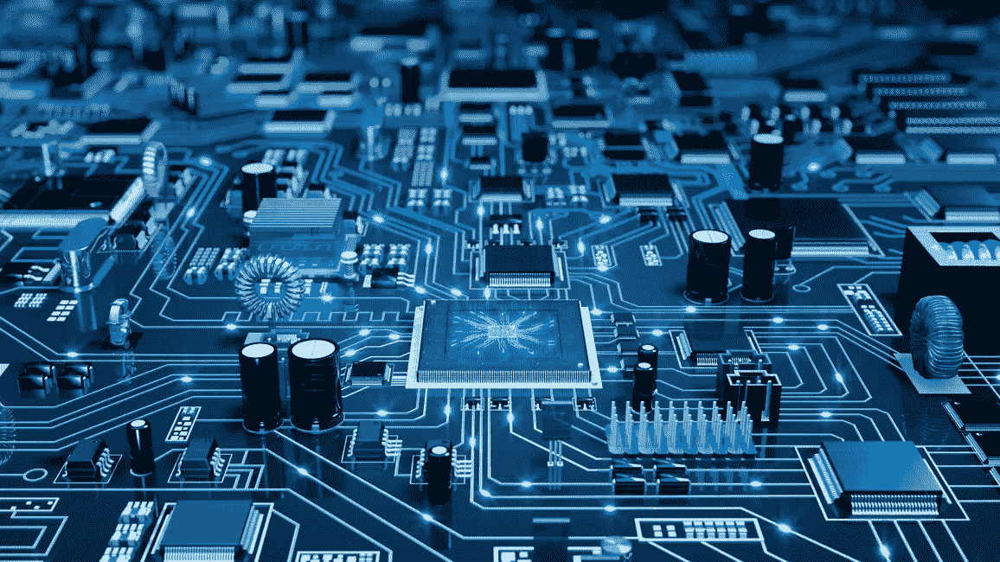

# 技术——好的、坏的还是中性的

> 原文：<https://medium.datadriveninvestor.com/technology-good-bad-or-neutral-45c5ec44e5ba?source=collection_archive---------1----------------------->

> “新技术本身没有好坏之分。这完全取决于人们如何选择使用它。”——大卫·王(作家)

从轮子的发明到半导体工业、互联网、人工智能和机器人的革命，人类文明发生了巨大的转变，而且这种转变已经到了不可逆转的地步。生活在当今世界的人无法想象生活在一个没有互联网、汽车、软件或任何技术的世界。虽然许多技术都在稳步发展，但有一项技术正以指数速度增长——半导体行业和软件行业。用英特尔公司联合创始人戈登·摩尔的话说，“如果汽车工业像半导体工业一样飞速发展，一辆劳斯莱斯每加仑能跑 50 万英里，扔掉它比停放它更便宜。”，它显示了这个行业的增长速度，他预测微芯片上的晶体管数量每两年翻一番，尽管计算机的成本减半，这就是众所周知的摩尔定律。这一预测不仅是正确的，晶体管的数量也在以比预测更快的速度增长。许多人担心技术的增长，尤其是软件和智能手机的增长。他们发现技术渗透到人类的生活中，并对他们产生负面影响，害怕技术的进步。

技术没有好坏和中性，人类才是。任何技术都是工具，人类可以用好的、坏的和中性的方式使用它。技术有助于将人类行为的影响扩大到更大的范围。人类拥有在好与坏之间进行选择的独特能力。人类可以成为最具破坏性的物种，也可以成为所有物种中最高贵的物种。没有其他物种有这种程度的自由，在短时间内有意识地以好或坏的方式影响世界。谁该为日本的原子弹爆炸负责，技术还是人？这一行为是有意识的，这是人类如何利用技术进行大规模破坏而不是为大规模建设或发展发电的证据。每一项技术都有可能是破坏性的，也有可能是巨大的益处。将我们的所作所为归咎于技术是对我们不道德行为的逃避。诚然，技术可以传播错误信息或引发破坏性的事情，但同样的技术可以用来检查信息，了解什么是破坏性的行为，并做一些有益的事情。技术不是有意识的，但是我们是有意识的，作为有意识的生物，我们对已经发生的和将要发生的负责。

技术给这个世界带来了巨大的好处，同时也带来了巨大的破坏。它显示了它是如何被用于邪恶的目的和良好的目的。它向我们展示了人类黑暗和光明的一面。