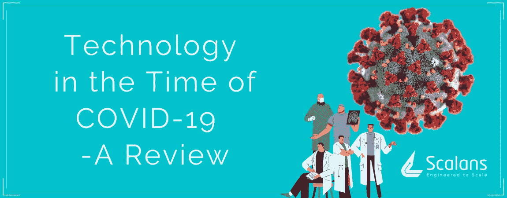

# 新冠肺炎时代的技术——概述

> 原文：<https://medium.datadriveninvestor.com/technology-in-the-time-of-covid-19-an-overview-f003f38f92ec?source=collection_archive---------27----------------------->

世界正在努力遏制新型冠状病毒的爆发，在这场危机中，技术的贡献不亚于此；它最大限度地减少了人与人之间的接触，加强了战斗和救灾工作。

 [## 认知计算——一套被广泛认为是……

### 作为它的用户，我们已经习惯了科技。这些天几乎没有什么是司空见惯的…

www.datadriveninvestor.com](https://www.datadriveninvestor.com/2020/02/19/cognitive-computing-a-skill-set-widely-considered-to-be-the-most-vital-manifestation-of-artificial-intelligence/) 

让我们来看看有助于新冠肺炎危机管理和减少疫情局势对人们生活的影响的一些技术。

1.  **人工智能**

作为[2020 年的新兴技术之一，](https://www.scalans.com/top-5-emerging-technologies-in-2020/)人工智能在提供解决新冠肺炎危机的解决方案方面处于前沿。机器学习算法和数据科学的结合可以跟踪和预测与冠状病毒传播相关的全球模式。

专注于冠状病毒的聊天机器人利用自然语言处理向人们传播关于症状和预防措施的实时信息。

**2。无人机**

在中国首次爆发后，政府已经求助于使用无人机喷洒消毒剂、运送体液样本进行检测、测量体温和广播公告。

与巡逻、筛选或喷雾等传统方法相比，这种技术的优势在于人类互动最少，地面覆盖范围最大。

**3。机器人**

机器人被用来在隔离病房运送食物和药品，从而阻止了病毒在医院工作人员中传播的机会。

在中国，被隔离在家的个人通过自动驾驶汽车获得食物和其他必需品。 [UVD 机器人被中国人](https://finance.yahoo.com/news/china-buys-danish-robots-fight-162400695.html)用来消毒公共场所和医院，以限制感染的风险。

**4。远程医疗**

远程医疗有助于对人们进行冠状病毒的远程筛查，并用于对有流感或普通感冒症状的患者进行分流，从而减轻医院的拥挤状况。

远程医疗应用程序有助于医疗保健提供者和患者通过视频聊天进行虚拟互动，而不会暴露任何个人信息。

**5。地理围栏**

使用地理围栏技术对处于强制性 14 天居家隔离的人进行持续监控。[已经在香港使用，](https://qz.com/1822215/hong-kong-uses-tracking-wristbands-for-coronavirus-quarantine/amp/)它是一种基于位置的服务，通过利用 GPS、RFID、WiFi 或蜂窝网络来定义目标对象的地理边界。

地理围栏对那些在家隔离的人来说是一个虚拟屏障；如果他们离开自己的住所，就会触发警报，并向有关当局发出警告。

# 结论

这些强大的技术将大大有助于指导我们有效地处理突发公共卫生事件。在这个关键时刻，我们敦促你通过呆在家里和保持个人卫生来练习社交距离。

注意安全，保持动力！

文章原载于[https://www . scalans . com/technology-in-the-time-of-the-a-review/](https://www.scalans.com/technology-in-the-time-of-covid-19-a-review/)