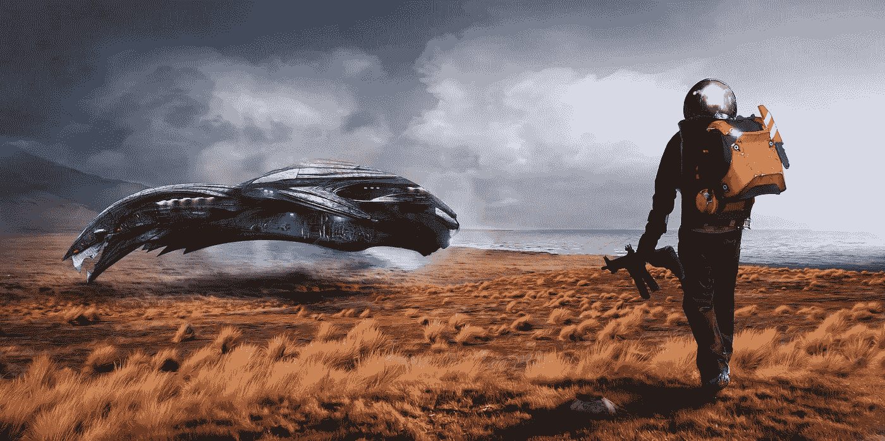
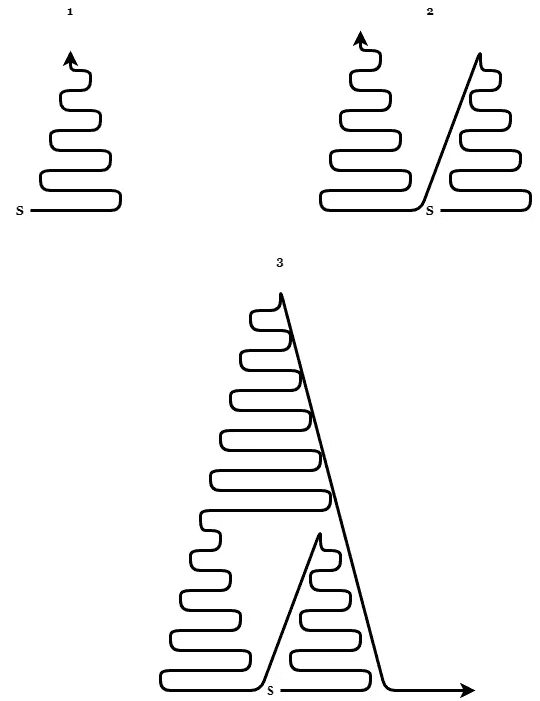

# 区块链:永恒的技术 I

> 原文：<https://medium.datadriveninvestor.com/technology-of-eternity-abe3e7a47ae6?source=collection_archive---------25----------------------->

Source: [Max Pixel](https://www.maxpixel.net/Spatial-Exploration-Spaceship-Wipeout-Blade-Runner-3018174)

## 第一部分

我读过很多次人们是如何努力理解区块链的概念的。区块链不容易理解，因为它还没有被广泛采用。我想带你踏上了解区块链的旅程，而不仅仅是它的一个应用——加密货币。

区块链是一个框架，一个可以给我们答案和洞察世界内部运作的系统。

## 社会结构的重要性

听起来可能很奇怪，但社会结构在区块链至关重要。我们的社会由无数更小的社会网络组成。我们周围由我们制造的一切都是某种社会结构。让我们以你的工作为例。在你的工作中，你可能有一个老板，你的老板很可能有一个老板，甚至所有老板中最大的老板也可能有一个老板。你也可能是某人的老板，而许多人对任何人都不是老板。一些社会结构可以很小，例如当地的小餐馆，而一些可以非常大，例如亚马逊，T2。将这些结构结合在一起的是社会等级制度。它们是抽象的，然而我们都参与其中。我们不能触摸它们，但是我们可以在大脑中创建它们的图像。让我们以一个公司层级为例。高层有首席执行官，首席执行官下面有一些高级管理人员，中层管理人员，实干家，等等。一种等级制度适用于自然界中存在的任何事物。它可能有更少的级别；就参与者的数量而言，它可以更小；然而，我们发现这种模式无处不在。想到政治、医院、蚁群、皇室、Instagram、元素周期表，不胜枚举。我希望你明白我的意思。我喜欢称这些建筑为金字塔，因为它们不仅仅是社会性的。他们到达了有生命和无生命的世界。

这一切和区块链有什么关系？你会很惊讶，但是所有的事情。这听起来可能与区块链无关，但我向你保证最终会有意义。

## 区块链的成分

下面的陈述不言自明，但我还是要陈述一下。区块链由**区块**和**链**组成。街区是有形的。我们可以把它们握在手中；我们可以改造他们，和他们一起玩。锁链是无形的。

简单来说，块是物质，链是将块结合在一起的能量。暂时就把这当成是理所当然的。我们将在接下来的故事中详细阐述为什么物质和能量存在，以及它们是如何相互依赖的。

现在，为了帮助你形象化，让我们来看一些例子，看看什么是块和链。如果我们回到我们的公司结构的例子，我们可以说为 CEO 工作的人是块，甚至 CEO 自己也是块。锁链是我们彼此之间的关系。你和你老板有关系，你老板和他老板有关系。你和你的团队成员有关系，你甚至可能和其他部门的人有关系。这些关系将结构结合在一起。如果你这样想这个结构，你就会明白我们都是通过某人以某种方式与每个人联系在一起的。还记得银翼杀手的名言吗？*“细胞内相通！”由于这个原因，我们说整个区块链都是连通的。这是一系列的积木和链条。当我们看吉萨的金字塔时，我们看到了一个结果。一个造型优美的物体。你有没有想过积木是按照什么顺序摆放的？首先是哪块石头，它的准确位置是什么？这就是区块链能解释的。区块链可以解释金字塔是怎么来的。它解释了块放置的整个顺序。*

如今，我们不太重视事物是如何演变成现在的样子的。如果我们想了解我们的目的、我们自己和宇宙的运作，我们必须知道事物是如何形成的。区块链的织物展示了多种多样的图案。如何创造一个金字塔模式没有对错之分，它很可能极大地依赖于外部因素。现在，你会如何建造吉萨金字塔？你会采取什么方法？你会完成一个基础然后进入下一个等级，还是在结构允许的情况下尽快进入下一个等级？请看下面几个模式——这三个阶段是小型设计向大型设计的演变。“S”表示一个假设的开始。

## 区块链的连续性和进步性

区块链是一个持续的、永无止境的事件集。它一直持续下去，直到达到平衡。当它达到完美的平衡时，它开始一个新的循环。在区块链，事情一直在发展。它创造金字塔，*，例如，公司，学校，国家，宗教，邪教，货币体系，科学等等。*

例如，在科学领域，我们正站在巨人的肩膀上，这意味着我们正在通过建立在以前的发现上来发现真理。我们利用很久以前的发现，*例如，电*我们重复它们，并在它们的基础上进一步发展。我们创造了电动汽车；我们拥有先进的电池技术，通过这种方式，我们在区块链制造新的积木。区块链最近的一件作品是一项新发明，被越来越多的人接受，因此，我们正在达成共识。人是不断验证新块用途的小型验证机器。

Instagram 就是一个很好的例子。这确实是一项伟大的发明。这是一场通往仙境的追逐，在它的终点，我们会快乐而满足。在 Instagram 上，我们追求更多的关注者、更多的喜欢和更多的满足，希望我们最终在金字塔阶梯上越升越高。我们想知道我们的风格，我们的脸，我们头发的颜色，我们的身体，以及一切与外表有关的东西是否被接受。你的粉丝会在 Instagram 上验证你的作品。你要么得到他们的喜欢，要么得不到。每一个喜欢都是验证过程的积极结果，让你更接近最新的区块，从而推动你在金字塔上更高。这种对进步和做得更好的渴望是与生俱来的。这是区块链永恒的原因。我们无法控制这种欲望，因为这是区块链的财产。区块链想要前进，这就是它的目的。它抛弃旧的东西，把旧的东西转化成新的东西，周而复始。

为区块链创造新的区块(发明、资产等。)，它必须抛弃某些东西，只要这个东西是有限的。想象一下我们这个资源有限的星球。为了开发新产品，我们不得不停止生产一些旧产品。移动电话取代了固定电话，现在互联网正在取代电话网络。电动汽车正在取代内燃机。Instagram、Snapchat、Twitter 和 WhatsApp 已经将社交媒体带到了一个新的高度，正在取代脸书。这个循环过程永远不会结束，因为我们在进步，因此整个区块链也在进步。旧的结束，新的开始。这就是区块链的世界。

在接下来的[故事](https://medium.com/@michal.korenko/technology-of-eternity-7bf8cd46291f)中，我们将谈论人类的角色、创世的历史、区块链的版本、减半的重要性、能量的派别，以及最令人兴奋的——未来。