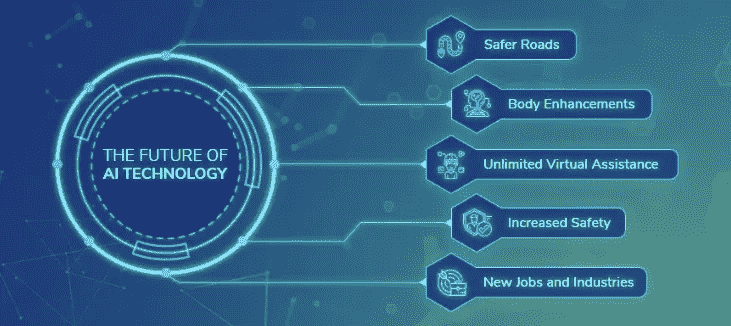

# 专家预测 2020 年的技术趋势

> 原文：<https://medium.datadriveninvestor.com/technology-trends-of-2020-according-to-experts-f4a165bffd8d?source=collection_archive---------19----------------------->

就新技术和新发明而言，今年是重要的一年，未来还会有更多。从人工智能的突破到 5G 的开发和部署，我们已经取得了进展。这些话题目前在大多数精通技术的人的脑海中。

2020 年，我们应该期待这些突破在现实生活中变得更加适用。一个例子是 5G 无线技术已经在一些地方注册。我们会看到明年的覆盖面会有巨大的增长。或者甚至可能在智能城市工作，改善那里的技术，实际上机会是无穷的。

# 人工智能会接管 2020 年吗？

嗯，可以肯定地说，人工智能正在大步发展，我们从电影中看到的所有事情都可能成为现实，从修复我们身体的纳米机器人到有感知能力的人工智能。然而，让我们来看看真正的专家对这个话题是怎么说的。

**医疗保健和科学**

随着该国转向基于价值的护理，人工智能和机器学习，加上数据互操作性，将改善患者的结果，同时提高运营效率，降低整体护理成本。通过为医疗保健提供商提供预测性机器学习模型，临床医生将能够无缝预测中风、癌症或心脏病发作等临床事件，并通过个性化护理和卓越的患者体验进行早期干预。— ***Shez Partovi，医学博士，亚马逊网络服务全球医疗保健、生命科学和基因组业务发展总监***

我们预计医疗设备和生物技术创新将受到更多关注，同时对机器学习和人工智能保持兴趣。我的 2020 黑马候选人？生物传感。想象一下，可穿戴设备可以测量你的体温，在你感冒之前预测你是否感冒，然后为你匹配一个分布式在线药店，直接送货上门。这个领域有许多令人兴奋的事情。— ***黄*******CEO，StartX****

***人工智能和语音技术***

*公众需要对人工智能的工作原理有一个初步的了解。他们需要对数据如何符合算法并转化为决策有一个大致的了解。例如，面部识别正被用于我们的智能家居安全系统，因此，我们需要了解该技术保护我们所爱的人的能力和局限性。
–***Omo ju Miller，高级机器学习工程师，GitHub****

**

*正如预测的那样，voice 在老年人中获得了巨大的成功。他们喜欢易用性以及如何以自然的方式使用这项技术。2020 年，语音技术将成为老年人生活中不可或缺的一部分。当前的语音解决方案需要由老年人发起对话。随着语音技术的进步以及聊天机器人和定制数字助理的成熟进入市场，语音将在 2020 年带来双向对话。
–***库尔迪普·帕布拉，工程高级副总裁，K4Connect****

* [## 2019 年即将改变世界的技术|数据驱动的投资者

### 很难想象一项技术会像去年的区块链一样受到如此多的关注，但是……

www.datadriveninvestor.com](https://www.datadriveninvestor.com/2019/01/17/the-technologies-poised-to-change-the-world-in-2019/) 

**商业和金融**

越来越多的公司使用移动、语音、API 基础设施等，在各自的市场上实现“一键式”体验。将繁琐的体验简化为几次点击。根据菜谱购物、按需提供虚拟助手、支付账单、向慈善机构捐款，甚至企业数据集成。意图和执行之间的时滞持续缩短。
–***肖恩·卡罗兰，门洛风险投资公司合伙人***

由于像 Peloton 和 WeWork 这样的著名“独角兽”公司面临着重新优先考虑扭亏为盈而不是昂贵的增长雄心的呼吁，随着基金加强对真实商业模式证据的审查并转向中心，2020 年获得资本的机会将会收紧。
–***梅根·本特，Harbinger Ventures 的创始人兼管理合伙人***

**虚拟、增强和混合现实**

计算机正在接收大量的世界数据，并能够立即处理和做一些有用的事情。这是增强现实成为可能的原因。。。UX 的设计师将不得不做出相应的调整:他们将不得不开始考虑响应式设计，而不是仅仅针对不同的设备进行响应式设计，因为计算机会对现实世界中的一切做出反应。手势，声音，目光，一天中的时间，房间里有多少人，你在哪里:所有这些变量现在都是必须考虑的新的用户输入。
–***Timoni West，Unity Labs XR 总监***

在与供应链中的关键参与者交谈以及我们公司对消费者甚至认为可以接受的东西所做的研究之后，我确信能够广泛采用 AR 眼镜的技术仍然不可用。我们采访的供应链人员表示，这至少需要 2-3 年的时间。因此，苹果将在 2020 年向市场推出 AR 眼镜的想法让我有点怀疑。"
–***本·巴加林，负责人，*创意策略***