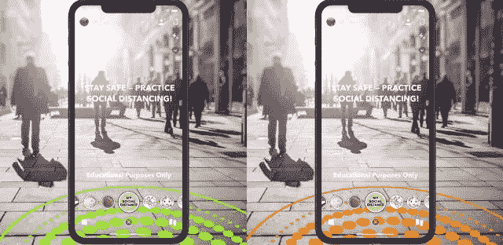
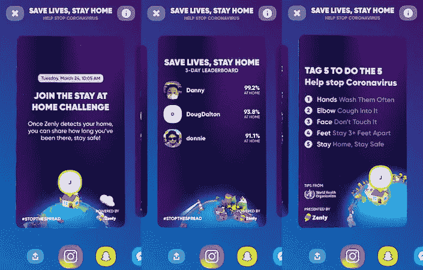
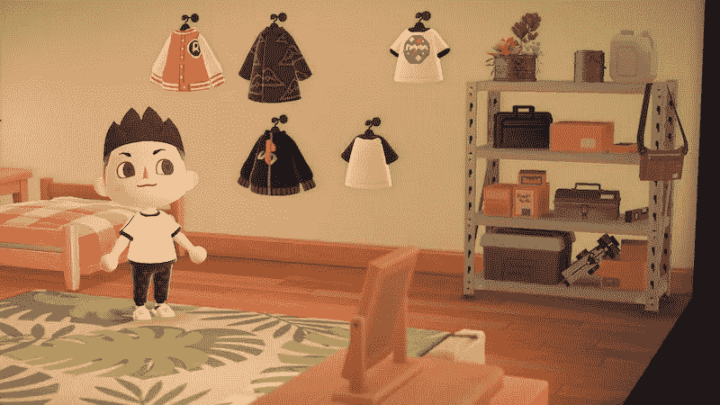
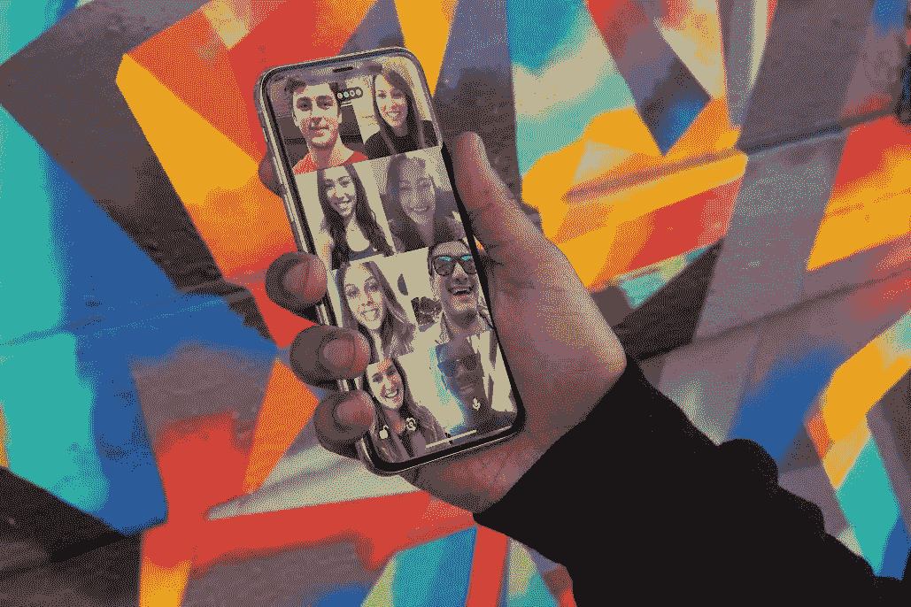

# 让社交距离变得更容易的技术趋势

> 原文：<https://medium.datadriveninvestor.com/technology-trends-that-are-making-social-distancing-easier-d019d551f36f?source=collection_archive---------8----------------------->

## 分析在锁定期间发布的应用、游戏和扩展

Photo by [Ramón Salinero](https://unsplash.com/@donramxn?utm_source=medium&utm_medium=referral) on [Unsplash](https://unsplash.com?utm_source=medium&utm_medium=referral)

3 月 28 日，世界卫生组织与 Zynga、Pocket Gems 和 Riot Games 等主要游戏公司合作，鼓励社交距离，并就冠状病毒发布公共服务公告。这是世卫组织的一项重大举措，该机构曾将视频游戏列为精神健康障碍的一个来源(当时这让许多游戏出版商非常失望)。

随着世界上超过四分之一的人口就地躲避，遏制新型冠状病毒的传播，技术肩负着巨大的责任。我们已经看到脸书和 Twitter 等科技巨头加强了监管，以遏制错误信息的传播。

最近，苹果推出了自己的[新冠肺炎应用和网站](https://www.apple.com/covid19/)——一个信息和筛选工具，拥有美国疾病控制中心(CDC)的最新指导。

与此同时，Tinder 和 Bumble 等约会应用正在发行应用内卡片，以鼓励社交距离，并启发用户了解流行病。此外，Tinder 最近才向全球所有用户免费提供护照功能，以减少自我孤立的感觉。

突然之间，随着人们有更多的时间在他们的盘子上，屏幕时间激增。Steam 游戏市场已经经历了[破纪录的](https://www.geekwire.com/2020/online-gaming-surge-steam-breaks-concurrent-user-record-amid-social-distancing-mandates/)在线用户数量。今天，技术的作用比以往任何时候都更加重要。让我们来看看一些游戏和应用程序，它们巧妙地适应了社交距离的时代。

# Snapchat 的新 AR 镜头

最近与世卫组织合作发布了两款新的 AR 驱动快照镜头，以帮助提高对新冠肺炎的认识。

第一个镜头名为“我的社交距离”，在用户周围推荐的两米半径范围内，在地面上创建一个 AR 圈。如果另一个人进入这个区域，圆圈会变红，从而及时提醒人们保持社交距离。

第二个镜头显示了世卫组织来源的关于如何实践良好卫生习惯的提示和其他冠状病毒相关的更新和资源。

# 曾丽

Zenly 是 Snapchat 的收购应用程序，为朋友和家人显示带有位置共享的实时地图。传统上，它鼓励你制定计划，走出去。现在，随着疫情病毒和封锁的实施，情况正好相反。

它通过“呆在家里挑战”将自我隔离游戏化，向用户展示他们的哪些朋友在排行榜上花了大部分时间。

此外，它还能让你浏览世界地图，并按国家或州查看新冠肺炎确诊病例数和恢复情况。

# 动物穿越

《动物穿越》的最新部分《新地平线》于 3 月 20 日上映，几乎与《呆在家里》的上映时间一致。难怪在任天堂 Switch 上推出的游戏反响热烈。

一个社会模拟游戏，让您建立自己的岛屿天堂，并邀请朋友举办虚拟生日派对。有了田园诗般的生活氛围和每天的目标，这正是你需要的游戏，来填补孤独的空虚，带来每天的成就感。目前的情况已经使这成为一个真正令人上瘾的游戏。对于“不玩任天堂”的用户来说，在安卓系统和 T2 的 iOS 系统上都有精简版的动物穿越游戏。

# 家庭聚会

Photo courtesy of Houseparty

最新的病毒式游戏化视频通话应用其实早在 2016 年就有了。随着人们被困在家里，而 Zoom 等应用程序在企业世界激增，HouseParty 成为了 goto“派对后”应用程序，并很快成为应用程序商店的榜首。它可以让你最多与 8 个人联系——允许朋友走进你的视频房间，除非你已经锁定它——从而模拟现实生活中的聚会。

此外，它增加了“快速抽奖”和“抬头”等酷游戏的体验。

# 网飞党

这不是虚拟现实家庭派对！VR 还有很长的路要走。相反，它是一个智能的[谷歌 Chrome 扩展](https://www.netflixparty.com/)，可以让你同步视频回放，还可以添加群聊功能。

在自我隔离期间，网飞党是救世主。只需登录，与朋友分享一个观看链接，并选择一个负责遥控器的人。

# 结束语

技术正在帮助弥合人与人之间的差距，随着游戏化程度的提高，这种意识已经显而易见。没有它，封锁就意味着完全的隔离和彼此的分离。相反，科技让社交距离变得更加容易。

感谢阅读。