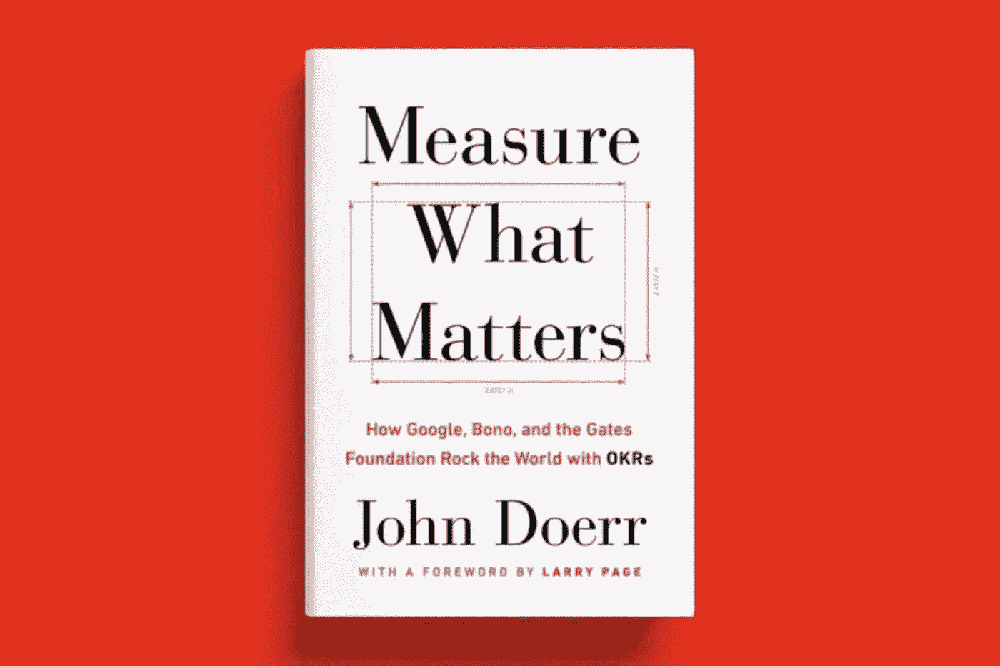
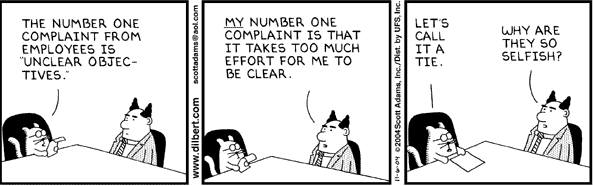

# 告诉我:目标和关键结果是什么(OKR)？

> 原文：<https://medium.datadriveninvestor.com/tell-me-what-are-objectives-and-key-results-okr-f716939c227d?source=collection_archive---------2----------------------->

*法语故事* [*这里*](https://medium.com/essentiels/raconte-moi-les-objectifs-and-key-results-okr-95c40ca9408) *。*

**我听到越来越多关于目标和关键结果(OKR)的说法，但我不太明白背后的含义。能帮帮忙吗？**

很好的主题提议，关于 OKR 确实有很多神话。我建议我们从一些背景开始。

**okr 根本不是一个新概念**:安迪·格罗夫于 20 世纪 70 年代在英特尔开发了这种方法。作为英特尔的首席执行官，安迪利用 OKRs 来推动他的公司，在 20 世纪 90 年代末将一家小型科技公司变成了乳齿象。okr 在很大程度上也受到了彼得·德鲁克几年前提出的目标管理概念的启发。

但 OKRs 真正的引爆点来自谷歌。1999 年，当公司只有大约 10 名员工时，与安迪·格罗夫在英特尔共事的约翰·杜尔登成功说服谷歌的管理团队使用 OKRs 来管理自己。你知道这个故事，谷歌(现在是 Alphabet)现在是世界上最有影响力的公司之一，拉里·佩奇说这很大程度上归功于 OKR 的使用。

好的，我明白了……但是为什么 okr 已经存在了至少三四十年了，现在每个人都在谈论它？

我想说，首先是约翰·杜尔登在 2017 年出版的[书](https://www.whatmatters.com/)，这本书在管理界取得了巨大成功。他的 2018 年 [TED 大会](https://www.ted.com/talks/john_doerr_why_the_secret_to_success_is_setting_the_right_goals/transcript?language=en)也火了。此外，还有许多来自初创企业和独角兽企业(LinkedIn、Twitter、优步……)的推荐，他们将自己的成功部分归功于系统地使用 okr。也许最后一个因素是传统公司对敏捷实践的狂热。迭代周期和优先化的概念非常符合 OKR 原则。

Measure What Matter — John Doerr’s book on OKR

现在，如果我们深入细节，okr 具体是什么？

在回答你它们是什么之前，我想解释一下 OKRs 对哪些困难做出了回应。

这是你的面试！

这一切都始于你可以亲身体验的一些观察。走过任何一家公司的走廊，向员工提出以下问题:

*   你的团队的首要任务是什么？
*   贵公司的主要目标是什么？
*   你的团队的优先事项如何符合你公司的目标？
*   你知道隔壁团队的优先级吗？隔壁的部门？
*   就所有这些目标而言，你如何判断自己是否朝着正确的方向前进？

我不明白…你是说大多数员工都不会回答这些问题？

不幸的是，事实往往如此。否则你可能会像员工一样有很多不同的答案。所以，如果我总结一下:

> 不同团队/部门之间无法解释和/或相互矛盾的优先级
> 
> 没有真实概览的优先活动:“喊得最响的人”
> 
> 所开展活动的实际影响能见度低

It takes effort to communicate clear objectives — Dilbert

**我能看到问题的严重性……所以如果我回到我们之前讨论的******，这些公司有点像老年人，他们再也不能随心所欲地四处走动了。他们身体的不同部分不再对大脑做出反应，或者以某种无序的方式行动。****

**就是这样，但这种病理以不同程度的强度影响着许多公司。一家公司发展得越快，它的复杂性就增加得越多，控制它的通信网络也越多。那么就有越来越多发展成这种病理的危险。如果公司的每一层都没有一致和结构化的努力来应对这些问题，我们就会得到一个僵化的公司。**

** [## 医疗保健行业的螺旋式项目管理方法|数据驱动的投资者

### 项目管理就是将知识、技能、工具和技术应用到活动中，以…

www.datadriveninvestor.com](https://www.datadriveninvestor.com/2020/08/04/spiral-project-management-methodology-in-healthcare/) 

OKR 的这个神奇配方是什么？

okr 的强大之处在于其简单性:

1.  定义 3 到 5 个鼓舞人心的目标，为你指明前进的方向
2.  对于这些目标中的每一个，找出 3 或 4 个关键结果，让我们知道您是否实现了这个目标。

基本上就是这样。

**等等，你是在向我解释，通过定义 OKRs 和大约 15 句话，任何公司都会成为下一个谷歌？**

你说得对，还有一些规则。

TED Talk — John Doerr

首先，**okr 在组织的每一级都有定义**。公司经理有他的 okr，部门经理有他们的 okr，团队经理有他们的 okr 等等。

其次，**okr 应是开放和可访问的**，即每个人都应能够看到其经理或隔壁团队的 okr。这个想法是相信集体智慧，这样每个人都可以调整自己的 okr 来适应其他团队的 okr。通过这种方式，系统自然地与共享的优先级(由经理选择的优先级)保持一致。

第三，应定期审查**okr**，例如每 3 个月一次。这意味着每三个月，组织的每一级都要问自己，其活动是否使其能够实现其承诺的关键成果。根据对这个问题的回答，以及该实体可能发展的优先事项，它将重新调整其下一个季度的目标。然后，它重新调整关键成果，这将使它知道是否实现了这些成果及其在实地的活动。

这有点像徒步旅行，你每半小时停下来，你抬头看看以确保你走的方向是正确的，如果有必要，你会调整你的路线，这取决于你的位置，一天中的时间，你的疲劳程度，太阳…还有其他细节需要了解，但我会将它们放在这里[这里](https://medium.com/@mcleanonline/4-key-lessons-ive-learned-about-okrs-3f4b902ae9f8)和[这里](https://medium.com/@mcleanonline/the-best-okr-reading-list-in-the-world-4344fb4781f7)，你可以不时地看看它们。

但是公司已经在设定目标了，不是吗？这有什么革命性的？

你抓住了极其重要的一点，这解释了为什么传统公司对 OKRs 持怀疑态度。他们已经定义了目标和优先级，并且他们遵循进度标准。但在操作上，这并不奏效，因为员工会迷失在他们的多个个人、团队和项目目标、老板给出的日常优先事项以及公司关于其目标的整体沟通之间。这又导致了上面提到的所有问题:过多的优先级会扼杀优先级。

所以，如果我总结的话，okr 主要是关于简单、透明和一丝不苟的一致性？

如你所知，定义 OKRs 并不复杂，只需在组织的每个层面思考几个小时，你就可以做到。**但是好处只有在长期内才能看得见**例如，当每个团队习惯于质疑自己，以确保其活动和优先事项符合上面层级的目标时。

Define objectives and key results every 3 months.

**之前您谈到了个人目标，这些 okr 是否也适用于个人，还是仅适用于团队层面？**

每个公司都可以按照自己的意愿自由实施这些 okr，你现在意识到，除了一些基本原则，它是相当灵活的。例如，在谷歌，目标是个人层面的。在我工作过的公司里，更多的是在团队或部门层面。

顺便说一下，我前阵子也决定在自己身上测试 OKRs。

你永远不会停止…但是它们涵盖了你生活的所有方面还是仅仅是你的职业生活？

啊哈哈哈，举例来说，我可以告诉你，我有一个发展专长的目标，有两个主要结果:

-本季度阅读 6 本“非小说类书籍”

-发表 10 篇这样的文章

**你快到了吗？**

3 个月回答！我也邀请你写你的 OKRs，它将帮助你把你的精力集中在让你前进的项目上。

*===每周，我都会在时事通讯上分享我阅读中最精彩的部分。在这里唱:*[*https://readwise.io/@bfabien*](https://readwise.io/@bfabien)*= =*

## 访问专家视图— [订阅 DDI 英特尔](https://datadriveninvestor.com/ddi-intel)**