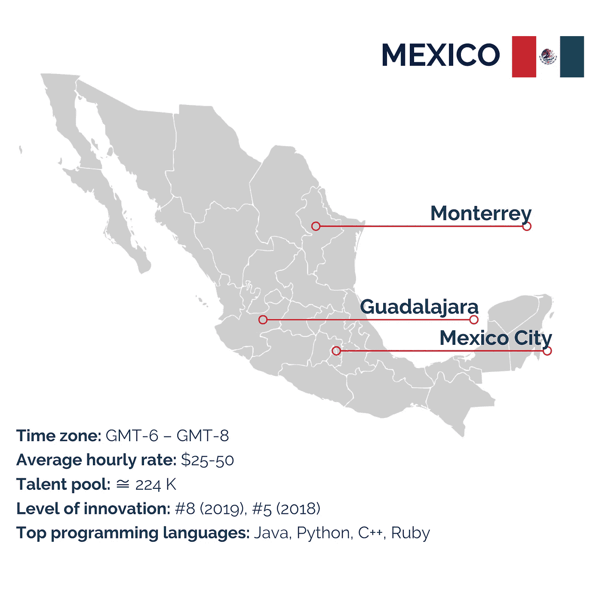
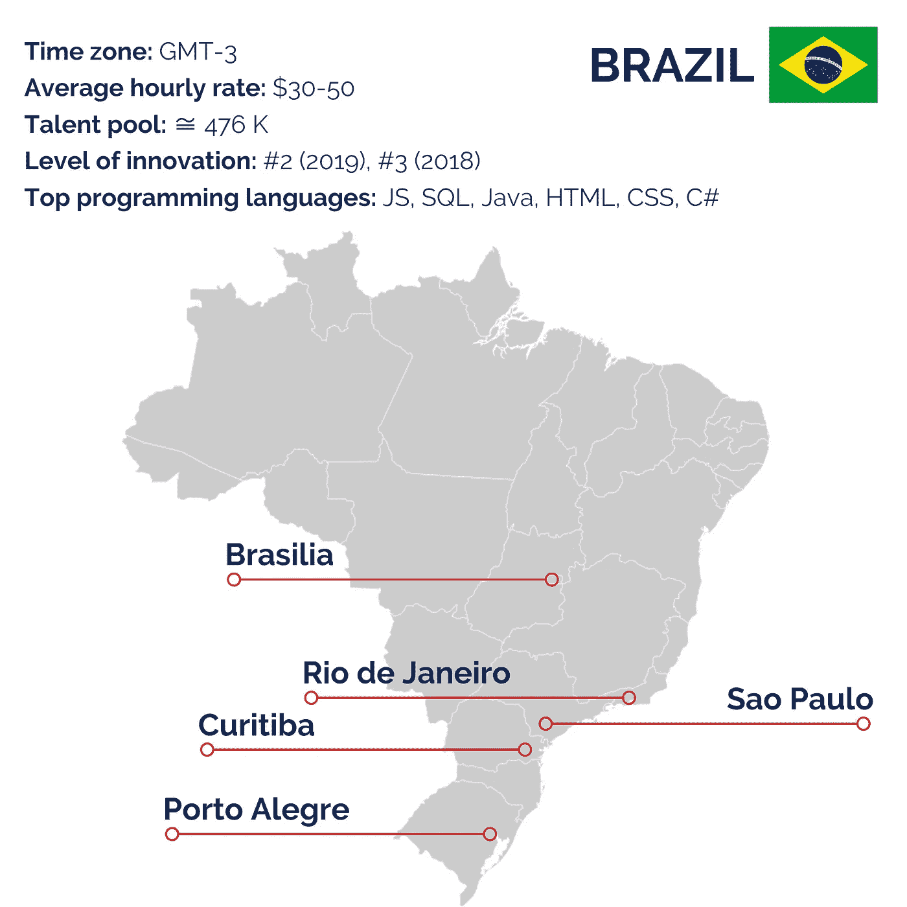
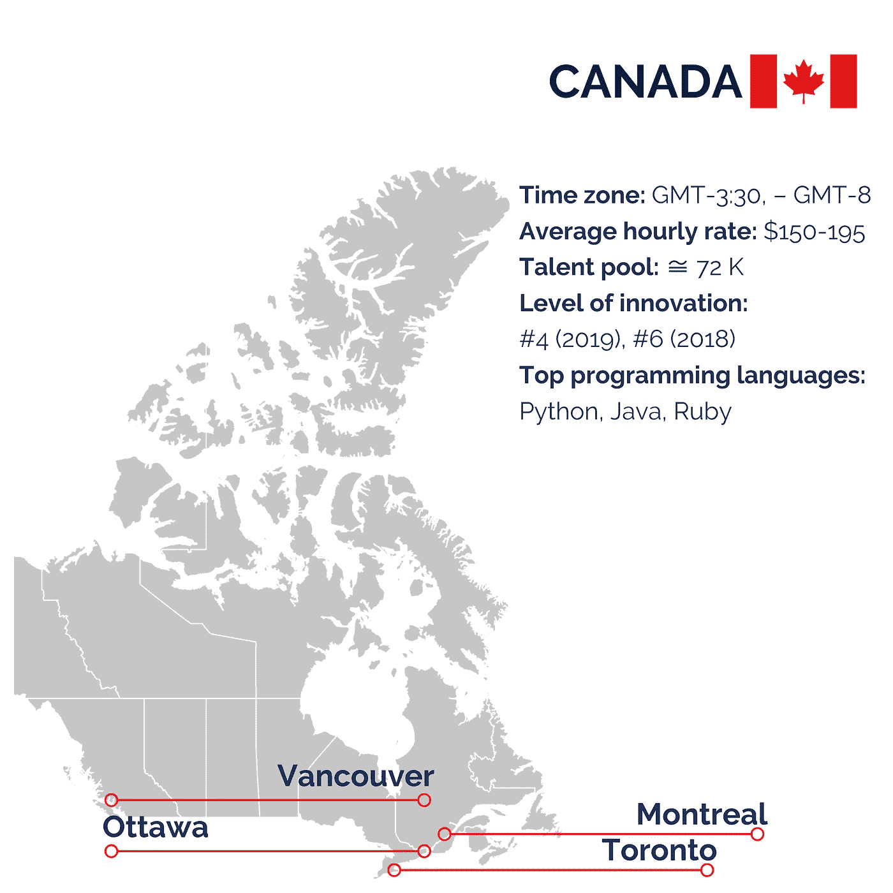
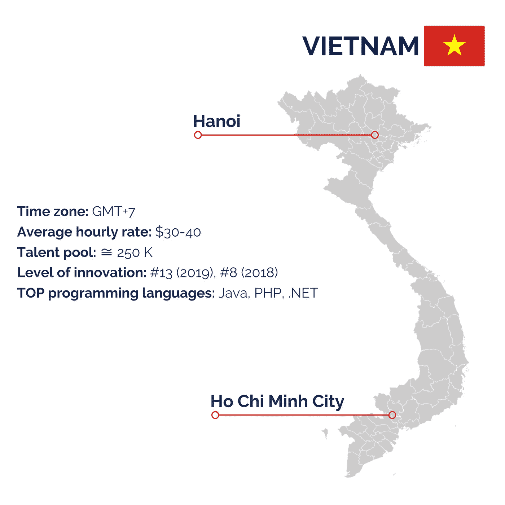
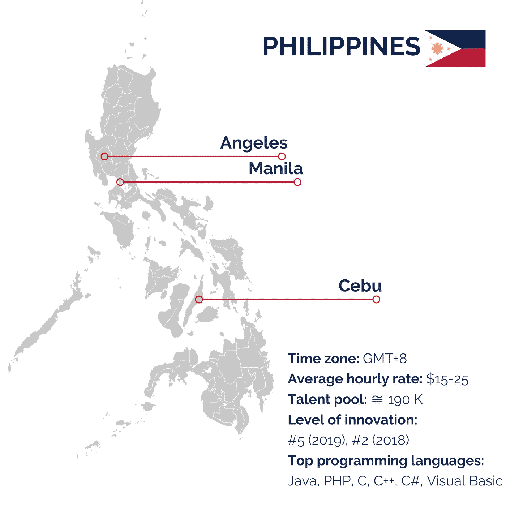
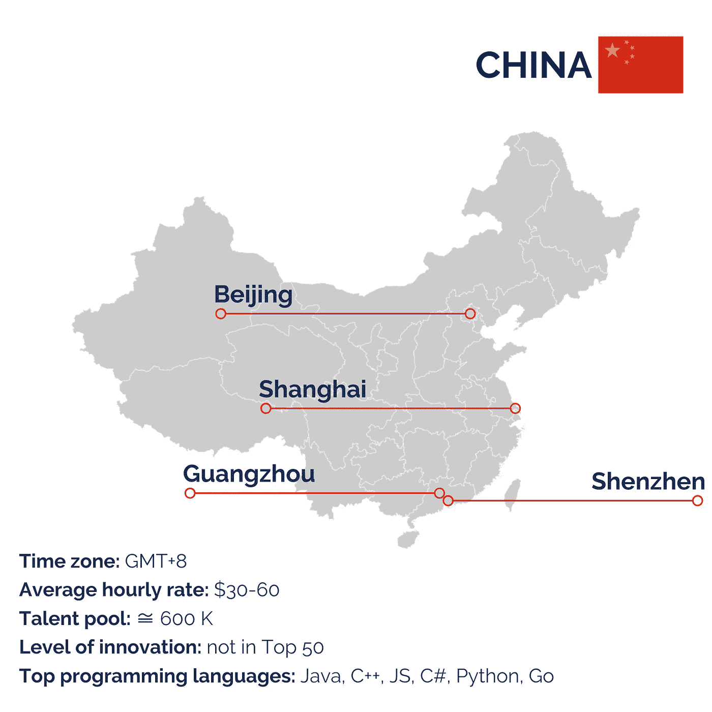
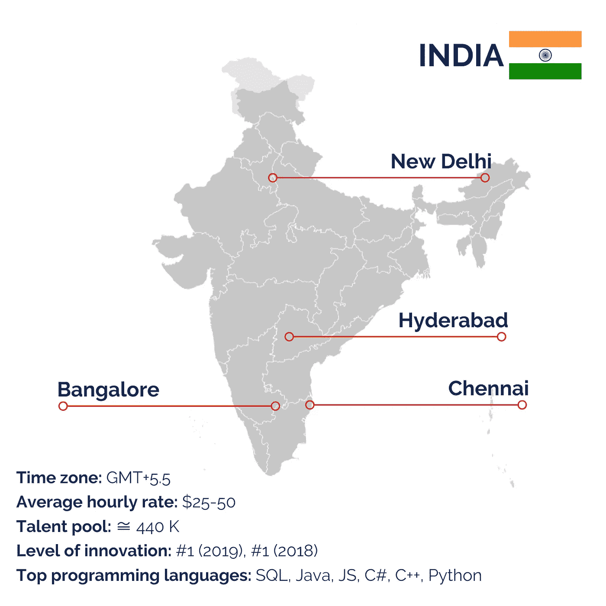
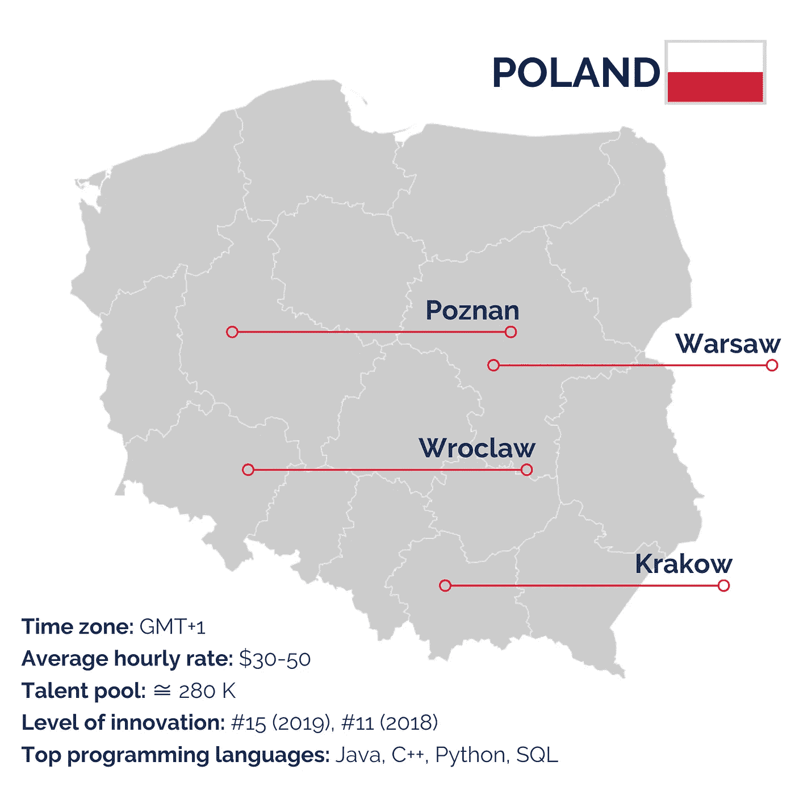
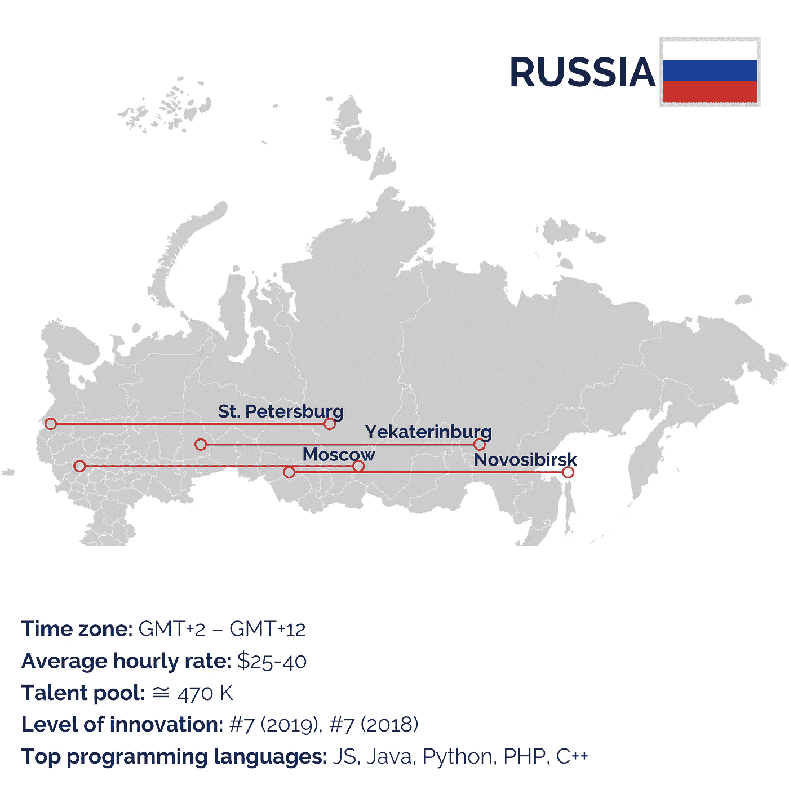
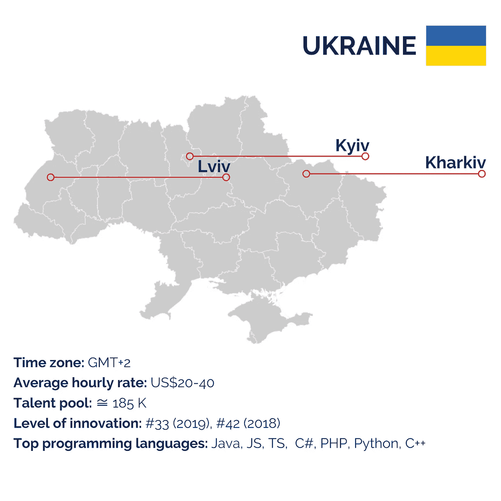

# 最适合雇佣专业开发团队的十个国家——keen ethics 博客

> 原文：<https://medium.datadriveninvestor.com/ten-best-countries-for-hiring-dedicated-development-team-keenethics-blog-bafe2f71d1cf?source=collection_archive---------9----------------------->

## 让我们比较一下墨西哥、巴西、越南、中国、印度、菲律宾、加拿大、乌克兰、波兰和俄罗斯的利率、时区、人才库、创新水平和最流行的编程语言。

如果你是一个来自富裕发达国家的企业主，比如美国或荷兰，你需要开发一个软件产品，你会去找谁？对你的同胞们？我不这么认为。虽然与说同一种语言、生活在同一种文化中的人一起工作对你来说可能更容易，但这绝对不是最具成本效益的解决方案。即使你已经有了一个内部团队，也不是全能的，所以我可能在向外部寻求帮助。那么如何选择最优的专用开发团队呢？

你应该从考虑从哪个国家雇佣专门的开发团队开始。在这篇文章中，我将比较 11 个最受欢迎的[外派和外包](https://keenethics.com/blog/outsourcing-vs-outstaffing)目的地。为了尽可能客观地进行比较，我会考虑以下指标:

*   平均时薪(离合器)
*   时区(GMT)
*   人才库
*   创新水平( [2019 Tholons 服务全球化指数](https://cdn.newswire.com/files/x/ca/9b/49cc2ecffa23679bf4baf5cdbe56.pdf?_ga=2.239641155.1185590406.1582123584-1407228228.1582123584))
*   最流行的编程语言

外包和外包最受欢迎的地区是拉丁美洲、东欧和亚洲。

# 拉丁美洲

对于美国客户来说，拉丁美洲是最大的外包和外包地区。这样的开发者在地理距离上确实很近，他们的时区也经常重叠。这些专业人员的平均成本也很低——每小时 30 美元，而美国开发公司的软件工程师的成本可能超过 100-150 美元。雇佣专业开发团队最受欢迎的两个拉美国家是巴西和墨西哥。

# 墨西哥

美国大多数企业主会告诉你，墨西哥人是很棒的员工。他们聪明、勤奋，对报酬要求不高。难怪墨西哥跻身 it 行业外包目的地排行榜。事实上，它提供了一个相当大的人才库，大约有 22.4 万名软件工程师，平均时薪从 25 美元到 50 美元不等。墨西哥开发人员更喜欢使用 Java、Python、C#和 Ruby。

 [## 数据科学和软件工程哪个更有前途？数据驱动的投资者

### 大约一个月前，当我坐在咖啡馆里为一个客户开发网站时，我发现了这个女人…

www.datadriveninvestor.com](https://www.datadriveninvestor.com/2019/01/23/which-is-more-promising-data-science-or-software-engineering/) 

此外，墨西哥在地理上非常靠近美国，因为这个国家只有几个小时的飞行路程。至于时差，这并不重要，因为这些国家位于相同的时区-墨西哥位于 GMT-6、GMT-7、GMT-8，美国位于 GMT-5、GMT-6、GMT-7、GMT-8、GMT-9 和 GMT-10。最后，根据 2019 年 Tholons 服务全球化指数，墨西哥目前在创新水平方面排名第八，比 2018 年低三位。

有三个理由不选择墨西哥作为外包目的地。一是美国和墨西哥之间的政治局势不稳定，因为唐纳德·特朗普长期以来一直以经济制裁威胁墨西哥。第二，有更具成本效益的选择。三种语言的障碍可能会成为一个障碍，因为墨西哥在 EF 英语水平的 88 个国家中排名第 57 位。

# 巴西

巴西的人口是 2.126 亿，其中大约 24 岁以下。这样一个年轻的国家渴望学习和发展，所以他们中的大多数人都参加了高等教育项目。与此同时，巴西的 IT 行业非常有利可图，一般开发者的工资为 30 到 50 美元。因此，巴西的开发者人才库相当庞大，大约有 47.6 万人，他们主要专注于 JavaScript、SQL、Java、HTML、CSS、C#和 Python。根据 Tholons 服务全球化指数，截至 2019 年，巴西是世界上第二大最具创新力的国家，比 2018 年高出一个位置。

巴西位于 GMT-3 时区，比纽约早 2 小时，比加州早 5 小时。这样，美国客户可以很容易地找到时间与巴西开发团队会面。尽管如此，与巴西人的交流并不一定简单，因为这里的英语水平很低。根据 2009 年的一项研究，巴西只有四分之一的 IT 专业人士英语流利。自那以后，情况略有改善，但糟糕的英语技能仍然是人们放弃外包到巴西的首要原因。

# 北美洲

北美很少与外包和突出联系在一起。尽管如此，它仍然值得关注，因为该地区拥有令人印象深刻的技能组合。然而，要做好准备，服务质量和简单的沟通是有代价的——在北美，一个普通的中级软件开发人员每小时的费用大约是 132 美元。

# 加拿大

美国客户选择外包给加拿大的首要原因是文化和地理上的接近。加拿大人和美国人相互了解，他们的工作时间重叠，因为加拿大位于 GMT-3:30、GMT-4、GMT-5、GMT-6、GMT-7 和 GMT-8 时区，而美国位于 GMT-5、GMT-6、GMT-7、GMT-8、GMT-9 和 GMT-10 时区。最重要的是，加拿大的开发服务比美国的稍便宜，因为这里的开发人员平均每小时挣 150-195 美元。总的来说，大约有 72，000 名软件开发人员，这里最流行的编程语言是 Python、Java 和 Ruby。

# 亚洲

亚洲以大量人才和低时薪而闻名。亚洲的中级开发人员平均每小时花费 24 美元。事实上，如果你用谷歌搜索“软件开发公司”，你打开的第一个网站很有可能是一家印度软件开发公司的。外包和外包最常见的亚洲国家是中国、印度、越南和菲律宾。

# 越南

越南是一个拥有近一亿人口的发展中国家，但它提供了大量的开发人才——大约 25 万名专注于 Java、PHP 和. NET 的专家。尽管[越南被定义为](https://www.oxfam.org/en/what-we-do/countries/vietnam)中低收入国家，但这里软件开发人员的平均时薪并不低——从 30 美元到 40 美元不等。越南位于 GMT+7 时区，比纽约早 12 小时，比加州早 15 小时。这两个国家的营业时间完全不重叠，这就带来了严重的沟通挑战。

促使企业外包到越南的是商业文化水平。越南员工非常忠诚，是全球流失率最低的国家之一。这里的 IT 基础设施显示出良好的增长趋势，创新水平相当高，尽管自 2018 年以来下降了 5 个位置。

# 菲律宾

菲律宾对于外包最大的优势就是成本低，英语水平高。事实上，[2000 年的人口普查显示](https://www.investopedia.com/articles/personal-finance/012516/philippines-friendly-country-english-speakers.asp)几乎 64%的菲律宾人会说英语——这是亚洲第二好的结果。这个国家提供了大约 19 万人的人才库，平均时薪为 15-25 美元。这里最流行的编程语言是 Java、PHP、C、C++、C#和 Visual Basic。此外，Tholons 服务全球化指数将菲律宾列为世界上创新水平第五位的国家，与 2018 年相比下降了 3 位。

菲律宾位于 GMT+8 时区，比美国西部早 16 小时，比美国东部早 13 小时。这种时差转化为严重的通信不便，尤其是对东部各州而言。然而，时差并不是外包给菲律宾的唯一缺点。菲律宾人在技术专长和服务质量方面略显落后。如果你心中有一个复杂的项目，你应该考虑其他地方寻找一个专门的开发团队。

# 中国

中国是世界上人口最多的国家，拥有最大的软件工程师人才库。这里的开发者既精通常用的编程语言，也精通不常用的编程语言，即 Java、C++、JavaScript、C#、Python 和 Go。同时，中国的开发者比其他亚洲国家的开发者更贵，这里一个中级开发者的平均时薪在 30 到 60 美元之间。

由于某种原因，中国没有被列入 Tholons 服务全球化指数的前 50 名创新国家。此外，中国人的英语水平很差，只有不到 1%的人会说英语。这可能会造成严重的沟通障碍。美国和中国之间持续的政治紧张局势使得外包到中国变得更加复杂。

中国位于 GMT+8 时区，比纽约早 13 个小时，比加州早 16 个小时。如果你来自洛杉矶或旧金山，你的工作时间和你的开发团队的工作时间会有一两个小时的重叠。如果你来自中部或东部的州，你将无法安排一个双方都方便的时间见面。

# 印度

听到“外包”第一个想到的状态是什么？印度。作为人口第二多的国家，印度肯定大有可为。预计这里的开发者人才库即将达到 44 万人。他们主要专攻 SQL、Java、JavaScript、C#、C++和 Python。然而，数量并不是它唯一的优势。[2011 年印度人口普查显示，10.6%的印度人说英语。这一比例在 IT 专业人员中要高得多。良好的英语能力让印度开发人员可以轻松地与来自世界各地的客户交流。更进一步说，外包在印度提供的最有吸引力的优势是成本效益。印度开发者的平均时薪是 25-50 美元。](https://en.wikipedia.org/wiki/2011_Census_of_India)

尽管如此，如此低的成本是有代价的。印度开发者经常被指责生产低质量的代码。当然，这不是普遍规律，印度也有技术天才。印度连续两年在 Tholons 服务全球化研究中获得创新第一名是有原因的。然而，当在这里寻找一个专门的软件开发团队时，要小心并彻底评估他们的技能。

此外，如果你是来自美国的企业主，印度可能不是你的最佳选择。它位于 GMT +5.5，这是一个独特的时区，仅次于印度和斯里兰卡。所以，如果你是纽约人，印度和你有 10 个半小时的时差。如果你是加州人，相差 13 小时 30 分钟。无论如何，你的工作时间没有重叠，所以要么你必须很早起床，要么开发人员必须工作更长时间。

最后，这里的政治环境相当不稳定，世界第二大人口经常对当局不满。

# 东欧

东欧是西欧商人中最受欢迎的外包和突出的目的地。这些专业人士在地理和文化上都很接近，但他们的成本远低于他们的同胞。一名来自东欧的中级软件工程师的平均时薪是 35 美元。就此而言，最受欢迎的东欧国家是波兰、乌克兰和俄罗斯(它的欧洲部分)。

# 波兰

波兰拥有大量有才华的开发人员，人数达到 28 万。中级波兰软件工程师的平均时薪是 30-50 美元。这里最流行的编程语言是 Java、C++、Python 和 SQL。

根据 Tholons 服务全球化指数，波兰是世界上创新水平第十五位的国家，比 2018 年下降了 4 位。波兰人表现出很强的英语技能——他们的英语水平被评为“非常高”。这将极大地方便与开发团队的沟通，并减少误解的可能性。

该州位于 GMT+1 时区，比纽约早 6 小时，比加州早 9 小时。这种差异让波兰和美国的商人找到了会面的时间，这对双方都很方便。

# 俄罗斯

说到外包，俄罗斯不是一个显而易见的选择。它通常与化石燃料、机械或农业联系在一起，但与 It 行业无关。然而，这个州还是有所贡献的。俄罗斯是世界上面积最大的国家，平均人口为 1.445 亿。然而，开发者的人才库是巨大的——大约有 47 万名软件工程师。这里的平均发展速度高于乌克兰，但低于波兰。俄罗斯开发者擅长的语言有 JavaScript、Java、Python、PHP、C++。

至于时差，没有什么可比较的，因为俄罗斯横跨 11 个不同的时区，从 GMT+2 到 GMT+12。要了解营业时间是否重叠，您应该检查您考虑外包的特定城市的时区。

外包给俄罗斯有两个问题。首先，英语水平值得怀疑，因为英语不是俄罗斯学校的必修课。其次，一方面是俄罗斯，另一方面是美国或欧盟之间存在一些政治热度。俄罗斯对其他几个国家采取侵略性的军事政治，因此它受到许多经济制裁的约束，新的制裁定期实施。

# 乌克兰

乌克兰是东欧最受欢迎的外包目的地，因为开发成本低，但不会影响服务质量，并且拥有大量 Java、JavaScript、C#、PHP、Python、C++和 TypeScript 人才。据估计，大约有 18.5 万名软件开发专家，平均每小时工资为 20 到 40 美元。

乌克兰的英语水平相当低，在欧洲 32 个国家中排名第 28 位。的确，中老年人的英语水平很差。然而，大多数年轻人理解并说英语。在 IT 市场，每个开发人员、设计人员或测试人员都会演示从中级到高级的英语水平。不懂英语的人很少有甚至没有机会进入 IT 行业。此外，乌克兰在 Tholons 服务全球化指数方面排名较低，但显示出前所未有的增长。2018-2019 年仅一年时间，乌克兰就向上攀升了 9 位，截至目前排名全球第 33 位。

另一个经常与乌克兰相关的常见问题是安全，因为乌克兰的政治局势不稳定。事实上，在过去六年中，乌克兰东部饱受与俄罗斯战争的摧残。然而，在这六年中，国家设法适应了这种情况，经济体系发挥了应有的作用。在乌克兰，战争年代涌现了许多软件开发公司，并且成功启动了更多的项目。

该州位于 GMT+2 时区。它比纽约早 7 个小时，比加州早 10 个小时。虽然乌克兰和美国的工作时间并不完全重叠，但作为企业主，您将能够从乌克兰抽出时间与专门的开发团队进行日常通话。例如，在纽约时间上午 10 点安排一次与开发人员的会议，他们会急切地回答你，因为基辅或利沃夫只有下午 5 点。

乌克兰正在逐渐摆脱后苏联时代的遗产。年轻人在欧洲文化中成长，他们的思维模式是西方国家的典型。当你和乌克兰的开发者交流时，你会看到你们会因为同样的笑话而发笑，会珍惜同样的价值观。

乌克兰是以亚洲价格提供西方文化和质量的国家。

# 总结

如果所有这些名字和数字都不能帮助你做出最后的决定，还有一个方法可以选择。在任何不清楚的情况下——问问你的朋友或曾经从事外包或外派工作的伙伴。他们将分享与来自不同州的[专业开发人员](https://keenethics.com/blog/dedicated-development-team)一起工作的真实感受。这样，你操作的不是平均的统计数字，而是真实的生活事实。

*最初发表于*[T5【https://keenethics.com】](https://keenethics.com/blog)*。*

 [## 网络和移动开发博客- KeenEthics

### 阅读来自 KeenEthics 博客的关于软件开发的最新新闻和观点——所有文章都基于我们的…

keenethics.com](https://keenethics.com/blog#subscribe)