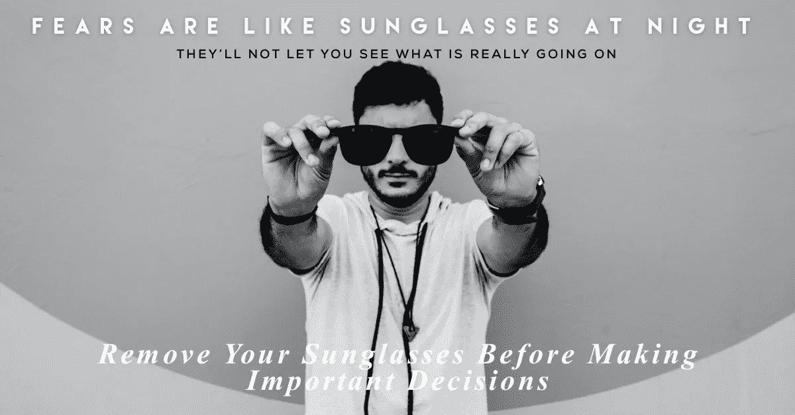

# 理解和转化你的恐惧并展示你的潜力的十个步骤。

> 原文：<https://medium.datadriveninvestor.com/ten-steps-to-understand-and-transform-your-fears-and-reveal-your-potential-626232360fd9?source=collection_archive---------11----------------------->

You can listen the audio version while reading :)

我想和你分享一个思路和十个步骤来理解和转化你的恐惧，并揭示你的潜力:

1.  我们没有关注作为我们生存本能一部分的恐惧；让我们考虑一下那些本能的恐惧(如果)。
2.  我们关注的是阻止我们冒险、参与改变的心理恐惧，这种恐惧能够支持我们的个性就是我们的想法。我们称之为心理恐惧。
3.  PFs 是有意识的和潜意识的，这意味着你没有意识到其中的一些。一些 PFs 伪装成个性特征:“我不是那种和朋友去跳舞的人。”
4.  一旦你意识到一种有害的模式，恐惧开始转变:“在一个朋友说我有跳萨尔萨舞的天赋后，我开始喜欢跳舞。”
5.  PFs 是我们个人经历的结果，其中包括文化影响。“我的家人以努力工作和专业精神为荣，正因为如此，我早期对艺术的兴趣没有得到足够的支持。今天我为一家知名公司工作，但我觉得我的生活中缺少了一些东西。”
6.  征召 PF 与其说是一门科学，不如说是一门艺术。我建议从确定一个重复的模式开始，反思它对行为的影响，并在行为重复时注意:“虽然我能负担得起，但我从来不为弹吉他腾出时间。每当我想享受的时候，我都这样做；我总是急于做更多的工作。这个 PF 是对喜悦的恐惧，或者是对自己工作不够好的恐惧。”
7.  一旦你确定了一个 PF，你就会在每次这个模式影响你的行为时抓住它。这种熟悉感会让你不可避免地重复一遍:“我不再在乎了，我会从今天和每个即将到来的周六开始弹吉他。我爱这个！”
8.  每一个 PF 都是不一样的，要转化和放下，需要的时间和注意力也是不一样的。可以肯定地说，消除恐惧是一生的过程。
9.  每次 PF 从你的生活中消失，你都会感觉更自由。你也会开始了解自己的新方面，你可能会发现一些以前不为人知的才能。“我不认为我能成为一个好园丁；我想我要搬到乡下去了。”
10.  终极 PF 是当你终于有力量去做一些事情来击败其他 PF 时对你说的那个人:“每天骑自行车已经一周了，现在我想知道这是否会破坏我找工作的机会。”

我妈妈总是说，如果我真心想要什么，我会找到让它实现的方法。她说的不是魔法，而是**当我们追求我们所爱的东西时，我们感受到的那种精致的快乐。**

如果你是一名企业家、自由职业者或试图实现你全部潜力的人，永远不要忘记**你的恐惧就像晚上戴墨镜**。

让我引用艾伦·沃茨的一句名言来结束我的发言，他是我智慧和灵感的最佳来源之一:

> “但把时间花在做你不喜欢的事情上，以便继续做你不喜欢的事情，做你不喜欢的事情，并教我们的孩子遵循同样的道路，这绝对是愚蠢的。看到了吗？我们所做的是，我们抚养孩子，教育他们过和我们一样的生活。为了他们可能自圆其说，通过抚养孩子来抚养孩子做同样的事情来寻找生活的满足感，所以都是干呕，没有呕吐。它永远不会到达那里。因此，考虑这个问题非常重要:我想要什么？”—艾伦·沃茨

如果我们都同意恐惧的定义，那么人类就不会再经历如此程度的冲突。为什么？因为如果我们不害怕，我们就不会如此防备、被动和无知。我们肯定会更好地理解自由意味着什么。

 [## 商业无国界:如何走向全球？数据驱动的投资者

### 首先，你要形成你的主要目标。例如，寻找投资，固定你的市场…

www.datadriveninvestor.com](https://www.datadriveninvestor.com/2020/07/14/business-without-borders-how-to-go-global/) 

谢谢你走到最后！如果你需要一些帮助来摆脱你的 PFs，别忘了联系我们。

如果你觉得这有用，你可能会喜欢参加我的[目的感在线培训](https://sop.visionofpresent.com/#)。

**访问专家视图—** [**订阅 DDI 英特尔**](https://datadriveninvestor.com/ddi-intel)