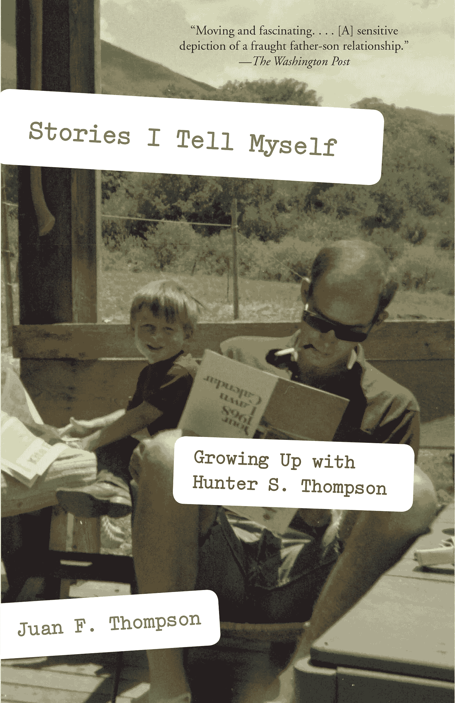

# 向亨特·S·汤普森学习的十件事

> 原文：<https://medium.datadriveninvestor.com/ten-things-to-learn-from-hunter-s-thompson-77a0028732a4?source=collection_archive---------5----------------------->

Penguin Random House

我一直是亨特·S·汤普森的粉丝，他是《拉斯维加斯的恐惧和厌恶》和《地狱天使》等经典作品的作者因此，当我看到他的儿子胡安·f·汤普森写的一本书时，我渴望得到一本。

胡安·汤普森的《我告诉自己的故事:与亨特·S·汤普森一起成长》这本书很值得一读。从某种意义上来说，这是一封写给他已故父亲的情书。也许更重要的是，对于我们这些局外人来说，它描绘了一个文学巨匠的三维肖像。人是复杂的:老汤普森比大多数人都复杂。

 [## 为您的职业生涯提供机器人保护|数据驱动型投资者

### 随着生产率的提高和巨大的利润，企业转向自动化来简化他们的…

www.datadriveninvestor.com](https://www.datadriveninvestor.com/2018/11/20/robot-proofing-your-career/) 

尽管老汤普森是个酒鬼，有时还是个暴君，但他身上有很多值得我们学习和钦佩的地方。以下是十个外卖。

# **住在可以做自己的地方**

对亨特·汤普森来说，这意味着要住在科罗拉多州的一个大农场里。正如他的儿子所说:“在他周围有隐私和空间，他不会被打扰或驱逐，他可以裸体坐在门廊上，他可以从前门射出大口径手枪(对亨特来说非常重要)。”

# **如果你不能做办公室工作，就不要做**

在办公室工作是不自然的。对有些人来说这是无法忍受的。老汤普森以自由撰稿人的身份勉强度日。找到适合你的，然后让它发生。

# **做个浪漫的人**

亨特·汤普森相信真爱。胡安写道:“他喜欢坠入爱河。尽管经历了一系列失败的恋情，亨特对下一段恋情没有失去任何热情。

# **不要太担心别人怎么想**

胡安写道:“我认为他根本不在乎人们喜欢什么——重要的是我们清醒过来并注意到这一点。”。

# **好景不长**

当你有钱时，不要吝惜金钱。亨特做到了，人们深情地记住了这一点。当老汤普森没有钱的时候，他不可能如此慷慨。如果发生这种情况，你说“那又怎么样！”只要知道好时光会再来。

# **学习你的手艺，并不断学习**

很少有人天生就有技能。我们必须学习我们所做的。对汤普森来说，那就是写作，一种他从事了很长时间的手艺。即使当他获得了一些名声，他也一直在增加他的工具箱。

# **不要期望事情会很容易**

“看着他把压抑的挫败感发泄到自己身上，在某种程度上是最痛苦的，”小汤普森写道。他描述亨特“鞭打自己，用内疚、羞耻和恐惧折磨自己，试图激发自己的能量，不管它的来源多么卑鄙和有毒，去完成摆在他面前的任何任务。”你给过那么多吗？

# **有勇气**

你会和地狱天使一起卧底吗？然后写出你所看到的关于他们的真相？亨特·S·汤普森做到了。

# **聪明地反抗**

反叛的方式有很多，但大多数都很老套。胡安引用了他父亲写给一个渴望成为地狱天使的年轻人的话:“做一个亡命之徒……但要用你自己的方式，为了你自己的理由……”老汤普森不喜欢地狱天使，但他喜欢聪明的反叛者。

# **你真正的礼物是你的公司**

在整本书中，胡安·f·汤普森表达了他的孤独。似乎有许多原因，但有一个原因很突出。他想离父亲更近一些。送上那份礼物。

*这是 2016 年 2 月 8 日首次在 Forbes.com 上发表的一篇报道的编辑版本。*