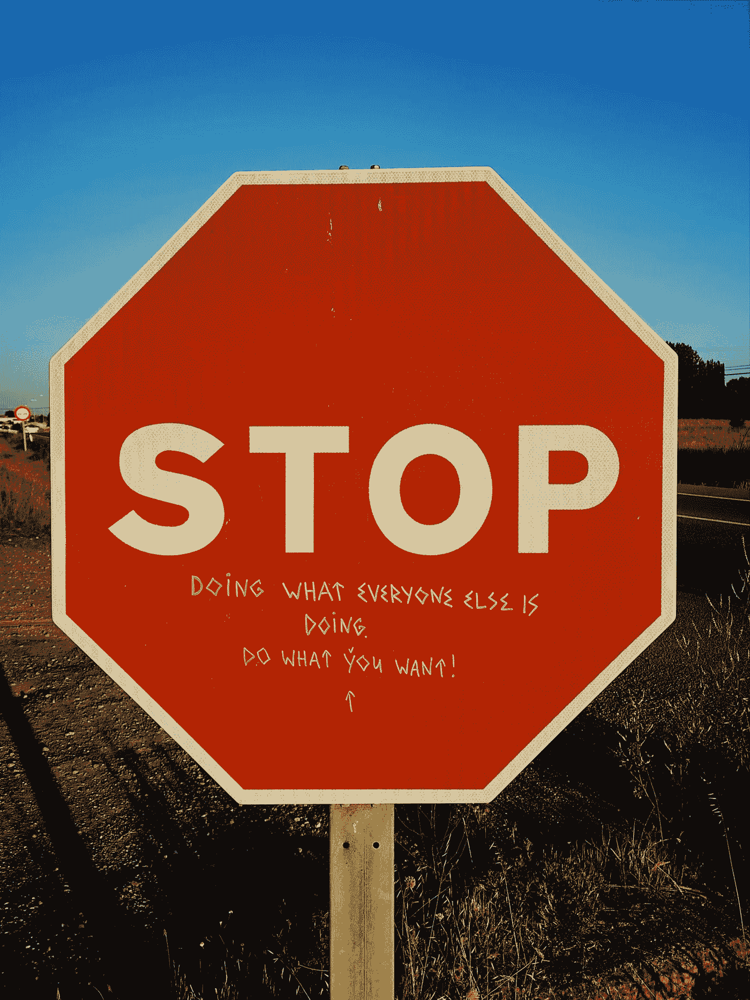

# 我们不该做的十件事

> 原文：<https://medium.datadriveninvestor.com/ten-things-we-shouldnt-do-ee51b20d157e?source=collection_archive---------13----------------------->

当我们不再糟糕时，每个人的生活都会改善(二手灵感项目)

Photo by [Jon Tyson](https://unsplash.com/@jontyson?utm_source=unsplash&utm_medium=referral&utm_content=creditCopyText) on [Unsplash](https://unsplash.com/s/photos/prohibited-sign?utm_source=unsplash&utm_medium=referral&utm_content=creditCopyText)

二手灵感项目从一句激励性的引语开始，在创造性道路蜿蜒的任何地方冒险。

> “你必须对旧方式说不，然后才能开始找到你需要的新方式。”—贝蒂·弗里丹

在 T2 土拨鼠日，这种居家冠状病毒协议的一个好处是有机会评估我们的生活，并关注什么是重要的。也许我们都不是[痴迷的自助瘾君子](https://medium.com/@Chef_BoyarDEJI/how-to-stop-being-a-self-help-junkie-and-start-living-your-life-70d1ce448ee8)，但在这段与世隔绝的时间里，个人成长很可能会出现在每个人的脑海里。

人们通常认为自我提升就是把闪亮的新习惯塞进我们目前枯燥的日常生活中。但是我们也可以通过走出自己的路，消除有害的行为来取得巨大的进步。这种负面倾向的修剪可以推动我们在生活中做出持久的改变。

我们都有坏习惯。我们甚至不应该考虑的行为，但仍然要做。但是是时候面对现实了。承认所有让我们陷入麻烦的糟糕的事情。不一定要修复我们自己——因为谁说我们已经破产了？——而是更现实地看待我们的缺陷和不安全感。

 [## 良好的生活是习惯的形成|数据驱动的投资者

### 过度思考是过度紧张。仅仅几个简单的习惯就会在一天中产生巨大的影响。那是…

www.datadriveninvestor.com](https://www.datadriveninvestor.com/2020/01/17/a-good-life-is-habit-forming/) 

这个世界可能不需要另一个 clickbait 列表，但现在是时候澄清事实了。因此，没有特定的顺序，这里有十件人们应该做但不应该做的事情。

# 1.不要在床上查看智能手机。

在我们上床睡觉后查看工作邮件是一个危险的举动。就像和主管即兴 3p 一样。恶心。

我们要么给我们重要的人他们应得的卧室关注，要么去睡觉。

# 2.每当事情看起来太困难时，不要说“我不能”。

被恐惧控制真糟糕。我们应该检查是什么阻力或精神障碍让我们相信我们无法完成目标，而不是翻来覆去。

我们需要开始用“让我们试试”来代替“我不能”至少在那时，我们在努力克服障碍，而不是放弃。

# **3。不要在网上发布敏感的照片或信息。**

我们需要保持我们的私人物品的私密性，除非我们希望它在公共场合被用来反对我们。句号。

Photo by [Adam Rakús](https://unsplash.com/@adamrakus?utm_source=unsplash&utm_medium=referral&utm_content=creditCopyText) on [Unsplash](https://unsplash.com/s/photos/do-not-disturb?utm_source=unsplash&utm_medium=referral&utm_content=creditCopyText)

# **4。求职面试时不要开着我们的手机。**

完全静音或关闭手机——仍然可以听到震动模式。

除非我们即将接到的电话是人力资源部门在我们梦想的演出上发出的热情邀请，否则我们不应该开着手机。

# **5。当我们还在生气的时候，不要在社交媒体上发布争论或分歧。**

大多数争论发生在私下里，但是脸书和推特却在全世界的视野中。

在我们冷静下来并完全处理好争端之前，在社交网络上发泄总是会回来困扰我们。一旦我们公开发帖，就无法收回。

# **6。不要撒谎、欺骗或说闲话。**

诚信是个人和职业成功的基础。如果我们从事不正当的活动，我们就会破坏这个基础。

由于缺乏诚信，我们限制了领导的机会。

Photo by [Kat J](https://unsplash.com/@kj2018?utm_source=unsplash&utm_medium=referral&utm_content=creditCopyText) on [Unsplash](https://unsplash.com/s/photos/bully?utm_source=unsplash&utm_medium=referral&utm_content=creditCopyText)

# **7。不要对我们的孩子骂人。**

称一个孩子为“问题儿童”或“被宠坏的小孩”是没有帮助的。他们会内化那些负面标签，无法进化。

我们的孩子应该得到更好的——他们在教室和操场上面临足够多的侮辱。他们不需要父母给他们。他们需要我们的支持。

# **8。不要不尝就端上任何食物。**

说真的。这应该是一个显而易见的问题。

如果我们不知道它是什么味道，我们不能假设它是好的，即使我们是了不起的厨师，我们正在修改我们的招牌食谱。总是做质量检查。

# **9。不要成为街区里不打理自己院子的人。**

每个街区都有那样的房子。不要成为那一家人。

随着房地产价格下跌，整条街都会发表消极攻击性的评论。如果我们太忙，我们需要雇用草坪服务或支付街区的孩子。

# 10.不要拿自己和别人比较。

嫉妒是我们不想陷入的陷阱。

胜利者庆祝他人的成功。他们不会拿自己和别人比较，也不会在被超越时抱怨。相反，他们重新校准，深入他们的努力，朝着他们的目标努力。

在这个陌生的新世界里，我们被关在家里，故意游荡，我们都在寻找新的生存和发展方式。保持联系，挖掘灵感，向更好的方向发展——希望在这个世界中找到一丝积极的东西，即使是在距离越来越远的情况下。

正因为如此，没有比当这个世界在这个叫做生活的游戏中按下暂停键的时候更好的时间来重新设置和抛弃我们可悲的行为了。现在是时候做出我们知道应该做出的改变了。

当我们放弃做坏事时，我们为让我们快乐的事情创造了更多的空间。我们越快改掉限制我们成长的习惯，我们进步得就越快。就这么简单。

如果我们都决心停止变得低劣，每个人都会受益。

阿德里安·s·波特是一名作家、工程师、顾问和演说家。他写诗歌、短篇小说和各种主题的文章，包括创造力和个人成长。他是诗集[和散文集](https://www.amazon.com/Everything-Wrong-Feels-Adrian-Potter/dp/109519061X/ref=sr_1_4?qid=1560264651&refinements=p_27%3AAdrian+S.+Potter&s=books&sr=1-4&text=Adrian+S.+Potter)[的作者。在](https://e2857002-6118-41be-9746-64261e36cacb.filesusr.com/ugd/21d2c2_03522f10c7c84340a05a8d03a97e1642.pdf)[http://adrianspotter.com/](http://adrianspotter.com/)在线拜访他。

# 附加文字

[三句名言开启你的雄心](https://medium.com/datadriveninvestor/three-quotes-to-jump-start-your-ambition-e59dc4424e60?source=friends_link&sk=1aa2ece82ddde2e40bcafedf3a7e3bc0)

[培养维护自己的勇气](https://medium.com/datadriveninvestor/cultivate-the-courage-to-stand-up-for-yourself-3afb2b8a1e74?source=friends_link&sk=dd19724eb34c2b2478f0a53bf531f119)

[小口吃](https://medium.com/@adrianpotter/take-small-bites-6741345732ec?source=friends_link&sk=02fd50ccc65d3229e1c24a24189577d4)