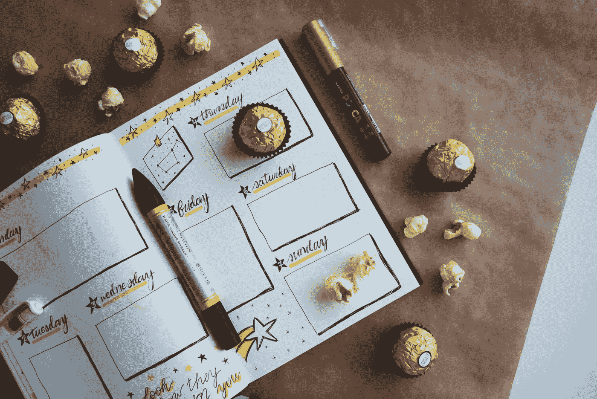

# 影响你生活的十种类型的杂志

> 原文：<https://medium.datadriveninvestor.com/ten-types-of-journals-that-can-impact-your-life-1fddcaa61e92?source=collection_archive---------7----------------------->

找到你喜欢的杂志类型。

Photo by [Debby Hudson](https://unsplash.com/@hudsoncrafted?utm_source=unsplash&utm_medium=referral&utm_content=creditCopyText) on [Unsplash](https://unsplash.com/s/photos/journal?utm_source=unsplash&utm_medium=referral&utm_content=creditCopyText)

定期写日记可以获得巨大的好处。这是一块空白的石板，你可以在上面倾诉你的想法或感受。抱怨无能的主管，但不要显得像个长舌妇。探究为什么你太害羞而不敢和商店里可爱的店员调情。这都是公平的游戏。

在艰难或困惑的时期，日志提供了一个可靠的出口。朋友和亲戚可能会对你评头论足，但杂志会保持中立和支持，不会打断你或脱口说出错误的话。

写日记有助于整理想法和处理感受。你现在有一堆笔记可以回头看，而不是仔细思考一些事情，然后忘记所有或大部分你意识到的事情。

 [## 摔倒不是失败。数据驱动的投资者

### 你只有在放弃的时候才会失败。每个英雄都会倒下，我们活着就是为了失败者出现的时刻；上升到…

www.datadriveninvestor.com](https://www.datadriveninvestor.com/2019/01/17/falling-isnt-failing/) 

最重要的是，如果你坚持写日记，它会迫使你致力于改善你的生活。当你坚持记录你过去一天或一周做了什么，它会推动你重新考虑目标或在目标上取得进展。

希望我用这个关于日志的推销吸引了你。如果你想让写日记成为你日常生活的一部分，拥有多种形式的日记可能是有效的。

如果你使用多种日志类型，只需进入特定的日志，一次处理一个问题，或者将项目组织起来，这样你就可以做出更好的决定。如果你是一个一心多用的人，当你要平衡不同的兴趣，或者想把你日常工作的想法与你的副业分开时，这可能特别有用。

期刊的种类数不胜数。他们的风格可以植根于创造力，健身目标，职业发展，宗教研究等。如果你不确定哪种形式的日志最适合你，或者哪种类型的日志最适合你，考虑以下十种选择。

**1。子弹日记。**这种类型的日志对那些有很多待办事项清单并喜欢跟踪目标的人来说很有用。它的功能性质有助于跟踪职业抱负和短期项目里程碑。项目符号日记应该有一个目录，当您向日记中添加内容时，目录会更新，这样您可以很容易地找到内容。你将使用符号、颜色和线条来制作子弹日志。你应该一眼就能明白页面上的内容。

**2。视觉期刊。**你可能听说过[愿景板](http://www.visionboard.cc/)。这本质上是同样的事情，但以日志的形式。它的工作方式是，你设置日志每页只有一个目标。然后你可以写文字，添加图片，或者画一些能让你制定计划达到目标的东西。当你达成一个目标时，一定要回去加上达成的日期。

Photo by [Estée Janssens](https://unsplash.com/@esteejanssens?utm_source=unsplash&utm_medium=referral&utm_content=creditCopyText) on [Unsplash](https://unsplash.com/s/photos/vision-journal?utm_source=unsplash&utm_medium=referral&utm_content=creditCopyText)

**3。每日一行日志。这本日记就像它的名字一样——你每天只写一行。你只需在日记中写一小段关于你那天经历的事情。最多一两句话，应该占不了多少篇幅。有些人喜欢用日历和笔来做这件事。**

**4。经典期刊。**这简直就是日记，每天想写什么就写什么。条目可以长，也可以短，如果你愿意，可以跳过几天。经典的日志就像一些人在孩童或青少年时期写的日记。你每天想写什么就写什么。

**5。祈祷日记。这是一本日记，你本质上表现得好像你的日记是你更高的力量。注意你希望上帝在你生命中的什么地方指引你。写下你对上帝的祈祷，而不是说出来。把它们记录下来，这样你就可以在以后反思并监控你的精神成长。**

**6。梦想日记。有些人喜欢追踪他们的梦想，因为它们为他们的生活提供了迹象。如果你想追踪它们，训练自己每天早上在还记得梦的时候写日记。写下这个梦，然后研究它的含义，并把它写下来。不要局限于夜间冥想——白日梦也可以包括在内。**

**7。食品杂志。**写下你每天吃的所有东西。你可以这样做是为了健身，或者仅仅因为你是一个美食家。有些人喜欢包括卡路里含量等等。它也可以帮助你写下你为什么吃它，你吃它的感觉，以及诸如此类的事情。简单的变化可以帮助您跟踪您最喜爱的葡萄酒或精酿啤酒。

**8。旅游日志。记旅行日记是记住你旅行的一个好方法。一些人喜欢每次旅行都做一个，而另一些人喜欢为他们持续的冒险编纂一个目录。你可以在日记中写下你的想法，但你也可以附上票根、照片和纪念品。**

Photo by [Freshh Connection](https://unsplash.com/@freshhconnection?utm_source=unsplash&utm_medium=referral&utm_content=creditCopyText) on [Unsplash](https://unsplash.com/s/photos/journal?utm_source=unsplash&utm_medium=referral&utm_content=creditCopyText)

**9。感恩日记。这是一本日记，记录下你每天感激的事情。这本日记中没有什么是消极的，因为它旨在帮助你追踪生活中的积极因素。**

10。项目日志。对于经常参与项目的人来说，这很方便。写日记记录所采取的行动、结果和数据将有助于改进每个项目，也有助于你兴奋地回顾它们。我为职业生涯和创造性努力保持独立的项目日志，尽管如果条目或想法跨越其间，我不会紧张。

如果你想解决问题或追踪目标，用不同的目的写日记是一个有效的方法。这也是一个很好的方式来储存你的想法和记忆，以便将来以一种有组织和有用的方式进行思考。

**阿德里安·s·波特**是一名作家、工程师、顾问和演说家。他写诗歌、短篇小说和各种主题的文章，包括创造力和个人成长。他是诗集《T4》和散文集《自我手册》的作者。在[http://adrianspotter.com/](http://adrianspotter.com/)在线拜访他。