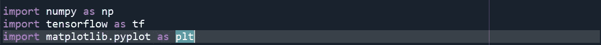
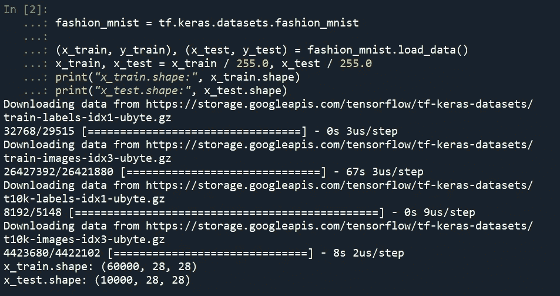
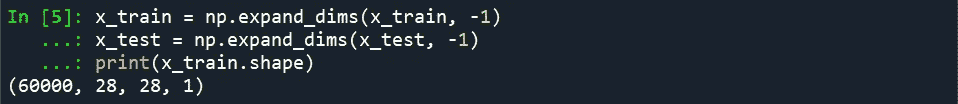
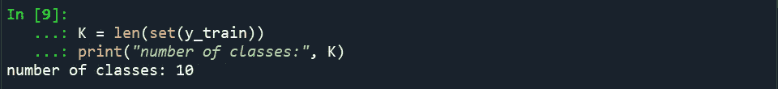

# Tensorflow 2.0 —从预处理到服务(第 1 部分)

> 原文：<https://medium.datadriveninvestor.com/tensorflow-2-0-from-preprocessing-to-serving-part-1-52e81fdcd46d?source=collection_archive---------14----------------------->

欢迎来到 tensorflow 及其 keras API 教程的第一部分。我们将讨论深度学习的一切——从如何预处理输入数据开始，然后建模你的神经网络来编码你的数据并处理输出。

在你开始阅读这篇文章及其后继者之前，你应该了解以下主题的基础知识，以便在阅读时不会感到慌张:
1。微积分
2。线性代数
3。神经网络
4。熊猫，熊猫

正如您可能已经从主题中推断出的那样，这是一篇编程文章，因此它可能有助于了解一些 python 方面的经验。

建议您使用 Spyder(Anaconda 的代码编辑器)进行编码，因为它具有选择性执行功能，这对于理解变量转换非常有帮助。

 [## 深度学习用 7 个步骤解释-更新|数据驱动的投资者

### 在深度学习的帮助下，自动驾驶汽车、Alexa、医学成像-小工具正在我们周围变得超级智能…

www.datadriveninvestor.com](https://www.datadriveninvestor.com/2019/01/23/deep-learning-explained-in-7-steps/) 

如果你没有 GPU，最好在 Google Colab 上完成这项工作——Colaboratory 是一个免费的 Jupyter 笔记本环境，不需要设置，完全在云中运行。

借助 Colaboratory，您可以编写和执行代码、保存和共享您的分析，以及访问强大的计算资源，所有这些都可以从浏览器中免费获得。

我们将在这里使用的数据集是`Fashion-MNIST`。`Fashion-MNIST`是一个由 [Zalando](https://jobs.zalando.com/tech/) 的文章图像组成的数据集——由 60，000 个样本的训练集和 10，000 个样本的测试集组成。每个示例都是 28x28 灰度图像，与 10 个类别的标签相关联。我们打算`Fashion-MNIST`作为原始 [MNIST 数据集](http://yann.lecun.com/exdb/mnist/)的直接替代，用于机器学习算法的基准测试。它共享训练和测试分割的相同图像大小和结构。

数据集的一个范例是:

Sample from the Fashion MNIST Dataset (*each class takes three-rows*)

你们可能对 MNIST 的手写数字数据集有过经验，但我们不会在这里使用它，因为有两个非常好的理由。MNIST 的网络设计太简单了，即使你使用密集的网络，你也可以达到 98%的准确率。
2。它被过度使用了，我们想要学习新的东西，而不是重复旧的内容。

说到这里，我们可以开始有趣的部分了:

在本文的第一部分中，我们将进行预处理，通俗地说就是准备原始数据集，使其与网络的输入图层兼容。

首先，我们导入我们将在实践中使用的基本库——NumPy，它是使用 Python 和 Matplotlib 进行科学计算的基础包，Matplotlib 是 Python 2D 绘图库，它以各种硬拷贝格式和跨平台的交互环境生成出版物质量数据。

最后但肯定不是最不重要的——tensor flow，这是一个用于机器学习的端到端开源平台。它有一个全面、灵活的工具、库和社区资源的生态系统，让研究人员推动 ML 的最新发展，让开发人员轻松构建和部署 ML 驱动的应用程序。

正如本文的主题所建议的，我们将使用 tensor flow——具体来说，它是稳定的 2.0 版本，用于我们从现在开始执行的几乎所有任务。

您从 tf.keras.datasets 加载数据，其中包含许多有用的数据集供您练习。

我们还对像素值进行归一化或缩放，将每个像素值除以 255，这是一个像素的最大值，因此我们得到了一个值在 0-1 之间的三维矩阵。这将有助于我们将来的计算。

检查输入的形状也很重要，因为我们的神经网络只会接受特定的输入形状。

我们将构建一个卷积神经网络或 CNN，它只接受具有形状(batch_size，height，width，channels)的输入。我们的数据集在训练集中有 60000 张图片，在测试集中有 10000 张图片。每个图像的高度和宽度都是 28，因为我们有一个灰度图像，通道数= 1。作为参考，彩色图像有三个通道，RGB。

因此，为了纠正我们的输入中通道维度的缺失，我们扩展维度，以便我们的输入与神经网络的输入层兼容。

我们还检查数据集中的类别数量，这将控制我们的输出层。

完成这些之后，我们就完成了模型的预处理。

在下一篇文章中，我们将讨论为预测特定图像所属的类别而设计的神经网络。

请点击此链接查看完整代码:

 [## Lord TT 13/中等-物品

### 我的 Medium Articles-Lord tt13/Medium-Articles 中引用的所有代码的配套报告

github.com](https://github.com/lordtt13/Medium-Articles/blob/master/tf2_pre_to_serve.py) 

也请给我的个人资料看看更多的内容，如机器学习，全栈开发等几个编程主题相关。