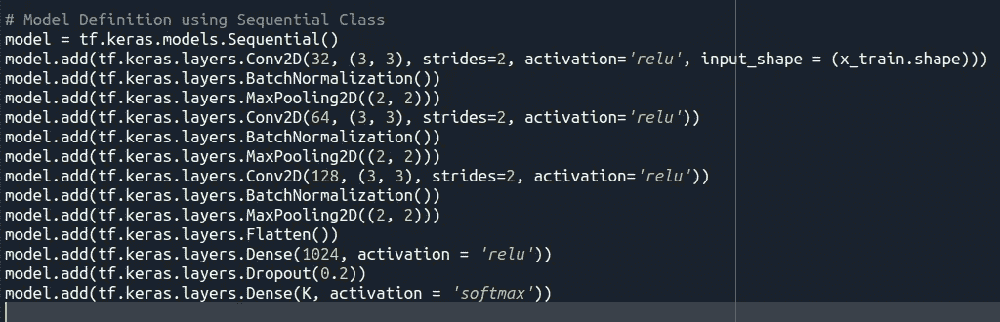
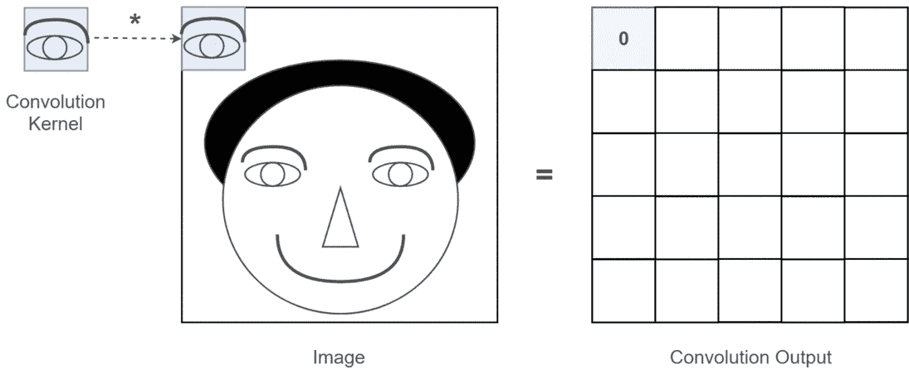
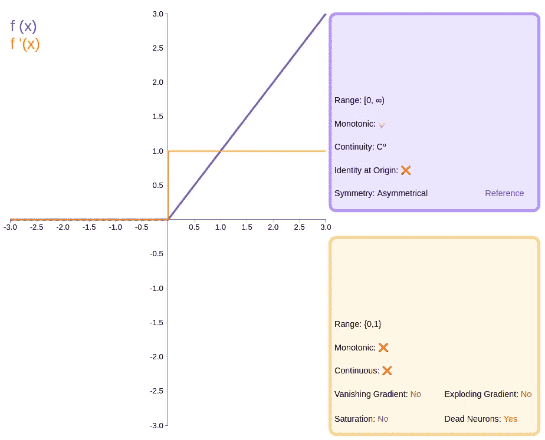
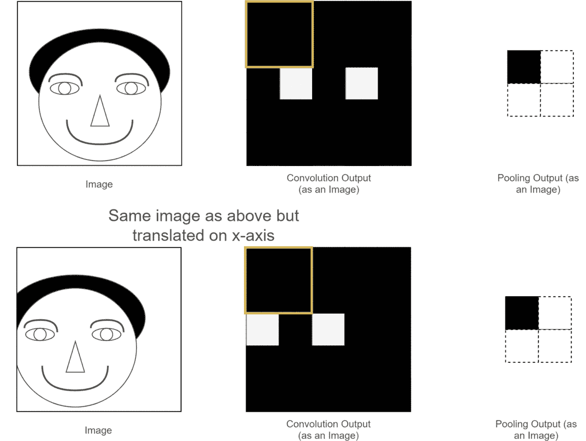
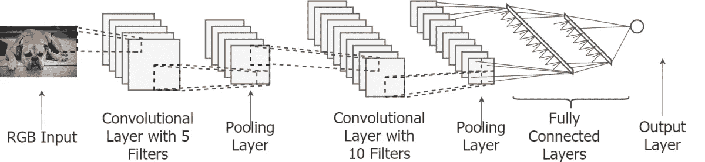
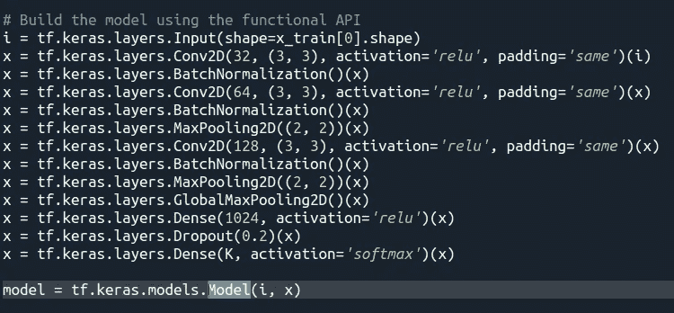
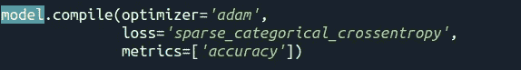
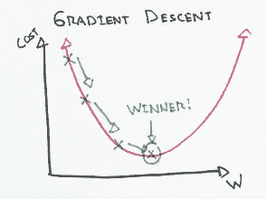
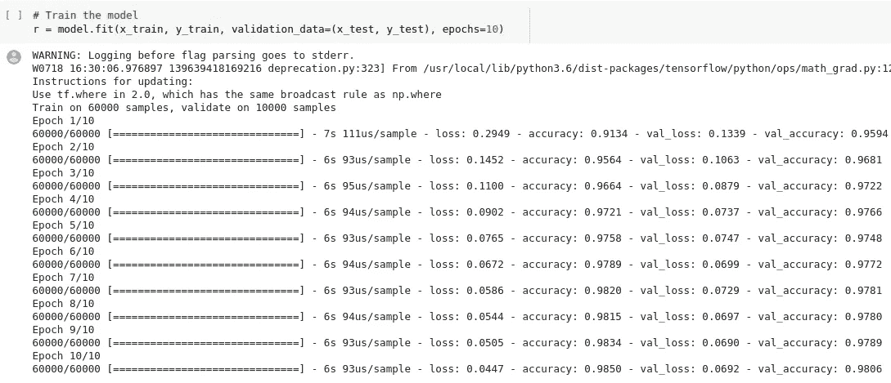

# Tensorflow 2.0 —从预处理到服务(第 2 部分)

> 原文：<https://medium.datadriveninvestor.com/tensorflow-2-0-from-preprocessing-to-serving-part-2-cad9e7f38a9c?source=collection_archive---------9----------------------->

欢迎来到 tensorflow 及其 keras API 教程的第二部分。我们将讨论深度学习的一切——从如何预处理输入数据开始，然后建模你的神经网络来编码你的数据并处理输出。

如果您继续阅读本系列的第一篇文章也是谨慎的，因为我们已经讨论了预处理，我们将从那里继续。

在你开始阅读这篇文章及其后继者之前，你应该了解以下主题的基础知识，以便在阅读时不会感到慌张:
1。微积分
2。线性代数
3。神经网络
4。熊猫，熊猫

正如您可能已经从主题中推断出的那样，这是一篇编程文章，因此它可能有助于了解一些 python 方面的经验。

建议您使用 Spyder(Anaconda 的代码编辑器)进行编码，因为它具有选择性执行功能，这对于理解变量转换非常有帮助。

 [## 2019 年最值得学习的编码语言|数据驱动的投资者

### 在我读大学的那几年，我跳过了很多次夜游去学习 Java，希望有一天它能帮助我在…

www.datadriveninvestor.com](https://www.datadriveninvestor.com/2019/02/21/best-coding-languages-to-learn-in-2019/) 

如果你没有 GPU，最好在 Google Colab 上完成这项工作——Colaboratory 是一个免费的 Jupyter 笔记本环境，不需要设置，完全在云中运行。

借助 Colaboratory，您可以编写和执行代码、保存和共享您的分析，以及访问强大的计算资源，所有这些都可以从浏览器中免费获得。

我们将在这里使用的数据集是`Fashion-MNIST`。`Fashion-MNIST`是一个由 [Zalando](https://jobs.zalando.com/tech/) 的文章图像组成的数据集——由 60，000 个样本的训练集和 10，000 个样本的测试集组成。每个示例都是 28x28 灰度图像，与 10 个类别的标签相关联。我们打算`Fashion-MNIST`作为原始 [MNIST 数据集](http://yann.lecun.com/exdb/mnist/)的直接替代，用于机器学习算法的基准测试。它共享训练和测试分割的相同图像大小和结构。

数据集的一个范例是:

来自时尚 MNIST 数据集的样本(每个类占三行)

你们可能对 MNIST 的手写数字数据集有过经验，但我们不会在这里使用它，因为有两个非常好的理由。MNIST 的网络设计太简单了，即使你使用密集的网络，你也可以达到 98%的准确率。
2。它被过度使用了，我们想要学习新的东西，而不是重复旧的内容。

上一次，我们已经完成了我们的预处理，并准备好输入和目标进入我们的模型。

现在我们做最重要的部分，即模型设计，正如我们在预处理中看到的，这个模型将输入图像，我们将它们分为 10 类。我们将在这里使用的模型是卷积神经网络(CNN)。

首先，我们将使用 Sequential 类构建模型，然后使用 Keras 的函数式 API。

使用顺序类是设计模型最简单的方法，您可以使用。add()方法，并继续将层堆叠在彼此之上，尽管这可能是一种幼稚的方法，因为我们希望我们的模型学习各种潜在的特性。我们将学习函数式 API 中的分支。

现在让我们看看 CNN 中存在哪种子模块。一个典型的 CNN 有三个不同的组成部分。它们是卷积层、汇集层和全连接层。

首先，我们深入讨论卷积层的作用。一个卷积层由许多 ***内核*** 组成。卷积层中存在的这些内核(有时称为 ***卷积滤波器*** )学习图像中存在的局部特征(例如，人的眼睛看起来像什么)。卷积层学习的这种局部特征称为 ***特征图*** 。然后这些特征在图像上进行卷积。该卷积操作将产生一个矩阵(有时称为 ***激活图*** )。如果卷积滤波器中表示的要素出现在输入的给定位置，则激活图会在该位置产生高值。

Convolution Visualized

与显而易见的相反，Conv2D 不执行卷积，而是执行互相关，这在寻找潜在特征时更有意义。

汇集层使 CNN 翻译学习的这些特征不变(例如，不管人的眼睛在[ *x=10，y=10* 或[ *x=12，y=11* ]位置，汇集层的输出将是相同的)。请注意，我们讨论的是每层的轻微翻译变化。然而，聚集几个这样的层，允许我们具有更高的平移不变性。

ReLU 或整流线性单元是我们这里使用的中间激活:

另外，为了可视化其他激活功能，您可以查看这个令人惊叹的网站[https://dashee 87 . github . io/deep % 20 learning/visualizing-activation-functions-in-neural-networks/](https://dashee87.github.io/deep%20learning/visualising-activation-functions-in-neural-networks/)。

输出激活是 softmax， **Softmax 函数，一个奇妙的*激活函数*，它将数字(又名逻辑)转化为概率，其总和为 1。Softmax 函数输出一个向量，该向量表示一系列潜在结果的概率分布。**也是用于*深度学习* *分类*任务的核心元素。

要了解更多关于 softmax 功能的信息，请查看[https://medium . com/data-science-boot camp/understand-the-soft max-function-in-minutes-f3a 59641 e86d](https://medium.com/data-science-bootcamp/understand-the-softmax-function-in-minutes-f3a59641e86d)。

在批次标准化层中，我们标准化每个批次前一层的激活，即应用一个变换，使平均激活接近 0，激活标准偏差接近 1。

然后，我们使用扁平化层，使我们的输入是密集层兼容。丢弃层包括在训练期间的每次更新时将输入单元的一部分`rate`随机设置为 0，这有助于防止过拟合。我们这里的利率是 0.2%或 20%。

Pooling Visualized

最后，我们有完全连接的层。完全连接的层负责基于激活的特征映射的集合和图像中的位置产生不同的激活模式，特征映射被激活用于图像中的位置。这是 CNN 视觉上的样子。

请查看[https://towards data science . com/light-on-math-machine-learning-intuitive-guide-to-convolution-neural-networks-e 3f 054 DD 5d aa](https://towardsdatascience.com/light-on-math-machine-learning-intuitive-guide-to-convolution-neural-networks-e3f054dd5daa)以更深入地了解 CNN 的。

The whole CNN visualized (credits : [https://towardsdatascience.com/light-on-math-machine-learning-intuitive-guide-to-convolution-neural-networks-e3f054dd5daa](https://towardsdatascience.com/light-on-math-machine-learning-intuitive-guide-to-convolution-neural-networks-e3f054dd5daa))

现在我们将使用函数式 API 做同样的事情

正如你所看到的，没有什么大的变化，但是函数式 API 给了你将你的层重定向到你想要的任何地方的自由。

这里唯一的主要变化是使用 GlobalMaxPooling2D 代替 Flatten 层。GlobalMaxPooling2D 块执行与 MaxPooling2D 块完全相同的操作，除了池大小(即，水平池系数 x 垂直池系数)是块的整个输入的大小，即，它为每个输入通道计算单个最大值。这是直观的，因为我们想要更突出的特征，因为它们将决定我们的输入属于哪个类别，并且该层极大地减少了我们的计算。

如果你想要更多的视频教程，请在 https://www.tensorflow.org/guide/keras[查看 tensorflow 的核心文档进行更多的练习。](https://www.tensorflow.org/guide/keras)

既然我们已经完成了模型设计，现在我们可以编译模型了

我们在编译时选择一个优化器。

在训练过程中，我们调整和改变模型的参数(权重),以尝试最小化损失函数，并使我们的预测尽可能正确。但是你具体是怎么做的呢？如何改变模型的参数，改变多少，何时改变？

这就是优化器的用武之地。它们通过响应损失函数的输出更新模型，将损失函数和模型参数联系在一起。简单来说，优化者通过使用权重将你的模型塑造成最精确的形式。损失函数是地形的向导，告诉优化器它何时向正确或错误的方向移动。

我们将使用梯度下降算法的后继算法，这里是 Adam(自适应矩估计)

Source : ML Cheatsheet

有关优化器及其变体的更多信息，请查看 https://algorithmia.com/blog/introduction-to-optimizers[https://www . dlology . com/blog/quick-notes-on-how-to-choose-optimizer-in-keras/](https://www.dlology.com/blog/quick-notes-on-how-to-choose-optimizer-in-keras/)和。

我们现在选择损失函数。作为优化算法的一部分，必须重复估计模型当前状态的误差。这需要选择误差函数，通常称为损失函数，该函数可用于估计模型的损失，从而可以更新权重以减少下一次评估的损失。

这里我们使用“sparse _ categorical _ crossentropy”，更多信息请看[https://medium . com/@ Joocheol _ Kim/what-is-sparse-categorial-cross entropy-7 BF 3c 5 ACF 99 e](https://medium.com/@Joocheol_Kim/what-is-sparse-categorical-crossentropy-7bf3c5acf99e)。

此外，如果你需要知道你自己的定制模型需要什么样的损失，请查看[https://machine learning mastery . com/how-to-choose-loss-functions-when-training-deep-learning-neural-networks/](https://machinelearningmastery.com/how-to-choose-loss-functions-when-training-deep-learning-neural-networks/)。

最后，我们选择需要记录的指标，因为这是一个分类问题，我们选择准确性。

现在该训练了！

完成这些之后，我们就完成了模型的训练。

PS:如果你在本地使用 GPU 资源，如果 cudnn 初始化失败，把你所有的代码移植到 colab。

在下一篇文章中，我们将讨论神经网络的版本控制，并使用 tensorflow 服务将它制作成 API 服务。

请点击此链接查看完整代码:

 [## Lord TT 13/中等-物品

### 我的 Medium Articles-Lord tt13/Medium-Articles 中引用的所有代码的配套报告

github.com](https://github.com/lordtt13/Medium-Articles) 

也请给我的个人资料看看更多的内容，如机器学习，全栈开发等几个编程主题相关。