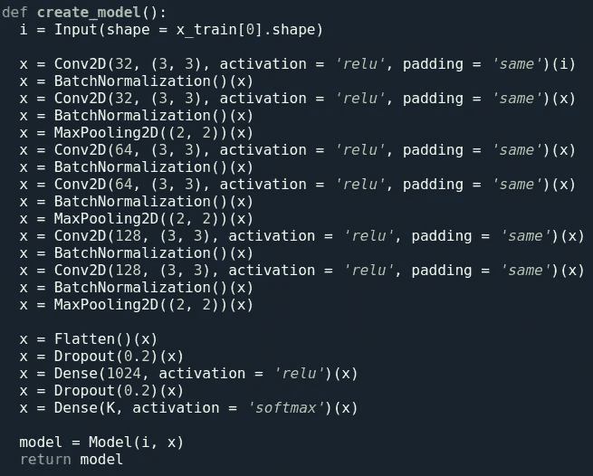
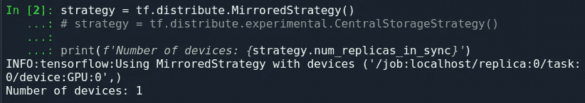
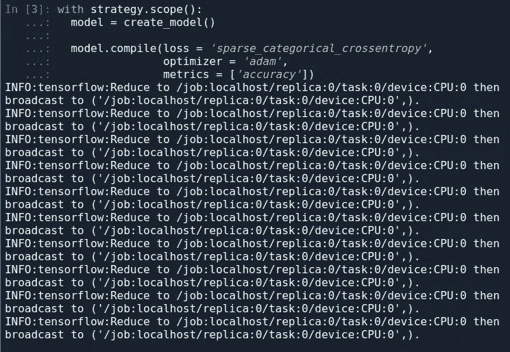
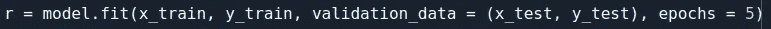

# Tensorflow 2.0 —从预处理到服务(第 3 部分)

> 原文：<https://medium.datadriveninvestor.com/tensorflow-2-0-from-preprocessing-to-serving-part-3-7fa5d1b6b142?source=collection_archive---------19----------------------->

欢迎来到 tensorflow 及其 keras API 教程的第三部分。我们将讨论深度学习的一切——从如何预处理输入数据开始，然后建模你的神经网络来编码你的数据和处理输出，优化训练，并将模型作为 REST API。

如果您继续阅读本系列的前两篇文章也是明智的，因为我们已经讨论了预处理和模型设计，我们将从那里继续。

在你开始阅读这篇文章及其后继者之前，你应该了解以下主题的基础知识，以便在阅读时不会感到慌张:
1。微积分
2。线性代数
3。神经网络
4。熊猫，熊猫

正如您可能已经从主题中推断出的那样，这是一篇编程文章，因此它可能有助于了解一些 python 方面的经验。

建议您使用 Spyder(Anaconda 的代码编辑器)进行编码，因为它具有选择性执行功能，这对于理解变量转换非常有帮助。

如果你没有 GPU，最好在 Google Colab 上完成这项工作——Colaboratory 是一个免费的 Jupyter 笔记本环境，不需要设置，完全在云中运行。

借助 Colaboratory，您可以编写和执行代码、保存和共享您的分析，以及访问强大的计算资源，所有这些都可以从浏览器中免费获得。

我们将在这里使用的数据集是`Fashion-MNIST`。`Fashion-MNIST`是一个由 [Zalando](https://jobs.zalando.com/tech/) 的文章图像组成的数据集——由 60，000 个样本的训练集和 10，000 个样本的测试集组成。每个示例都是 28x28 灰度图像，与 10 个类别的标签相关联。我们打算`Fashion-MNIST`作为原始 [MNIST 数据集](http://yann.lecun.com/exdb/mnist/)的直接替代，用于机器学习算法的基准测试。它共享训练和测试分割的相同图像大小和结构。

数据集的一个范例是:

来自时尚 MNIST 数据集的样本(每个类占三行)

你们可能对 MNIST 的手写数字数据集有过经验，但我们不会在这里使用它，因为有两个非常好的理由。MNIST 的网络设计太简单了，即使你使用密集的网络，你也可以达到 98%的准确率。
2。它被过度使用了，我们想要学习新的东西，而不是重复旧的内容。

上次我们已经完成了模型设计，现在我们已经准备好进行优化和指标回调。

在我们前进之前，让我们看看我们的模型设计

现在，我们继续定义分布策略，分布策略提供了一个抽象概念，用于将您的培训分布到多个处理单元。目标是允许用户使用现有的模型和培训代码进行分布式培训，并进行最小的更改。

我们将在这里使用 the tf.distribute.MirrorStrategy 策略，它在一台机器上的许多 GPU 上通过同步训练进行图内复制。本质上，它将模型的所有变量复制到每个处理器。然后，它使用 [all-reduce](http://mpitutorial.com/tutorials/mpi-reduce-and-allreduce/) 来组合来自所有处理器的梯度，并将组合值应用于模型的所有副本。

更多策略可在[分销策略指南](https://www.tensorflow.org/guide/distributed_training)中找到。

在声明了策略之后，我们可以获得设备的数量和它们的 id，以便访问它们。

我们现在必须在`strategy.scope`的上下文中创建和编译 Keras 模型

现在我们训练，就像我们习惯的那样:

要查看完整的代码，请查看:

[https://github.com/lordtt13/Medium-Articles](https://github.com/lordtt13/Medium-Articles)

我们已经完成了培训，现在剩下的就是开始为模型服务，我们很快就会讨论这个问题，所以请密切关注。

在那之前，再见！