# TensorFlow 2.0 —从预处理到服务(第 4 部分)

> 原文：<https://medium.datadriveninvestor.com/tensorflow-2-0-from-preprocessing-to-serving-part-4-96a6ba1dcd39?source=collection_archive---------2----------------------->

欢迎来到 TensorFlow 及其 Keras API 教程的第四部分，也是最后一部分。我们将讨论深度学习的一切——从如何预处理输入数据开始，然后建模你的神经网络来编码你的数据和处理输出，优化训练，并将模型作为 REST API。

正如您从标题中看到的，我们已经有了 3 个关于这个主题的故事，在这个故事中，我们将快速浏览所有这些步骤，并使用创建的模型来满足请求。

在开始阅读本文及其前辈之前，您应该了解以下主题的基础知识，以便在阅读时不会感到慌张:

1.  结石
2.  线性代数
3.  神经网络
4.  熊猫，熊猫

正如您可能已经从主题中推断出的那样，这是一篇编程文章，因此它可能有助于了解 python 的一些现有经验。

由于这篇文章涉及到服务模型，最好在 Google Colab 上完成——Colaboratory 是一个免费的 Jupyter 笔记本环境，不需要设置，完全在云中运行。

借助 Colaboratory，您可以编写和执行代码、保存和共享您的分析，以及访问强大的计算资源，所有这些都可以从浏览器中免费获得。

我们将在这里使用的数据集是`Fashion-MNIST`。`Fashion-MNIST`是一个由[扎兰多](https://jobs.zalando.com/tech/)的文章图像组成的数据集——由 60，000 个样本的训练集和 10，000 个样本的测试集组成。每个示例都是 28x28 灰度图像，与 10 个类别的标签相关联。我们打算将`Fashion-MNIST`作为原始 [MNIST 数据集](http://yann.lecun.com/exdb/mnist/)的直接替代，用于机器学习算法的基准测试。它共享训练和测试分割的相同图像大小和结构。

来自时尚 MNIST 数据集的样本(每个类占三行)

你可能以前使用过 MNIST 的手写数字数据集，但我们不会在这里使用它，原因有两个:

1.  MNIST 的网络设计太简单了，即使是简单的密集网络，你也能达到 98%的准确率。
2.  它被过度使用了，我们想要学习新的东西，而不是重复旧的内容。

但首先我们应该了解什么是 API:应用程序接口(API)是一组用于构建软件应用程序的例程、协议和工具。API 规定了软件组件应该如何交互。

我们来看一个小例子:

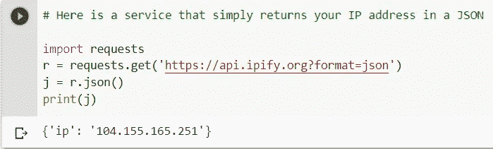

我们的 TensorFlow 模型服务器将是相同的，除了它从 ML 模型返回预测。现在，让我们像在本教程的第一部分中一样加载并规范化数据:

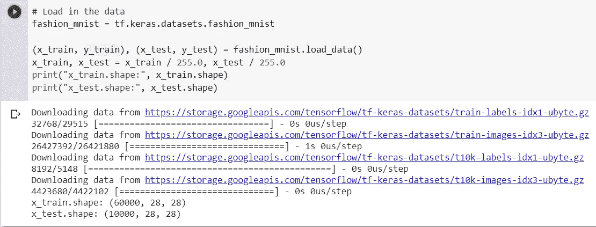

然后，我们将扩展维度，重塑并获得唯一类的数量。现在我们继续构建卷积模型，就像第二个教程一样。

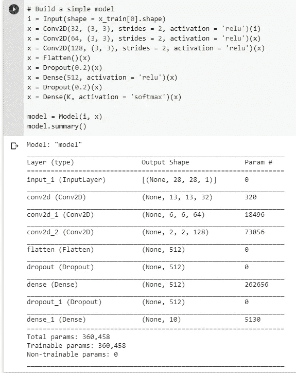

现在我们开始训练:

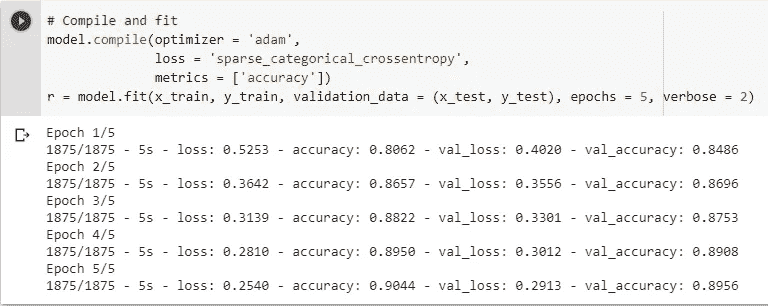

既然我们已经训练了模型，我们需要把它保存在一个临时文件中，这样它就可以被服务了，如果已经有一个保存的模型，我们就把它从系统中删除。SavedModel 是包含序列化签名和运行它们所需的状态的目录，包括变量值和词汇表。

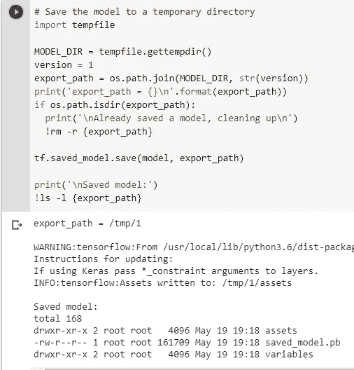

注意版本的使用。

`saved_model.pb`文件存储实际的 TensorFlow 程序或模型，以及一组命名的签名，每个签名标识一个接受张量输入并产生张量输出的函数。

SavedModels 可能包含模型的多个变体(多个`v1.MetaGraphDefs`，用`--tag_set`标志到`saved_model_cli`来标识)。

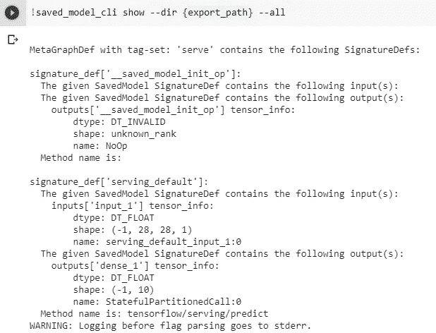

`saved_model_cli`在其输出中包含了更多的类信息，如果您能看到这个命令的完整输出就太好了。

现在使用“！”在您的 colab 终端上安装`tensorflow-model-server`包(砰)符号。(在整个代码中还包含了在本地设置软件包的说明)

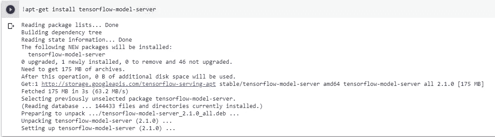

现在，我们将继续并开始将模型作为服务来提供。

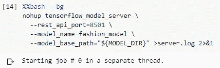

这是我们开始运行 TensorFlow 服务和加载模型的地方。加载之后，我们可以开始使用 REST 进行推理请求。有一些重要的参数:

*   `rest_api_port`:我们将用于 REST 请求的端口。
*   `model_name`:我们将在 REST 请求的 URL 中使用它。它可以是任何东西。
*   `model_base_path`:这是我们保存模型的目录路径。

nohup 参数是必需的，以便服务不间断地运行。让我们检查一下我们的日志，看看一切运行正常:

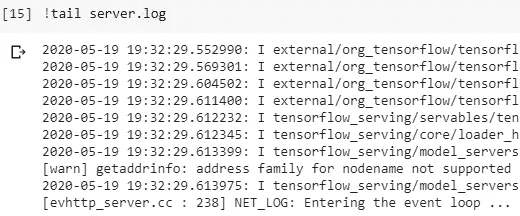

如果没有记录错误，这意味着我们的模型已经开始服务，我们可以向它发送请求以获得预测。

现在，让我们看一个来自我们数据集的随机例子:

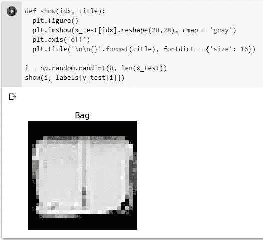

现在我们将创建一个请求，以 JSON 格式传递，它应该包含正确格式化的输入，就像我们传递用于训练的数据一样，因为我们的模型被训练为只识别预处理的数据。

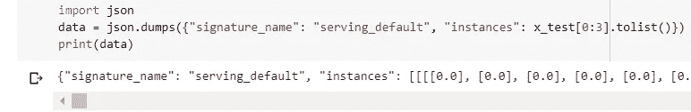

正如您可以清楚地看到的，我们传入了 3 个实例来获得推论。

现在，我们将它打包在一个请求中，并将其发送给我们的预测模型，我们得到一个 ping 返回，即预测，采用相同的 JSON 格式。

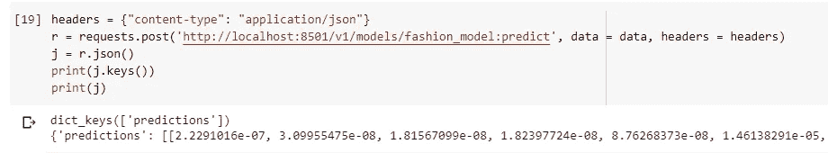

预测采用 SoftMax 格式，这是与实例所属的每个类相对应的概率。因此，我们可以做的是通过获取每个预测的 argmax 并将它们映射回字符串标签来找到每个实例所属的索引。

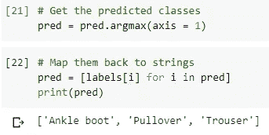

现在让我们看看它们是如何与实际预测相匹配的:

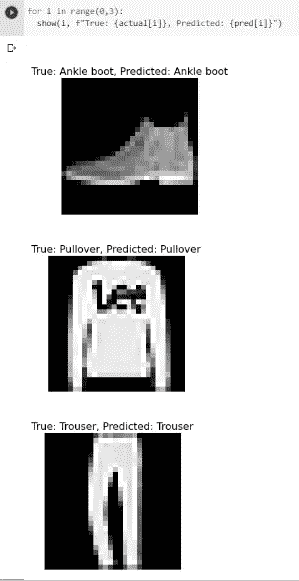

相当不错的成绩！

现在，我们来看一下模型的版本化，让我们看看如何根据版本来制作和选择模型:

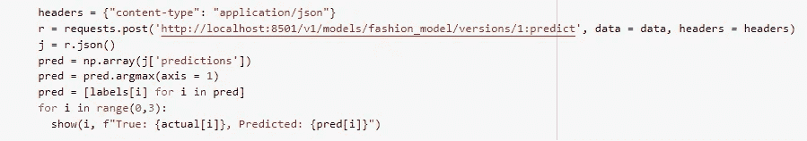

额外注意 URL 的最后几个部分，我们向其发出 post 请求，特别是 versions/1:predict，默认情况下，如果只有一个模型，那就是 v1，这是唯一被服务的模型。

现在，我们将继续制作模型的另一个版本，再次编译并将其放入我们的数据集。

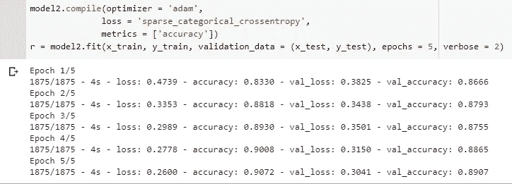

现在适当地保存我们模型的第二个版本:

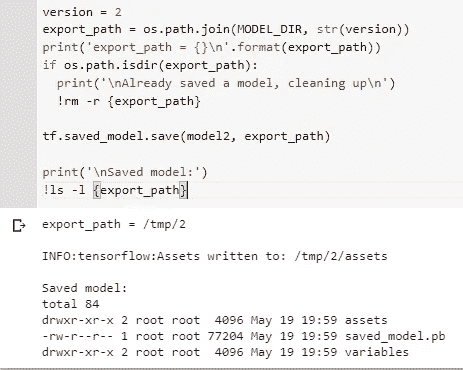

最酷的是，您不需要重新启动服务器来让模型识别第二个版本，它已经被保存为资产并准备好提供服务。我们再次发出 post 请求，但是这次是针对模型的第二个版本

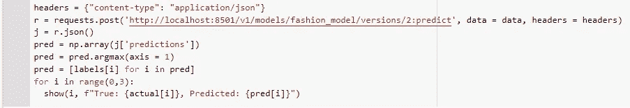

看到了吗？URL 现在已更改为`2:predict`。使用`tensorflow-server`进行版本控制很容易。

但是此时要问的一个有效问题是，“如果我们使用一个不存在的版本号会怎么样？”让我们来测试一下！

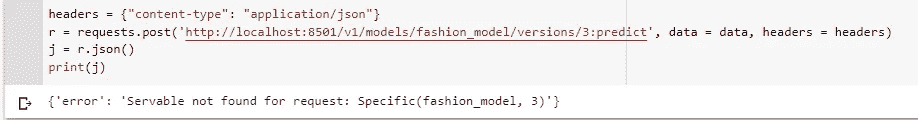

我们遇到了一个我们预料到的错误。

至此，我们完成了从预处理到上菜的整个过程。

要查看完整的代码，请查看:

 [## Lord TT 13/中等-物品

### 我的 Medium Articles-Lord tt13/Medium-Articles 中引用的所有代码的配套报告

github.com](https://github.com/lordtt13/Medium-Articles) 

请继续关注我的下一个系列。

在那之前，再见！