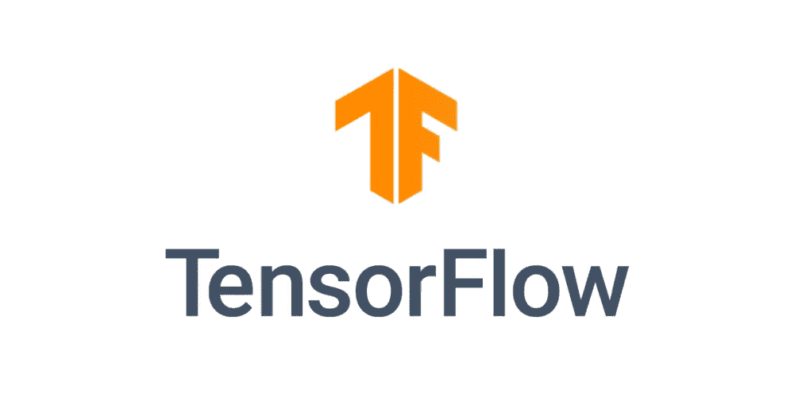

# 5 分钟学会张量流⏱️

> 原文：<https://medium.datadriveninvestor.com/tensorflow-in-5-minutes-c4396e29f0d5?source=collection_archive---------4----------------------->

## TensorFlow 机器学习库简介


Photo by [Veri Ivanova](https://unsplash.com/@veri_ivanova?utm_source=unsplash&utm_medium=referral&utm_content=creditCopyText) on [Unsplash](https://unsplash.com/s/photos/stopwatch?utm_source=unsplash&utm_medium=referral&utm_content=creditCopyText)

Tensorflow 是一个深度学习库，使构建和部署深度学习应用程序变得超级简单。如果你想知道这个库是关于什么的，不要再等了，继续阅读博客，寻找 Tensorflow 的独特之处。

本博客提供了 Tensorflow 库的概述，并提供了该主题的简要介绍，包括一些重要的关键字、安装和演示代码。

# 什么是张量流？



*   它是一个针对高性能数值计算的**免费开源平台，专门针对 ML 和深度学习。**
*   拥有**灵活的架构**，可以跨多种平台(CPU、GPU 和 TPU)以及移动和边缘设备进行部署。
*   让**轻松构建和部署机器学习解决方案**。

# 张量流的应用:

Tensorflow 用于搜索引擎、文本翻译、图像字幕、推荐系统等应用中

# 张量流的安装:

## 1.在 python3 中安装 tensorflow

```
$ pip3 install tensorflow
```

## 2.在 python2 中安装 tensorflow

```
$ pip install tensorflow
```

## 3.安装 Tensorflow 2.0

```
$ pip install tensorflow==2.0.0-alpha0
```

## 4.在 Anaconda 环境中安装 Tensorflow

```
$ conda install tensorflow
```

# 张量

*   张量是一个**类型的多维数组**。
*   可以是 0 维、1 维、2 维和 3 维，也可以是 n 维。

# 张量的类型:

1.  零维-标量(仅数量级)
2.  一维向量(大小和方向)
3.  二维矩阵(数字表)
4.  三维矩阵(数字立方)
5.  n 维矩阵

# 重要关键词:

## 1.张量的形状；

*   它是每个维度中的**个元素。**
*   为了得到张量的形状，我们使用:

```
>> tensor.shape
```

## 2.常数:

*   它是 Tensorflow 中的一种数据结构，当被赋值时，**它的值在执行时**不能改变。
*   它的初始化是用一个值，而不是用一个操作。

```
a = tf.constant([[1, 2], [3, 4]])
```

## 3.变量:

*   它们**在 Tensorflow** 中存储图形的状态，而**是可变的(即可以在执行过程中改变)**。
*   它们需要在声明时进行初始化。

```
new_variable = tf.Variable([.5], dtype=tf.float32)
new_variable = tf.get_variable("my_variable", [1, 2, 3])
```

*   这里可以使用 tf.assign()来更改它的值。

## 4.占位符:

*   它是一个变量，最初**没有值，以后可以给它赋值**。
*   占位符的数据类型必须在创建占位符的过程中指定。

## 5.排名:

*   tf 的等级。张量对象是它的维数。也称**阶**或**度**。

# Tensorflow 的重要组件:

## 1.图表:

*   它是任何 Tensorflow 程序的支柱。
*   图是由一系列通过边相互连接的节点组成的。
*   每个节点代表计算单元，边代表计算消耗或产生的数据。

```
tf.get_default_graph()
# Creating a new graph
graph = tf.graph()
# Printing all operations in a graph
print(graph.get_operations())
```

图表的优势:

*   平行
*   分布式执行
*   汇编
*   轻便

## 2.会话:

*   它**分配资源**。
*   存储中间结果的实际值。

```
with tf.Session() as sess:  # Creating a session
# Perform operations here
```

**张量流的数学运算**

```
>> tf.add(x,y)  # Add two tensors of same type, x+y
>> tf.sub(x, y) # Subtract two tensors of same type, x-y
>> tf.mul(x, y)  # Multiply two tensors element-wise
>> tf.pow(x, y) # Element-wise power of x to y
>> tf.exp(x)  # Equivalent to pow(e, x)
>> tf.sqrt(x)  # Equivlent to pow(x, 0.5)
>> tf.div(x, y)  # Element wise division of x and y
>> tf.truediv(x, y)  # Same as tf.div, but casts the arguments as float
>> tf.floordiv(x, y)  # Same as truediv, excepts rouds final answer to an integer
>> tf.mod(x, y)  # Element wise remainder from division
```

## 3.图形可视化工具

它是 TensorBoard 的一个组件，**在浏览器**中可视化地呈现你的图形结构。

```
# Saving a graph for visualization
with tf.Session() as sess:
writer = tf.summary.FileWriter("/tmp/log/...", sess.graph)
```

# Tensorflow 使用的命令式编程环境

## 急切的执行

*   使用急切执行**你可以不用会话**运行你的代码。
*   它立即评估操作，而不构建图表。

```
# To enable eager execution in old versions of Tensorflow
tf.enable_eager_execution ()
```