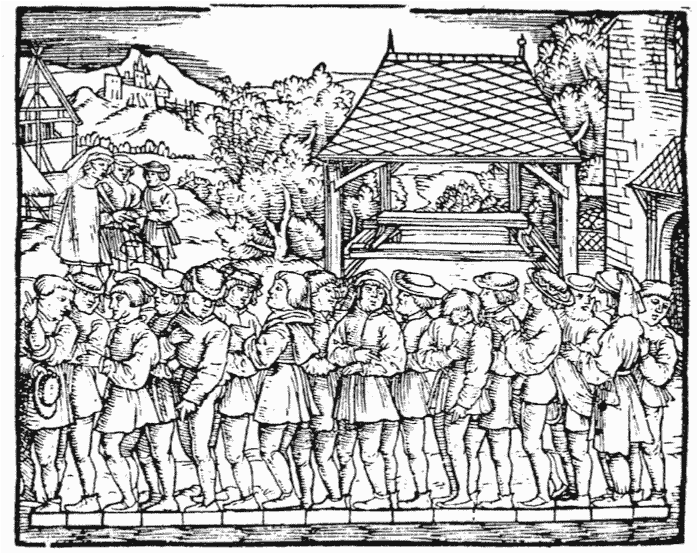
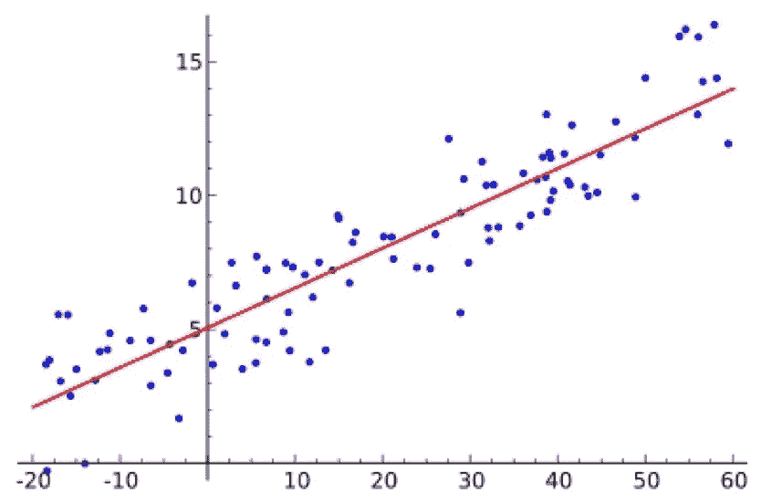
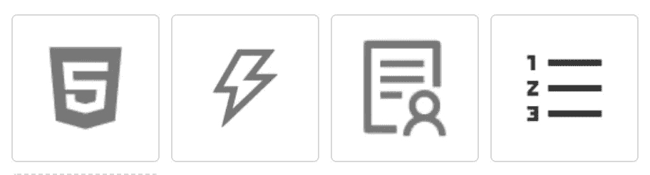

# TensorFlow.js 帮助在毫秒内识别大量图标！

> 原文：<https://medium.datadriveninvestor.com/tensorflow-js-helps-recognize-large-quantities-of-icons-in-milliseconds-289709671ecc?source=collection_archive---------27----------------------->


*作者田可*

# 背景

在前端开发过程中，需要恢复图像的图标。在大多数情况下，图标没有相应的`type`字段。如果用户需要用肉眼从数百个图标中寻找自己需要的东西，结果就是用户体验很差。

因此，去年，我提交了一个[蚂蚁设计](https://ant.design/)开源项目的 pull 请求。pull request 贡献了一个新功能，基于深度学习技术搜索带有截图的图标。当用户点击、拖动或粘贴设计中的图标截图或任何要上传的图像时，他们可以搜索最佳匹配和相应的匹配率。记住**所有识别任务都是由前端完成的！**

下图显示了效果:


也可以在官网体验:[https://ant.design/components/icon/](https://ant.design/components/icon/)

我们如何实现这项技术？本文将揭示这项技术背后的秘密:

*   深度学习简介
*   样本生成
*   模特培训
*   模型压缩和转换
*   TensorFlow.js 识别

# 深度学习简介

如前所述，该功能是基于深度学习实现的。什么是深度学习？深度学习是机器学习的一种。机器学习是对基于“经验”自动改进的计算机算法的研究。

这里的关键词是体验。长期以来，人类根据自己的经验来解决问题。比如，早在中世纪，就有人通过测量 16 个男人的平均脚长来估算所有男人的平均脚长。



这是另一个例子。如果给你很多身高体重数据以及一个人的身高，你能估算出这个人的体重吗？



当然可以！可以在上图所示的 y = ax + b 的公式中计算出 a 和 b 的值，然后根据身高计算出一个人的体重。在机器学习中，a 叫权重，b 叫偏差。更具体地说，这在机器学习中被称为线性回归。

计算机可以学习数字模式。如果我们将图像、声音或文本转换成数字，计算机能识别这些模式吗？当然可以！然而，模型要复杂得多。

# 图像分类


## 语音助手


我们使用一种叫做卷积神经网络的深度学习模型对图标截图进行分类。

无论我们谈论的是简单的线性回归还是复杂的深度学习，模型都是从“经验”中学习的。这里的“经验”在机器学习中称为“样本”。所以首先要生成机器学习的样本。

# 样本生成

在此图标分类任务中，样本由两部分组成:

*   形象
*   图像标签

标签指的是图像的类别名称。比如你想识别图像中是猫还是狗，那么猫和狗就是标签。

研究表明，生成的样本越多，深度学习模型的学习效果就越好。因此，我们采用了集成一个示例页面的方法。它使用木偶戏与 FaaS 快速生成成千上万的图标图像及其相应的标签。我们如何实现它？

1.  **编写一个示例页面:**我们创建一个新的前端页面，它只呈现一个 Ant 设计图标。然而，这个图标可能是 300 多个 Ant 设计图标中的任何一个。除此之外，图标的大小、颜色和位置都是随机呈现的。
2.  **使用 puppet er 循环截图:**编写完一个样本页面后，我们使用 puppet er(一个无头浏览器)打开页面，刷新-截图操作自动循环。生成了成千上万的图像。
3.  **实现 FaaS 并发:**在一台 PC 上生成上万张图片太慢，所以我们预计在 100 台电脑上并发截图。我们使用 FaaS 并创建 100 个实例并发截图，在测量过程中每分钟生成 20，000 张图像。

因此，有许多样品可供选择。



# 模特培训

当样本可用时，您可以开始训练模型。我们使用张量流框架。TensorFlow 框架提供了一个图片分类的例子供大家下载。运行它时，根据我们刚刚生成的示例指定参数。[https://github . com/tensor flow/hub/tree/master/examples/image _ retaining](https://github.com/tensorflow/hub/tree/master/examples/image_retraining)

您可以在电脑上进行模型训练。训练模式比较慢，但是一个午休就能完成！

[阿里云机器学习平台 AI (PAI)](https://www.alibabacloud.com/product/machine-learning) 提供可用的图像分类算法和 GPU 进行加速训练。我没有在 PAI 上使用图像分类算法。相反，我已经将 TensorFlow 代码部署到 PAI 进行模型训练。速度非常快！

# 模型转换和压缩

模型经过训练后，可以用来识别图像。但是，在使用模型之前，Python 代码必须部署在服务器上。这会带来以下缺点:

*   **服务器成本**:部署一个模型需要服务器。蚂蚁设计是一个开源项目，所以我们不愿意承担任何线性增长的成本。
*   **识别速度:**服务器是集中式的，所以中国以外居住较远的用户在速度方面会受到影响。
*   **稳定性:**数十万开发者正在使用蚂蚁设计。如果出现服务器问题，服务器稳定性堪忧，可能会有大量用户受到影响。
*   **安全:**蚂蚁设计是一个没有任何认证授权的静态公共网站，开放的接口必然会带来一些安全隐患。

鉴于这些缺点，我们打算将我们的模型转换为 TensorFlow.js 模型，并允许用户将后一种模型下载到他们的浏览器上进行识别。这可以带来以下好处:

*   **边缘计算:**每个用户都有一台安装了 GPU 的电脑。我们的模型下载到每个用户的浏览器后，模型可以使用来自大量用户的 GPU 的计算能力，降低服务器成本，让用户免除对服务器攻击和服务器稳定性问题的担忧。
*   **识别速度快:**模型下载到每个用户的浏览器，识别过程几乎是实时的，不涉及网络传输。

模型转换和压缩都使用 tfjs-converter:[https://github . com/tensor flow/tfjs/tree/master/tfjs-converter](https://github.com/tensorflow/tfjs/tree/master/tfjs-converter)

我们使用 MobileNet 进行迁移学习。型号为 16 MB，压缩到 3 MB 左右，发布到 jsDelivr 进行全局加速。

# TensorFlow.js 识别

现在，您需要编写一些 TensorFlow.js 代码。首先，加载模型文件。代码片段如下所示:

```
const MODEL_PATH = 'https://cdn.jsdelivr.net/gh/lewis617/antd-icon-classifier@0.0.1/model/model.json';
model = await tfconv.loadGraphModel(MODEL_PATH);
```

接下来，把图标截图转换成张量。

张量是一种类似于多维数组的数据结构。在 TensorFlow 中，模型的输入和输出是张量。因此，在训练和识别之前，必须将数据转换成张量。

```
// Convert images into tensors
constimg=tf.browser.fromPixels(imgEl).toFloat();constoffset=tf.scalar(127.5);
// Normalize an image from [0, 255] to [-1, 1]
constnormalized=img.sub(offset).div(offset);// Change the image size 
let resized = normalized;
if (img.shape[0] !== IMAGE_SIZE || img.shape[1] !== IMAGE_SIZE) {
  const alignCorners = true;
  resized = tf.image.resizeBilinear(
    normalized, [IMAGE_SIZE, IMAGE_SIZE], alignCorners,
  );
}// Change the shape of a tensor to meet the model requirements
constbatched=resized.reshape([-1,IMAGE_SIZE,IMAGE_SIZE,3]);
```

然后，开始识别图像。代码片段如下所示:

```
pred=model.predict(batched).squeeze().arraySync();
// Find the categories with the highest matching degree
const predictions = findIndicesOfMax(pred, 5).map(i => ({
    className: ICON_CLASSES[i],
    score: pred[i],
  }));
```

然后，最后的结果就显示出来了！

GitHub 上有完整的代码。点击[此链接](https://github.com/lewis617/antd-icon-classifier)获取完整代码。

# 原始来源:

[](https://www.alibabacloud.com/blog/tensorflow-js-helps-recognize-large-quantities-of-icons-in-milliseconds_597000) [## TensorFlow.js 帮助在毫秒内识别大量图标！

### 阿里巴巴 F(x)团队 2020 年 12 月 11 日 164 在前端开发过程中，图片的图标需要恢复…

www.alibabacloud.com](https://www.alibabacloud.com/blog/tensorflow-js-helps-recognize-large-quantities-of-icons-in-milliseconds_597000)