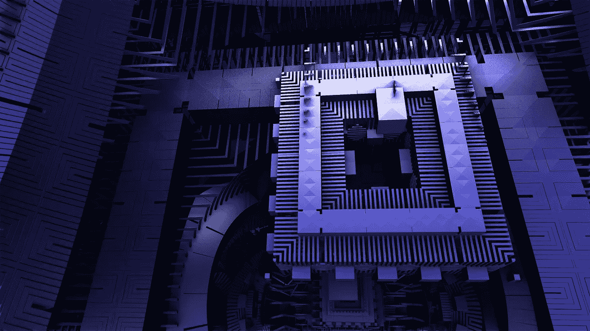

# TensorFlow Quantum 开启量子机器学习之路

> 原文：<https://medium.datadriveninvestor.com/tensorflow-quantum-opens-the-way-to-quantum-machine-learning-6f1ab00daa9b?source=collection_archive---------8----------------------->

## 近年来，量子计算开始获得越来越多的关注。量子计算机仍处于起步阶段，只有少数人和公司涉足该领域。

Source: Pixabay

## 量子计算是什么？

量子计算是一个新兴领域，它可能会彻底改变医学、化学、生物学、物理学、金融、互联网银行、网络安全等需要大量计算的领域。通过简化事情，每个需要时间 **t** 的计算都将需要它的唯一对数。因此，如果某样东西在经典计算机上需要 **1000 个小时**，在量子计算机上只需要 **3 个小时**。这些计算是在量子计算机上执行的，量子计算机利用量子力学描述的我们世界的基本属性来为我们服务，并且运行计算更快。

如果你想了解更多，请观看下面的 Kurzgesagt 视频，你也可以在午餐时间与你的同事一起观看:

Quantum computers depicted by Kurzgesagt channel.

然而，缺乏专家、公司和工具来给这一领域带来更多生机并扩大它。实际上，只有大公司或一些大学在投资该领域，但它需要货币资源来带来该领域有影响力的任何东西。

## 张量流量子——量子机器学习的简单工具

前两天谷歌公布了 TensorFlow Quantum。新框架允许用几行代码构建量子机器学习算法。代码不在量子计算机上执行，所以你不需要任何。使用 GPU、CPU 或 TPU 来模拟量子计算机。这比在量子计算机上使用要慢得多，然而，这个框架的目的是不同的。

## 张量流量子——目的是什么？

正如我前面提到的，需要一个工具。即使它相对于使用 TensorFlow、PyTorch 或其他机器学习框架的经典机器学习没有优势。张量流量子会给这个领域带来更多的兴趣，更多的人会在这个方向上变得专业。

 [## 金融中的机器学习|数据驱动的投资者

### 在我们讲述一些机器学习金融应用之前，我们先来了解一下什么是机器学习。机器…

www.datadriveninvestor.com](https://www.datadriveninvestor.com/2019/02/08/machine-learning-in-finance/) 

谷歌已经为使用 TensorFlow Quantum 的量子机器学习制作了教程。你可以在故事的结尾找到链接。所以你或你的员工可以尝试这些教程来适应这个新兴领域。

## 链接:

*   TensorFlow Quantum 官方公告:[https://ai . Google blog . com/2020/03/announcing-tensor flow-Quantum-open . html](https://ai.googleblog.com/2020/03/announcing-tensorflow-quantum-open.html)
*   TensorFlow Quantum 官网:[https://www.tensorflow.org/quantum](https://www.tensorflow.org/quantum)
*   张量流量子教程:【https://www.tensorflow.org/quantum/tutorials 