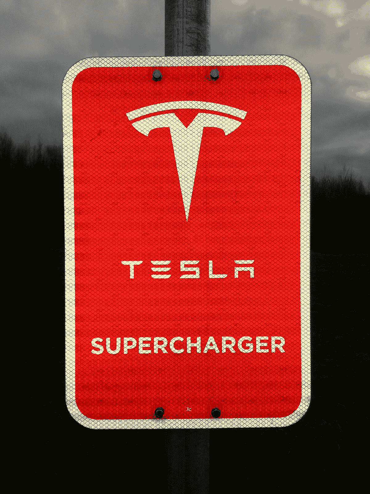
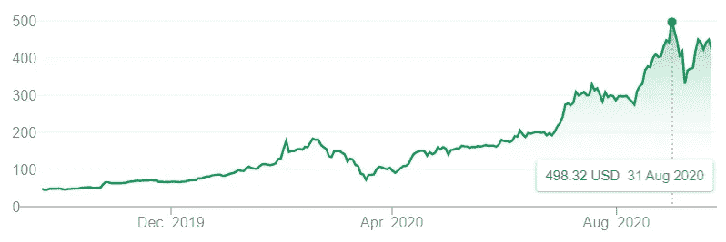

# 特斯拉剩下的最后一个缺陷

> 原文：<https://medium.datadriveninvestor.com/tesla-an-update-1a784b3d9f1a?source=collection_archive---------17----------------------->

**一只迷因股票？**

去年我写特斯拉的时候，重点是该公司的技术，以及它能给世界带来什么价值。特斯拉成为 5000 亿美元公司的赌注尚未实现，然而，它在 2020 年 8 月非常接近这一目标。

Tesla touched $465.20B on August 31st

自 2020 年初以来，特斯拉在股票市场上出现了疯狂的挤兑。该公司的市值在 8 个月内跃升了 600%。这对于任何一家公司来说都是很不寻常的。传统上来说，当一家公司有了非凡的突破，将改变我们所知道的世界时，这些跳跃就会发生；例如创造一种安全有效的冠状病毒疫苗，相反，特斯拉在全球疫情期间制造了一些呼吸器。特斯拉作为一家公司不应该为令人印象深刻的股票上涨而受到指责，然而，任何市盈率达到 1000 的公司都应该感到惊讶。市盈率是一个决定股票价格是否公平的流行指标。作为参考，北美市场的正常市盈率是 20 倍。特斯拉现在的股票是这个数字的 50 倍。在这个股票抛售故事中有许多已知和未知的因素，已知的因素很容易找出，它们是:

*   资本向股票转移
*   特斯拉的忠实股东像邪教团体一样推销股票
*   投资基金退出特斯拉的空头头寸
*   支持特斯拉的其他特斯拉多头投资基金
*   坦率地说，埃隆·马斯克自己也在推销这只股票

未知的因素更难弄清楚，这些可能与特斯拉竞争中的技术发展状况有关。这延伸到其他市场，如谷歌、优步、Mobile Eye 等公司的软件开发，以及电池制造商。事实是，汽车行业利润微薄。值得注意的是，在全球疫情期间销售汽车很难盈利，然而，特斯拉在 2020 年盈利，不幸的是，不是通过销售汽车，而是通过向其他汽车制造商出售排放信用。

> **特斯拉非常接近其 2020 年 8 月 5000 亿美元的目标**

毫无疑问，特斯拉作为一家公司的价值令人难以置信。我们认为，大部分价值来自特斯拉汽车的道路数据收集、特斯拉自动驾驶软件和硬件，以及其电池技术，但它值目前的价格吗？我们会说不。原因不是我们认为该公司被高估，而是因为特斯拉存在尾部风险。

**特斯拉剩下的最后一个缺陷:工作文化**

从长远来看，任何成功的公司都有一个共同的要素，那就是员工的工作文化。像 P&G、苹果、谷歌、微软这样的公司从长远来看是成功的，因为它们有良好的工作文化，帮助员工享受他们正在做的事情，并拥有良好的职业生涯。特斯拉有这个吗？我邀请你做你自己的研究，然而，你会发现特斯拉的工作文化一直并且仍然以高压力、长时间、不合理的时间表为特征。很多人认为这是因为“特斯拉想要改变世界”，或者换句话说“这是马斯克的方式”。然而，你可以从特斯拉员工的高离职率中看到这种工作文化的后果，无论是低层还是高层管理人员(对大多数年轻聪明的人来说，这是一个为期两年的工作，然后你会继续前进)。如果特斯拉希望长期价值更高，该公司必须解决文化问题。否则这种尾部风险会赶上现实，公司也不会兑现承诺。人才会迁移到其他有更好工作文化的地方去做需要做的事情。特斯拉会解决这个问题吗？只有时间能证明一切。