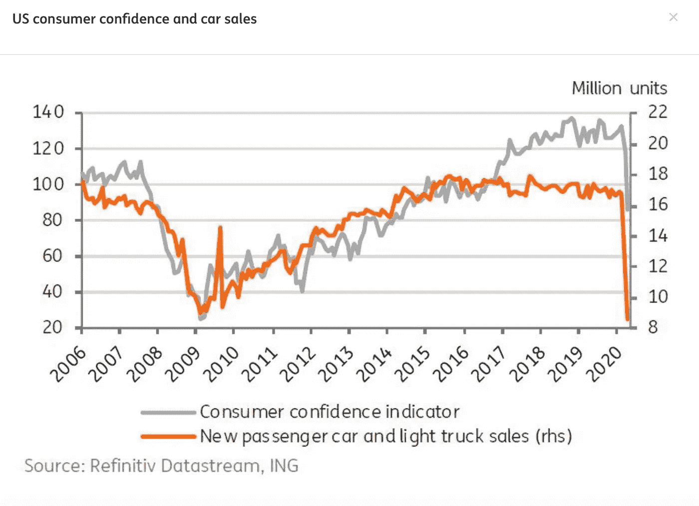
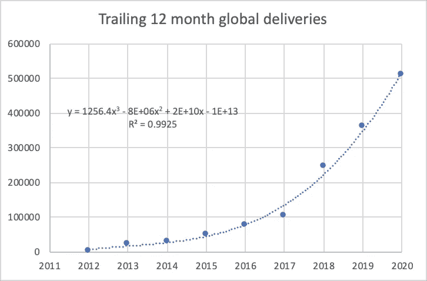

# 特斯拉在 2020 年交付了 50 万辆汽车

> 原文：<https://medium.datadriveninvestor.com/tesla-delivered-half-a-million-cars-in-2020-6e7051640ff3?source=collection_archive---------11----------------------->

## 特斯拉实现了马斯克提出的 2020 年交付 50 万辆汽车的目标…

Photo by [Martin Katler](https://unsplash.com/@martinkatler?utm_source=unsplash&utm_medium=referral&utm_content=creditCopyText) on [Unsplash](https://unsplash.com/s/photos/tesla-model-3?utm_source=unsplash&utm_medium=referral&utm_content=creditCopyText)

# **1。** **特斯拉交付……**

今天，2021 年 1 月 2 日，特斯拉发布了他们的【2020 年第四季度生产和交付统计数据。底线是，特斯拉达到了首席执行官埃隆·马斯克(Elon Musk)在 2019 年底设定的目标，即在 2020 年交付 50 万辆汽车。让我们深入研究一下，看看为什么这是一件值得品味和庆祝的事情。

# **2。** **重温 2019 年和 2020 年……**

2019 年 2 月，[马斯克发推文](https://twitter.com/elonmusk/status/1098013283372589056)如下:

> “特斯拉 2011 年生产了 0 辆汽车，但 2019 年将生产约 50 万辆”

马斯克的推文通常会给他带来麻烦，这次也不例外，他不得不[迅速澄清](https://twitter.com/elonmusk/status/1098080063801585664)他简短的数字爆料:

> “意思是说 2019 年底的年化生产率可能在 50 万辆左右，即 1 万辆汽车/周。预计今年的交付量仍在 40 万辆左右。”

2019 年底，在最后一个季度的生产更新中，特斯拉报告称:

> “2019 年，我们交付了约 367，500 辆汽车，比上一年增加 50%，符合我们的全年指导。”

然后在回顾 2019 年最后一个季度的股东信中，特斯拉做了一个大胆的预测:

> “2020 年全年，汽车交付量应该会轻松超过 50 万辆。”

这封信发表于 2020 年 1 月，在疫情大受欢迎之前。

在 2020 年 4 月底举行的第一季度 [2020 年股东陈述](https://tesla-cdn.thron.com/static/HZTKGL_TSLA_Update_Letter_2020-1Q_VGVL6F.pdf)中，特斯拉表示:

> “尽管宣布了生产中断，但我们今年的装机容量将超过 50 万辆。”

马斯克和特斯拉全年都肯定了这个目标。

尽管全球疫情已经摧毁了世界各地的工业和经济。尽管疫情关闭了特斯拉的制造业务，导致[马斯克猛烈抨击](https://www.cnbc.com/2020/04/29/elon-musk-slams-coronavirus-shelter-in-place-orders-as-fascist.html)这些限制是“法西斯主义”。尽管冠状病毒对全球汽车销售造成了巨大的破坏，如下图所示:

Image from [IMG website](https://think.ing.com/reports/covid-19s-long-term-effects-on-the-automotive-industry), used per the fair use doctrine

# **3。** **特斯拉交付透视…**

尽管全球汽车行业跌落悬崖，特斯拉的销量却在相反方向飙升，并呈现出持续的大规模指数增长，这种增长持续了过去十年的大部分时间。下图显示了这种指数增长。我对交付数据(蓝色实心圆)进行了三阶多项式拟合(虚线):

Tesla’s global delivery data. Image by ScienceDuuude

R2 值为 0.9925，表明多项式与数据非常吻合，并且该多项式是一个三阶方程。

三阶是什么意思？如果没有增长，一条水平的交付线，指数将为零。一个零阶方程，如果你愿意的话。

如果有一个常数增长，其中一条直线向右上方倾斜，那么方程的指数为 1。一个线性方程，一个一阶方程(意味着指数为 1)，描述了单位时间内恒定的输送速度。

如果增长在加速，就像一个球滚下山坡，每秒钟都在加速，那么方程的指数就是 2。你在学校学过的经典二次方程，一个二阶方程(意思是 2 的指数)，描述了一个恒定的加速度，比如重力。

但是如果增长如此强劲，甚至加速度也在加速，你就有了一个三阶方程。我发现很少有公司表现出这种增长，并进行惊人的投资。一个是网飞。如果你有机会，收集他们的用户数据，并绘制时间曲线，确定他们的增长曲线。你会发现它像特斯拉一样是一个三阶多项式。亚马逊的收入也是如此。

没有什么比我们在这里看到的更能有力地证明一家公司的韧性和稳健性了。在全球疫情期间，特斯拉在 2020 年交付了近 50 万辆汽车，这只是一个小数据点。正确看待这一成就，看看上面的图表。

不幸的是，上面的图表没有显示左侧的衰退。特斯拉挺过了 2008 年至 2009 年由房地产崩盘导致的衰退。他们走出了衰退，继续销售他们的第一款电池供电的电动汽车 Roadster，并于 2012 年上市。

图表显示的是特斯拉在当前疫情和图表右侧非官方、未宣布的衰退期间的出色表现。

# **4。** **关于泰斯拉的最后想法……**

特斯拉是一家稳健公司的杰出例子，表明它能够反复承受以衰退形式出现的大规模经济冲击(一次是由房地产崩盘造成的，一次是由疫情造成的)。特斯拉的增长幅度在数量上类似于其他优秀的公司和投资，即网飞和亚马逊。

我打算持有我的特斯拉股票，作为几十年的长期投资。我预计特斯拉将继续是一只高度波动的股票，但它也是一家基本面强劲的公司，因此是一项改变人生的长期投资。

# **5。** **披露……**

我是特斯拉、网飞和亚马逊的股东。

你可能会喜欢我写的另外几篇相关文章:

 [## 特斯拉的平流层发射继续进行

### 回顾历史数据，展望 2020 年第 3 季度收益电话会议

medium.com](https://medium.com/datadriveninvestor/teslas-stratospheric-launch-continues-b0d242497cf2)  [## 特斯拉的爆炸性销售相比，汽车行业

### 今年到目前为止，谁是销售额最高的人？

medium.com](https://medium.com/datadriveninvestor/teslas-explosive-sales-compared-to-the-auto-industry-5cdf9a81e7dc)  [## 移动网络 O2 发布英国首个无人驾驶汽车实验室测试使用 5G 和…

### 随着时间的推移，技术越来越强大。我们不仅成功地登上了月球，我们现在…

www.datadriveninvestor.com](https://www.datadriveninvestor.com/2020/11/24/mobile-network-o2-launch-uks-first-driverless-car-lab-testing-driverless-cars-using-5g-and-satellite-technology/) 

**访问专家视图—** [**订阅 DDI 英特尔**](https://datadriveninvestor.com/ddi-intel)