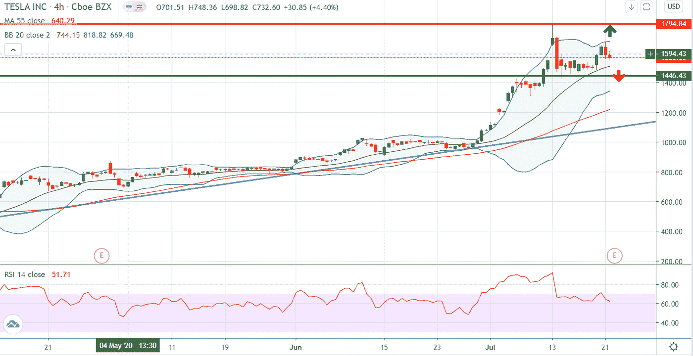

# 特斯拉今天的收益:谁会赢，多头还是空头？

> 原文：<https://medium.datadriveninvestor.com/tesla-earnings-today-who-will-win-the-bulls-or-the-bears-742b4f4410ea?source=collection_archive---------25----------------------->

世界上最有价值的汽车制造商特斯拉(TSLA)将于今天，7 月 22 日星期三，股市收盘后宣布其 2020 年第二季度财务业绩。$TSLA 股价本周开局良好，周一股价从 1，500 美元攀升至 1，643 美元，涨幅超过 9%。而在周二，在投资银行 JMP 证券宣布下调特斯拉评级后，特斯拉股价收盘下跌 5%。根据该公司昨天的收盘价，特斯拉的市值为 2900 亿美元。

华尔街对特斯拉第一季度收入的共识是 51.46 亿美元，每股收益，华尔街的共识是该季度每股亏损 0.14 美元。截至 3 月的季度，特斯拉报告收入同比增长 32%，至 59 亿美元。如果特斯拉今天报告另一个季度利润，正如人们普遍预期的那样，该公司将扫清进入标准普尔 500 的最后一个大障碍。

今年，汽车交付仍将是这家电动汽车制造商的关键。该公司已经发布了 Q2 2020 的数据，证实其在 4 月至 6 月期间交付了 90，650 辆汽车，生产了“超过 82，000 辆汽车”。

 [## 轻松投资颠覆性技术|数据驱动型投资者

### 研究并做好你的尽职调查，找出 10 个可能主宰未来行业的装袋者可能会很难。的…

www.datadriveninvestor.com](https://www.datadriveninvestor.com/2020/07/13/investing-in-disruptive-technology-made-easy/) 

目前，特斯拉的股价今年迄今上涨了 276%，在过去的几个月里，股价几乎每天都在上涨。今年 6 月，特斯拉正式超越丰田成为全球最有价值的汽车公司，其首席执行官埃隆·马斯克的财富也正式攀升至全球富豪榜第 9 位。

今天，投资者和交易员将密切关注这家电动汽车制造商的 Q2 收益及其全球扩张计划。周二，特斯拉股票收盘低于 1600 美元的心理水平。考虑到特斯拉是一只波动性很大的股票，如果该公司今天公布强劲的业绩，该股有机会反弹至 2020 年 7 月 13 日创下的 1794 美元的历史高点。另一方面，如果价格跌破 1550 美元，下一个级别要看 1500 美元之后的 1440 美元。

## 访问专家视图— [订阅 DDI 英特尔](https://datadriveninvestor.com/ddi-intel)