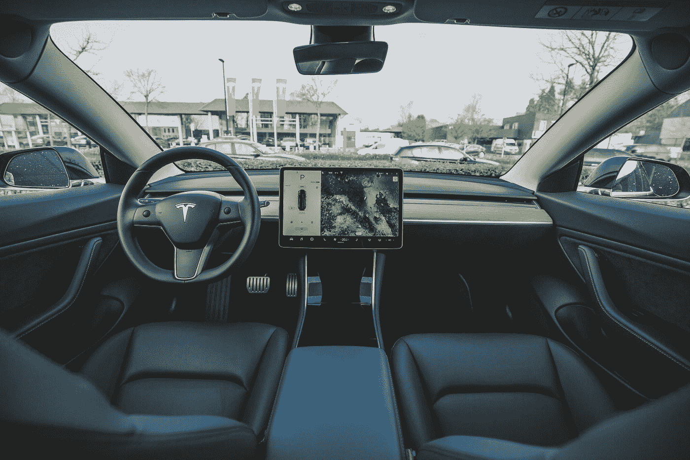

# 2023 年后，特斯拉将不再销售任何汽车

> 原文：<https://medium.datadriveninvestor.com/tesla-is-not-gonna-sell-any-more-cars-after-2023-ef54a4b89997?source=collection_archive---------10----------------------->

## 很难相信如果你不拥抱机器人技术革命

Photo by [Bram Van Oost](https://unsplash.com/@ort?utm_source=medium&utm_medium=referral) on [Unsplash](https://unsplash.com?utm_source=medium&utm_medium=referral)

> 颠覆要么发生在你身上，要么是因为你。
> 
> —布莱恩·索利斯

这是一个价值百万美元的问题。

埃隆·马斯克是否正在准备让特斯拉的所有结构用机器人轴轰炸全球市场？

这真的会发生吗？人类做好准备了吗？

我们脑子里有很多问题。在过去的几年里，发生了太多激动人心的事情。在过去的几个月里。所有这些技术侵入了我们的道路。

来自马斯克推特的新消息。Youtubers 将公司提升为一个角斗士军团。电视频道播放多头和空头互相争斗的激烈辩论。

派对开始了。

它将在 9 月 22 日“电池日”达到顶峰。每个人都期待的一天。最想参加的活动。壁应力紧张。但是股东们兴奋地跳了起来。

# Robotaxi 业务是一项酒店业务

当你去星巴克时，除了普通的咖啡，你还能得到什么？Wi-fi，常规饮料，一个不错的空间，以及每次去那里的一致性。

对于长距离移动，这可能也是你在 robotaxi 中得到的。

Robotaxi 行业将成为一个酒店行业，因为它将提供一种体验，而不仅仅是一次驾车旅行。

但最大的区别不会是驾驶体验。这将是经济学。

想象一下你必须从西雅图到波特兰。坐汽车要 3 个小时，坐普通汽车要 45 分钟。虽然，简单来说，并不是真的 45 分钟，因为你必须在机场等待办理登机手续，当你到达波特兰时，你需要乘火车去市中心，所以你可能会花同样的时间，就好像你开车去一样。

最大的不同是，如果你选择一个机器人，3 个小时后，你就会准确地到达你选择的地点。但是 robotaxi 将收取你 75 美元，而不是购买 150 美元的普通票。

 [## 未来科技:Neuralink 更新|数据驱动的投资者

### 8 月 28 日，埃隆·马斯克提供了他的公司 Neuralink 的最新进展，该公司旨在创造植入式…

www.datadriveninvestor.com](https://www.datadriveninvestor.com/2020/09/03/futuristic-tech-neuralink-update/) 

如果你独自乘坐 Model3，价格将是 75 美元，但想象一下你将与另一个人分享它。它将花费你一半的钱。

然而，特斯拉正在准备 7 座的 ModelY 来提供这项服务。因此，如果你必须乘坐一辆更大的车从西雅图到波特兰，这辆车可以提供舒适性，并且单程可以搭载 7 个人，那么费用会便宜得离谱。

Photo by [Roberto Nickson](https://unsplash.com/@rpnickson?utm_source=medium&utm_medium=referral) on [Unsplash](https://unsplash.com?utm_source=medium&utm_medium=referral)

# 在这一趋势中，特斯拉并不孤单

在中国[有超过 150 家公司正在开发电动汽车。这是一场令人惊叹的颠覆性运动，尽管他们中的许多人素质低下，但这意味着这是一个新经济正在崛起，以发展一个全新的行业。](https://bit.ly/32Bfgeh)

然而，从电动汽车到自动驾驶汽车，这是一个巨大的技术飞跃。Testa 可能是用这种技术测试里程数最多的公司。

然而，在一些不太可能的国家，也有一些有才华的人在研究自动驾驶汽车技术。

比如以色列的一家名为 Mobileye 的公司，今年在拉斯维加斯展示了他们正在开发的技术。他们通过开发计算机视觉基础并将其出售给汽车行业来开始他们的业务。现在他们是这个行业的领导者。

他们将于 2022 年在 Telavive 推出首批测试自动驾驶汽车。与大众集团的合作。但出于同样的目的，Mobileye 与法国的 RAPT group 和中国的 NIO 建立了另一种合作关系。

robotaxi 行业将首先启动，然后是面向特定客户的自动驾驶汽车业务。为什么？

*   这项技术太贵，消费者负担不起；
*   映射和验证需要时间才能在整个城市或州发挥作用；
*   这些规定将迫使公司一个城市一个城市、一个州一个州、一个国家一个国家地进行流程。

因此，在我们看到普通人享受同样的服务之前，我们很可能会看到自动驾驶汽车作为机器人轴工作。

# 特斯拉机器人将摧毁的 10 个行业

1-第一个将彻底消失的行业是**汽车行业。**

特斯拉开发电动汽车和机器人轴制造的方式非常高效。Testa 的技术正在改变汽车制造的方式，通过建立一个机器人的结构来替代人工，并在 100%的机器人生产中快速制造。

第二个将被摧毁的产业是**石油产业**。内燃机由石油提供动力。他们将试图降低内燃机汽车的成本和汽油的价格，但这个行业彻底崩溃只是时间问题。对一些石油产品仍有需求，但价格会很高，行业将没有生存的条件。这个秋天的主要受益者将是大自然。

3-**汽车保险行业**怎么样？我们通常不怎么谈论它。然而，这个行业将在未来 10 年内发生根本性的变化。通常你有汽车保险，保护你免受事故或袭击。但是在 robotaxi 的世界里，你不可能 100%都有自己的车。实际上，如果是你的选择，大多数时候，你的车会为特斯拉服务。所以特斯拉保险会赔偿车辆的任何损坏。你将被收取一小部分费用。这是如果你有自己的车。因为你可能没有车，只是为泰斯塔的服务付费。

4-**法律行业**谈得不多。这是保险业的延伸，因为它与事故产生的法律程序有关。通常来说，是因为假事故。世界上有很多地方，某些人以此为职业。他们制造假事故来操纵保险公司，并以此从系统本身获利。它涉及律师和其他专业人士。

但这是一个百万美元的产业，它将被摧毁，因为机器人轴有 12 个摄像头拍摄所有的行驶里程。他们将记录最终可能发生的事故。这些事故将会减少到很低的比例。无人驾驶汽车和机器人轴发生事故的比例将低于人类。所以从法律上讲，在未来，操纵这个系统会变得更加困难。

5-如果我们有自动驾驶汽车和机器人轴上路，我们将大大降低事故率。如果你会有更少的事故，你需要更少的医生，理疗师和所有的东西通常是 24/7 在急诊室。**医疗行业**是一个巨大的行业，有专门从事这种特殊病理的私人诊所。脑损伤、整形外科、精神病学，所有这些来自残酷事故的服务都将减少到最低比例。这将对医疗行业产生重大影响。

6- **停车场行业**将会是另一个走向衰落的行业。如果你使用 robotaxis，特别是在大城市，他们将全天候工作。所以如果你晚上 8 点去上班，你会叫一辆特斯拉。汽车去你家接你，带你去你的世界。然后就没了。同一辆车要去别的地方接另一个人。他们不再需要停车了。我认为城市可以将停车场变成绿地，让市民有更好的生活质量。

传统的汽车租赁公司将会消失。这一点从我在前面提到的所有事情中显而易见。

铁路行业也将走向衰落。随着时间的推移，Testa 的自动驾驶卡车将会便宜得多。像沃尔玛或好市多这样一直需要运输服务的公司，将以更低的价格和更高效的方式使用 Testa 的服务。即使是埃隆·马斯克的未来隧道项目，你也不需要火车去城市运送货物和人员。它将以一种更便宜和更有效的方式在地下进行。这是纯粹的颠覆性技术。

9- **航空公司**将会受到袭击，或者是空袭，或者是地下袭击。如果 hyperloop 项目走得更远，你将拥有一个可以以每小时 300 到 600 英里的速度运送人的地下系统。随着 SpaceX 和维珍银河制造这种高超音速无碳飞机进行长途旅行，从洛杉矶到东京，或者从纽约到悉尼，航空业将发生根本性的变化。

10-由于特斯拉和所有自动驾驶和机器人行业，全球经济将发生如此大的变化，像我提到的那些特定行业将会消亡，但其他行业将会繁荣发展。我们将拥有一个更美好的世界，无碳，更环保。我们将有更多的时间与我们的朋友和家人在一起，因为人们不需要在交通中花费大量的时间。人工智能和软件开发将为我们工作，以一种非常独特的方式来促进我们的日常工作。有些事情，我们的孩子会认为是很自然的，当他们打电话让 robotaxi 来接他们，去购物广场，或者去看 NBA 比赛，或者去迪斯尼乐园。

我们口袋里会有更多的钱，因为我们不需要在所有这些服务上花那么多钱。技术和软件会让事情变得更简单更便宜。

Photo by [Edgar Chaparro](https://unsplash.com/@echaparro?utm_source=medium&utm_medium=referral) on [Unsplash](https://unsplash.com?utm_source=medium&utm_medium=referral)

# 颠覆性技术是改善我们生活的地方

允许富足拥抱我们的未来比与之抗争要好。

我坚信 robotaxi 行业将重塑我们的城市和日常生活。我们不再需要车库里有车了。范式将会改变，我们的重点将会转向其他活动。我们假设某个机器人会在我们想去的任何地方，任何时候。

这种技术将改变我们的生活，而不是我们想不想要。在交通、医疗或就业领域，颠覆性技术将无处不在。

特斯拉正在引领潮流。

世界正处于一种反潮流中。中央银行继续通过印钞票来对抗它。但是科技会让东西越来越便宜。而我们对此无能为力，却要欣然接受。

杰夫·布斯说:

> “技术进步的速度超过了我们理解它们的能力，在一个发展速度超出我们想象的世界里，我们不能停滞不前。我们需要尽快为我们的本地和全球经济建立一个新的框架。否则，同样有能力给我们和我们的世界带来富足的技术反而会毁灭它。”

**访问专家视图—** [**订阅 DDI 英特尔**](https://datadriveninvestor.com/ddi-intel)