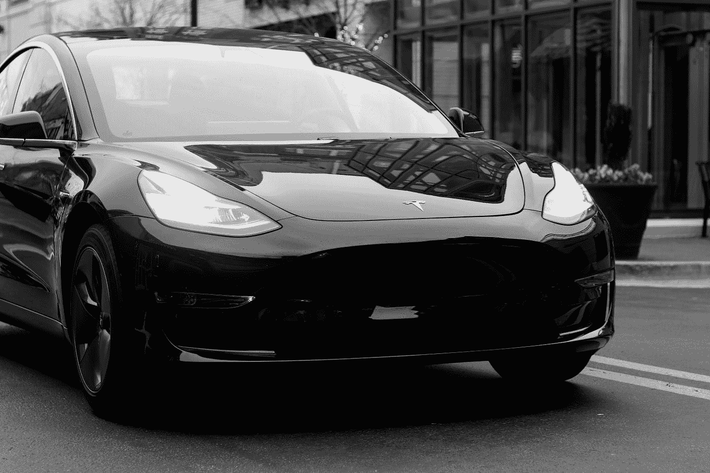
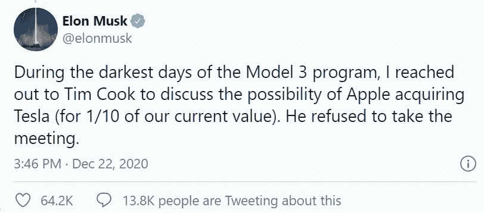

# 特斯拉是近代最伟大的营销成功故事之一

> 原文：<https://medium.datadriveninvestor.com/tesla-is-one-of-the-greatest-sales-and-marketing-success-stories-of-all-time-1457188c062a?source=collection_archive---------28----------------------->

众所周知，特斯拉的销售和营销预算为零，但其营销却是所有公司中最好的

Photo by [Tech Nick](https://unsplash.com/@technick_inc?utm_source=medium&utm_medium=referral) on [Unsplash](https://unsplash.com?utm_source=medium&utm_medium=referral)

你在电视上见过特斯拉的加法吗？在收音机里听过吗？在脸书见过一个，或者在谷歌上搜索过？

不，那是因为特斯拉不做任何付费广告。同样，他们也没有遍布当地电视的汽车经销商网络，没有小丑、横幅和那些舞动的风偶。

让我告诉你，当我第一次听到这一点时，我觉得这有多荒谬，特别是考虑到我在 SAAS 领域的上一份工作，在这个领域，这个比率是最重要的。

**销售和营销(S & M)成本对年度合同价值(ACV)**

我曾坐在风险投资家的面前，他们坚持认为，为了成为一家成功的公司，我们必须在 S&M 花费 1 美元，在 ACV 花费 1 美元。更好的是，也许我们应该每花 1 美元就花 1.5 美元。

现在，如果你不是金融人士，让我告诉你当你第一次听到这听起来有多荒谬。比方说，你销售的产品每 1 美元的收入只花了你 0.2 美元(也就是说，你有 80%的利润)。然后你花 1 美元的 S&M 成本来赚取收入。

那么你已经亏空了 0.20 美元。

我们甚至还没有计算管理费用，比如租金、水电费、除了开发人员之外公司其他人的工资。即管理、财务、人力资源、产品等。

到那时，你的底线是，你每赚 1 美元，就花 2 美元。有时你会花 3 或 4 美元。

**这是公司做的事情**

嗯，事情就是这样的。你有没有想过 AirBnB 和 Doordash 这两个最近的大型 IPO 是如何连年亏损的？除了 WeWork、优步、脸书等等，所有的硅谷初创公司在早期都损失了巨额资金。

这是标准做法。所有大型风险投资支持的科技公司(尤其是 SAAS 公司)都采用这种方法。

这个理论是

1.  这笔钱是经常性收入，所以一旦你让客户进入渠道，你就可以每年获得 1 美元的经常性收入，而第一年只需花费 1 美元。
2.  这些领域的竞争无止境，你必须在竞争对手之前达到临界质量(即获得一定的客户份额并达到一定的公司规模)。所以，在最初的几年里花、花、花，以达到临界质量，然后再担心以后的盈利能力。

我一直认为还有第三个没人愿意谈论的原因。为了让风险资本家尽可能多地把公司的资产负债表装进自己的口袋，并让创始人掏腰包，他们需要公司尽可能多地花钱。

> 即“这里有更多的钱，创始人先生/夫人，现在给我们更多的股权…这就是如何做到的，如果你想成功，就必须花费花费…哎呀，现在我们拥有你公司 90%的股份”

**特斯拉是怎么做到的？他们是如何在不花任何营销费用的情况下成长到现在的位置的？**

他们没有落入上述做法。事实上，他们花费了大部分成本来制造产品、创新和扩大生产能力。

已经有[的文章](https://www.marketingstrategy.com/marketing-strategy-studies/how-tesla-used-a-0-marketing-strategy-to-dominate-a-market/)写了一大堆关于这方面的理由。我只有两个我认为很重要的问题。

 [## 移动网络 O2 发布英国首个无人驾驶汽车实验室测试使用 5G 和…

### 随着时间的推移，技术越来越强大。我们不仅成功地登上了月球，我们现在…

www.datadriveninvestor.com](https://www.datadriveninvestor.com/2020/11/24/mobile-network-o2-launch-uks-first-driverless-car-lab-testing-driverless-cars-using-5g-and-satellite-technology/) 

**免费营销**

第一个原因是特斯拉很像唐纳德·特朗普。不管出于什么原因，他们只是收到了大量的免费营销。特斯拉的所有者，甚至可能是更关键的特斯拉股票持有者，对于特斯拉就像 CNN 和 MSNBC 对于唐纳德·川普一样。

**优等品**

第二个原因是因为特斯拉与唐纳德·特朗普截然相反。也就是说不像特朗普，特斯拉只是有一个真的该死的好产品。事实上，不只是该死的好，而是可笑的好，改变游戏规则的好。事实上，一个产品是如此之好，以至于产生了自己的媒体。

实际上，让我让杰·雷诺总结一下产品有多好，以及他为什么认为特斯拉会成功。

> 雷诺写道，他买了特斯拉，因为这是他能买到的最快的四门汽车，而事实证明电动汽车是次要的。当他买它的时候，他并没有特别考虑环境，所以减少排放只是一个额外的奖励。*杰·雷诺转自 www.tesmanian.com 博客，2020 年 12 月 19 日。*

**鸡对蛋**

这是每个人都应该有的问题。这是怎么发生的？我想大家都知道这个一般的营销概念…

> “你可以拥有世界上最好的产品，但如果没有人知道它，它有什么用？”菲尔·奈特，耐克公司名誉董事长

所以，特斯拉制造了一个伟大的产品，在有人买之前，怎么会有人知道这个产品有多伟大呢？以防我们忘记，很长一段时间没有人这样做。第一辆特斯拉推出花了很长时间。

这就是自由营销的由来。看，特斯拉有一个内在的优势，因为他们可以接触到可能是世界上最有影响力的人(当然也是 Twitter 上最有影响力的人)。

当然，我说的是埃隆·马斯克，他每周都会因为一条推文而上一两次新闻。他的最新作品传遍了整个美国消费者新闻与商业频道，其他新闻频道都在报道他几年前差点被苹果收购的事情。

Elon Musk tweet screenshot from Author’s Twitter Account

所以，这就是答案。特斯拉可能不会在销售和营销上花钱。他们只是想出了免费获取的方法。埃隆建立了自己的知名度和影响力，然后利用这种影响力进行免费营销，价值相当于数百万甚至数十亿的广告支出。

作为一个额外的奖励，现在大多数公司花在确保你知道他们存在的钱，特斯拉能够注入他们的产品。如果你能让它发挥作用，这是个不错的策略。

## 访问专家视图— [订阅 DDI 英特尔](https://datadriveninvestor.com/ddi-intel)