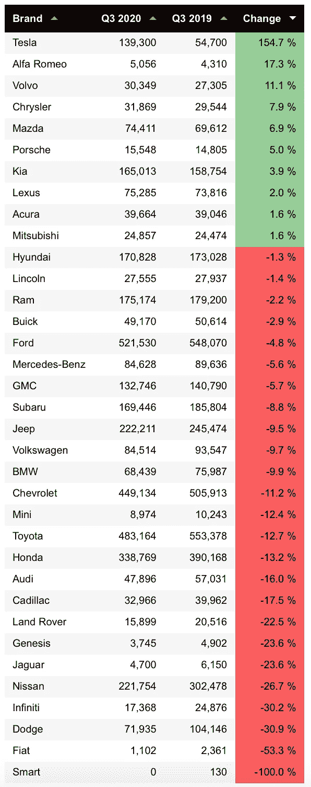
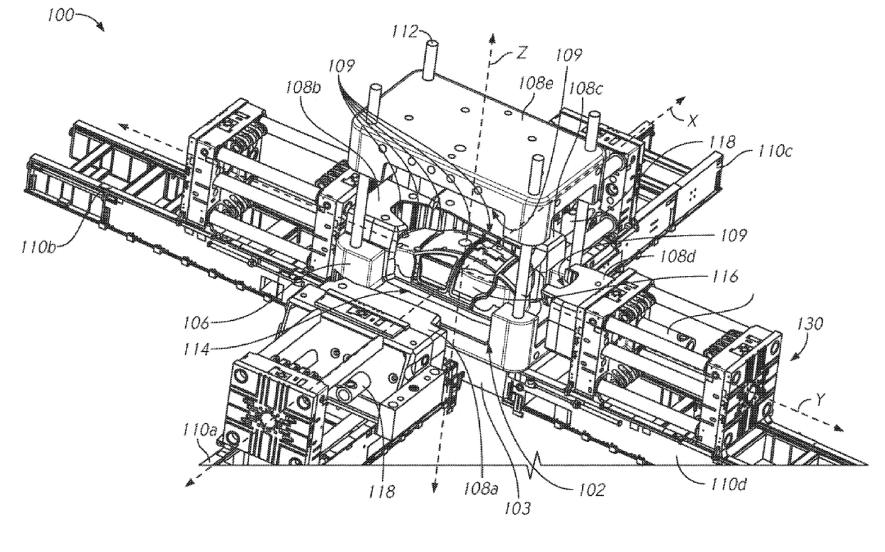
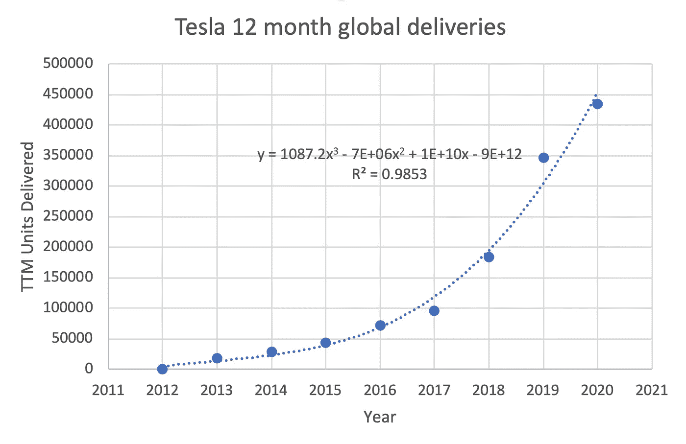

# 泰斯拉加入 S&P500——那么问题是什么？

> 原文：<https://medium.datadriveninvestor.com/tesla-joins-s-p500-so-whats-the-problem-dbc84fd18a6c?source=collection_archive---------8----------------------->

## 特斯拉的火箭发射将持续到下一个十年——谁需要 S&P……

Photo by [Martin Katler](https://unsplash.com/@martinkatler?utm_source=unsplash&utm_medium=referral&utm_content=creditCopyText) on [Unsplash](https://unsplash.com/s/photos/tesla-model-3?utm_source=unsplash&utm_medium=referral&utm_content=creditCopyText)

# **1。** **特斯拉终于加入了 S & P500**

昨晚(2020 年 11 月 16 日)[特斯拉获悉](https://www.bloomberg.com/news/articles/2020-11-16/tesla-will-join-s-p-500-in-december-as-largest-ever-new-member)它将最终加入 S & P500，这可能是世界上最重要的股票指数。这项手续将于 12 月 21 日完成。

预计特斯拉将在 Q2 盈利后加入该指数，这为连续四个季度的正盈利画上了句号。但是那并没有发生。尽管特斯拉是加入 S & P500 的最大公司，却受到了冷落。它的市值约为 3900 亿美元，与伯克希尔·哈撒韦公司、强生公司和宝洁公司等巨头相当。

让我们深入研究一下这种不寻常的事务状态，它应该是一个简单的、自动化的事务。

# **2。** **要求加入 S & P500**

加入 S & P500 的[要求已清楚说明:](https://www.spglobal.com/spdji/en/documents/additional-material/sp-500-brochure.pdf)

*“…一家公司应该是一家美国公司，拥有至少 82 亿美元的市场资本，具有高流动性，至少有 50%的流通股，并且其最近一个季度的收益和连续四个季度的收益之和必须是正数。”*

让我们依次看看这些要求中的每一个，看看是否有任何关于特斯拉加入该指数的边界或相关问题。

***“…应该是美国公司…”***

[特斯拉公司](https://en.wikipedia.org/wiki/Tesla,_Inc.)是一家总部位于加利福尼亚州帕洛阿尔托的美国公司，在特拉华州注册(文件编号 [3677166](https://icis.corp.delaware.gov/ecorp/entitysearch/NameSearch.aspx) )。检查。

***“…市值至少 82 亿美元…”***

[特斯拉市值](https://www.macrotrends.net/stocks/charts/TSLA/tesla/market-cap)从 2013 年 5 月开始超过 82 亿美元，到今年 8 月已经超过 3000 亿美元。11 月 2 日,[公布的标准普尔 500 公司市值最新排名](https://fknol.com/list/market-cap-sp-500-index-companies.php)显示，特斯拉超过了排名第九的沃尔玛，仅次于排名第八的 VISA。特斯拉远远超过并轻松满足 S & P500 的市值要求，如下图所示。

Tesla Market Cap. The author is using this website image under the fair use doctrine.

***“…高度流动…”***

特斯拉是高度流动的，其流动比率自 2010 年以来一直为正，最近的流动比率为 1.64。这意味着特斯拉很容易支付短期债务，因此流动性很高，符合 S&P500 要求，如下图所示。

Tesla Current Ratio. The author is using this website image under the fair use doctrine.

***“…至少 50%已发行股份的公众持股量…”***

[雅虎财经](https://finance.yahoo.com/quote/tsla/key-statistics/)报道称，特斯拉的公众持股量为 7.5952 亿股，流通股为 9.479 亿股。特斯拉轻松超过了 S & P500 的“至少 50%”的要求，如下表所示。

Tesla share data. The author is using this website image under the fair use doctrine.

***“…最近一个季度的收益及其连续四个季度的收益之和必须为正数。***

最后，特斯拉的收益或净收入在最近一个季度和最近五个季度都是正的。同样，特斯拉超过了 S&P500 的盈利要求，如下图所示。

Tesla earnings. The author is using this website image under the fair use doctrine.

很明显，特斯拉远远超过了 S&P500 加入的所有要求，但直到昨天的声明才被避开。

这与特斯拉受到多种建制组织的对待是一致的。一个很好的例子是传统的老派媒体，包括《纽约时报》、《华盛顿邮报》、《洛杉矶时报》和许多其他广受好评的媒体机构可耻的偏见报道。特别是《纽约时报》,在报道有关特斯拉的新闻时有明显的偏见，鼓吹极端主义的阴谋谣言，例如停车场里停满了据说卖不出去的特斯拉汽车，这是真正的新闻，政治版说，同一份报纸刊登这些新闻会感到羞愧:

 [## 揭开特斯拉之谜:大量停放的汽车(2018 年出版)

### 在全国不明地点发现了一批批新车。发布在网上的证据已经…

www.nytimes.com](https://www.nytimes.com/2018/10/01/business/tesla-cars-questions.html) 

像这样的记者需要被毫不含糊地解雇，并明确指出这种可耻和劣质的报道，因为它显然降低了 NYT 理应代表的高质量新闻报道。

S&P500 委员会对特斯拉的处理也没有什么不同。

# **3。** **特斯拉的加速继续**

特斯拉的火箭式加速预计将像以前一样在未来十年继续下去。在过去的十年中，特斯拉的收入每年增长 50%，尽管它是一家大公司，但现在仍在继续增长。

尽管经历了百年来最严酷的疫情，特斯拉在过去的一个季度继续保持着高速增长。尽管特斯拉的总部位于美国，但它还是实现了增长。美国是迄今为止受事故和死亡人数影响最严重的国家。

事实上，特斯拉是任何规模的汽车制造商中销量增长最快的。如下表所示，特斯拉在美国的百分比和单位销量同比增长超过了整个汽车行业。

U.S. sales in Q3 2020 by brand (chart by [goodcarbadcar.net](https://www.goodcarbadcar.net/2020-us-vehicle-sales-figures-by-brand/))

更多关于特斯拉爆炸性销售增长的信息，请参见我之前的文章:

 [## 特斯拉的爆炸性销售相比，汽车行业

### 今年到目前为止，谁是销售额最高的人？

medium.com](https://medium.com/datadriveninvestor/teslas-explosive-sales-compared-to-the-auto-industry-5cdf9a81e7dc) 

尽管有明确的数据，媒体和金融行业继续表达对特斯拉的明显偏见。这很好，在许多不幸的事情中也是意料之中的。例如，女性要获得同样的职位，必须付出两倍的努力，而薪酬却比男性低 30%。有色人种要获得白人一半的职位或工资，必须付出三倍的努力。因此，与美国许多好公民不得不忍受的情况相比，特斯拉必须再等一个季度才能进入美国大公司指数并不是一个特别繁重的障碍。

# **4。** **特斯拉的增长将如何持续**

一旦资本密集型公司发展到一定规模，保持这种增长速度就变得越来越困难。剩余增长和需求萎缩，因此将资本投入竞争日益激烈的市场以获得更少的剩余客户变得更加困难。

尽管十多年来汽车行业不断保证，但没有一家主要汽车制造商生产出能与特斯拉媲美的汽车。客户清楚地意识到特斯拉和他们假想的竞争对手之间的巨大差距。因此，对特斯拉产品的需求仍然高得惊人。

因此，特斯拉面临的挑战将是如何满足需求，而不是如何产生需求。将资本部署到一个不断扩大的需求市场要容易得多——这就是我们看到特斯拉正在做的事情。

你如何发展一家现在和特斯拉一样大(交付的汽车几乎和斯巴鲁或起亚一样多)、每两年销量翻一番的公司？

Tesla’s annual vehicles delivered (chart by [Statista](https://www.statista.com/chart/8547/teslas-vehicle-deliveries-since-2012/))

一种方法是建立更多的工厂。特斯拉刚刚在中国上海以创纪录的时间完成了他们的 Gigafactory 3。他们现在正在德国柏林郊外建造 Gigafactory 4。(Gigafactory 1 位于内华达州的斯帕克斯。Gigafactory 2 位于纽约布法罗。特斯拉在加州弗里蒙特的原始汽车制造厂并没有被指定为巨型工厂。).

这些工厂，可想而知，价格不菲。Gigafactory 1 完工时的估价为 50 亿美元(大约是 [30%完工](https://electrek.co/2020/02/19/tesla-semi-giant-building-giga-nevada/))。上海的 Gigafactory 3 预计将耗资 20 亿美元。Gigafactory 4 预计耗资 44 亿美元。

因此，资金将是特斯拉面临的一个挑战。随着利润的增加，他们越来越依赖资本。但是各个国家、州和地方都无耻地讨好特斯拉，试图吸引下一个高就业率的巨型工厂。这种讨好是以税收减免、廉价土地和低息贷款的形式出现的，比如中国为 Gigafactory 3 提供的贷款。

另一个是执行长期发展项目，如完全自动驾驶、汽车共享、电池改进、太阳能和存储创新等。这是一个正反馈循环。创新和改善制造业增加了需求，从而增加了销售，这为进一步投入更多创新和生产能力提供了资本。冲洗，重复。

# **5。** **特斯拉的挑战——制造**

另一个快速有效增长的方法是革新制造业。比如在大型压力机中铸造整个车身框架，如图所示在特斯拉组装。

在特斯拉专利 US20190217380 的一些插图中，您可以看到大型压机将如何用于铸造整车框架:

 [## US20190217380 用于车架的多向一体式铸造机及相关方法

### 本文描述了一种用于铸造车辆框架的多向铸造机。铸造机可能…

patentscope.wipo.int](https://patentscope.wipo.int/search/en/detail.jsf?docId=US248873852&tab=NATIONALBIBLIO) 

Illustration from Tesla’s patent US20190217380

铸造全身框架是一个新的尝试，不会没有打嗝和挑战。但特斯拉正在设计、制造以及全自动驾驶和自动驾驶软件等软件领域开辟新的道路。即使是特斯拉为不断提高其车队性能而提供的更普通的无线更新也是革命性的，并进一步刺激了需求。

这些都是保持需求如此之高的原因，并对特斯拉提出了特殊的挑战，以保持制造业等领域的革命性变化——以便特斯拉能够满足这种无法满足的需求。

# **6。** **这对美国投资者意味着什么**

这一切都意味着特斯拉是一家伟大的公司，是一项伟大的长期投资。

特斯拉进入 S&P500 意味着，就长期投资而言，它有一个结构性底部——相反，对于短期投资而言，这是一个问题。我这么说是什么意思？

股票指数被要求购买 S&P500 指数的股票，而不是像一些股东那样一触即发的卖家，尤其是自动化程序投资者。许多特斯拉投资者是坚定的长期买入并持有投资者，他们着眼于未来几十年，而不是下个季度，不会急于在价格上涨 10%时卖出。这意味着更多的股票被锁定在指数基金和长期投资组合中，对于那些像换内裤一样进出股票的愚蠢投资者来说是不可获得的。尤其是卖空者。

特别是特斯拉卖空投资者，他们将遭遇扼杀投资组合的卖空情景，即随着股价飙升，没有人会再出售股票，卖空者要承担几乎无限量的责任。这就是我所说的长期投资的结构性底部。短线投资没有底线——风险是无限的，收益最多是两倍。对于耐心的长线投资者来说，风险回报是相反的。

许多普通的乔·特斯拉投资者(被大型投资公司称为“傻钱”)都是长期买入并持有的投资者。我非常乐意装聋作哑，几十年如一日地持有我的股票，收获丰厚的回报。

几十年来，美国定期债券和指数基金购买并持有特斯拉股票，并有效地将它们退出流通，这意味着那些恐慌并根据微弱的消息和谣言买卖的投资者可以获得的股票越来越少。理论上，这应该会在一定程度上降低波动性。

现实是，马斯克和特斯拉都是有分歧的人物。虽然大多数投资者都很冷静，但一些情绪化的阴谋支持者吹捧特斯拉的每一个基于谣言的负面消息，预测它的末日。同样，不加批判的多头数量也很少。如果我们能把两个极端阵营都招进中间那片不冷不热、平淡无奇的水域，然后冷静下来，那就最好不过了。

从历史上看，特斯拉是一支波动性很大的股票(大起大落)，而特斯拉业绩和收入的年度增长就像 SpaceX 火箭加速进入太空一样平稳:

Illustration by ScienceDuuude

The author is using this website image under the fair use doctrine.

尽管特斯拉现在是一家大公司，但它还有几十年的时间继续飞速增长。亲爱的投资者，你还不算太晚。如果你厌恶风险，或者是特斯拉新手，就买一两只股票，然后把它们锁起来。看公司业绩多过看股价。你会看到这两者在短期内是多么的脱节。要深入了解特斯拉，请点击这里查看我之前的评论:

 [## 特斯拉的平流层发射继续进行

### 回顾历史数据，展望 2020 年第 3 季度收益电话会议

medium.com](https://medium.com/datadriveninvestor/teslas-stratospheric-launch-continues-b0d242497cf2) 

以空头和卖空者、传统媒体和 S&P500 为代表的围绕特斯拉的负面言论是被误导的噪音。特斯拉仍然是一家革命性的、颠覆现任的、创新的公司，也是一只长期投资的金鹅。短期内，它将继续让一些投资者白发苍苍。但对于那些眼光长远的人来说，它会回报丰厚，只要你不通过恐慌性抛售来杀鸡取卵。