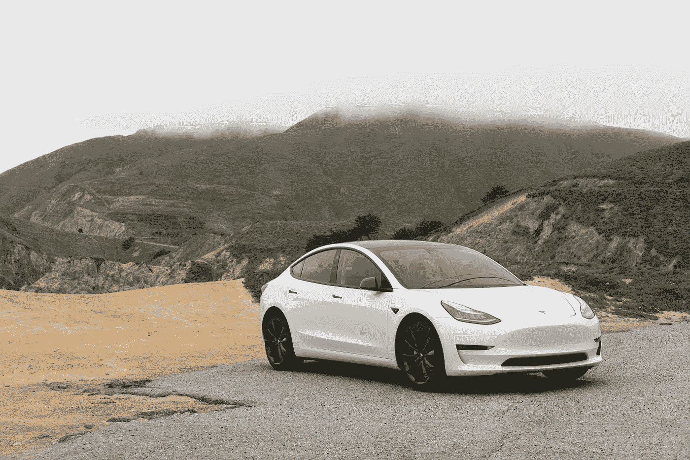

# 特斯拉降低新型号 Y 的价格

> 原文：<https://medium.datadriveninvestor.com/tesla-lowers-its-price-for-the-new-model-y-f9bfd2539a4b?source=collection_archive---------5----------------------->

## 这是呼吁现金还是有意识的营销策略？

Photo by [Charlie Deets](https://unsplash.com/@charliedeets?utm_source=medium&utm_medium=referral) on [Unsplash](https://unsplash.com?utm_source=medium&utm_medium=referral)

截至 7 月 13 日，特斯拉最新车型的价格[低于 5 万美元](https://www.tesla.com/modely/design#battery)。Y 型车最近降价 3000 美元。这次降价似乎出乎意料。

我们可以理直气壮地问自己，这种突然降价是对现金的呼唤，还是经过深思熟虑的营销策略。在不久的将来，电动汽车可能会进入大众市场，这是一个信号吗？或者这只是对 T2 销量下降预测的延迟反应？*或者也许不是这些？*

[Elon Musk](https://twitter.com/elonmusk) on Twitter

许多人可能会觉得难以消化，但即使是传奇的特斯拉汽车公司也无法逃脱疫情的后果。人们——甚至是最富有的人——可能会找到比在危机中期投资豪华跑车更好的花钱方式。

预测预测汽车行业甚至可能面临销售额大幅下降 22%的局面。尽管特斯拉迄今为止超过了[预期](https://techcrunch.com/2020/07/02/tesla-delivered-90650-vehicles-in-second-quarter-a-4-9-decline/)并且在 2020 年第二季度仍交付了 90，650 辆汽车。还必须承认，与去年同期相比，销售额只下降了 4.8%。但是这一年还没有结束。

由于新冠肺炎危机，特斯拉主要工厂的生产暂停了数周。这显然导致了生产中断，这使得特斯拉在财务上更加困难。

 [## 为什么那个创业者筹的比我多那么多？数据驱动的投资者

### 养多少既是一门艺术，也是一门科学，这个话题在许多其他帖子中有详细讨论。这篇文章将…

www.datadriveninvestor.com](https://www.datadriveninvestor.com/2020/06/14/why-is-that-entrepreneur-raising-so-much-more-than-me/) 

还必须指出的是——尽管你们中的一些人似乎总是忘记这个因素——2019 年是特斯拉历史上[第一个盈利的](https://edition.cnn.com/2020/01/29/business/tesla-earnings/index.html)年。迄今为止，该公司仅出现亏损。特斯拉也因“烧钱”而闻名，一个不那么美好的结局是[现金短缺](https://money.cnn.com/2018/03/28/news/companies/tesla-model-3-cash-crunch/index.html)实际上是该公司未来可能的场景。

该公司还深陷于长期债务和短期负债之中。因此，尽管特斯拉预计销量将持续增长，但埃隆·马斯克建立一家自筹资金公司的目标可能在一段时间内仍是一个梦想。

作为结论，是的，降价*可能*是一个求救信号。事实可能意味着公司将会受到危机的严重打击。

另一方面，特斯拉是一家非常有前途的公司。到目前为止，美国唯一一家没有破产的汽车生产商初创企业比特斯拉早 100 年成立。是的，我说的是福特汽车公司。我想我们都知道那个成功的故事。

在公司的历史上，埃隆·马斯克取得了惊人的成就。也是由于他的贡献，我认为我们现在可以说电动汽车行业正在进入[增长阶段](https://www.youtube.com/watch?v=7vgaLP5dP0w)。

故事并没有就此结束。埃隆·马斯克与特斯拉的长期计划令人惊叹。

> “我们的长期计划是制造各种各样的车型，包括价格合理的家用汽车”——[埃隆·马斯克](https://www.tesla.com/blog/secret-tesla-motors-master-plan-just-between-you-and-me)

除了计划制造负担得起的家用汽车，特斯拉汽车公司的使命是“加速世界向可持续能源的过渡”

他们的愿景是“通过推动世界向电动汽车的转变，创建 21 世纪最引人注目的汽车公司。”

特斯拉的目标显然非常远大。有些人可能会认为这些只是梦想，而不是实际目标。但就目前而言，该公司似乎在前进，似乎有进一步发展的手段。

回到**突然降价**，如果我们观察更大的画面，它实际上**符合特斯拉的最初计划。**

他们计划从高利润、高性能的跑车开始。通过这样做，他们可以使电动汽车对大众更有吸引力。此外，他们可以用这些收入来购买更实惠的汽车，最终实现规模经济。

想出一个出人意料的公告也完全符合埃隆·马斯克的风格。在这一点上，重要的是要强调特斯拉的[广告预算](https://marketingexamples.com/referral/tesla-marketing-strategy)等于零。*当然，*埃隆·马斯克的[个人品牌](https://www.youtube.com/watch?v=bYnBozl-9Ok)是绰绰有余的广告…

他创造迷因。在演示过程中打碎了特斯拉新的 Cybertruck 的窗户，并在演示结束后售出了 25 万多辆。他甚至在南方公园有一个角色！来吧，他得到了每个人的关注…

带着意想不到的东西出现绝对是他个人品牌战略的一部分。

因此，作为结论，是的，*也许*突然降价是一种有意识的营销策略。*也许*这是为了让我们可以再次谈论该公司，并为特斯拉创造更多的宣传。在这种情况下，*我想我们是上钩了，伙计们。*

但是我们永远不会知道…

*除非……*

马斯克先生，我听说你有时会和你的追随者交谈，并对他们的观点表现出兴趣。所以如果你正在读这篇文章，你能告诉我们这次突然降价背后的确切原因吗？

**访问专家视图—** [**订阅 DDI 英特尔**](https://datadriveninvestor.com/ddi-intel)