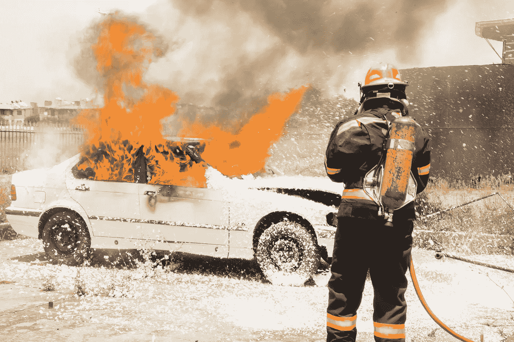

# 特斯拉 Model S 再次自燃

> 原文：<https://medium.datadriveninvestor.com/tesla-model-s-self-ignites-again-7d6d7e486644?source=collection_archive---------20----------------------->

## 美国国家消防协会和美国联邦公路管理局根据其电动汽车车队的行驶里程计算事故数量

Image by [Blomst](https://pixabay.com/users/blomst-3476834/?utm_source=link-attribution&utm_medium=referral&utm_campaign=image&utm_content=1738969) from [Pixabay](https://pixabay.com/?utm_source=link-attribution&utm_medium=referral&utm_campaign=image&utm_content=1738969)

人们在推特上向埃隆·马斯克或特斯拉寻求汽车方面的帮助并不罕见。乌斯曼·艾哈迈德的特斯拉 Model S 停在达拉斯郊区的一条路上。他突然听到金属碰撞的声音。几秒钟后，他买了 5 年的电动车开始冒出火苗。

41 岁的艾哈迈德说:“这声音就像普通汽车的车轴掉到地上一样。”他回忆说汽车完好无损。突然，汽车燃起了火焰，他正在路边目睹。所有的火焰主要集中在前排乘客轮周围。

他说:“像喷火器一样，火焰喷了出来。”Ahmed 在一家医疗保健公司从事战略和业务开发工作。

最近老款特斯拉 Model S 和 Model X 起火事件越来越多。

艾哈迈德的车辆也是其中之一。专家表示，这些事故与车辆使用的电池有关。关于汽车老化后的安全性和耐久性问题。

美国高速公路安全管理局(NHTSA)发言人肖恩·拉什顿(Sean Rushton)本月早些时候表示，该机构正在调查发生在得克萨斯州弗里斯科的车辆起火事件，并已就此事与特斯拉取得联系。

该机构自去年以来一直在调查特斯拉的电池缺陷，据说这一缺陷可能会导致旧款车型发生火灾事故。

> 许多特斯拉发言人没有回应置评请求

促使 NHTSA 对特斯拉发起调查的一份诉讼和缺陷申请称，为了解决一个未披露的缺陷，特斯拉操纵了旧款车型的电池软件，以降低起火风险，但这也降低了起火风险。

 [## 苹果 iCar:规格和传言

### 路透社爆料称，苹果正在推进自动驾驶技术，计划在 2024 年生产一款乘用车…

medium.com](https://medium.com/datadriveninvestor/apple-icar-specs-and-rumors-299a41cfdedb) 

车辆的续航里程和充电时间变长。去年，代表特斯拉车主对该公司提起诉讼的律师列举了“数量惊人的特斯拉汽车火灾”，这些事件似乎都是车辆自燃。

然而，自从 NHTSA 去年同意调查这一问题以来，该机构并没有透露太多的调查信息。

特斯拉引用了美国国家消防协会和美国。联邦高速公路管理局根据其电动汽车车队和其他车辆的行驶里程计算事故数量，称该公司的电动汽车发生火灾的概率比燃油汽车低 10 倍。

> 它的汽车每行驶 10 亿英里就有 5 起火灾，而美国汽车平均每行驶 10 亿英里就有 55 起火灾。

**除了特斯拉**，其他一些品牌的电动汽车也因起火风险面临联邦审查，一些制造商也启动了车辆召回。

上个月，NHTSA 宣布通用汽车在美国召回超过 5 万辆雪佛兰 Bolt 电动汽车，原因是其高压电池组可能起火。

早些时候，该机构证实，有五起已知的火灾涉及该车辆，造成两人受伤。NHTSA 建议车主在问题完全解决之前将车停在户外。

通用汽车发言人丹尼尔·弗洛雷斯(Daniel Flores)表示，经销商将更新车辆的电池软件，将最大充电量限制在 90%以下。同时，公司将寻求解决这一问题。

他说，这些车辆中使用的电池“在充满电或接近充满电时可能有起火的风险。”通用汽车正在 24 小时不间断地寻找根本原因。

 [## 移动网络 O2 发布英国首个无人驾驶汽车实验室测试使用 5G 和…

### 随着时间的推移，技术越来越强大。我们不仅成功地登上了月球，我们现在…

www.datadriveninvestor.com](https://www.datadriveninvestor.com/2020/11/24/mobile-network-o2-launch-uks-first-driverless-car-lab-testing-driverless-cars-using-5g-and-satellite-technology/) 

去年，奥迪 E-Tron 在美国上市。但上市后不久，该车因存在起火风险而被召回。

该公司表示，火灾风险是由线束引起的。奥迪发言人马克·达恩克(Mark Dahncke)表示，该公司尚未收到全球范围内的火灾报告，召回纯粹是出于谨慎考虑。

2011 年，美国联邦调查机构调查了通用汽车的插电式混合动力版本雪佛兰 Volt 的电池起火风险，通用汽车最终同意解决该问题。

Photo by [Hush Naidoo](https://unsplash.com/@hush52?utm_source=unsplash&utm_medium=referral&utm_content=creditCopyText) on [Unsplash](https://unsplash.com/s/photos/burn-car?utm_source=unsplash&utm_medium=referral&utm_content=creditCopyText)

根据美国国家消防协会的数据，2019 年，美国共有 18.95 万起高速公路车辆火灾，包括乘用车和其他类型的车辆。

> 专家表示，电动汽车的起火频率与燃油汽车相似，可能略低于燃油汽车

但由于化学物质的助燃作用和锂电池系统中大量热量的存在，发生火灾后，电动车燃烧强度更高，持续时间更长，灭火难度更大。

特斯拉在其网站上发布的 Model S 应急指南中写道:“起火后，电池可能需要长达 24 小时才能完全熄灭。可以考虑在做好曝光保护工作的同时，让电池继续燃烧。”

NHTSA 准备的报告称，电动汽车起火可能是一系列事件引起的连锁反应，例如，一个缺陷可能导致单个电池单元过热。

通过这种载体，热量可以点燃火源周围的高度易燃物质，并扩散到电池组的其他部分，最终随着温度和压力的升高而失控。

> 这个过程通常被称为热失控

然而，研究表明，这个问题可能不是电池固有的，而是由于当前一批电动汽车上市时间短，缺乏统一的安全标准造成的。

【2017 年 10 月，巴特尔纪念研究所(Battelle Memorial Institute)为 NHTSA 准备了一份关于纯电动汽车和插电式混合动力汽车锂离子电池安全性的报告。该报告称，“技术和行业尚不成熟，不足以建立全面的安全法规和标准来降低风险。”

在这个项目中，特斯拉特别受到监管机构的关注，因为人们担心该公司的计算机化汽车会使紧急响应和调查更加困难。

**例如**，一些急救人员称特斯拉汽车使用可伸缩门把手会对急救人员造成障碍。况且因为特斯拉的专有系统需要公司的配合才能解码，而且系统存储了车辆的关键事件信息。

NHTSA 表示，他们的调查重点是 2012 年至 2019 年生产的 Model S 和 Model X 车型。调查集中在车辆电池管理系统，包括热管理和充电控制。

 [## 硅谷面临逃离危机

### 加州是世界第五大经济体。但现在硅谷正面临前所未有的逃亡危机…

medium.com](https://medium.com/datadriveninvestor/silicon-valley-faces-an-escape-crisis-bb747e0d46af) 

**访问专家视图—** [**订阅 DDI 英特尔**](https://datadriveninvestor.com/ddi-intel)