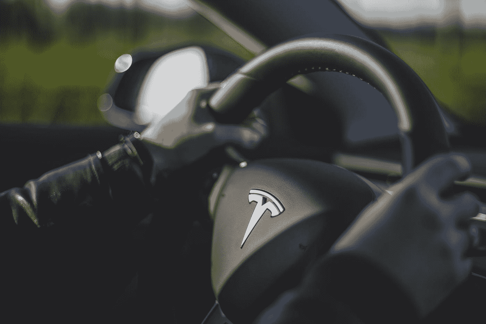

# 特斯拉:中国供应链的下一个游戏规则改变者

> 原文：<https://medium.datadriveninvestor.com/tesla-the-next-game-changer-to-chinese-supply-chain-b1240abc3ff3?source=collection_archive---------1----------------------->

Photo by [Bram Van Oost](https://unsplash.com/@ort?utm_source=medium&utm_medium=referral) on [Unsplash](https://unsplash.com?utm_source=medium&utm_medium=referral)

## 疯狂的中国速度:从开工到交付仅 357 天

> 这个月中国最大的新闻是什么？肯定是特斯拉的 Gigafactory 3 在上海开业了。特斯拉在上海开设了一家工厂，年产量将达到 15 万辆。埃隆·马斯克称这种植物为“未来增长的模板”

有什么刺激的？

除了开幕时宣布的国产 Model 3 降价(29.9 万人民币，约合 4.27 万美元)，另一个巨大的新闻是特斯拉 Model Y 计划的揭幕。正如 Model 3 一样，Model Y 也受到了很多关注，因为全球 SUV 市场最近经历了爆发式增长，仅 2018 年的销量就达到了 3000 万辆(难怪保时捷、宾利、劳斯莱斯等豪华品牌也加入了 SUV 战场)。

特斯拉 CN 更新了 Model Y 的价格(44.4 万元人民币，约合 6.34 万美元)，这也向中国市场发出了一个自信的信号，即按照埃隆·马斯克的承诺，2010 年在 Q2 开始交付不成问题。

 [## 物联网解决方案如何改变供应链中的机遇|数据驱动型投资者

### 物联网(IoT)可能开始时规模很小，但它正在成为世界经济中的一个重要因素。事实上…

www.datadriveninvestor.com](https://www.datadriveninvestor.com/2018/11/14/how-iot-solutions-are-shifting-opportunities-in-the-supply-chain/) 

但真正令人兴奋的是，Model Y 将在与 Model 3 相同的平台上生产，这使得共享 70%以上的零部件成为可能。鉴于 Model 3 目前的成本控制，Model Y 很可能会以较低的价格出售，考虑到 SUV 的市场潜力，预计也将是所有特斯拉车型中最畅销的。

# 疯狂的中国速度

中国被称为“基础设施超人”，不仅解决了各种世界级的工程和建设难题(如[青藏铁路](https://en.wikipedia.org/wiki/Qinghai%E2%80%93Tibet_railway))，还以疯狂的中国速度交付产品，这就是为什么特斯拉需要中国来实现彻底改革汽车市场的雄心。

*   2019/01/07 特斯拉启动其上海 Gigafactory。
*   2019/08/19 提交后 3 天，特斯拉获得了中国政府颁发的首张制造许可证。
*   2019/10/23 特斯拉拿到制造资质，开始制造 Model 3。
*   2019/12/30，特斯拉向当地员工交付了 15 辆中国制造的 Model 3。

从开球到交付只用了 357 天。

据特斯拉称，Gigafactory3 迄今已达到 1000 台/周的产能，不久将实现 3000 台/周的量产。

没有人能够想象，仅仅一年前，埃隆·马斯克在开幕式上跳舞的地方还是一片农田。

# 特斯拉的中国梦？

相比之下，特斯拉的弗里蒙特工厂花了 5 年多的时间才达到每周 1000 辆的产能，特斯拉不必从零开始建设，因为这是一个接管和改造。另一个特斯拉工厂，内华达州的 Gigafactory1，从交易(2014 年)到正式运营花了两年时间，迄今为止只建成了计划的 14%。

# 不仅仅是中国速度

为了充分理解这个故事发生了什么，我想回到 90 年代末中国向外国汽车制造商开放市场的时候。大约在 1984 年，当中国的汽车制造业如此落后时，中国政府决定引进合资企业来促进其汽车工业的发展。然而，为了保护本土汽车厂商，政府不能对国际汽车巨头完全敞开大门。因此，当这项政策在 1984 年公开时，合资企业必须遵循 50:50 的股份比例，尽管政策发生了变化，但这一比例一直保持不变。直到最近。

2018 年，中国政府宣布，将在电动汽车制造商中免除其汽车行业对外国所有权的合资限制。

除了中国政府的监管支持，特斯拉还获得了高达 185 亿元人民币(26 亿美元)的贷款，其中 45%是无担保贷款，利率为央行年度基准利率的 90%(银团贷款 35 亿元人民币，招银中国 50 亿元人民币)。

这笔贷款帮助特斯拉完成了土地购买和工厂建设，远远超过了上海 Gigafactory 之前的估计成本(约 140 亿元人民币)，使特斯拉有足够的现金来推动其在中国的业务。

但中国政府也有回报预期。在上海市政府和特斯拉的交易中，特斯拉将在未来 5 年内投资 140 亿元人民币，到 2023 年创造超过 750 亿元人民币的产值，并每年贡献 22.3 亿元人民币的税收。

# 特斯拉 Gigafactory3:解锁的制造能力+庞大的中国市场

随着 2018 年 Model 3 的成功，特斯拉的年收入更上一层楼，达到 214.6 亿美元，净亏损从 2017 年的 19.6 亿美元收窄至 2018 年的 9.8 亿美元。然而，特斯拉仍然无法将其产能提高到 5000 辆/周的目标产能，这对已经超过 10 年没有盈利的特斯拉来说是一个至关重要的问题。这就是为什么埃隆·马斯克在 2018 年 H1 特斯拉股东大会上确认了上海 Gigafactory3 计划。

特斯拉 Gigafactory3 的设计产能为每年制造 50 万辆汽车(每周 1 万辆)，到 2020 年将每年制造 15 万辆汽车。

此外，据摩根士丹利(Morgan Stanley)称，中国生产的汽车的劳动力成本将显著降低，仅为弗里蒙特工厂的 1/10 左右。如果我们按照特斯拉在中国 Gigafactory3 的计划，将有 1 万名员工，节省的成本甚至可以将利润率提高 30%以上。一个巨大的差异。

成本节约的另一个关键因素是中国供应商。埃隆·马斯克(Elon Musk)去年已经在公开场合提到，特斯拉计划在 2020 年底前在中国本地化 Model 3 的所有零部件。特斯拉的供应商体系中已经有多家中国供应商。因此，现在新的地点不仅节省了大量的物流成本，还为当地优质供应商创造了机会，例如电池解决方案中的 [CATL](https://finance.yahoo.com/quote/300750.SZ?p=300750.SZ&.tsrc=fin-srch) 和 LG，这占据了特斯拉的大部分材料成本。

特斯拉和中国相互需要。中国市场是全球最大的电动汽车市场，占全球市场份额的 50%以上。全球每卖出两辆电动汽车，中国就有一辆。随着特斯拉在中国建厂，高昂的关税和劳动力成本大大降低。

此外，特斯拉计划到 2020 年底在 mainland China 增加 4000 多个超级充电站，将过去五年建造的充电站数量增加一倍。

*“我们真正的竞争对手不是正在生产的非特斯拉电动汽车的涓涓细流，而是每天从世界各地工厂涌出的巨大汽油车洪流。”*

马斯克对特斯拉的使命是加速世界向可持续能源的过渡，因此特斯拉的雄心不是击败其电动汽车竞争对手，而是改善整体能源应用。

但是能源决定了世界的经济和政治，这就是为什么特斯拉有这么多的“困难”:因为与石油巨头的利益有冲突。在美国，70%的石油用于汽车。但是不管你喜不喜欢，新能源是必然的趋势。

# 特斯拉+中国汽车供应链:电动汽车的加速

快速浏览一下电动汽车供应链:

*   上游——资源类:以金属资源为主的公司，如锂、稀土矿等。
*   中游——3 个“电子相关”组件:电池、电机和电子控制的供应商。
*   下游——汽车生产和销售:原始设备制造商、批发商和零售利益相关者。
*   后市场—以运营为中心:充电站制造/运营、车辆维护、电池回收。

电动汽车供应链高度依赖上中游生态系统。在这些领域，中国公司占据了全球前十强的一半以上。同样在中国电动汽车市场巨大需求的推动下，出现了多个区域性产业生态系统，如[华北](https://en.wikipedia.org/wiki/Jing-Jin-Ji)(又名京津冀，意为京津冀)[长三角](https://en.wikipedia.org/wiki/Yangtze_Delta)、华南(又称[珠三角](https://en.wikipedia.org/wiki/Pearl_River_Delta)，现拓宽为[大湾区](https://en.wikipedia.org/wiki/Guangdong-Hong_Kong-Macau_Greater_Bay_Area))、西南等。

# 特斯拉会是另一个激活中国供应链的苹果吗？

从 iPhone 4 开始，苹果凭借其智能手机产品一跃成为市值最高的公司之一。iPhone 4 是最畅销的 iPhone，尤其是在手机性能和改善低功耗方面。随着硬件/软件的升级和配置/功能的改善，苹果公司成功推出了一系列新产品，在智能手机行业占据了主导地位。

7 年前，苹果全球 156 家供应商中只有 8 家来自 Mainland China。2019 年，苹果将其全球 200 家供应商中的中国供应商增加到 50 多家。

除了众所周知的富士康，过去 10 年间加入苹果供应链后，还出现了一批股票收益实现 10 倍以上增长的优秀供应商:

[歌尔泰克](https://finance.yahoo.com/quote/002241.SZ?p=002241.SZ&.tsrc=fin-srch)，音响供应商；

[深圳赛维](https://finance.yahoo.com/quote/300136.SZ?p=300136.SZ&.tsrc=fin-srch)，天线供应商；

[Luxshare Precision](https://finance.yahoo.com/quote/002475.SZ?p=002475.SZ&.tsrc=fin-srch) ，连接器供应商；

[镜头技术](https://finance.yahoo.com/quote/300433.SZ?p=300433.SZ&.tsrc=fin-srch)，玻璃盖供应商；

[深圳德赛电池](https://finance.yahoo.com/quote/000049.SZ?p=000049.SZ&.tsrc=fin-srch)，电池供应商；

等等。

依托苹果的快速发展，中国建立了全球最全的消费电子产业链。但更令人着迷的是，不仅中国手机供应商可以生存并扩大业务(有些甚至成为其专注领域的领导者)，而且中国的整体手机品牌也可以从苹果主导的生态系统中受益，如华为、小米、Oppo、Vivo。

因此，当我们展望未来时，特斯拉似乎非常有能力在创新颠覆、产品认知度、产业链影响方面复制苹果在中国的遗产。

唯一的问题是:

# 特斯拉的 Model 3 能像苹果的 iPhone 4 一样受欢迎吗？