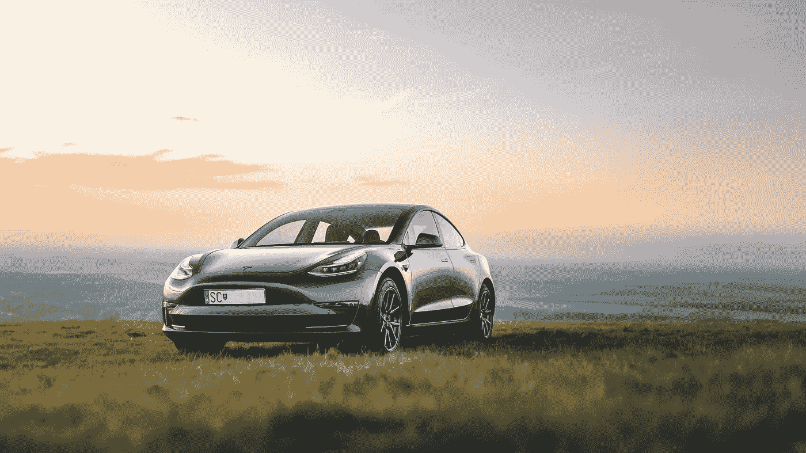
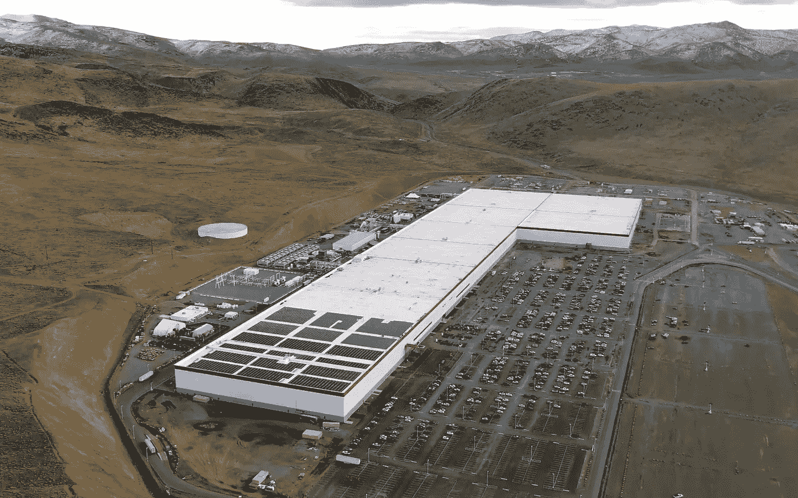
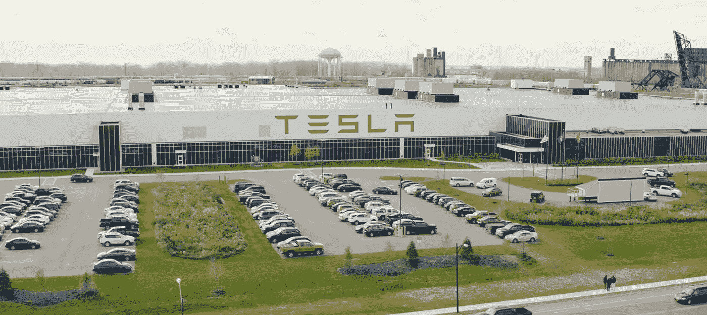
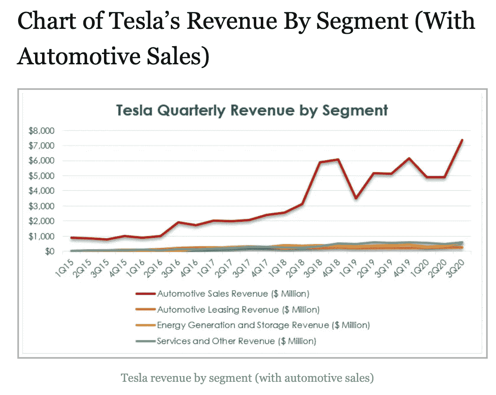
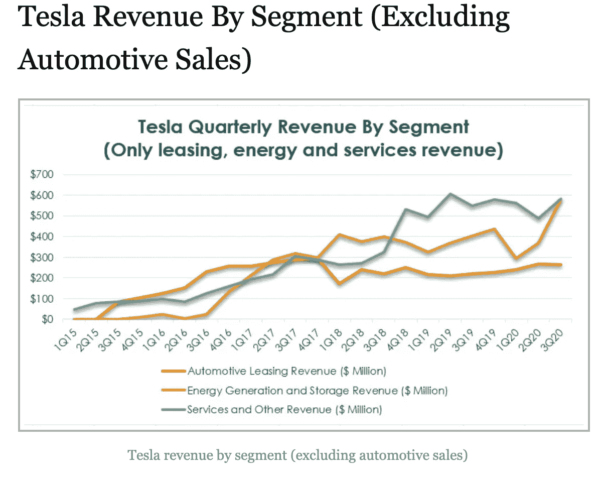

# 特斯拉的能源产品

> 原文：<https://medium.datadriveninvestor.com/teslas-energy-products-29ebae2aa687?source=collection_archive---------2----------------------->

## 看看特斯拉的能源组合以及它们可能的发展方向

Image by Pixabay

# **1。** **什么是特斯拉？**

特斯拉(股票代码 TSLA)是埃隆·马斯克写给环境的情书——一家电池供电电动汽车制造商。对吗？

如果你看看他们现在卖什么，那么毫无疑问，特斯拉是插电式电池供电电动汽车的制造商/销售商/服务商。他们也有一个额外的电池供电的运输方式，如卡车，坚实的 R&D 组合。我在这里对特斯拉的汽车部门做了更彻底的审查:

 [## 特斯拉的平流层发射继续进行

### 回顾历史数据，展望 2020 年第 3 季度收益电话会议

medium.com](https://medium.com/datadriveninvestor/teslas-stratospheric-launch-continues-b0d242497cf2) 

然而，如果你将新产品和未来产品视为特斯拉未来的先兆，那么他们正在开发各种可再生能源发电(太阳能)和存储(电池)产品。特斯拉的能源部门是我们在这里要关注的，因为这将是他们未来的一大部分。

# **2。** **秘密总体规划——将特斯拉的能源部门放入背景中…**

特斯拉成立于 2003 年，自 2004 年以来，马斯克一直以这样或那样的形式掌舵。

马斯克对特斯拉的愿景是“加快从开采和燃烧碳氢化合物经济向太阳能电力经济的转变。”

马斯克在 2006 年的“秘密总体规划”中首次阐述了特斯拉的目标，他将其概括为:

1.  *打造跑车*
2.  *用那笔钱造一辆买得起的车*
3.  用那笔钱造一辆更实惠的车
4.  *在做上述工作的同时，还提供零排放发电选项*

我们可以看到，如果我们将每个列举的目标与相应的特斯拉产品对应起来，这些目标大部分已经实现:

1.  是跑车
2.  型号 S 和 X
3.  是型号 3 和 Y
4.  是他们正在进行的太阳能研究

Photo by [Martin Katler](https://unsplash.com/@martinkatler?utm_source=unsplash&utm_medium=referral&utm_content=creditCopyText) on [Unsplash](https://unsplash.com/s/photos/tesla-model-3?utm_source=unsplash&utm_medium=referral&utm_content=creditCopyText)

2016 年，马斯克在这里发表了他的“总体规划，第二部分”[，他总结为:](https://www.tesla.com/blog/master-plan-part-deux)

1.  *利用无缝集成的电池储存创造出令人惊叹的太阳能屋顶*
2.  *扩展电动汽车产品线，覆盖所有主要细分市场*
3.  *通过大规模车队学习，开发比手动安全 10 倍的自动驾驶能力*
4.  当你不用的时候，让你的车为你赚钱

最重要的是，尽管我们认为特斯拉是一家电动汽车公司，但他们从一开始就将能源产品目标置于两个总体规划的核心。能源产品不是事后的想法或次要的。他们是公司的核心。

让我们来看看那些能源产品。

# **3。** **电池……**

电动汽车旨在为我们提供汽油动力汽车的所有好处，但对环境的影响要小得多。最有效的用电方式之一是通过电池储存和放电。

[锂离子电池](https://en.wikipedia.org/wiki/Electric_vehicle_battery)是目前最好的汽车电池，因为与其他类型的电池相比，它们具有相对较高的功率重量比。但是锂离子电池的功率密度远小于汽油，所以电动汽车必须通过其他方式进行补偿。

补偿较低功率密度的一种方法是提高效率。在将储存的能量转化为动力方面，电动马达比汽油发动机要高效得多。储存在汽油中的绝大部分能量(约 80%)在典型的发动机中作为热量被浪费掉了。这一比例在电动汽车中正好相反，高达 90%储存在电池中的电能被直接转化为动力。

一辆电动汽车充满电后的能量可能只相当于几加仑汽油，但对于特斯拉来说，这足以行驶 300 多英里。

特斯拉从一开始就计划制造自己的电池，意识到他们的需求将很快超过锂离子电池的全球产能。第一个 [Gigafactory](https://en.wikipedia.org/wiki/Giga_Nevada) (以目标生产 35 千兆瓦时的电池单元命名)早在 2013 年就宣布了。2014 年，特斯拉宣布与松下合作，投资 Gigafactory，提供生产专业知识，并管理电池生产。特斯拉于 2016 年底和 2017 年初开始在 Gigafactory 1 生产电池。

Tesla Gigafactory 1, Sparks, Nevada (Wikimedia Commons)

特斯拉目前生产的电池主要用于生产电动汽车 S、3、X 和 y。然而，一些 Gigafactory 产能用于生产特斯拉的储能产品。

# **4。** **储能产品……**

如今，可再生能源的生产比碳氢化合物(煤、天然气、石油等)更便宜。)或许多其他传统能源。风能和太阳能等可再生能源的最大缺点之一是它们的间歇性，以及当能源供应最低时，能源需求经常达到峰值(傍晚和夜间)的事实。即使成本较低，要使 100%的可再生能源成为现实，也需要储能。

对于家庭使用，特斯拉有 [Powerwall](https://en.wikipedia.org/wiki/Tesla_Powerwall) ，可以用来储存家庭的太阳能以供正常使用，将能源用于其他时间，作为备用电源，或用于离网使用。Powerwall 是一个安装在墙上的可充电锂离子电池系统，它包括一个基于手机的应用程序来监控和控制能源使用。2020 年早些时候，特斯拉宣布已经安装了第 10 万台 Powerwall。

对于商业或公用事业用途，特斯拉有动力包和巨型包。已经安装了许多非常引人注目的公用事业规模的电池，包括澳大利亚 Hornsdale 电力储备中心的 100 兆瓦特斯拉系统。特斯拉目前被批准在加利福尼亚州的[莫斯兰丁](https://pv-magazine-usa.com/2020/07/29/pge-tesla-begin-construction-on-the-worlds-largest-battery-for-now/)发电厂安装世界上最大的电池存储系统，该发电厂将拥有大约 10 亿瓦的超级电池组。

特斯拉还参与了一个非常大的[虚拟发电厂](https://arena.gov.au/projects/tesla-virtual-power-plant/)的建设，这是一个由南澳大利亚潜在的 50，000 个家用太阳能和特斯拉 Powerwall 电池存储系统组成的网络。虚拟发电厂是一个由家庭太阳能和存储单元组成的分布式系统，所有这些单元作为一个发电厂联网在一起。

# **5。** **太阳能……**

特斯拉位于纽约布法罗的 [Gigafactory 2](https://www.tesla.com/gigafactory2) 目前生产太阳能电池板、太阳能屋顶，以及 Powerwall 和 Powerpack 储能系统。

Tesla Gigafactory 2, Buffalo, New York (photo by Electrek)

特斯拉在 2016 年的一次有争议的合并中收购了 Solar City，并因此收购了布法罗工厂。特斯拉与松下建立了合作伙伴关系，使用他们的光伏电池生产电池板。2018 年，特斯拉开始生产单独的太阳能电池，2020 年，特斯拉开始安装他们的太阳能屋顶。

2016 年推出的太阳能屋顶不同于现有的太阳能产品，现有的太阳能产品是安装在现有屋顶上的光伏电池板。相比之下，太阳能屋顶用马斯克的话说“就是屋顶”。它们是由高强度玻璃制成的太阳能屋顶瓦片，纹理看起来像陶瓷或石板。

太阳能屋顶正在经历分娩的阵痛，这与 Model X 长达数年的时间表延伸和孵化不同。特斯拉的太阳能屋顶目前正在销售和安装，尽管速度缓慢。家用和商用能源[储存做得更好](https://techcrunch.com/2020/07/22/teslas-megapack-powers-its-small-but-growing-energy-storage-business/)，增长迅速，也在世界各地高调安装。所以，秘密总计划第二部分的第一个目标正在进行中。

# **6。** **特斯拉能源事业部何去何从……**

特斯拉的能源部门是特斯拉最小的部门，这可以从下面的收入分解图中看出。上图显示了所有细分市场，包括占主导地位的汽车细分市场。在图表底部的噪音中，能源收入下降了。

Tesla revenues by segment to Q3 2020\. The author is using this website image under the fair use doctrine.

Tesla revenue breakdown without automotive, to Q3 2020\. The author is using this website image under the fair use doctrine.

特斯拉的重点仍然是汽车领域。从电池到成品汽车，生产必须加速，并能够以远高于特斯拉目前的产量满足需求。除了成长一家新的创业汽车公司、与福特、通用汽车、丰田、戴姆勒、大众和其他巨头竞争的正常挑战之外，特斯拉还必须管理冠状病毒引起的衰退状况。

尽管如此，正如我在之前的[特斯拉文章](https://medium.com/datadriveninvestor/teslas-stratospheric-launch-continues-b0d242497cf2)中指出的，特斯拉的汽车交付量和收入继续以惊人的速度加速增长，而汽车行业的其他部分正在以惊人的速度被摧毁和失去销量。

特斯拉将继续尝试在利润中增加能源产品，但开发和生产资源及资本的优先次序将继续向汽车部门倾斜。

电池生产将是最重要的制约因素之一，其中型号 3 和 Y 将再次获得第一优先。由于电池的限制，我们将看到 S 型和 X 型电池连续三年销量下降，同样，我们也将看到固定存储产品的限制。

如果 cell 的产量超过了 Models 3 和 Y 的需求，那么我们将立即看到大型豪华 Models 和 X 以及固定存储产品的产量增加。

尽管有这些限制，[特斯拉的 Powerwall](https://www.teslarati.com/tesla-solar-roof-killer-elon-musk/) 主导了住宅储能市场。

电池生产不会限制太阳能产品，但对资源和资本的限制会。

然而，我认为最终目标是特斯拉能源产品的收入远远超过汽车收入，这反映了能源行业比汽车行业大得多的规模。

# 7 .**。** **披露……**

我很高兴拥有最古老的二手特斯拉 Model S(2013 款 MS P85)，也很高兴投资了特斯拉公司。

你可能也会喜欢以下最近的文章。

这是对 SpaceX 的 Starlink 的介绍:

 [## SpaceX 的 Starlink

### 或许很快就能让高速卫星互联网进入您的家中！

medium.com](https://medium.com/predict/spacexs-starlink-high-speed-satellite-internet-to-your-home-soon-maybe-38d02eb0d072) 

这是 Starlink 最近测试的后续:

 [## 佤邦军方使用的 Starlink

### SpaceX 加快了 Starlink 互联网服务的 beta 测试，满足了军事紧急情况的严格要求…

medium.com](https://medium.com/predict/starlink-used-by-wa-states-military-bb2cd8aca83a) 

这是对网飞文化的一个观察:

 [## 网飞文化战争

### 好好看看一场有影响力但被误解的文化大革命

medium.com](https://medium.com/illumination-curated/reed-hastings-and-the-netflix-culture-wars-cfe8777e1a6a) 

感谢您的阅读，并请分享！