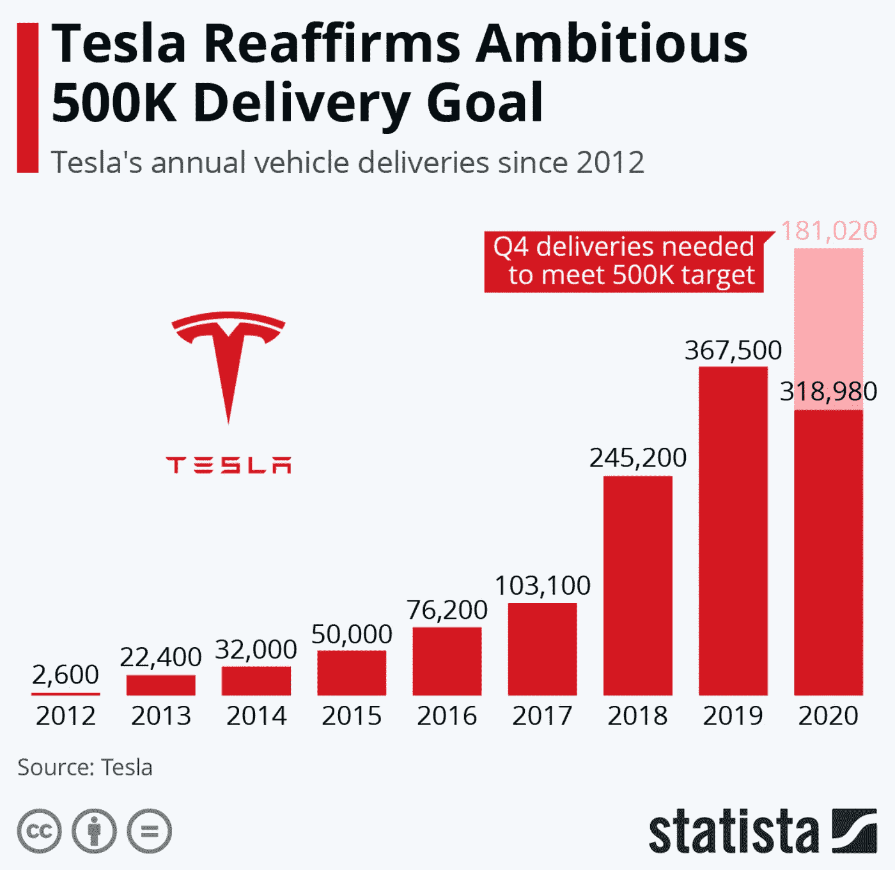

# 特斯拉的爆炸性销售相比，汽车行业

> 原文：<https://medium.datadriveninvestor.com/teslas-explosive-sales-compared-to-the-auto-industry-5cdf9a81e7dc?source=collection_archive---------1----------------------->

## 今年到目前为止，谁是销售额最高的人？

Photo by [Martin Katler](https://unsplash.com/@martinkatler?utm_source=unsplash&utm_medium=referral&utm_content=creditCopyText) on [Unsplash](https://unsplash.com/s/photos/tesla-model-3?utm_source=unsplash&utm_medium=referral&utm_content=creditCopyText)

# **1。****2020 年第三季度汽车行业销量如何**

今天早上(2020 年 11 月 6 日),我听到媒体近乎欣喜若狂地报道今年第三季度美国汽车销售情况。我想事情都是相对的。[在 Q1 2020 年](https://www.coxautoinc.com/market-insights/10-takeaways-from-u-s-auto-sales-q1-2020-and-covid-19/)，根据 Coxautoinc.com 的数据，美国的汽车销量比去年下降了 12%以上。在 2020 年 Q2 的[，just-auto.com 报告称，与 2019 年相比，美国汽车销量下降了近 34%。](https://www.just-auto.com/news/covid-19-hit-us-light-vehicle-sales-hard-in-q2_id196469.aspx)

这是一个前所未有的生存悬崖，汽车行业正从这里坠落。

因此，当销售额下降幅度小于前两个季度时，这肯定意味着在这个流行病肆虐的时代，第三季度实际上是一个不错的季度。让我们看看这些数字，看看每家公司在 2020 年第三季度的表现如何——特别是特斯拉，我认为他正在彻底改变这个僵化和垂死的行业。

# **2。** **将特斯拉与业内其他公司进行比较**

这里是每个制造商的排名订单列表，以及它们在每年第三季度的 2019 年与 2020 年美国销售额(售出的数量)，由 goodcarbadcar.net 汇编。排名是根据 2019 年第三季度和今年第三季度之间的增长量进行的，显示在最后一列-绿色表示销售额增长，红色表示销售额萎缩。注意谁在上面，增长有多大。

U.S. sales in Q3 2020 by brand (chart by [goodcarbadcar.net](https://www.goodcarbadcar.net/2020-us-vehicle-sales-figures-by-brand/))

特斯拉第三季度的同比销售增长远远超过整个汽车行业。沃尔沃和阿尔法罗密欧都公布了低两位数的增长，但特斯拉超过了他们几乎 10 至 15 倍的增长率。

让我们仔细看看这些数字。

与 2019 年相比，特斯拉 2020 年第三季度的销量增长超过了整个汽车行业第三季度的销量增长(净负值)。它超过了其他九家正增长公司的第三季度单位增长(见从阿尔法罗密欧到三菱的绿色公司)

尽管名字响亮，但沃尔沃和阿尔法·罗密欧都不能因为特斯拉是一家小公司就说它有更高的增长。看看前两列中售出的数量。

2019 年，特斯拉的销量是沃尔沃的两倍，是阿尔法·罗密欧的十三倍多。这一差距在 2020 年进一步扩大。

特斯拉不再是一家小公司，但它仍保持着迅猛的增长率。它比去年的销售额翻了一倍多，还不到两倍。

2019 年，特斯拉第三季度的交付量小于马自达、雷克萨斯和奥迪。但在 2020 年，特斯拉的交付量是马自达、雷克萨斯和奥迪的两倍，仅次于斯巴鲁和起亚。

2019 年，特斯拉售出了福特售出的约十分之一的汽车。但在 2020 年，特斯拉已经将差距移至福特的四分之一左右。

多年的指数增长，50%的年增长率做到了这一点。

# **3。** **特斯拉的挑战——资本**

一个常见的说法是，特斯拉的需求正在死亡。因为竞争，因为产品质量差，或者因为任何虚构的替代事实遇到的时刻。

不久前，可疑网站上流传的照片显示，停车场堆满了未售出的特斯拉。这些都被揭穿了。就连《纽约时报》都被蒙骗了，不加批判地认为，这些堆满特斯拉的停车场代表着某种生存威胁，或者至少证实了埃隆·马斯克的管理不善。看看 NYT 的[这里的](https://www.nytimes.com/2018/10/01/business/tesla-cars-questions.html)差报道。

有关于“车轮不稳”或其他所谓质量问题的虚假报道。特斯拉确实存在质量问题。埃隆·马斯克和我们其他人一样，远非完美。特斯拉作为一家公司也是如此。但威胁生命的质量问题并不在这些担忧之列，就像选民欺诈不是美国的一个主要问题一样(它确实存在，但发生率可以忽略不计，而且远远不会使我们的选举结果无效)。

特斯拉获得了 IIHS 高速公路安全保险协会和 NHTSA 国家高速公路交通安全管理局的最高安全评级。

归根结底，特斯拉是一家快速增长的大型资本密集型公司。客户明白这一点，需求远非特斯拉所能满足。汽车公司需要大量资金来运营，更不用说发展了。

展望未来，特斯拉面临的挑战将是如何满足需求，而不是如何创造需求。

你如何发展一家现在和特斯拉一样大(交付的汽车几乎和斯巴鲁或起亚一样多)、每两年销量翻一番的公司？

Tesla’s annual vehicles delivered (chart by [Statista](https://www.statista.com/chart/8547/teslas-vehicle-deliveries-since-2012/))

一种方法是建立更多的工厂。特斯拉刚刚在中国上海以创纪录的时间完成了他们的 Gigafactory 3。他们现在正在德国柏林郊外建造 Gigafactory 4。(Gigafactory 1 位于内华达州的斯帕克斯。Gigafactory 2 位于纽约布法罗。特斯拉在加州弗里蒙特的原始汽车制造厂并没有被指定为巨型工厂。).

这些工厂，可想而知，价格不菲。Gigafactory 1 完工时的估价为 50 亿美元(大约是 [30%完工](https://electrek.co/2020/02/19/tesla-semi-giant-building-giga-nevada/))。上海的 Gigafactory 3 预计将耗资 20 亿美元。Gigafactory 4 预计耗资 44 亿美元。

因此，资金将是特斯拉面临的一个挑战。随着利润的增加，他们越来越依赖资本。但是各个国家、州和地方都无耻地讨好特斯拉，试图吸引下一个高就业率的巨型工厂。这种讨好是以税收减免、廉价土地和低息贷款的形式出现的，比如中国为 Gigafactory 3 提供的贷款。

# **4。** **特斯拉的挑战——制造**

另一个快速有效增长的方法是革新制造业。比如在大型压力机中铸造整个车身框架，如图所示在特斯拉组装。

在特斯拉专利 US20190217380 的一些插图中，您可以看到大型压机将如何用于铸造整车框架:

[https://patentscope.wipo.int/search/en/detail.jsf?docId = us 248873852&tab = national biblio](https://patentscope.wipo.int/search/en/detail.jsf?docId=US248873852&tab=NATIONALBIBLIO)

Illustration from Tesla’s patent US20190217380

铸造全身框架是一个新的尝试，不会没有打嗝和挑战。但特斯拉正在设计、制造以及全自动驾驶和自动驾驶软件等软件领域开辟新的道路。即使是特斯拉为不断提高其车队性能而提供的更普通的无线更新也是革命性的。

这些都是保持需求如此之高的原因，并对特斯拉提出了特殊的挑战，以保持制造业等领域的革命性变化——以便特斯拉能够满足这种无法满足的需求。

感谢阅读，请分享！

你可能会喜欢我之前关于特斯拉的文章:

 [## 特斯拉的平流层发射继续进行

### 回顾历史数据，展望 2020 年第 3 季度收益电话会议

medium.com](https://medium.com/datadriveninvestor/teslas-stratospheric-launch-continues-b0d242497cf2)  [## 特斯拉的能源产品

### 看看特斯拉的能源组合以及它们可能的发展方向

medium.com](https://medium.com/datadriveninvestor/teslas-energy-products-29ebae2aa687)  [## 特斯拉明矾回收锂离子电池

### 那些小虫子有多毒？

medium.com](https://medium.com/datadriveninvestor/recycling-lithium-ion-batteries-464f8d149b9c)  [## 泰斯拉美丽的负重兽

### 特斯拉 Semi 怎么了？

scienceduuude.medium.com](https://scienceduuude.medium.com/teslas-beautiful-beast-of-burden-2f5955d3dcfe)