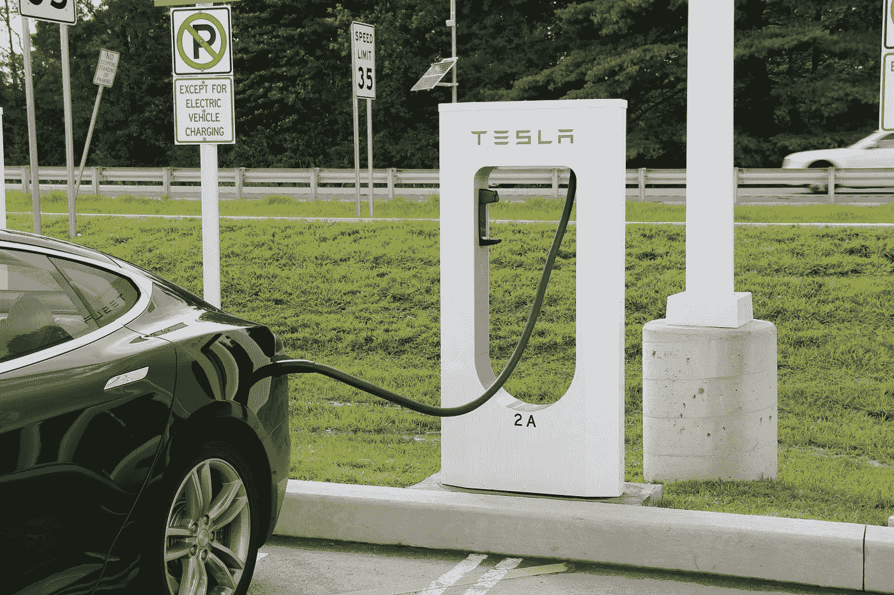
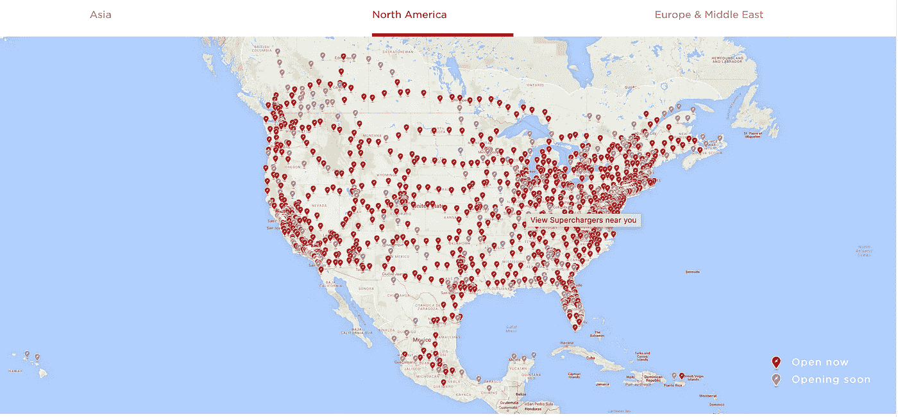
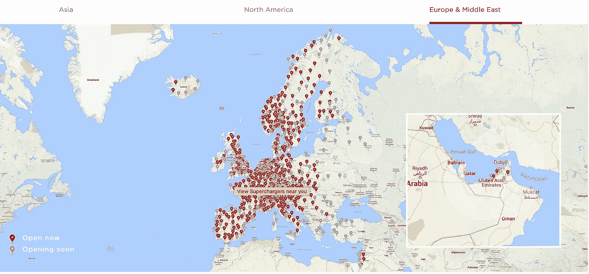
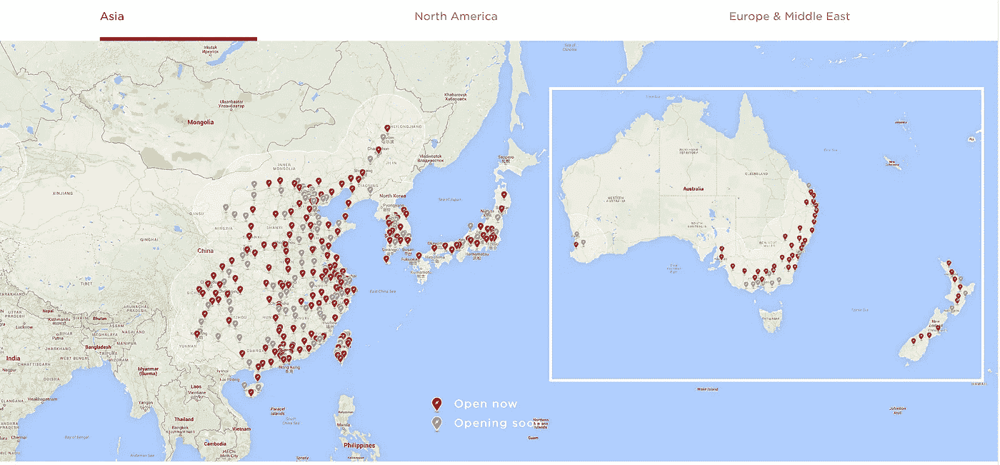
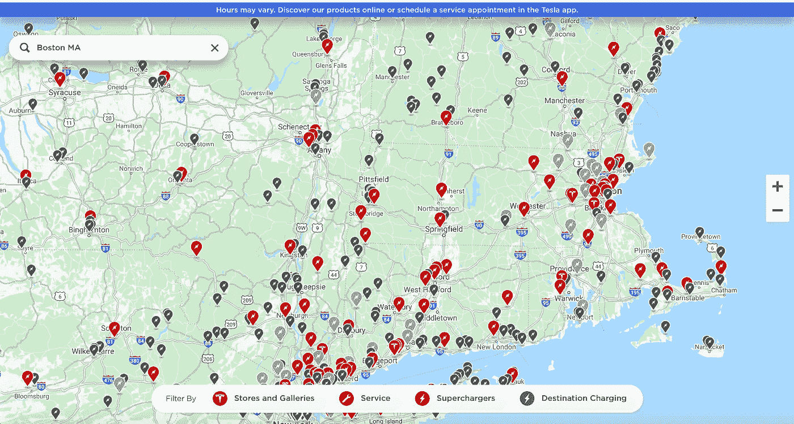
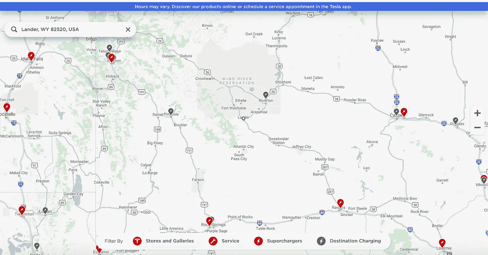
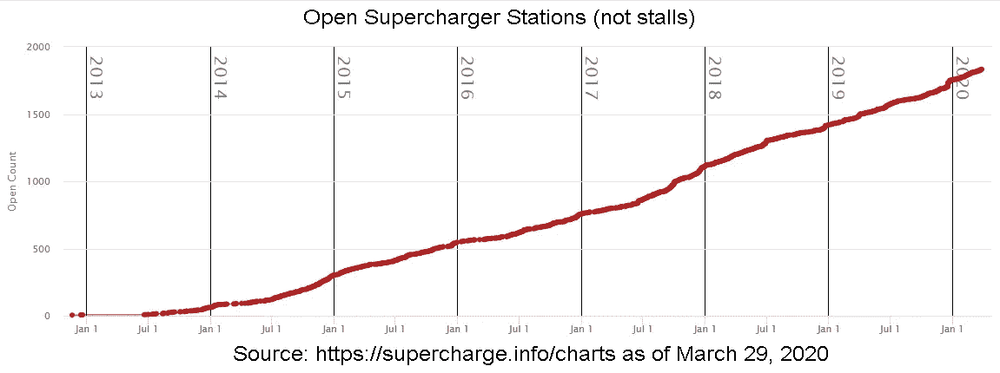
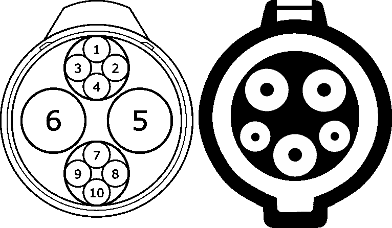

# 特斯拉的全球增压器网络

> 原文：<https://medium.datadriveninvestor.com/teslas-global-supercharger-network-526705822bac?source=collection_archive---------1----------------------->

## **特斯拉的超级充电站网络遍布全球，以对抗全球变暖……**

[Tesla Model S](https://en.wikipedia.org/wiki/Tesla_Model_S#Charger) charging at the Supercharger network station in [Newark](https://en.wikipedia.org/wiki/Newark,_Delaware), [Delaware](https://en.wikipedia.org/wiki/Delaware). (Wikimedia Commons)

# **特斯拉增压器…**

如果我们正在考虑购买电动汽车或卡车，我们会考虑如何为我们的汽车充电。对于我们中的许多人来说，我们大部分时间都在家里充电，当我们下班或出差回家时再充电，然后整夜充电以补充电池的电量。但是如果我们是在长途旅行中，我们会做什么呢？

如果你有一辆特斯拉，你将主要依赖特斯拉分布广泛、方便的超级充电站网络。这些是特斯拉内部开发、制造、安装的高压高速充电站。

让我们深入研究一下，看看为什么特斯拉已经主宰了电动汽车的世界，并将有可能成为推动汽油动力汽车衰落和实际灭绝的领导者。

# **接管世界…**

首先，让我们快速浏览一下特斯拉品牌的超级充电站的全球网络。接下来的三张图片是特斯拉网站的截图，显示了一系列定位其增压器的地图。

Supercharger locations in US. (Images from Tesla.com)

Supercharger locations in EU and ME. (Images from Tesla.com)

Supercharger locations in Asia. (Images from Tesla.com)

很高兴知道，埃隆马斯克和特斯拉正在花费大量资金来推广这些增压器，就像一个老农民在撒播种子一样。但是我们中的大多数人并不开车环游世界，所以那些地图，尽管它们可能令人印象深刻，但并没有真正帮助我们。

在我们自己的区域呢？如果你在一个相当城市化的地区附近，你可能会看到类似我所在的新英格兰地区的东西。注意城市周围密集的充电器群，比如波士顿。如果你想为你的地区找到一个类似的地图，这里是特斯拉在其网站上的应用程序:

 [## 增压器|特斯拉

### 在世界上最快的充电网络旁停下来，快速吃点东西。随着我们的快速扩张…

www.tesla.com](https://www.tesla.com/supercharger) 

Supercharger and destination charger locations around Boston, MA. (Images from Tesla.com)

更偏远的位置呢？我选择怀俄明州的兰德作为比较点，因为我和妻子在风河山脉一次漫长的徒步旅行和登山假期中开车经过那里。让我们来看看吧——缩放比例与波士顿地图大致相同。

Supercharger and destination charger locations around Lander, WY. (Images from Tesla.com)

离兰德最近的目的地充电器(较低和较慢的充电器，通常位于酒店或其他“目的地”)是东边 25 英里外的里弗顿。向南行驶，在美国 287 号公路上行驶 125 英里到达罗林斯，到达最近的增压器。

这些距离完全在充满电的特斯拉的范围内，所以如果你在该地区，从一个站到另一个站，中间穿插目的地充电器，到达你需要的地方不会有任何问题。

传统和网络媒体从来没有特别支持过特斯拉。尽管如此，不可避免的是，特斯拉在超级充电网络上的投资已经在易用性方面获得了回报，因此赢得了客户的忠诚度。以下是 Business Insider 对特斯拉充电器网络的评论:

 [## 特斯拉庞大的跨国增压器网络是一个巨大的竞争优势。仔细看看…

### 特斯拉广泛的超级充电站网络是该公司在电动汽车竞争中脱颖而出的原因。其他…

www.businessinsider.com](https://www.businessinsider.com/tesla-supercharger-network-versus-other-electric-car-chargers-2020-4) 

*   [*特斯拉的*](https://www.businessinsider.com/category/tesla) *广泛的超级充电站网络是该公司在电动汽车竞争中脱颖而出的原因。*
*   *其他汽车制造商已经与充电业务合作，并探索了自己的解决方案，但只有特斯拉在北美、欧洲、中东和亚洲拥有与该公司车辆完全集成的庞大网络。*
*   *增压让特斯拉车主成为一车 EV 客户；其他充电系统更青睐续航里程较短的电动汽车，这类汽车需要备用车辆才能行驶更长的距离。*
*   *随着特斯拉售出更多汽车，超级充电站网络面临压力，该公司不得不开始向车主收取使用费。*

以下是《福布斯》对特斯拉与其竞争对手的比较:

 [## 特斯拉超级充电站网络 Vs 电气化美国 Vs EVgo(2020 年末)

### 特斯拉庞大的超级充电站网络终于有了竞争，这使得购买非特斯拉电动汽车变得更加…

www.forbes.com](https://www.forbes.com/sites/brookecrothers/2020/12/06/state-of-electric-car-fast-charging-late-2020-tesla-supercharger-network-vs-electrify-america-vs-evgo/?sh=3eb96af012e6) 

# **比较充电器…**

对普通驾驶员有用的充电器至少有两个主要要求。一是充电站的数量和位置。我们在上面讨论了位置，特斯拉是领导者之一，它安装了大量(超过 2，000 个加油站和 20，000 个增压器)，并且安装在彼此相对靠近的便利位置。

另一个主要要求是充电速度。充电速度取决于你推电子的力度，外加电压。给汽车充电有几个层次。所有这些都依赖于将电源的标准交流(AC)电压转换成电池所需的直流(DC)。

*   第一级(120 伏交流电)—第一级充电可以让你插入普通的 120 伏家用插头，以低速为你的汽车充电。对于特斯拉来说，这相当于每小时行驶 3-5 英里。所有的特斯拉汽车都配有一种叫做通用[移动连接器](https://www.tesla.com/support/home-charging-installation/mobile-connector) (UMC)的东西，这是一种带变压器的重型电缆，可以插入任何 120V 插座。
*   2 级(240 伏交流电)-2 级通常用于目的地充电器，安装了[特斯拉墙壁连接器](https://www.tesla.com/support/home-charging-installation/wall-connector)的房主每小时可以获得 5-44 英里的范围，这取决于通过充电器的电流。
*   3 级(480 伏 DC)——这些是像特斯拉的超级充电器一样的高速充电器，因为它们是 DC，所以它们可以直接将电荷推送到电池，无需从交流转换到 DC。这些充电器每小时充电至少可以行驶 100 英里。

Chargepoint 是目前最大的电动汽车充电站网络，截至 2020 年 9 月，在全球 14 个国家运营着 114，000 个充电器。然而[他们的充电器绝大多数](https://www.myev.com/research/comparisons/comparing-public-electric-vehicle-charging-networks)都是 2 级。去年 8 月，Chargepoint 拥有约 1500 个 3 级充电器。

相比之下，特斯拉的 20，000 台 3 级增压器分布在世界各地的 2000 个加油站。特斯拉至少有那么多 2 级目的地充电器。

Number of Tesla charging stations (not Superchargers) (Wikimedia Commons)

事情是这样的。特斯拉通过使用 CHAdeMO 或 SAE 连接器的适配器，可以在美国的任何充电站轻松充电。然而，其他汽车制造商拒绝使用特斯拉的充电器，即使是现在，对于其他制造商是否可以以及如何使用特斯拉的网络也存在困惑。[马斯克本人向行业提出了开放特斯拉网络的提议](https://thedriven.io/2019/04/03/can-non-tesla-electric-cars-use-tesla-ev-chargers/)，但没有人接受这个提议。

特斯拉拥有迄今为止最好、最快、位置最便利的充电器网络，这也是特斯拉客户如此忠诚的原因。

其他制造商坚持使用不同的标准和连接器。例如，特斯拉的充电连接器不同于 [CHAdeMO](https://en.wikipedia.org/wiki/CHAdeMO) 或 [SAE Combo](https://en.wikipedia.org/wiki/SAE_J1772) 充电连接器，如下所示。

CHAdeMO connector (left) and SAE connector (right) in the US (Wikimedia Commons)

特斯拉已经发展了他们的增压技术，目前处于 2019 年首次开放的 V3。一个 1 兆瓦的充电箱可以为多达四辆特斯拉汽车提供 250 千瓦的电能。以前的 V1 和 V2 技术被限制在最大 150 千瓦，但在给定的停车点，两辆车共享这个功率。

虽然充电没有线下的加速或汽车的风切曲线那么性感，但充电是大多数司机每天关心的问题，并以相当不合理的“里程焦虑”来表达，因为汽车的里程远远超过典型司机在任何给定的一天使用的里程。

尽管如此，特斯拉理解消费者心理的这一关键点，他们在基础设施上投入了大量资金来解决这一问题。特斯拉建立了增压器网络，而不是敲打他们的脑袋试图说服客户，他们是不理智的。这种基础设施让特斯拉遥遥领先于所有竞争对手，显然赢得了客户的心和非理性思维。

这是加速向可再生能源过渡的关键，也是特斯拉的唯一目的。

注:感谢 [Madison Hunter](https://medium.com/u/6a8c6841e521?source=post_page-----526705822bac--------------------------------) 在她的一次现场评论中提出了充电基础设施的问题。