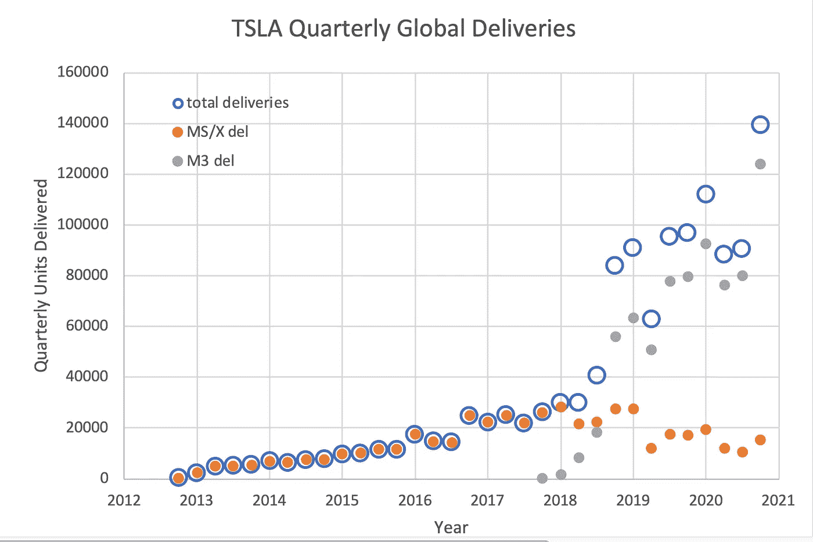
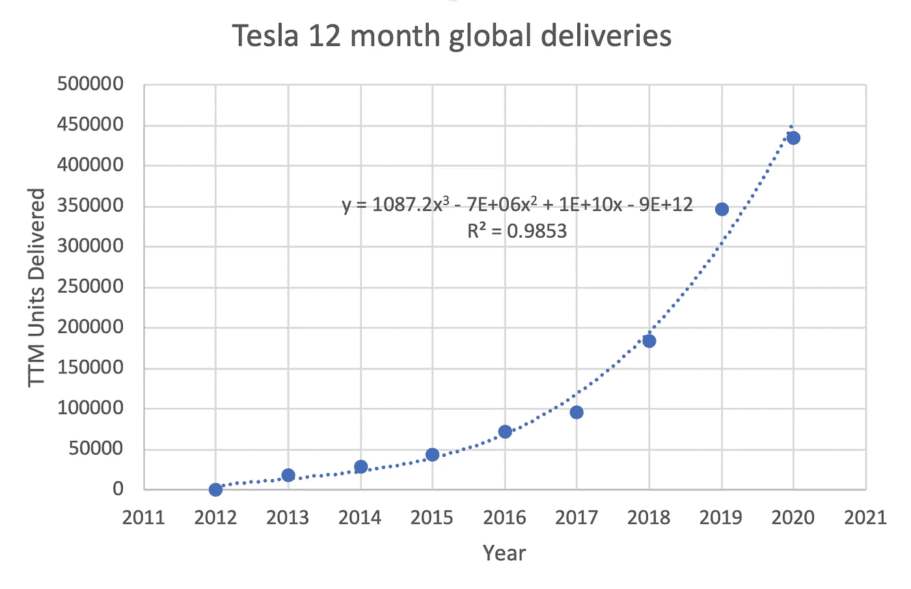
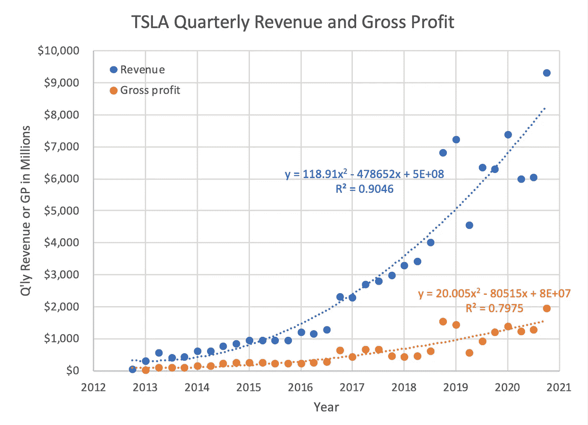
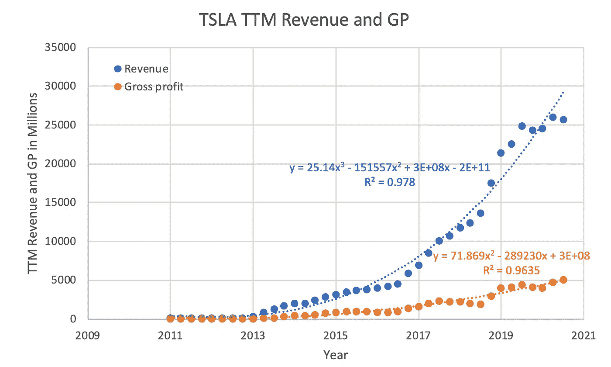
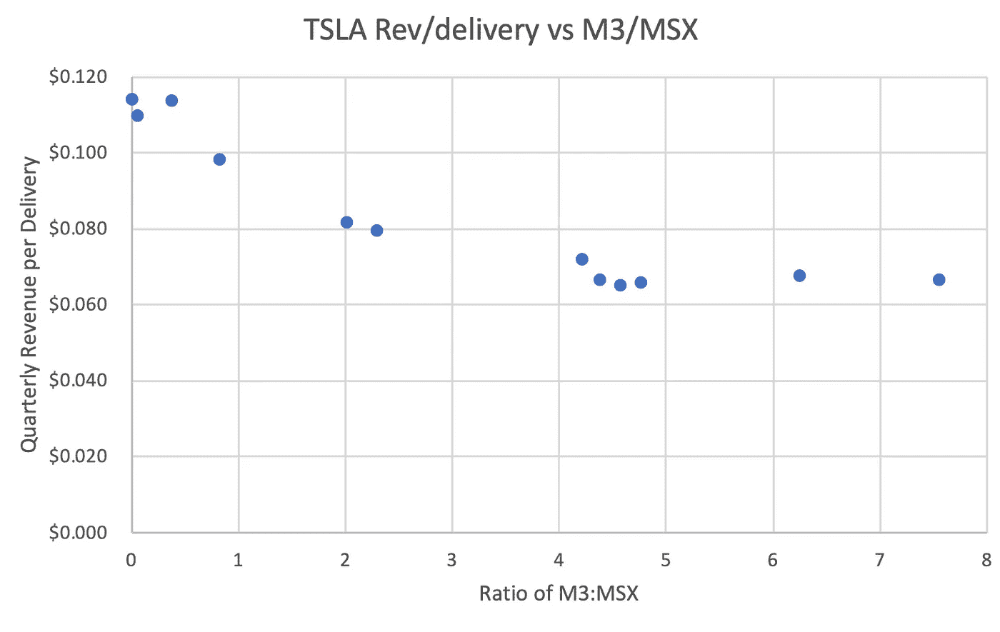
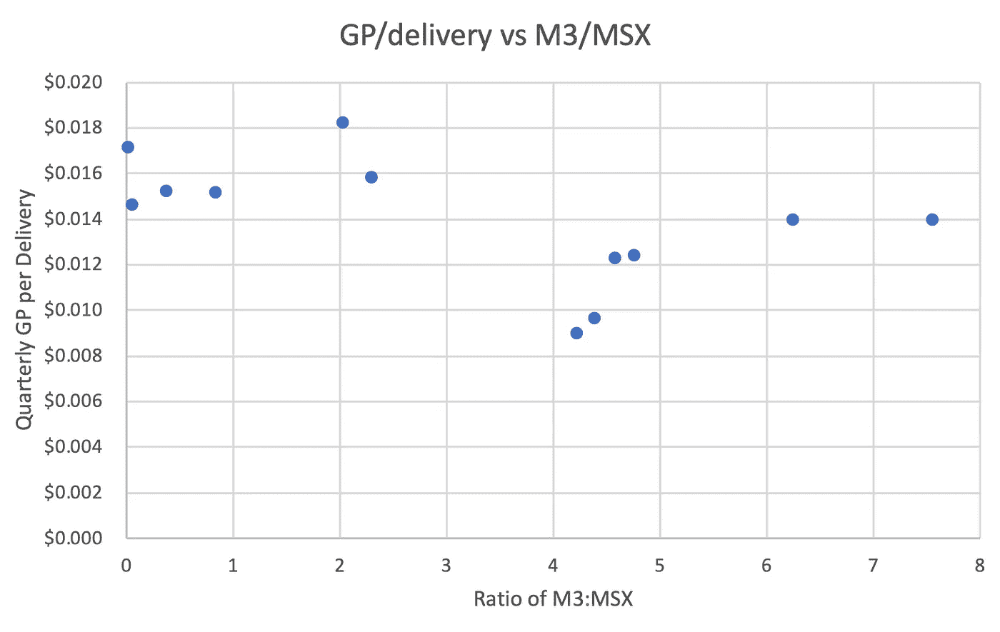

# 特斯拉的平流层发射继续进行

> 原文：<https://medium.datadriveninvestor.com/teslas-stratospheric-launch-continues-b0d242497cf2?source=collection_archive---------2----------------------->

## 回顾历史数据，展望 2020 年第 3 季度收益电话会议

Photo by [Martin Katler](https://unsplash.com/@martinkatler?utm_source=unsplash&utm_medium=referral&utm_content=creditCopyText) on [Unsplash](https://unsplash.com/s/photos/tesla-model-3?utm_source=unsplash&utm_medium=referral&utm_content=creditCopyText)

# **1。** **特斯拉数字的历史背景…**

特斯拉(股票代码 [TSLA](https://www.google.com/search?tbm=fin&ei=xqCFX8zSOtG1ggf11J8w&q=tsla&oq=tsla&gs_l=finance-immersive.3..81l3.1787.3395.0.3643.7.7.0.0.0.0.128.796.1j6.7.0..3..0...1.1.64.finance-immersive..0.7.793....0.9eo0vWi8b7w#scso=_y6CFX_PwNu-m_Qb0ipOYCw7:0) )计划于 10 月 21 日周三召开 2020 年第三季度财报电话会议。为了将这些数字放入上下文中，拥有您喜欢的数据的运行历史总是好的，我将在这里展示。

在我们看数字之前，我们应该问，特斯拉是什么？如果你看看他们卖什么，特斯拉目前主要是插电式电池供电电动汽车的制造商/销售商/服务商。

然而，如果你将新产品和未来产品视为特斯拉未来的先兆，那么他们正在开发各种各样的能源生产(太阳能)和存储(电池)产品，以及其他电池供电的运输方式，如卡车。

如果你看看特斯拉是如何做他们所做的事情的，他们是一家颠覆性技术公司的核心和灵魂，他们对僵化的汽车行业做的事情就像苹果对旧音乐行业做的事情，网飞对视频娱乐做的事情，亚马逊对零售做的事情，以及谷歌和脸书对媒体和广告做的事情。

我认为看待特斯拉最有效的方式是将其视为一个颠覆者和硅谷技术伦理的进化继承人。我相信/希望科技公司将从今天专注于“喜欢”按钮和编程内啡肽热潮，发展到特斯拉专注于极其艰苦的创新和技术工作——设计、制造和销售重要的物理/软件产品，以真正的方式改变我们的生活。

但其核心是，该公司试图通过让我们爱上惊人的电池供电的电动汽车，让我们摆脱对碳氢化合物燃料的依赖。

任何新公司要做的第一件事就是转移产品。这通常有一个多阶段的方法，其中一个全新的创新寻求早期采用者，并系统地通过他们越来越厌恶风险的客户群体的剩余人口。让我们看看特斯拉是如何销售他们的产品的。

# **2。** **特斯拉交付…**

特斯拉的不同寻常之处在于，他们将销售(确认收入)定义为车辆交付给客户的时间。因此，与大多数汽车制造商不同，特斯拉将交付的车辆视为一项关键指标。第一张图描绘了作为时间函数的季度交付总量。蓝色空心圆圈代表交付的车辆总数，我将 S 型和 X 型(MS/X)划分为橙色，将 3 型(M3)划分为浅灰色。

Illustration by ScienceDuuude

请注意，特斯拉销量的增长是在美国汽车销量大幅下降的背景下发生的。我们可以看到特斯拉交付的指数性质，以及 2017 年底才开始销售的 M3 极其陡峭的启动曲线。橙色的点代表 MS/X 的销售，似乎在 2018 年达到顶峰，并在下降。每当特斯拉的销量出现下滑时，许多人都会归咎于需求疲软。我认为 MS/X 销量连续三年下滑是几个因素造成的暂时后果。首先，几年来，特斯拉一直受到电池供应的限制，因为它增加了 M3 的销量，达到了电池生产的极限。第二，M3 优先于 MS/X。我认为，特斯拉牺牲了 MS/X 的生产，而不是减少 M3 的生产。

因为车辆交付量是一个很大的指标，而且在任何报告期内都有许多车辆在运输中，所以平滑数据的一种方法是绘制一个更长的报告期。在这里，我只是将季度交付改为年度交付(从 2020 年 Q2 的最后一个报告期开始，使用 12 个月的增量)。最佳拟合曲线显示了具有极高拟合优度测量 R2 的三阶多项式。这是一个仍在加速的火箭的曲线图。

Illustration by ScienceDuuude

# **3。** **特斯拉的收入和毛利…**

当然，衡量公司业绩的标准不是交付的产品，而是收入和利润。在下一张图中，我绘制了季度收入和总利润(特斯拉在其历史上的大部分时间里都没有盈利，所以我选择了一个至少说明最基本的盈利水平的指标，即收入减去销售成本)。

Illustration by ScienceDuuude

同样，我们可以看到特斯拉在总销售额和总利润方面的指数性质，两者都随着时间的推移而快速增长。尽管特斯拉销售的低价 M3 数量和比例越来越大，但销量还是出现了增长。

对于交付，我们通过绘制年度而不是季度周期非常有效地平滑了数据。另一种常见的方法是使用 12 个月(TTM)的跟踪数据，其中每个季度对包括报告期在内的前 4 个季度的指标(收入或 GP)进行求和。我们可以对这些起伏不定的财务数据进行 TTM 平滑，并在曲线拟合中显示出类似的改善，但无论哪种方式，指数增长率都是明确无误的。

Illustration by ScienceDuuude

# **4。** **多卖低价 M3s 的效果…**

我们避开了特斯拉大幅提高价格低得多的 M3 的销量，这款车的价格可能是 MS 或 MX 的一半到三分之一。人们自然会担心单位收入会减少，从而影响整体收入和利润。

我们可以做一些简单的计算，看看这是否是一个真正的问题。

随着越来越多的 M3 售出，M3 与 MS/X 的比率将会增加，这是我们希望观察的一个变量。假设是收入和利润将随着 M3:MSX 比率的增加而下降，这将使特斯拉处于危险之中。

同样，我们可以用季度总收入除以该季度的总交付量。如果更多的 m3 构成了总交付量，我们预计每次交付的收入将会减少。

如果我们绘制这两个比率，我们会看到什么？

Illustration by ScienceDuuude

最初，我们确实看到在 M3 坡道早期的每交付收入下降。当交付的 m3 相对于更贵的 MS/X 非常少时(X 轴上的比率小于 1)，我们看到每次交付的收入数字很高。y 轴是以百万计的收入，您可以看到每次交付的平均收入接近 MS 和 MX 的价格。

但随着时间的推移，我们看到了一件有趣的事情，特斯拉交付了越来越多的 M3，最近的报告期是 2020 年的 Q2，M3 与 MSX 的比率约为 7.5。每次交货的总收入已经持平。已经停止下降了。

这里会发生什么？

一种可能性是，特斯拉销售的最低装饰/最低价格的 MS 越来越少，而这些买家却在购买最高装饰/价格的 M3。

事实上，我们看到有报道称，特斯拉计划在 2019 年初停止销售价格最低的 MS 和 MX 汽车。到 2019 年 7 月，特斯拉已经停止了 MS/X 的标准系列版本。

我们在总利润(GP)方面看到了类似的情况，最初随着更多 m3 的销售，盈利能力略有下降。但是，最近，随着 m3 的销量远远超过 MS/X，每次交付的 GP 已经停滞不前，就像每次交付的收入一样。

Illustration by ScienceDuuude

许多积极的和可控的因素会导致毛利的稳定。增加产量意味着特斯拉可以要求原材料供应商收取更低的单位成本。直接人工也对 COGS(商品销售成本)有贡献，所以自动化程度的提高(更低的人工)会增加 GP。

据 electr ek 2020 年 5 月报道，特斯拉已经表现出继续投资额外自动化的意愿。

 [## 未来科技:Neuralink 更新|数据驱动的投资者

### 8 月 28 日，埃隆·马斯克提供了他的公司 Neuralink 的最新进展，该公司旨在创造植入式…

www.datadriveninvestor.com](https://www.datadriveninvestor.com/2020/09/03/futuristic-tech-neuralink-update/) 

# **5。** **展望不久的将来…**

特斯拉已经在这里报告了其 2020 年第三季度[的生产和交付数量。这些数字包含在上面的图表中。我们可以用目前计算出的数字做几个小的预测吗？](https://ir.tesla.com/press-release/tesla-q3-2020-vehicle-production-deliveries)

特斯拉只有在交付车辆时才报告收入。我们知道他们报告了 140，000 次交付。我们还计算了 Q2 2020 年每次递送的收入和 GP。将这些数字相乘，我们得出第三季度可能的汽车收入为 93.2 亿美元，汽车毛利为 19.6 亿美元。

然而，特斯拉不仅仅是一家汽车公司。他们还设计、制造、销售和服务能源产品:太阳能系统和电池储能系统。这些目前构成了特斯拉业务的一小部分，但增长迅速。由于能源部分的数字如此之小且易变，我宁愿不去计算第三季度的数字。

我认为，目前，特斯拉的能源业务太小，他们无法优先考虑它，继续平价 M3 和我的销售是他们目前的主要关注点。但我也相信特斯拉的能源部门将继续快速增长，有一天它可能会成为特斯拉汽车公司的尾巴。

# **6。** **险…**

任何公司都有风险。这些风险直接影响了美国投资者。因此，有必要对这些风险有一个直接的认识，并尽我们所能去理解它们。公司被要求列举他们在财务文件中看到的风险，比如特斯拉最近的 [10K](https://ir.tesla.com/_flysystem/s3/sec/000156459020004475/tsla-10k_20191231.html#ITEM_1A_RISK_FACTORS) 。

但我们也应该用自己的投资眼光，观察商业前景，看看我们自己能否识别风险，并评估公司是否准备好应对这些风险。以下是我对特斯拉一些风险的部分看法(特斯拉可能会也可能不会将这些风险纳入其财务披露)。

**战略风险**:在我们的注视下，特斯拉正在颠覆汽车行业。问题是，特斯拉本身是否会受到反过来的干扰。特斯拉的核心技术是储能锂离子电池。特斯拉聘请了一些世界上最好的电池专家，包括[杰夫·达恩教授](https://electrek.co/2019/08/05/tesla-battery-researcher-jeff-dahn-talks-100-kwh-cells-removing-cobalt/)和他在加拿大哈利法克斯的团队。特斯拉正在积极关注世界各地的电池发展，因此我认为中断的风险很小。另一个核心技术是还没有部署的，是全自动驾驶。特斯拉在这项技术上处于领先地位，尽管它的部署可能会比现在推迟更长时间。另一个战略风险是交通需求的人口变化。冠状病毒疫情改变了我们许多人的工作方式，在家工作成为许多人的常态。如果这一事件或类似事件极大地改变了我们购买新车的数量或频率，这可能会给特斯拉带来重大的战略风险。然而，这将是一个行业风险，特斯拉的汽车制造商竞争对手可能适应性更差，更不可能在如此重大的消费者转变中幸存下来。

**合规风险**:特斯拉已经因涉及其自动驾驶仪的事故受到政府监管机构的调查。迄今为止，特斯拉在所有这些调查中都毫发无损。我们可以预计，随着完全自动驾驶的发布，合规风险最初会增加，尽管特斯拉生成的安全数据的数量和质量可能会减轻这些风险。

**财务风险**:随着特斯拉财务健康和实力的增强，来自大型资本投资的风险以及贷款和其他义务的相对暴露程度已经降低。特斯拉不再是一家试图建立第一家工厂的创业公司。建造巨型工厂的过程现在似乎几乎标准化了。特斯拉是许多州和国家高度寻求的企业公民，这一事实通过提供赠款、低息贷款和特殊税收待遇减轻了这些金融风险。上海超级工厂的快速建成和上线，缓解了今年早些时候加州冠状病毒关闭带来的大部分金融风险。随着特斯拉在全球范围内的扩张，这将进一步减轻当地的财务风险，因为其他工厂可以部分容纳生产。特斯拉现在基本上是自给自足的，这是金融风险的一个主要缓解。

**运营风险**:冠状病毒疫情是运营风险和黑天鹅事件的典型例子。我非常肯定，没有一份公司风险声明包含疫情——我希望现在这种情况有所改变。如财务风险所述，全球分布的巨型工厂的开设减轻了一些本地运营风险，正如上海部分弥补了在美国的运营损失

# **7。** **埃隆·马斯克的愿景和目标……**

作为个人投资者，我们不想屏息关注每一次季度电话会议，并随着华尔街和大型机构投资者的节奏起舞。对我们这些散户投资者来说，一种冷静、缓慢行动、长期买入并持有的心态，从统计数据来看，是比一根古怪的扳机指更可靠的投资成功之路。

尽管挖掘你所投资的公司的季度数据很有趣，但正如一句老话所说，在矮树丛中短期摸索往往意味着只见树木不见森林。

对公司及其领导层保持一个宽广的视野，对经常变化很大的季度数据保持宽松的控制，对于投资和内心的平静来说更有成效。

那么，我们该如何看待特斯拉及其领导层呢？

我认为埃隆·马斯克是 21 世纪最具分裂性、颠覆性、创造性和成功的企业家之一——他要么给未来带来技术上的一步变革，要么带来无尽的警示故事和错失的机会。

所以我在 [Starlink 的文章介绍里说，这里](https://medium.com/predict/spacexs-starlink-high-speed-satellite-internet-to-your-home-soon-maybe-38d02eb0d072)。

特斯拉成立于 2003 年，自 2004 年以来，马斯克一直以这样或那样的形式掌舵。对特斯拉来说，与 Starlink 不同，我们目前正处于变革的中期。

马斯克对这一阶跃变化的愿景是“加快从开采和燃烧碳氢化合物经济向太阳能电力经济的转变。”

马斯克在 2006 年的“秘密总体规划”中首次阐述了特斯拉的目标，他将其概括为:

> 1.制造跑车
> 
> 2.用那笔钱造一辆买得起的车
> 
> 3.用这些钱去造一辆更便宜的车
> 
> 4.在做上述工作的同时，还提供零排放发电选择

那些已经大部分实现了(1。是跑车，2。是型号 S 和 X，3。是型号 3 和 Y 和 4。是他们正在进行的太阳能努力)。

2016 年，马斯克在这里发表了他的“总体规划，第二部分”，他总结为:

> 1.利用无缝集成的电池存储创造出令人惊叹的太阳能屋顶
> 
> 2.扩展电动汽车产品线，覆盖所有主要细分市场
> 
> 3.通过大规模车队学习，开发比手动安全 10 倍的自动驾驶能力
> 
> 4.当你不用的时候，让你的车为你赚钱

太阳能屋顶正在经历阵痛，这与 Model X 长达数年的时间表延伸和孵化没有什么不同。特斯拉的太阳能屋顶正在[出售和安装](https://electrek.co/2020/09/30/tesla-reduces-solar-roof-price-updates/)，尽管速度缓慢。家用和商用能源[储存做得更好](https://techcrunch.com/2020/07/22/teslas-megapack-powers-its-small-but-growing-energy-storage-business/)，增长迅速，也在世界各地高调安装。所以，第二部分的第一个目标是一项正在进行的工作。

特斯拉目前有四款量产车型，S、3、X、y，没错，马斯克是故意这么做的(我也是)。特斯拉还宣布了 Cybertruck、Semi 和一款经过改进的跑车。宣布的车辆显然已经停止，虽然[的 Semi](https://electrek.co/2020/09/01/tesla-semi-ecascadia-electric-truck-sales-increase-2025/) 正在获得一些知名度和高调的买家。在这三者中， [Cybertruck 拥有资源的优先权](https://www.cnet.com/roadshow/news/elon-musk-tesla-roadster-delay-cybertruck-semi-joe-rogan/)。同样，第二个目标是一项正在进行的工作。

自动驾驶也在经历漫长的酝酿，但特斯拉仍然遥遥领先，拥有更多相关数据(真实用户在真实天气条件下在真实道路上驾驶)来训练他们的人工智能。有了新的消息关于一个测试版测试与[选定的司机](https://electrek.co/2020/10/12/tesla-release-full-self-driving-beta-customers-next-week/)。在特斯拉的所有项目中，第三个目标可能具有最高的优先级和开发强度，但也可能比能源或汽车产品有更长的意想不到的酝酿时间，因为这是一个更困难的问题。

第四个目标高度依赖第三个目标，所以就自动驾驶而言，马斯克设想的汽车共享经济也是如此。

尽管如此，这些目标对它们所触及的行业和经济领域具有破坏性和变革性。商业或投资没有保证——但如果有一个地方可以投入可投资的金额(一个你可以忍受波动的金额)——我想不出比特斯拉更好的地方了。

# **8。** **披露……**

我很高兴拥有最古老的二手特斯拉 Model S(2013 款 MS P85)，也很高兴投资了特斯拉公司。

你可能也会喜欢以下最近的文章。这是对 SpaceX 的 Starlink 的介绍:

 [## SpaceX 的 Starlink

### 或许很快就能让高速卫星互联网进入您的家中！

medium.com](https://medium.com/predict/spacexs-starlink-high-speed-satellite-internet-to-your-home-soon-maybe-38d02eb0d072) 

这是 Starlink 最近 beta 测试的后续文章:

 [## 佤邦军方使用的 Starlink

### SpaceX 加快了 Starlink 互联网服务的 beta 测试，满足了军事紧急情况的严格要求…

medium.com](https://medium.com/predict/starlink-used-by-wa-states-military-bb2cd8aca83a) 

最后，这篇文章深刻地审视了网飞的文化:

 [## 网飞文化战争

### 好好看看一场有影响力但被误解的文化大革命

medium.com](https://medium.com/illumination-curated/reed-hastings-and-the-netflix-culture-wars-cfe8777e1a6a) 

感谢您的阅读，并请分享！

## 访问专家视图— [订阅 DDI 英特尔](https://datadriveninvestor.com/ddi-intel)