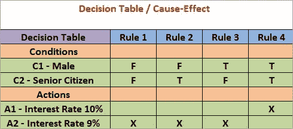
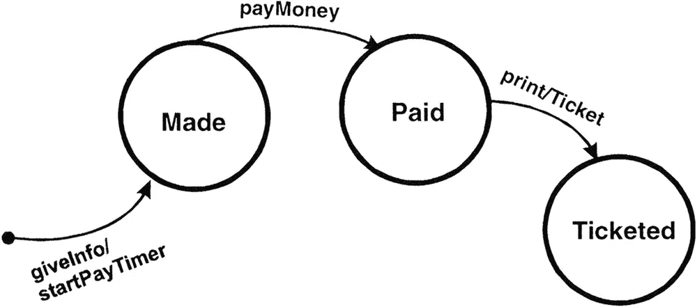

# 生产测试的测试设计技术。

> 原文：<https://medium.datadriveninvestor.com/test-design-techniques-for-productive-testing-764c8f6e01a7?source=collection_archive---------4----------------------->


Photo by [Alesia Kazantceva](https://unsplash.com/photos/XLm6-fPwK5Q)

est 设计是将一般的测试目标转化为有形的测试条件和测试用例的过程。

测试设计师应该建立一个流程，用尽可能少的检查来测试软件产品所有最重要的部分。在小团队中，测试设计师的工作往往落在一个普通测试人员的肩上。在大公司中，测试和测试设计的功能通常在专家之间划分得很清楚。

结果，测试链看起来像这样:

*   测试分析员分析产品，将它分解成组成部分，区分测试的优先级，并创建应用程序的逻辑图；
*   测试设计者根据从分析师那里得到的信息开始开发测试；
*   测试人员基于现成的测试用例执行直接测试。

**测试设计技巧:**

等效等级测试。

测试数据被划分为可接受值的特定类别。在每个类中，用任何测试数据值运行测试都会产生等效的结果。定义类之后，必须在每个类中至少运行一个测试。

让我们用一个具体的例子来证明这一点。假设我们正在测试一个 HR 模块，该模块根据候选人的年龄来决定是否录用他们。设置以下选择条件:

*   如果你在 0 到 16 岁之间，不要雇佣；
*   如果你的年龄在 16 岁到 18 岁之间，你只能兼职；
*   如果你的年龄在 18 岁到 55 岁之间，你可以全职工作；
*   如果你的年龄在 55 岁到 99 岁之间，不要雇佣。

是否值得检查每个值？测试每个条件的范围似乎更合理。

这使得我们只有 4 个阳性测试案例，而不是最初的 100 个(0–99)，例如:

*   10 —不雇佣；
*   17-雇佣兼职；
*   40-雇佣全职；
*   80 —不雇佣。

B 边界值测试。

这种技术基于这样一个事实，即任何软件产品的最弱点之一就是边界值的区域。首先，选择值的范围—通常是等价类。然后定义范围边界。在每个边界上创建 3 个测试用例:第一个检查边界的值，第二个值在边界下面，第三个值在边界上面。

让我们回到我们在等价类技巧中考虑的例子:

*   如果你在 0 到 16 岁之间，不要雇佣；
*   如果你的年龄在 16 岁到 18 岁之间，你只能兼职；
*   如果你的年龄在 18 岁到 55 岁之间，你可以全职工作；
*   如果你的年龄在 55 岁到 99 岁之间，不要雇佣。

让我们想象相应的代码是这样的:

```
If (applicantAge >= 0 && applicantAge <=16)
hireStatus="NO";
If (applicantAge >= 16 && applicantAge <=17)
hireStatus="PART";
If (applicantAge >= 18 && applicantAge <=54)
hireStatus="FULL";
If (applicantAge >= 55 && applicantAge <=99)
hireStatus="NO";
```

当您第一次评估需求范围的边界时，您会立即看到一个错误——范围重叠或重叠。事实上，条件应该写得不同:

*   如果你在 0 到 15 岁之间，不要雇佣；
*   如果你的年龄在 16 岁到 17 岁之间，你只能兼职；
*   如果你的年龄在 18 岁到 54 岁之间，你可以全职工作；
*   如果你的年龄在 55 岁到 99 岁之间，不要雇佣。

```
If (applicantAge >= 0 && applicantAge <=15)
hireStatus="NO";
If (applicantAge >= 16 && applicantAge <=17)
hireStatus="PART";
If (applicantAge >= 18 && applicantAge <=54)
hireStatus="FULL";
If (applicantAge >= 55 && applicantAge <=99)
hireStatus="NO";
```

因此，将为其编译测试的一组值将如下所示:

```
{-1, 0, 1}, {15, 16, 17}, {17, 18, 19}, {54, 55, 56}, {98, 99, 100}
```

D 精密工作台测试。

解决方案表是获取需求和描述应用程序功能的便利工具。表格对于描述应用程序的业务逻辑非常方便，它们可以作为创建测试用例的良好基础。

[](https://www.datadriveninvestor.com/2019/10/07/fossil-fuel-subsidies/) [## 化石燃料补贴:对环境有害&对经济不利！|数据驱动…

### 亚马逊最近的野火不仅是一场燃烧的不公正，而且对长期的社会经济和生态…

www.datadriveninvestor.com](https://www.datadriveninvestor.com/2019/10/07/fossil-fuel-subsidies/) 

决策表根据表征应用程序状态的系统条件来描述应用程序逻辑。每个表应该描述系统的一种状态。解决方案表模板如下:



状态转换测试。

系统根据对其执行的操作切换到一种或另一种状态。为了清楚起见，我们举一个经典的买票的例子:



*   **状态**(图中用圆圈表示)是应用程序等待一个或多个事件的状态。状态会记住之前收到的输入数据，并显示应用程序将如何响应收到的事件。事件可以导致状态改变和/或触发动作。
*   **转换**(图中用箭头表示)是在一个事件中发生的从一种状态到另一种状态的转换。
*   **事件**(由箭头上方的标签表示)是导致应用程序改变其状态的事情。可以通过应用程序本身的接口从应用程序外部接收事件。应用程序本身也可以生成事件(例如，“定时器到期”事件)。当事件发生时，应用程序可以改变(或不改变)状态并执行(或不执行)动作。事件可以有参数(例如，“工资”，“打印/票证”)。
*   **动作**(动作，在转换上方标签中的“/”后表示)通过改变状态(“打印票据”)启动。通常，动作会创建一些系统的输出/返回数据。动作发生在转换期间，状态本身是被动的。
*   **入口点**用黑色圆圈表示。

空中测试。

结对测试方法是基于下面的想法:绝大多数的错误是通过检查一个参数或者两个参数的组合来检测的。由三个或更多参数的组合引起的误差通常不太严重。

假设我们有一个依赖于几个输入参数的系统。是的，我们可以检查这些参数的所有可能的组合。但是即使对于 10 个参数中的每一个都只有两个值(开/关)的情况，我们也得到了 210 = 1024 个组合！使用成对测试的方法，我们不测试输入参数的所有可能组合，而是创建测试集，使得每个参数值与其他测试参数的每个值至少组合一次。因此，该方法显著减少了测试次数，从而减少了测试时间。

但是，该方法的重点不是遍历所有可能的参数对，而是选择能够以最少的测试次数提供最有效验证的参数对。

探索性测试。

探索性测试是一种软件测试方法，通常被描述为同时学习、测试设计和执行。它关注于发现，并依靠单个测试人员的指导来发现其他测试范围内不容易发现的缺陷。

正如众所周知的定义所说，编程是思考，而不是打字。那么我们为什么需要测试设计师呢？如果可以用它来执行许多额外的检查，为什么还要花时间在分析和设计上呢？

上面的例子表明，使用设计可以显著地减少测试的数量，并且可以关注功能中最脆弱和最重要的部分。

如果在线商店中产品的支付机制不能正常工作，那么授权表单的全面测试覆盖有什么意义呢？毕竟，当测试人员用 100 个测试检查 100 个值时，测试设计人员会想出如何在 10 个测试中检查 1000 个值。因此，花费在测试设计上的努力将随着测试执行的质量而得到回报。

## 获得专家观点— [订阅 DDI 英特尔](https://datadriveninvestor.com/ddi-intel)