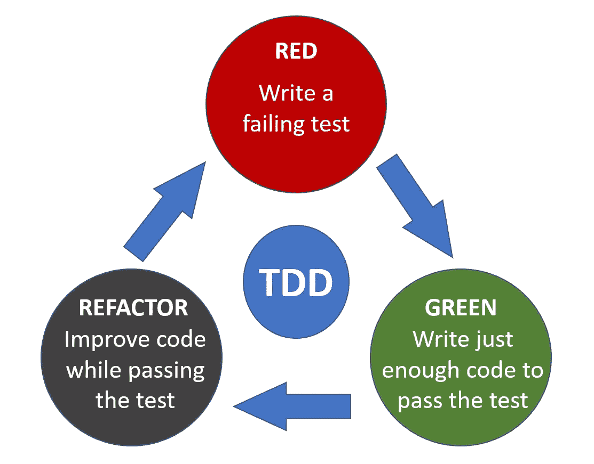

# 测试驱动开发:非常简短的介绍

> 原文：<https://medium.datadriveninvestor.com/test-driven-development-a-very-short-introduction-1edfb86e0d02?source=collection_archive---------8----------------------->

## TDD 不是关于测试的


Photo by [David Travis](https://unsplash.com/@dtravisphd?utm_source=medium&utm_medium=referral) on [Unsplash](https://unsplash.com?utm_source=medium&utm_medium=referral)

测试驱动开发(也称为 TDD)是我们接近设计的方式。这与测试无关。它是迫使我们在编写代码之前考虑实现和代码需要做什么的方法。

> 任何傻瓜都能写出计算机能理解的代码。优秀的程序员编写人类能够理解的代码。— *马丁·福勒*

当我第一次读到 TDD 的时候，我非常惊讶。我们应该在实现之前编写测试用例。此外，他们应该测试行为，而不是执行原子操作。所有的测试用例都会自动运行并生成报告。我做过 TDD，我相信它。

# TDD 的历史

## 以前

公元前 12000 年:这位德高望重的人拿着一块生肉，向他的穴居同伴描述了生火的过程，设定了他们的期望，并为他自己的任务开出了处方。他后来拿在手里的那块烧焦的肉被广泛认为是第一个通过测试的案例。

[](https://www.datadriveninvestor.com/2020/02/26/surviving-in-a-digital-age-of-instability/) [## 在不稳定的数字时代生存|数据驱动的投资者

### 如果你是一名计算机科学家，你可能已经注意到新的框架不断出现。编程…

www.datadriveninvestor.com](https://www.datadriveninvestor.com/2020/02/26/surviving-in-a-digital-age-of-instability/) 

1959 年到 1963 年:水星太空计划的程序员在编写穿孔卡片时使用了一种 TDD 形式。

## 经典 TDD

一般来说，TDD 的现代重新发现归功于 Kent Beck，他也是极限编程的创始人。正是通过极限编程和敏捷软件开发运动，TDD 开始在软件开发社区中被广泛接受。

> TDD 最初的描述是在一本关于编程的古书里。

据说 Kent Beck 重新发现了 TDD，因为 TDD 的原型可以追溯到 20 世纪 60 年代计算的早期。

*   1994 年:KentBeck 在 1994 年编写了 SUnit 测试框架的第一个版本。
*   1995 年 10 月:1995 年 10 月，在奥斯汀的 OopsLa，肯特为沃德坎宁安演示 TDD。

## 在...之后

有很多关于 TDD 的书籍和文章出版。

*   1999–07–08:重构:改进现有代码的设计。
*   1999-12:第一个 TDD tutorial⁵.
*   2000 年 8 月 16 日:由 ObjectMentor 发起的 JUnit.org 网站。
*   2006 年:丹·诺斯的博客文章:介绍 BDD⁶.
*   2007–07:IEEE 软件测试驱动开发特刊。

而一切都还在继续，直到现在。

# 我们为什么要关心 TDD？

Kent Beck 在他的 book⁴.中指出测试驱动开发的目标是“T0”但事实上，如果您可能已经面临了至少一个(如果不是更多的话)以下的痛苦、问题或不成功交付的原因，那么您应该关心 TDD。

*   您的大多数测试都是手动的。
*   维护成本太高。
*   上市时间太长。
*   文档永远不是最新的。

请记住，TDD 不会神奇地解决所有这些问题。相反，它让我们走上了解决问题的道路。

# TDD 有什么规律？

TDD 有三个法则:红色、绿色和重构。遵循它们，直到你在 TDD 中获得足够的经验，或者直到你有足够的信心打破它们。

## 法则 1:不允许你写任何产品代码，除非是为了通过失败的单元测试

这条规则确保了产品代码只作为实现特定行为的需要的结果而产生，由一个或多个单元测试来表示。这条规则增加了我们对实施的信心。

## 法则 2:不允许你写任何超过足以失败的单元测试；编译失败就是失败

从编写一个失败的单元测试开始。我们不想事先编写所有的测试，因为有时实现会“暗示”一个我们以前没有预想到的测试。

## 法则 3:除了足以通过一个失败的单元测试之外，你不允许写更多的产品代码

一旦我们通过了测试，我们就不再写任何产品代码，直到我们有一个失败的测试。原因见上述规则。

这些规则在下图中显示为 TDD 的周期。



The 3 laws of TDD

# 在井字游戏中实现 TDD 的一个简单例子

**井字游戏**

小孩子最常玩井字游戏。游戏规则相当简单。这是一个纸笔游戏，由 X 和 O 两个玩家轮流在一个 3x3 的格子中标记空间。成功地在水平、垂直或对角线上放置三个标记的玩家赢得游戏。


a simple tic-tac-toe board

## **本例中的要求**

我们定义了边界以及什么构成了一件作品的无效放置。我们可以将这个需求分成三个测试。

*   当一块被放置在 x 轴之外的任何地方时，就会抛出 RuntimeException。
*   当一块被放置在 y 轴之外的任何地方时，就会抛出 RuntimeException。
*   当一块被放置在一个被占用的空间上时，就会抛出 RuntimeException。

## **为此需求写一个周期的 TDD**

第一步:写一个测试。我们定义当调用 game.play(5，2)方法时，RuntimeException 是预期的。

```
import org.junit.Before;
import org.junit.Rule;
import org.junit.Test;
import org.junit.rules.ExpectedException;

public class TicTacToeSpec {
  @Rule
  public ExpectedException exception = ExpectedException.none();
  private TicTacToe game;

  @Before
  public final void before() {
    game = new TicTacToe()
  }

  @Test
  public void whenXOutsideBoardThenRuntimeException() {
    exception.expect(RuntimeException.class);
    game.play(5, 2)
  }
}
```

步骤 2:运行所有测试。它应该会失败，因为 play 方法不存在。

第三步:编写实现代码。我们要做的就是创建 play 方法，确保它在 x 参数小于 1 或大于 3(棋盘为 3x3)时抛出 RuntimeException。

```
public class TicTacToe {
  public void play(int x, int y) {
    if (x < 1 || x > 3) {
      throw new RuntimeException("X is outside board");
    }
  }
}
```

如您所见，这段代码不包含任何其他内容，只是通过测试所需的最低要求。

步骤 4:再次运行所有测试。它应该是成功的，因为与该测试相对应的代码已经完全实现。

很简单，对吧？

# 资源

## 网

[1][http://shebanator . com/2007/08/21/a-brief-history-of-test-frameworks/](http://shebanator.com/2007/08/21/a-brief-history-of-test-frameworks/)

[2]沃德坎宁安。[http://wiki.c2.com/?WardCunningham](http://wiki.c2.com/?WardCunningham)

【http://wiki.c2.com/?ObjectMentor 

[6]http://dannorth.net/introducing-bdd

## **书籍**

[3]马丁福勒。*重构:改进现有代码的设计*。1999 年 6 月中旬由爱迪生-韦斯利出版公司出版。

[4]肯特·贝克。 [*测试驱动开发:通过实例*](https://www.goodreads.com/book/show/387190.Test_Driven_Development) *。*由 Addison-Wesley Professional 于 2002 年出版。