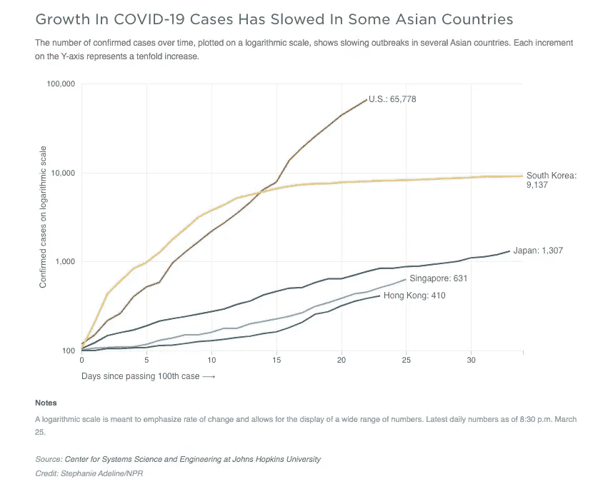
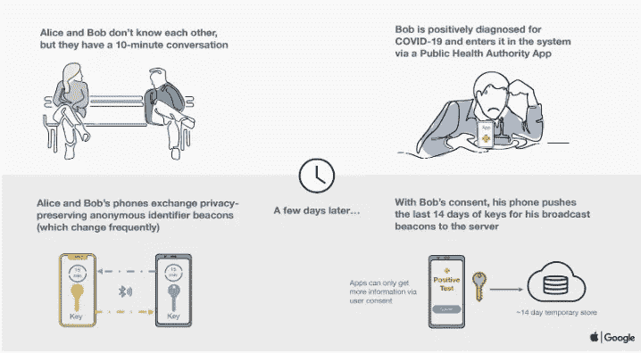
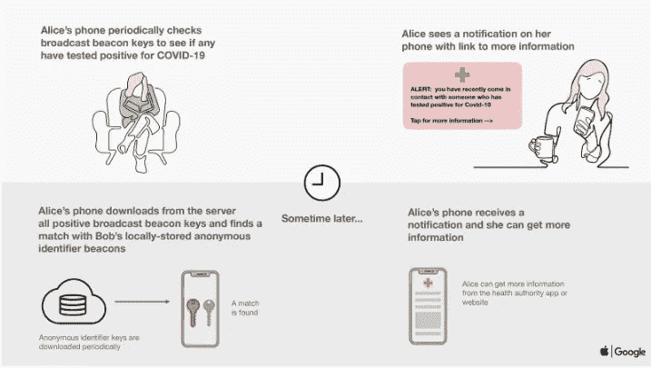

# 三个国家，对新冠肺炎的三种反应

> 原文：<https://medium.datadriveninvestor.com/testing-contact-tracing-and-the-economy-are-three-sides-of-the-same-coronavirus-triangle-3bf0030358be?source=collection_archive---------14----------------------->

> 探索三个国家——印度、美国和南韩——对冠状病毒疫情的反应的案例研究

Source: Jorg Greuel/Getty Images

测试、接触者追踪和重开经济是冠状病毒三角的三个顶点。全球人口中有一定比例的人是无症状冠状病毒携带者，也就是说，一个人可能被感染并检测为阳性，但不会表现出任何症状。这就是冠状病毒测试具有挑战性的原因；不可能准确地确定要测试谁。在美国，严重缺乏测试和必要的设备。

如果现在没有积极的测试，很可能这个国家将会看到第二次和第三次病毒传播浪潮，可能会比第一次浪潮影响更多的人。在这些浪潮中，我们将处于与现在相似的位置，面临另一系列的关闭，导致更大的经济损失。

 [## 冠状病毒；惊慌失措；字里行间的 z |数据驱动的投资者

### 围绕冠状病毒的话题；更准确地说，新冠肺炎几乎占据了整个新闻预报的头条…

www.datadriveninvestor.com](https://www.datadriveninvestor.com/2020/03/23/coronavirus-a-to-panic-z-between-the-lines/) 

劳动力由个人和企业组成，是任何国家经济的支柱。正如《纽约时报》所解释的那样，资本主义经济是在永动机的基础上运行的。我们购买我们想要和需要的物品，作为交换，我们把钱给生产该物品的人，这些人反过来用这些钱购买他们想要和需要的物品。这种循环还在继续，由于产业是相互关联的，一个产业的崩溃会影响到其他产业。经济需要恢复正常，这样人们才能生存和繁荣。

如果经济过早开放，我们将看到感染率飙升，导致医疗系统不堪重负。卫生专家警告说，随着广泛的检测，该国需要一个强大的程序来追踪感染者和所有他们可能传播病毒的人。根据联邦疾病控制和预防中心(CDC)的数据，在美国每天只有 120，000 个样本被检测。专家说，为了恢复某种程度上的经济常态，每天必须进行数百万次测试。

虽然制药公司努力生产所需的检测试剂盒和设备，但接触者追踪有助于控制感染率。接触追踪是追踪和隔离任何可能接触过冠状病毒检测呈阳性的人的过程。如果我们能够确定受感染者的位置以及与他们接触过的人，就有可能绘制出病毒在社区中的传播图，并切断进一步的传播。

接触者追踪不能有效地像现在这样手工完成，因为追踪一个病人可能需要几个小时甚至几天[3]。利用技术的力量来联系 trace 是负担得起的，实用的，而且不那么费力。印度、美国和南朝鲜对疫情采取了不同的态度；本文将讨论他们独特的策略，以及他们如何利用技术来联系 trace。

印度
世界上许多人认为印度对待新冠肺炎疫情的方式过于严厉。密集的人口很容易使其卫生系统不堪重负，除了实施为期 6 周的全国封锁和吸收由此带来的经济痛苦之外，别无选择。封锁减缓了病毒的传播，给这个国家带来了准备医疗系统的时间。然而，13 亿人口确实允许人民的力量:有人力联系追踪者和警察来实施封锁。

*印度的接触者追踪* 印度的接触者追踪策略涉及一个巨大的监测网络，即综合疾病监测计划(IDSP)，该计划关注城市和农村地区的新冠肺炎病例[4]。在受感染地区，设立了一个隔离区，社会工作者挨家挨户检测阳性病例。受感染的人被迅速送往医院和隔离病房。

除了 IDSP 之外，某些国家正在采用策略来解决接触者追踪问题。喀拉拉邦正在获取电话记录，以调查受影响人群的接触史。在泰米尔纳德邦，卫生工作者正在挨家挨户地监测和检测出现流感样疾病的人。

印度还推出了一款智能手机应用 Aarogya Setu，它使用蓝牙和位置数据来提醒用户可能与病毒检测呈阳性的人有接触。印度有效地利用其现有的中央法律、充足的人力和信息平台来通知其公民并遏制病毒的传播。

**美国** 美国的疫情战略比其他许多国家要宽松得多。联邦政府没有发布全国范围的封锁，各州州长实施了全州或部分州的居家命令。[5]美国有几个州依赖白宫对社交距离的指导。

各州和联邦政府发布的不一致和不同的指导方针似乎使控制病毒的传播具有挑战性。需要跨州的一套统一的遏制措施来处理已经影响到该国每个州的病毒。在这个国家，家庭订单和社会距离的结合为医院增加能力和实验室增加诊断测试赢得了时间。根据疾病预防控制中心主任罗伯特·雷德菲尔德的说法，美国应该引入“非常积极的”接触者追踪和检测，以有效应对疫情。

*美国的联系追踪* 美国联邦政府尚未批准任何形式的联系追踪技术，但各州都有相关举措。由麻省理工学院研究人员发起的“安全路径”项目利用匿名 GPS 和蓝牙数据向可能接触过感染者的用户发出警告。Safe Path、斯坦福大学的 Covid Watch 和西雅图的 CoEpi 正在共同努力，以实现一个可以跨不同计算平台和地区工作的技术标准[6]。

虽然与其他国家相比，美国对疫情的最初反应看起来较晚，但它一直在认真努力平衡经济和控制病毒的传播。由于其广阔的地理位置和国家一级的权力下放，我国正慢慢朝着正确的方向前进，通过就地安置住所、社会距离、接触者追踪、增加检测、更多设备和公众合作来遏制疾病的传播。居民的明确方向、政府的透明度和基于事实的行动将有助于美国对疫情的胜利。

**韩国** 韩国在没有封锁或经济后果的情况下控制了新冠肺炎疫情。这是通过迅速行动实现的，包括广泛检测、接触者追踪、患者隔离和公民支持。1 月下旬，在大量病例出现之前，韩国官员与研究机构和制药公司协商，在内部开发检测试剂盒[7]。

他们快速有效的反应是从之前的呼吸道病毒爆发 MERS 中吸取的教训，MERS 在 2015 年使该国陷入停滞。这种情况促使韩国官员更积极地回应新冠肺炎，也让当地居民更愿意接受侵入性的遏制措施。

*韩国的接触者追踪* 2015 年 MERS 爆发后，韩国修改了隐私法，在疫情期间，社会安全优先于个人隐私，允许政府窃听居民的电话。官员们使用安全摄像机镜头、信用卡记录、全球定位系统和蓝牙数据来追溯病人的移动。受感染个体的更新和时间表被发送到居民的手机上，强烈鼓励那些可能与受感染个体有过接触的人进行检测。被要求自我隔离的人下载另一个应用程序，当地监测团队确认被隔离者留在原地，违反者面临最高 2500 美元的罚款。

众所周知，南韩的疫情反应是世界上最好的。世界卫生组织秘书长谭德塞·阿达诺姆博士对他们的反应表示赞赏，并要求世界其他国家将在南朝鲜学到的经验应用到自己的国家。韩国通过广泛检测、快速隔离和迅速隔离疑似病例，限制了对其经济的影响。

*接触追踪*实际上*起作用吗？*
是的。下图显示了韩国(黄线)和美国(红线)在同一天，2020 年 1 月 20 日，记录了他们的第一个冠状病毒患者。从那天起，韩国的曲线迅速变平，而美国的曲线急剧上升。

韩国官员早期采用的检测和追踪策略被证明有效地拉平了曲线，大大降低了死亡率。韩国甚至在被世界卫生组织宣布为疫情之前就采取了严格的措施来控制病毒。他们的公民非常接受政府以追踪接触者的形式加强监视。早期干预对他们模型的成功至关重要。

Source: Center for Systems Science and Engineering at Johns Hopkins University

***谷歌和苹果合作追踪接触者*** 这两家科技巨头发布了一份联合声明，表示他们将与公共卫生官员合作，使用蓝牙数据追踪受影响个人的接触者。他们将对智能手机操作系统进行一系列更新，利用信号追踪潜在病例。

今年 5 月，他们预计将发布开发者工具或 API，允许官方联系人追踪应用在 iOS 和 Android 平台上运行。然后，两家公司将在各自的操作系统中内置支持蓝牙的联系人追踪功能。该应用程序将通知用户，如果他们遇到了受感染的个人，并提供后续步骤的信息。该公司制定了隐私政策，用户自愿加入该应用，任何共享数据都完全匿名。

感谢您的阅读！请在下面的评论中告诉我你的想法。

参考资料:

[1][https://www . nytimes . com/2020/03/17/upshot/coronavirus-economy-crisis-demand-shock . html](https://www.nytimes.com/2020/03/17/upshot/coronavirus-economy-crisis-demand-shock.html)

[2][https://www . CNBC . com/2020/04/16/coronavirus-testing-needs-to-be-wide-done-before-economy-reopens . html](https://www.cnbc.com/2020/04/16/coronavirus-testing-needs-to-be-widely-done-before-economy-reopens.html)

[3][https://www . us news . com/news/health iest-communities/articles/2020-04-17/contact-tracing-short-could-strain-efforts-efforts-重开经济](https://www.usnews.com/news/healthiest-communities/articles/2020-04-17/contact-tracing-shortage-could-strain-efforts-to-reopen-economy)

[https://www.nature.com/articles/d41586-020-01058-5](https://www.nature.com/articles/d41586-020-01058-5)

[5][https://www . Forbes . com/sites/Steve denning/2020/03/22/why-the-us-coronavirus-strategy-must-change/# 71 bfd defe 049](https://www.forbes.com/sites/stevedenning/2020/03/22/why-the-us-coronavirus-strategy-must-change/#71bfddefe049)

[6][https://www . kff . org/coronavirus-policy-watch/is-contact-tracing-getting-follow-attention-in-u-s-coronavirus-response/](https://www.kff.org/coronavirus-policy-watch/is-contact-tracing-getting-enough-attention-in-u-s-coronavirus-response/)

[7][https://www . NPR . org/sections/goatsandsoda/2020/03/26/821688981/how-south-Korea-wanted-in-the-outbreak-with-shut-down](https://www.npr.org/sections/goatsandsoda/2020/03/26/821688981/how-south-korea-reigned-in-the-outbreak-without-shutting-everything-down)

[8][https://www . nytimes . com/2020/03/23/world/Asia/coronavirus-south-Korea-flatten-curve . html](https://www.nytimes.com/2020/03/23/world/asia/coronavirus-south-korea-flatten-curve.html)

[9][https://www . apple . com/news room/2020/04/apple-and-Google-partner-on-新冠肺炎-contact-tracing-technology/](https://www.apple.com/newsroom/2020/04/apple-and-google-partner-on-covid-19-contact-tracing-technology/)