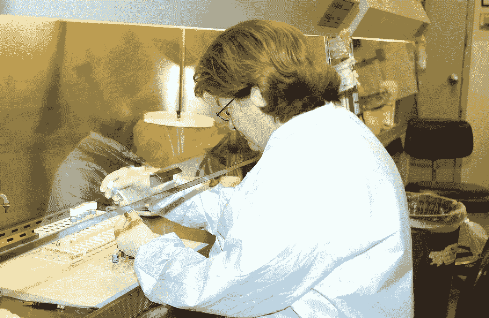
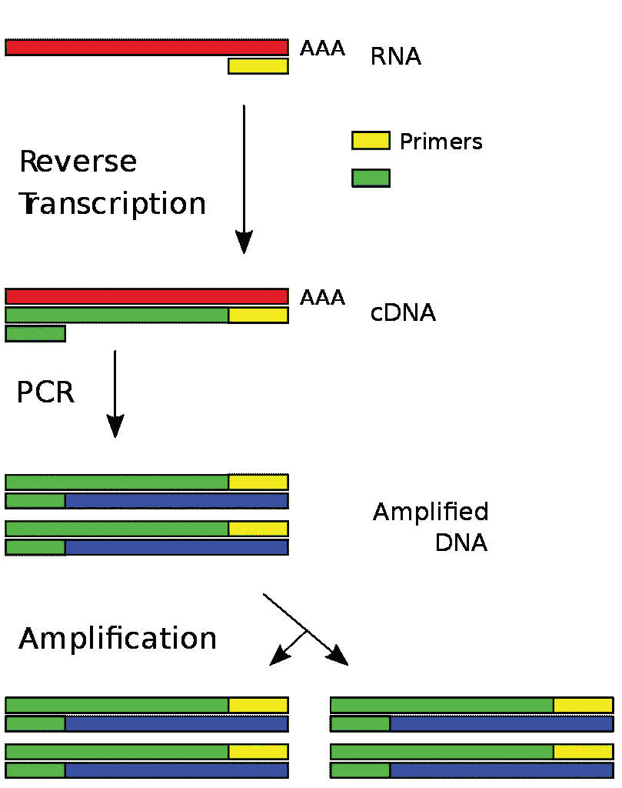
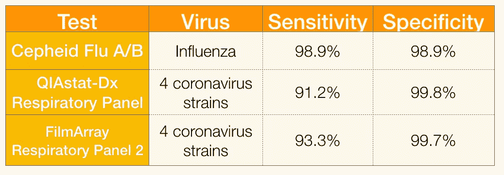
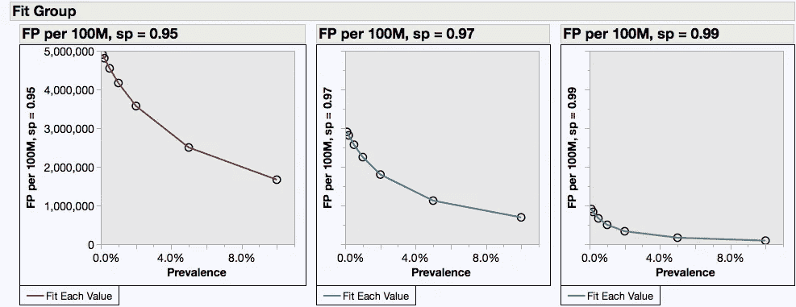

# 测试每个人的冠状病毒是一个可怕的想法

> 原文：<https://medium.datadriveninvestor.com/testing-everyone-for-coronavirus-is-a-terrible-idea-7c443b848668?source=collection_archive---------9----------------------->

至少现在是这样

A technician at the Air Force Institute for Operational Health virology laborator.y. Accurate testing doesn’t happen by magic. It requires training, skills, time and conscientious adherence to best practices. Picture from [Brooks lab helping detect avian flu](https://www.af.mil/News/Article-Display/Article/132796/brooks-lab-helping-detect-avian-flu/), US Air Force, public domain.

毫无疑问，需要对冠状病毒进行更多的检测。没有它，我们就无法治疗那些需要它的人，隔离那些接触过它的人，或者区分新冠肺炎病和其他呼吸道感染。

但是就像生活中的所有事情一样，好事也会有太多的时候。

呼吁进行广泛或普遍的测试——“任何想做测试的人都应该去做”——是基于两个错误的假设:

1.  测试完全准确，和/或
2.  测试错误没有不良后果

目前的测试有多准确？事实是我们不知道。在正常情况下，FDA 要求测试制造商在内部进行广泛的分析测试，并在诊所进行“真实世界”测试。显然，这不是正常的情况，我们不能等几个月来做这些研究。

但是我们可以通过与类似测试的比较来估计测试的准确性。检测病毒感染使用一种被称为 RT-PCR 的技术。RT 代表逆转录，一种将病毒 RNA 转化为 DNA 的反应。PCR 代表聚合酶链式反应，它可以将 DNA 放大数十亿倍，从而可以通过各种方式进行检测。

Schematic of RT-PCR process. Poshul / CC BY-SA ([https://creativecommons.org/licenses/by-sa/4.0](https://creativecommons.org/licenses/by-sa/4.0))

这些技术已经成熟。它们在 20 世纪 80 年代首次开发，并在 20 世纪 90 年代开始进行商业测试。从那时起，数百个 RT-PCR 测试已经被 FDA 批准。

我在 FDA 网站上查阅了一些最近批准的病毒性呼吸道疾病测试。我们在这里关心的数字是敏感性和特异性。敏感性是指携带病毒并在检测中得到阳性结果的人的百分比。特异性是指*没有*携带病毒且检测呈阴性的人的百分比。

The coronaviruses tested are older strains, not the current pandemic strain 2019-nCOV. Links to data: [Cepheid](http://www.accessdata.fda.gov/cdrh_docs/pdf18/K181289.pdf), [QIAstat](https://www.accessdata.fda.gov/cdrh_docs/pdf18/K183597.pdf), [FilmArray](https://www.accessdata.fda.gov/cdrh_docs/pdf17/K170604.pdf)

这些都是很好的测试。但是，对当前疫情病毒株的测试可能要糟糕得多。

上面引用的经批准的测试是以有序的方式开发的。它们是第二代、第三代或第四代(我没有检查)测试，已经从最初的版本进行了细化和改进。

虽然在现实世界中进行了测试，但这些测试数据来自顶级医院的评估。测试开发人员派他们的技术人员去培训实验室技术人员，并验证他们的熟练程度。临床试验经理对他们进行审计，以确保他们遵循正确的程序。实验室应该有运行 RT-PCT 测试的经验。他们几乎没有压力去尽快完成尽可能多的测试。测试人员应该遵循关于样本收集和避免交叉污染的最佳实践(对于像 PCR 这样的强大扩增技术来说，这是一个严重的问题)。简而言之，这些结果是在最佳条件下获得的。

当执行 2019-nCOV 测试时，我们离最佳情况还差得很远。误差必然会更高。至于高出多少，这纯粹是猜测，但至少要高出几个百分点。

那么测试错误的后果是什么呢？

假阴性结果并不意味着病人得不到治疗。如果他们有病毒性肺炎的症状，他们将得到几乎相同的治疗，不管病毒是流感、冠状病毒还是其他 20 种左右导致肺炎的病毒。更大的危险是接触预防措施可能会减少，增加疾病传播的风险。

最大的问题是假阳性，即那些被诊断患有新冠肺炎的人，即使他们没有患病。当测试高风险人群时，许多人患有该疾病，这是一个可管理的问题。如果你考验所有人，那就成了灾难。

截至 3 月 31 日，美国疾病预防控制中心报告了 16 万例病例。假设这个数字低了 5 倍，实际数字是 80 万。这相当于美国人口的 0.2%。

如果我们对 1 亿人进行检测，我们预计会发现 20 万个新病例。但是如果测试的特异性是 97%，我们也会有 3，000，000 个假阳性。如果是 95%，我们将有 500 万人被告知他们患有致命疾病，而他们实际上并没有。即使有 99%的特异性，我们也会有一百万个假阳性，每检测到一个真阳性就有五个假阳性。

False positives for every 100M people tested. Small changes in test performance have big consequences

至少，这些人会被严格隔离，与亲人隔绝，吓得魂不附体。他们中的许多人——无论有无症状——都需要护理，使医疗系统不堪重负，并从真正需要护理的病人那里分流资源。成千上万的人会无谓地死去。

对疾病流行率的估计会变成疯狂的高估。当局会加强和延长封锁，让经济陷入更大的混乱。

毫不夸张地说，如果不是整个社会的话，普遍测试会导致医疗系统的彻底崩溃。

原则上，测试每个人是个好主意。但是细节很重要。在我们知道我们有接近 100%特异性的测试之前，我们必须将测试限制在高风险/高患病率人群中。

Drew Smith 是 MicroPhage 的首席安全官，他开发了第一个 FDA 批准的快速检测方法，用于检测金黄色葡萄球菌血流感染并确定甲氧西林耐药性和敏感性。