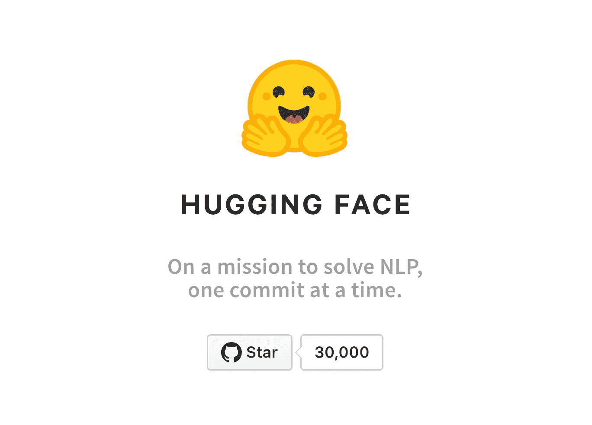
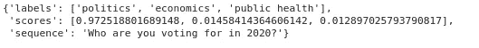
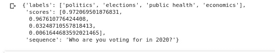

# 无标记数据的文本分类——拥抱脸管道

> 原文：<https://medium.datadriveninvestor.com/text-classification-with-no-labelled-data-huggingface-pipeline-d457c47f5cd?source=collection_archive---------4----------------------->



[Source](https://huggingface.co/)

没有任何进一步的介绍，让我们开始我们计划在这个故事中讨论的概念。

我们大多数人使用监督学习来处理大多数人工智能、人工智能用例。耶！所以我们知道带标签的数据集有多重要。我们经常努力为我们的用例获取适当的公共数据。这给我们带来很多麻烦。今天我正在为我的一个 NLP 用例搜索数据集，突然我在 linkedIn 上看到一个帖子，作者是 **Huggingface** 提到了那里的 **Zero Shot Pipeline** 。所以我想试一试，分享一些关于它的东西。


[Source](https://www.pinterest.com/chauphung583/hug-gif/)

首先要做的事。使用以下命令安装所需的拥抱面变压器。

```
!pip install git+https://github.com/huggingface/transformers.git
```

然后你必须导入并用`zero-shot-classification`定义`pipeline`

```
from transformers import pipeline
classifier = pipeline(“zero-shot-classification”)
```

使用零炮分类有两种方法

1.  直接使用
    你可以给一个`sequence`和`candidate labels`，然后管道给你一个带分数的输出，就像 **softmax 激活**一样，所有标签探针加起来都是 1，并且都是相关的。

```
sequence = "Who are you voting for in 2020?"
candidate_labels = ["politics", "public health", "economics"]
classifier(sequence, candidate_labels)
```

输出>>



[Source](https://colab.research.google.com/drive/1jocViLorbwWIkTXKwxCOV9HLTaDDgCaw?usp=sharing#scrollTo=ZvZeVb2h5RX0)

2.在这里使用`multiclass`属性
除了上面的情况，你必须给出一个属性`multi_class=True.`分数将是独立的，但是每个标签 prob 将保持概率规则(在 0 和 1 之间)

```
sequence = "Who are you voting for in 2020?"
candidate_labels = ["politics", "public health", "economics", "elections"]
classifier(sequence, candidate_labels, multi_class=True)
```

输出>>



[Source](https://colab.research.google.com/drive/1jocViLorbwWIkTXKwxCOV9HLTaDDgCaw?usp=sharing#scrollTo=ZvZeVb2h5RX0)

您可以查看更多示例，并从拥抱脸[笔记本](https://colab.research.google.com/drive/1jocViLorbwWIkTXKwxCOV9HLTaDDgCaw?usp=sharing#scrollTo=lLLeDT1r9-yQ)中获取笔记本。

## 这些东西是如何工作？

这个模型是在自然语言接口上训练的。其中模型接受两个序列，并检查它们是否矛盾或必然，或者都不矛盾或必然。利用该模型，以这样的方式处理零炮分类，即，将该序列视为 NLI 模型的一个序列，并将其中一个标签视为另一个序列。现在，模型检查哪个标签需要第一个和第二个序列。然后将其视为预测并返回输出。

> 来源—[https://colab . research . Google . com/drive/1 jocviliorbwiktxkwxcov 9 hltaddgcaw？USP = sharing # scroll to = IAR brae 781-_](https://colab.research.google.com/drive/1jocViLorbwWIkTXKwxCOV9HLTaDDgCaw?usp=sharing#scrollTo=iArbRAe781-_)
> 
> 注意，这里使用的情感分类只是作为一个说明性的例子。[拥抱脸部模型中枢](https://huggingface.co/models?filter=text-classification)有许多专门针对情感任务训练的模型，可以替代使用。