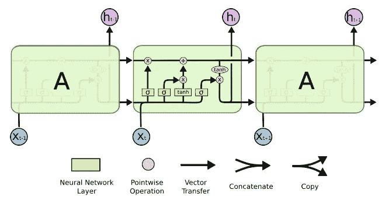
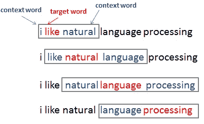
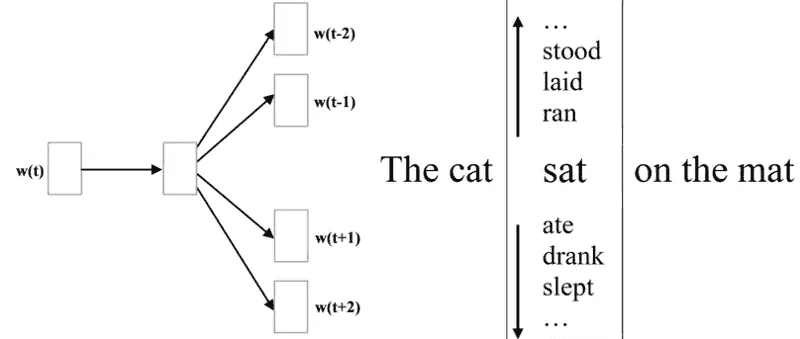

# 使用长短期记忆的文本预测

> 原文：<https://medium.datadriveninvestor.com/text-prediction-using-long-short-term-memory-a42fc66e22c3?source=collection_archive---------10----------------------->

最近，谷歌和脸书专注于文本预测的幕后机制。除了使用递归神经网络和长短期记忆网络的动机，还有两个 word2vec 模型生成单词嵌入也进行了讨论。

framework for LSTM

在探索深度学习的演变时，我举例说明了一些只在谷歌内部应用的领域，作为操场上的主要神童之一。所以，多亏了深度学习。

> word2vec 模型有两种开发方式: ***连续词包*** (CBOW)和**跳格**。

为了更详细地理解，首先，让我们看看 CBOW 和跳格模型。

# 连续跳格和词袋

就底层算法而言，这两个模型是相似的，只是在方法上略有不同:CBOW 从源上下文单词预测目标单词，而 skip-gram 则相反，从目标单词预测源上下文单词。简单地说，CBOW 模型使用周围的词来预测感兴趣的词，而 skip-gram 模型使用中心词来定义周围的词。

其他微小的差异包括在 skip-gram 架构中没有隐藏层，在 CBOW 中没有严格的词序规则。根据[这篇 TensorFlow 教程](https://www.tensorflow.org/tutorials/word2vec)，CBOW 对于较小的数据集更有用，而 skip-gram 对于较大的数据集更重要。

# 文本生成的实现步骤:

1.  **清洗输入数据**

**2。建筑词汇**

**3。将文本转换为单词向量**

**4。定义模型(编码器-解码器)**

**5。训练模型**

6。生成文本

上述一步一步的过程将引导我们达到文本预测的最终目标。C *学习数据涉及* spans 记号化、词条化和词干化。对于*将文本转换为单词向量*，我们需要考虑以下步骤:

*   所有的单词都必须包含在词汇表中。
*   设计每个单词到索引的唯一映射

因此，单词映射技术将输入文本转换成单词向量。

当*定义型号*时，必须满足以下前提条件:

*   使用单词嵌入将输入嵌入到 2D 数组中
*   使用包括 rnn 和 LSTMs 的解码器(具有编码器)来进行预测
*   在解码器输出之上应用一些完全连接的层，以生成实际的预测

应用 LSTM，在*训练中，模型*实现输入时间步长，预测下一个单词的类别。

> *你可以在* [***中找到每一步的源代码***](https://github.com/Sangramsingkayte/TextPrediction)

 [## 机器学习和人工智能如何改变电子商务的面貌？|数据驱动…

### 电子商务开发公司，现在，整合先进的客户体验到一个新的水平…

www.datadriveninvestor.com](https://www.datadriveninvestor.com/2020/11/19/how-machine-learning-and-artificial-intelligence-changing-the-face-of-ecommerce/) 

**访问专家视图—** [**订阅 DDI 英特尔**](https://datadriveninvestor.com/ddi-intel)