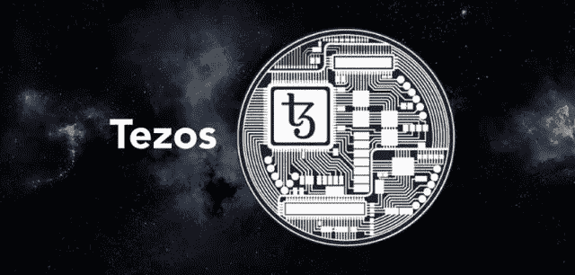

# Tezos 升级降低智能合同费用

> 原文：<https://medium.datadriveninvestor.com/tezos-upgrade-reduces-fees-for-smart-contracts-3c9c3d42a129?source=collection_archive---------10----------------------->

越来越多的加密货币提供了以太坊的严肃替代品。直到现在，以太坊区块链被认为是创建分散应用程序的首选。编程语言 Solidity 实现了智能合约的多功能应用。现在，Tezos 也可以通过最新的升级再次引起开发者的兴趣。

尤其是以太坊高昂的交易成本，对于很多应用来说都是一个问题。这些是一个项目可持续发展的决定性因素。此外，低可伸缩性仍然是一个风险因素，在某些情况下会严重影响速度。例如，当游戏 CryptoKitties 由于大量交易而显著降低网络速度时，就会出现这种情况。

自成立以来，Tezos 一直是市值最大的项目之一。然而，公司周围的关注大多是有限的。与其他区块链类似，在网络中使用不同的货币进行交易。然而，Tezos 的根本不同之处在于，它因其结构而保持动态，因此可以防止硬分叉。

# Tezos 作为一个分散金融平台(DeFi)？

最新的升级旨在吸引专注于分散融资(DeFi)的开发人员。通过将智能合同的费用降低 75%，Tezos 区块链上的新项目将得到推广。

此次升级名为 Delphi，于 2020 年 9 月 3 日首次提出，目前已完全集成。这是游牧实验室，转移，和加布里埃尔阿尔古尔的合并。该公司的目标是帮助个人为 Tezos 开发智能合同。据开发人员称，这是一次关键的升级，可以在 Tezos 区块链上启用特定的应用程序。其中包括游戏、分布式金融和收藏品。

Tezos 是第四代区块链平台，使用股权证明，支持智能合约和分布式应用。硬币 XTZ 在网络付费。

> “Tezos 是一个针对资产和应用的开源区块链协议，由全球验证者、研究人员和构建者社区提供支持。Tezos 协议是安全的、可更新的，并且是为长寿而设计的”。Tezos 基金会

与其他平台不同，Tezos 是动态构建的，因此是可变的。根据其声明，它是一个自我改变的区块链，使用链上机制。这允许提出、测试和激活协议升级，而不会使网络遭受硬分叉。

Delphi 升级优化了费用的计算。此外，管理人员的必要成本从 10，000 降低到 1，000 gas。同样，Tezos blocks 现在可以执行简单得多的 XTZ 交易和多资产转移。存储 Tezos 的成本也从每千字节 1 XTZ 降低到 0.25 XTZ。

基于 Delphi 升级的进一步协议变化可能很快就会出现。预计 Nomadin Labs 将在 12 月初提出这些建议。

# Tezos 赌注——创造被动收入

Tezos 通过首次发行硬币(ICO)筹集了超过 2.3 亿美元的资金。这是迄今为止最大的 ico 之一，Mainnet 在大约一年后的测试阶段完成。

Tezos 的特点之一是由所谓的面包师下注。他们在网络中生产积木并获得报酬。持有的硬币越多，被选为验证者的机会就越高。由于面包师只能参与特定数量的硬币，小数量的赌注是通过一个池。

由于 Tezos 是一个非常著名的项目，许多交易所也提供与硬币的股份。在币安，客户可以期待 7%的年回报率。此外，币安不扣除任何服务费用。

 [## 波尔卡多特:以太坊还做不到的，密码世界的新星应该能做到

### 无论是谁，只要定期查看全球最大加密货币的图表，就可能已经观察到一些正在崛起的…

medium.com](https://medium.com/coinmonks/polkadot-what-ethereum-cannot-yet-do-the-new-star-of-the-crypto-world-should-be-able-to-do-6a1b3fd934f2) 

# Tezos 作为以太坊的竞争对手？

到目前为止，有几个平台提供智能合约，包括 Cardano、Solana 和 NEO。然而，根据目前的技术水平，以太坊是迄今为止应用最多的。其中不乏成功的项目，这些项目本身已经成为其所在领域的市场领导者。这意味着以太坊区块链可以指望许多想要继续推进网络的支持者。以太坊联盟也是致力于区块链和新技术的最佳社区之一。

以太坊已经宣布将通过升级到以太坊 2.0 来解决之前的问题。然而，在全面实施之前可能需要几年时间，在此期间，竞争对手可能会成为新宠。由于 Tezos 专注于分散融资，新项目可能会越来越多地落户在他们的区块链。迄今为止，DeFi 一直被认为是 2020 年最重要的主题之一，并出现了无数创新。如果这种增长在未来几年持续下去，通过低费用和动态发展，Tezos 可能会有很好的机会。

> “我们相信，Tezos 将在全球范围内推动社会、政治和经济创新”。Tezos 基金会

然而，最终不可能只有一个供应商在所有生态系统中立足。由于许多区块链公司仍处于早期阶段，市场为其他参与者提供了很大的空间。因此，几个项目可以赢得比赛，并倡导不同的服务。例如，由于其结构，Tezos 可能是安全令牌产品的一个很好的替代方案。

 [## 新冠肺炎疫情之后，哪些行业可以从区块链技术中受益

### 新冠肺炎疫情以前所未有的方式冲击了全球经济。

l-wiesflecker.medium.com](https://l-wiesflecker.medium.com/which-industries-can-benefit-from-blockchain-technology-after-the-covid-19-pandemic-3d0bada0cfa8) 

# 结论:智能合同需要多样化

到目前为止，以太坊被认为是创建智能合约的首选平台。这些帮助了许多项目取得成功，并形成了许多其他加密货币的基础。然而，创造替代方案也是至关重要的，而且可能性仍然是多样的。不同的项目是通过各种智能合同平台开发的，这可以带来新的技术和应用。

Tezos 以前被认为是一个不起眼的项目，主要以跑马圈地著称。动态模型也从其他应用程序中脱颖而出，提供了许多优势。例如，虽然比特币的一些开发人员已经离职，现在正通过 hard fork 从事不同的项目，但 Tezos 的变化可以通过多种方式进行测试。

Delphi 的升级使得 Tezos 和 XTZ 硬币对开发者来说更加有趣。网络现在提供了提供高效智能合同的最佳条件。尤其是对于去中心化的财务，稳固的结构和低廉的费用至关重要。对于投资者来说，赌注也是一个有利可图的机会，即使是小额的被动收入。

我在每月的[时事通讯中分享了更多私密的想法，你可以在这里查看](https://mailchi.mp/bf8f8e8ed697/keep-in-touch-with-lukas)。请在评论中告诉我，并在各种社交媒体平台上加入我:

[推特](https://twitter.com/WiesfleckerL) ● [Instagram](https://www.instagram.com/lukaswiesflecker/) ● [脸书](https://www.facebook.com/lukaswiesfleckerr)●[Snapchat](https://www.snapchat.com/add/luggooo)●[LinkedIn](https://www.linkedin.com/in/lukas-wiesflecker-1b11251a5/)

无论你做什么，都要带着爱和激情去做！