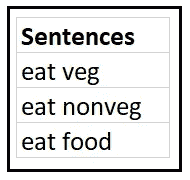
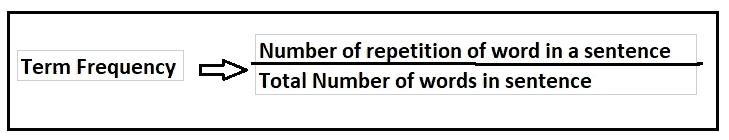
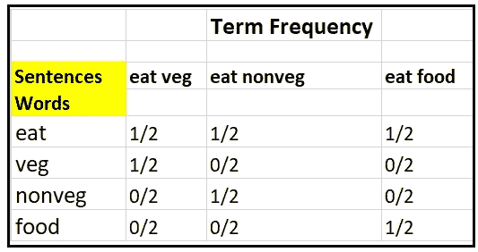
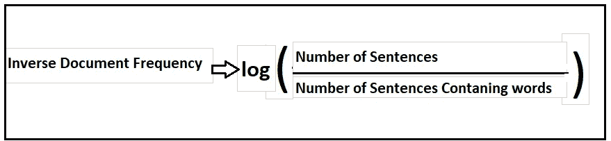
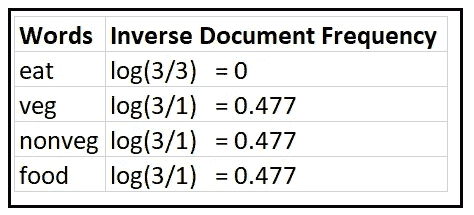
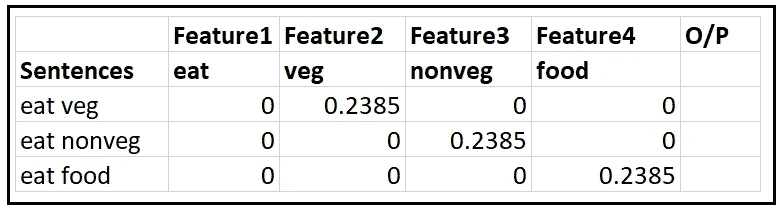
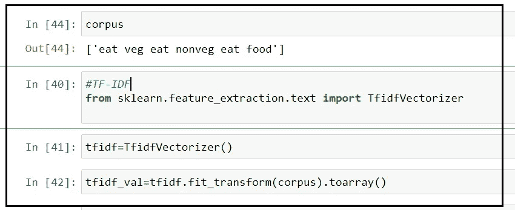

# 自然语言处理中的 TF-IDF

> 原文：<https://medium.datadriveninvestor.com/tf-idf-in-natural-language-processing-8db8ef4a7736?source=collection_archive---------0----------------------->

image:Kaggle

# **概述**

正如我们从我以前的文章[单词包](https://medium.com/@anjanimca2007/bag-of-words-in-natural-language-processing-fe996f9ae9d2)中所知，我们通过 BOW 将句子转换为单词向量，BOW 将单词转换为 0(当单词不在句子中时)或 1(当单词在句子中时)。

**单词包**只是创建了一组包含句子/语料库中**单词**出现次数的向量，但它不包含重要**单词的信息。**

因此，我们有另一种技术来实现的话，重要性被称为

> **TF-IDF** 意为**术语频率和逆文档频率，**是一个广泛用于信息检索(IR)或摘要的评分指标。 **TF** - **IDF** 意在反映一个术语在给定文档中的相关程度。

## **举例详细了解 TF-IDF:**

让我们通过我们在“单词袋”中看到的同一个例子来理解 TF-IDF

假设我们有下面这样的句子

1.他正在吃蔬菜

2.她正在吃水果

3.两个人都在吃食物

在应用数据清洗技术和应用停用词后，我们将得到下面的句子单词和计数。

**让我们看看计算词频(TF)的公式**

让我们计算句子的词频

**让我们看看计算逆文档频率(IDF)的公式**

**让我们计算句子中单词的逆文档频率(IDF)**

现在计算 TF-IDF，将上面生成的 TF 表乘以 IDF

经过简化，我们得到了下面的 TF * IDF 矩阵表

> 在这里，我们可以看到，在句子 1(吃蔬菜)中，单词“veg”被赋予了重要性，类似地，在句子 3(吃食物)中，单词“nonveg”被赋予了重要性，单词“food”被赋予了重要性，它具有某种形式的语义意义。
> 
> 单词“eat”不太重要，因为它经常出现在所有的句子中，可能有相同的意思，所以没有用。

现在想想我们只有三个句子，当我们有大量的段落和句子时，这将是多么有帮助。

所有输入特征将与 O/P(输出特征)一起提供给模型，模型将被训练，并且可以以矩阵形式获得所有具有值的重要单词。

**Python 代码，供参考。**使用的包是来自 **sklearn** 的**tfidf 矢量器**

**结论** : TF-IDF 是自然语言处理中的一种技术，用于将带有一些语义信息的词转换成向量，并对生僻词进行加权，用于各种 NLP 应用。还有其他先进的技术 **Word2Vec** 我将在我的下一篇文章中介绍，这些技术将具有语义和单词之间的关联关系。

请写下您的疑问和意见，并分享您的反馈。

希望你喜欢我的文章。请鼓掌👏(50 次)激励我继续写下去。

想要连接:

联系方式:【https://www.linkedin.com/in/anjani-kumar-9b969a39/ 

如果你喜欢我在 Medium 上的帖子，并希望我继续做这项工作，请考虑在 [**patreon**](https://www.patreon.com/anjanikumar) 上支持我