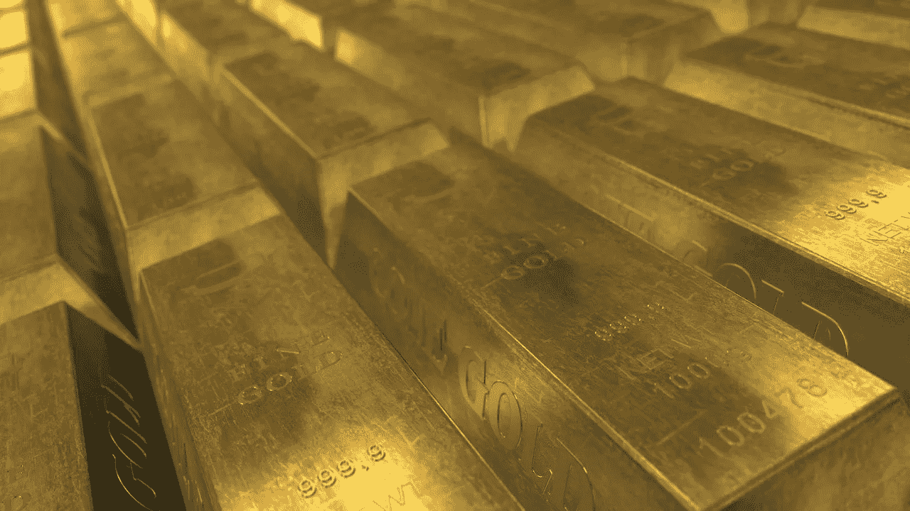
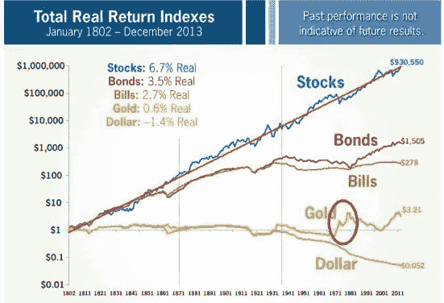
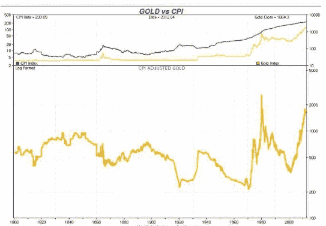
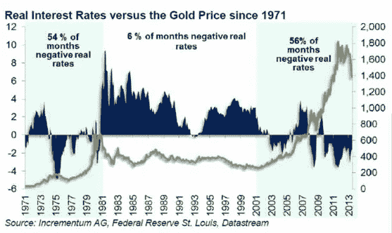
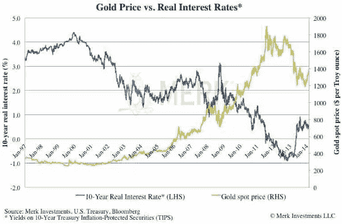
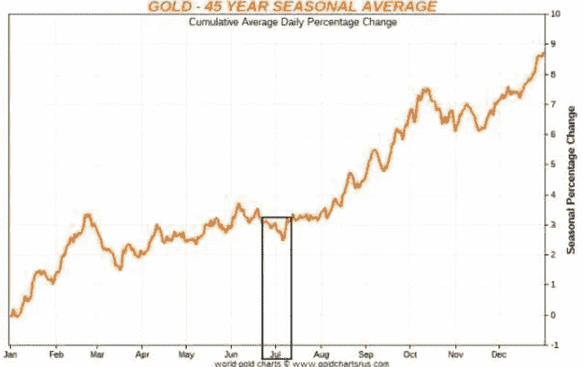
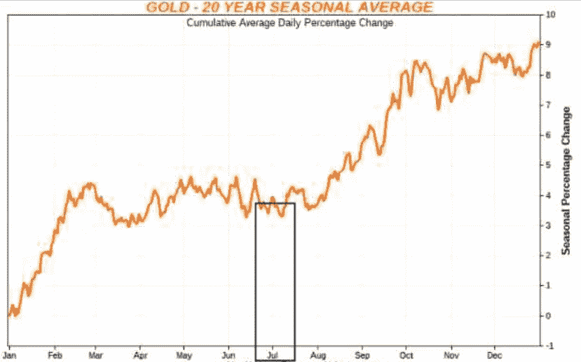
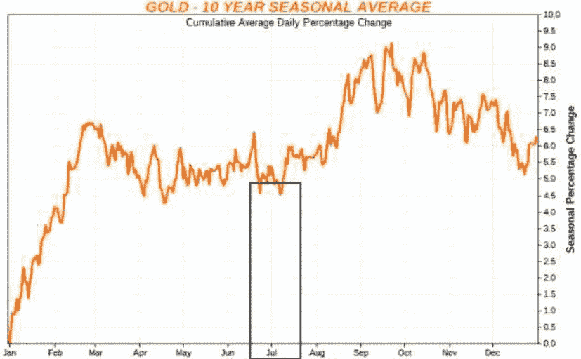
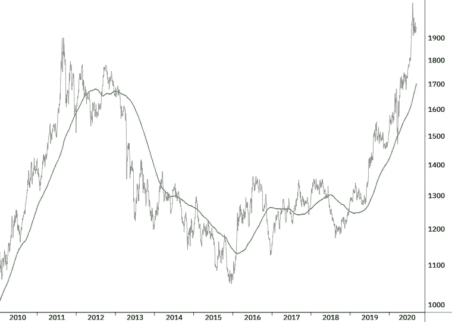

# 那影响金价！

> 原文：<https://medium.datadriveninvestor.com/that-affects-the-gold-price-b1adf6981fcc?source=collection_archive---------12----------------------->

(Picture from PublicDomainPictures on pixabay.com)

## 历史上的黄金

黄金在不同的时期，甚至是很长的时期里，发展得极其不同。这包含了准备黄金价格行为统计数据的风险，因为你自己的观点显然是有根据的。金融市场中的每个参与者都会发现自己的观点似乎得到了支持的阶段。例如，如果你看看 1968 年至 2012 年这段时期，黄金的表现好于一些股市指数。你只需要选择正确的时间框架。因此，让我们首先考虑下一张图中 200 年的超长时期:

Graphic 1: Stocks perform best over the long term (Source: [www.marrotaonmoney.com)](http://www.marrotaonmoney.com))

可以清楚地看到，考虑到通货膨胀，股票的实际回报是历史上最高的。从长期来看，黄金主要“仅仅”提供通胀保护，如下图所示。然而，这是以非常大的价格波动为代价的——这并不能完全导致纯粹的买入并持有黄金投资的最佳风险回报率。

Graphic 2: Investing in gold and inflation (Source: [www.sharelynx.com)](http://www.sharelynx.com))

## 黄金作为对冲危机、货币贬值和低实际利率的工具

金价上涨的两个主要原因，一方面是防范经济衰退等危机，另一方面是防范即将到来的货币贬值。如果通货膨胀或货币贬值还伴随着低利率环境，这就是金价上涨的最优环境。事实上，通胀会影响实际回报率。在所谓的实际利率下，名义利率会随着通货膨胀率而降低。实际利率越低，越倾向于下降，金价就越有可能上涨，因为在固定利率领域已经没有什么可赚的了。当实际利率为负时，情况更是如此。因此，黄金价格通常会上涨，特别是当实际回报下降或为负时，例如，目前美国就是这种情况。在那里，十年期政府债券的实际收益率约为负 1%(0.6%的收益率减去 1.6%的通胀率)。

Graphic 3: In phases of low or even negative real interest rates (highlighted in light blue), the gold price rises. The gold price struggles in phases of higher real interest rates (Source: Incrementum AG)

为此，HQ Trust 分析了自 1987 年以来低实际利率引发的危机在过去 11 年中金价的发展。在这些危机时期，黄金平均每年上涨 6.9%，而美国股市同期平均上涨 19.4%。与 10 年期美国政府债券一样，在实际收益率较低的危机时期或经济衰退的环境中，黄金总是一种非常好的分散投资工具。但那也不总是管用！1990 年和 2008 年的股市暴跌无法通过增加黄金得到最佳缓冲。相反:在 2008 年至 2009 年间，黄金损失了 33%的价值。不过，值得安慰的是，应该说这一损失仍然小于这一时期股票市场的价格损失。例外证实了规则。毕竟，自 1984 年以来，股票、黄金和债券同时崩盘的时间只有两个月，即 2008 年 9 月和 10 月。每当 10 年期美国债券的实际利率较低，因而低于 3%至 4%的关口，并趋于进一步下跌时，这迄今一直是金价上涨的良好温床。然而，市场参与者对未来通胀率将继续上升的担忧应该会伴随着这种情况。

 [## 完美的加密交易策略|数据驱动的投资者

### 如果你在交易游戏中已经有一段时间了，你可能听说过“支点”和“VWAP”前者听起来像…

www.datadriveninvestor.com](https://www.datadriveninvestor.com/2020/08/31/the-perfect-crypto-trading-strategy/) 

特别是在 1998 年至 2014 年期间，实际利率下降与黄金价格同步上涨之间的联系变得更加明显(见图 4)。利率下降导致股价上涨，利率上升导致股价下跌。如果十年期美国政府债券的实际利率水平同时低于 3%到 4 %,这种联系就更加明显。

Graphic 4: Gold and real interest from 1998 to 2014 (Source: [www.merkinvestments.com)](http://www.merkinvestments.com))

## 衰退阶段的黄金

总部位于 Liechenstein 的 Incrementum AG 定期对比股票市场，研究衰退阶段的金价走势。他们将美国自 1970 年以来的衰退阶段分为四个阶段:初步阶段一是衰退开始前大约一个季度。衰退开始于第二阶段，之后由统计机构公布；第三阶段是正式的衰退阶段，第四阶段标志着衰退的最后阶段。症状是股市在衰退的最后阶段复苏——也就是当隧道尽头的灯光再次亮起。另一方面，黄金从衰退的初步阶段增加到官方确定，因此成为股票熊市的最佳分散投资者。

## 黄金和美元

人们还应该注意黄金价格的发展与美元之间的联系；毕竟，黄金是以美元在全球范围内交易的。因此，欧元升值会让欧元投资者更加买得起黄金。如果美元升值，购买黄金会变得更加昂贵——需求会减少。

## 黄金价格的季节性观点

如果我们观察与黄金价格季节性相关的不同长度的时期，6 月/7 月期间的低点是一次又一次明显的。截至 2 月底，下半年总体形势有所好转，这也是显而易见的。如果已经解释过的影响黄金价格的其他因素也是积极的，你应该最迟在 6 月初建立适当的黄金头寸。

Graphic 5: Seasonal development of the gold price in US dollars over the past 45 years (Source: [www.goldchartsus.com)](http://www.goldchartsus.com))

Graphic 6: Seasonal development of the gold price in US dollars over the past 20 years (Source: [www.goldchartsus.com)](http://www.goldchartsus.com))

Graphic 7: Seasonal development of the gold price in US dollars over the past 10 years (Source: [www.goldchartsus.com)](http://www.goldchartsus.com))

## 简历

新出现的危机、衰退阶段、上升或高通胀率以及低或下降的利率大致上是影响黄金价格的最重要因素。所有这些因素反过来又相互影响。美元的走势和季节性是相当次要的影响因素。黄金最终是一种货币替代品，因此主要是防止货币贬值。作为股票熊市中的分散投资者，黄金通常非常有效，因为黄金和股票之间的相关性大多是负的。然而，从长期来看，黄金将无法跑赢股票。因此，它应该被视为整个投资组合的重要组成部分——尤其是考虑到政府债券在未来很难被视为避风港的事实。

## 务实执行

迄今为止，如果一个人特别仔细地观察十年期美国债券的实际利率低于 4%的阶段，他总是有很好的投资黄金的经历。在所有其他阶段，黄金都不会发挥作用。在务实实施的情况下，可以使用 200 日线策略来利用这些预先选择的低实际利率的盈利阶段，以便仅投资于黄金价格的上升趋势。下图很好地展示了该过程。自 2010 年以来，由于考虑到低实际利率，人们总是会投资；使用 200 日线策略的额外时机，上行阶段(2010 年和 2011 年以及 2018 年底以来)将得到很好的协调——不同经济阶段的时机，以便进入黄金的衰退阶段可以更好地匹配，这在实践中证明是相当困难的。

Graphic 8: Ounce of gold in US dollars (black) with a 200-day average (green). The 200-day line method yields good results in phases of low real interest rates (Source: own backtest)

英俊的约翰尼

**进入专家视角—** [**订阅 DDI 英特尔**](https://datadriveninvestor.com/ddi-intel)