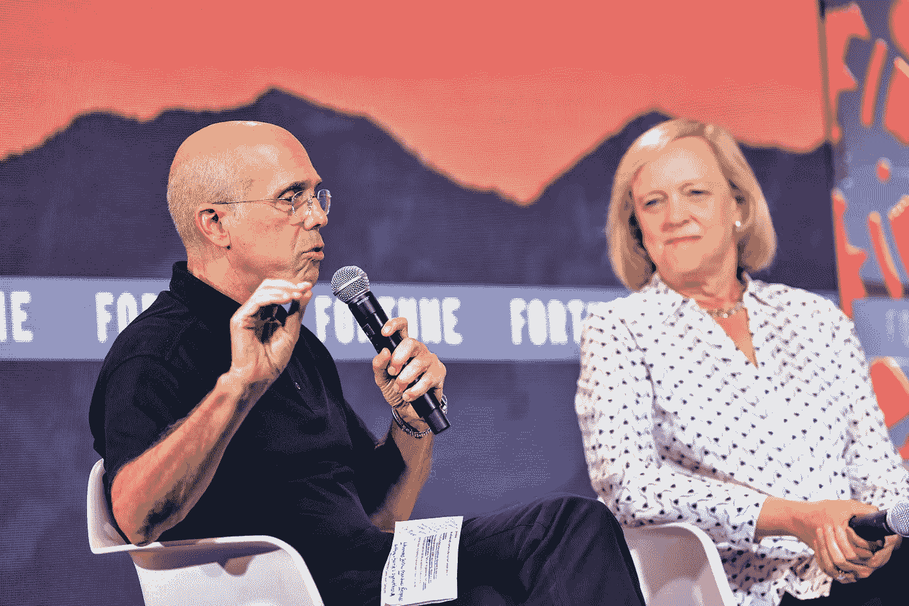

# 17.5 亿美元的 Quibi 失败应该提醒我们，金钱不是一切

> 原文：<https://medium.datadriveninvestor.com/the-1-75-billion-quibi-failure-should-remind-us-that-money-isnt-everything-5ab824f65ea5?source=collection_archive---------12----------------------->

## 一个非常短命的娱乐平台**Z 世代**从未想要

Photo by [John Fornander](https://unsplash.com/@johnfo?utm_source=medium&utm_medium=referral) on [Unsplash](https://unsplash.com?utm_source=medium&utm_medium=referral)

新闻上说了。在[媒体](https://medium.com/u/504c7870fdb6?source=post_page-----5ab824f65ea5--------------------------------)上也有。来自 Quibi 首席执行官梅格·惠特曼&创始人杰弗瑞·卡森伯格[的](https://medium.com/u/b2c2790459e4?source=post_page-----5ab824f65ea5--------------------------------)[公开信](https://quibi-hq.medium.com/an-open-letter-from-quibi-8af6b415377f)。戏剧性的结局，曾经被认为是下一个成功的流媒体平台，Quibi。

> *致员工、投资者和合作伙伴的公开信，他们相信 Quibi 并使这项业务成为可能—*

信的其余部分是对投资者、员工和合作伙伴的道歉。

# 什么是 Quibi？

Photo by [Mali Desha](https://unsplash.com/@malidesha?utm_source=medium&utm_medium=referral) on [Unsplash](https://unsplash.com?utm_source=medium&utm_medium=referral)

Quibi 是 Quick 和 Bites 的混搭，发音为“kwĭb-ee”是一个失败的想法。一个我们可以借鉴的想法。

这个想法背后的人是一个在娱乐界取得成功的人，这是许多人只能渴望的。杰弗瑞·卡森伯格将迪士尼变成了今天的发电站。

他大胆尝试只有皮克斯能与之匹敌的动画。他与史蒂文·斯皮尔伯格和戴维·格芬一起组建了 SKG 梦工厂，后来以数十亿美元的价格出售。杰夫对娱乐了如指掌。

梅格·惠特曼，她在易贝的成功使她成为白手起家的亿万富翁，后来，她成为惠普公司的首席执行官，并从此成为众所周知的科技巨星。她在 2010 年竞选加州州长失败。

> 关闭奎比，是股东们最光荣的选择。—梅格·惠特曼

# 奎比哪里出了问题？

Attribution: Photograph by [Stuart Isett](https://www.flickr.com/photos/125193258@N05/48303023092) for Fortune Magazine

这个想法是，Z 世代将把他们的时间花在移动设备上，观看故事片和节目，在几分钟内被消费掉。

取代传统的半小时或一小时的电视消费，娱乐节目将会很快出现。理论上看起来可能不错，但即使是脸书似乎也无法打破 Z 世代在线观看习惯的密码。

有一段时间，甚至 Youtube 也成为 z 世代的过时视频平台。通过保持免费服务，它找到了不同年龄层的人作为观众。

当 Z 世代想要的不仅仅是他们在社交媒体平台上观看的短片时，它是他们的中间娱乐来源。由于疫情，它得到了更多的关注，更多的人被迫在网上寻找娱乐。

社交媒体巨头脸书的用户习惯于在滚动订阅源时观看用户制作的视频。原因之一，为什么我们没有听说任何突破脸书制作的内容。脸书的人们做很多事情，滚动、发布更新、观看视频。

就连 Youtube 也不再是网飞的竞争对手。制作可以通过订阅销售的原创内容成本很高。只有迪士尼或 HBO 有电影目录，可以在他们的流媒体平台上找到新的观众。

Youtube 肯定对它最擅长的在线广告产生的数十亿美元感到满意。它还通过与内容创作者分享部分广告收入，激励任何人制作内容。有了疫情，我们在 Youtube 上看到了更多的内容创作者。

脸书和 Instagram 也是如此，没有人会像人们在网飞学会的那样去观看一部好的故事片。

抖音是一场不同的球赛，10 到 15 秒的视频可以像病毒一样传播，让某人出名。

同样，这些视频不同于 Quibi 为其流媒体平台设想的长格式娱乐或短格式娱乐。

Photo by [Briana Tozour](https://unsplash.com/@britozour?utm_source=medium&utm_medium=referral) on [Unsplash](https://unsplash.com?utm_source=medium&utm_medium=referral)

Quibi 错算的是他们的假设，因为人们首先使用他们的移动设备，人们会沉迷于他们的移动设备来观看短片形式的电影或连续剧。他们可以改变 z 世代的行为。

与网飞不同的是，他们在现有的基础上建立了流媒体业务。网飞早在成为流媒体平台之前就有数百万用户，而 Quibi 没有。

网飞还汇总了已经制作的电影和电视节目，这些节目在传统平台上已经有了追随者。

Quibi 推出了订阅模式，在制作成本上耗费了 10 亿美元。其中最贵的要花 10 万美元一分钟，或者 600 万美元一小时。

显然，他们的成本太高了，他们本可以用这笔钱通过与现有电影公司合作来建立自己的目录。他们本可以像网飞在开始制作自己的内容之前所做的那样。

这可能是对公众需求的误读，是创始人和观众之间的代沟。Quibi 首席执行官梅格·惠特曼&创始人杰弗瑞·卡森伯格不明白 Z 世代是如何决定的，尤其是他们如何使用他们的钱来订阅。

坚持 Quibi 是一个移动优先、移动优化和仅移动的娱乐平台，这与 z 世代根深蒂固的“无论何处都可以获得”的态度背道而驰。

这就是为什么脸书可以从你的手机，笔记本电脑，甚至任何智能设备上访问，它必须无处不在。

奎比认为这很酷，这样做表明他对人们在网上的行为缺乏理解。

对杰夫和梅格来说，这只是又一次失败，不会影响他们的个人命运。

像这样的大规模失败提醒我们，金钱不是一切。在这个消费者为王的时代，这个想法背后的人并不重要，他们自己决定。

宣布奎比电影节闭幕早在它第一次放映之前就被预料到了，它的导演喊了一声， ***“开拍！”***