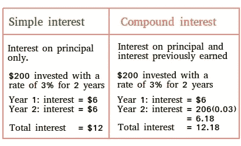

# 从股市赚 100 万美元的数学方程式

> 原文：<https://medium.datadriveninvestor.com/the-1-million-dollar-guarantee-93238446db0?source=collection_archive---------10----------------------->

## 无聊而平凡的罢工又开始了

Photo by [Sharon McCutcheon](https://unsplash.com/@sharonmccutcheon?utm_source=medium&utm_medium=referral) on [Unsplash](https://unsplash.com?utm_source=medium&utm_medium=referral)

抱歉，这不是我要告诉你成为百万富翁需要的几个习惯的帖子之一。或者说是创业者看似拥有的一个“秘密”。

我就不废话了，直接进入正题。

首先，这是一种投资策略。有史料做后盾。

这是对间谍的投资。美元间谍基金是一个指数基金，跟踪标准普尔 500 所有 500 家公司。简单来说，就是 500 家公司股票表现的平均值。其中一些是你现在看到的设备的生产商。

 [## 全球思考，本地行动:创业公司拓展新市场的 4 个关键|数据驱动的投资者

### 你是一家初创公司，在你的本土市场上表现出色。恭喜你。你能在新的市场重复它吗？这个…

www.datadriveninvestor.com](https://www.datadriveninvestor.com/2020/08/23/think-global-act-local-4-keys-for-startups-to-expand-into-new-markets/) 

# “世界第八大奇迹”——阿尔伯特·爱因斯坦

有史以来最聪明的人之一亲口说过:

> “懂得复利的人就赚到了。不付钱的人。”我有什么资格质疑这个？

那我们就把它武器化吧。

自 1900 年以来，SPY 美元的平均回报率约为 9.8%，截至 2020 年，SPY 美元的总增长率约为 56352%。所以如果你在 1900 年投资 1000 美元，你今天会有 563520 美元。(来源:[https://bit.ly/3czSaYS](https://bit.ly/3czSaYS))

相当不错吧？

不，那是垃圾！谁愿意等 100 年才发财？一个该死的世纪！当你那么老的时候，你能用这些钱做什么？做一个钚髋关节置换？

所以还是这样做吧。

到每个月底，当你收到薪水时，买 1 股$SPY。你不需要那些新衣服或者凯莉·詹娜每个月设计的最新化妆品。

这样做 35 到 40 年，你会得到**一百万美元的保证！就这样，无所事事！就像生了个宝宝，那个宝宝变成了金刚！这就是复利的力量。**

# 数学

**复利公式:**

> **A = P(1 + r/n)^(nt)**

我很确定，读到这里的人没有一个会尝试使用那个公式。所以我是为你做的！我会尽量让它简单易懂。

目前，每股 328 美元的 SPY 股票。根据你何时购买，这个价格可能会有所不同。但为了简单起见，并考虑到未来的价格上涨，我们将使用平均每月 350 美元。

这样，让我们把它放入这个公式，跟踪$ SPY →([https://bit.ly/2HtJWWB](https://bit.ly/2HtJWWB))的过去表现。不，我不是奇异博士，所以我不能摇头给你未来的数字。相反，我们将过去的 35 年。

为了节省你的点击，这里是结果。

从 1985 年 1 月到 2020 年 8 月，每月投资 350 美元，总成本不会超过 15 万美元。而你的投资组合价值约为 110 万美元！即使将资本收益税计算在内，你的银行存款仍将超过 100 万美元！

美元间谍还每季度发放股息。截至 2020 年 9 月 18 日，$SPY 每股发行价为 1.339 美元。我知道这听起来不多，但当你再投资这笔钱时，这将是一个在 100 年内赚了 50 万美元的人和一个在 35 年内赚了 100 万美元的人之间的差别。

另一个简单的例子:

Source: [Basic-mathematics.com](https://www.basic-mathematics.com/simple-vs-compound-interest.html)

所以你看，当你在亚马逊上看到那个可爱/古怪的商品时，你不能冲动。一百万美元危在旦夕，伙计！但是，如果你能控制住这种情况，你就有可能在银行账户中拥有 100 万美元，而不必卖掉可乐！

所以问问你自己这个问题:你是愿意每月花掉 350 美元，还是愿意 35 年后银行账户里有 100 万美元？你的选择。

> 完全披露:我目前投资了$SPY，价格我不会告诉你，我的投资方式有点复杂。但是嘿伙计！我说到做到。

如果你想要一篇更枯燥、更乏味的文章，深入分析我的个人计划，请在这里折磨自己:[https://bit.ly/30abKpG](https://bit.ly/30abKpG)。

标准普尔 500 不断淘汰实力较弱的公司，同时增加实力较强的公司。换句话说，只有足够强大的公司才能在标准普尔 500 上市。所以真的没必要担心这个指数明天会不会一落千丈。

如果真的发生了，你和我不会是第一个有麻烦的。这将是世界各地的大银行和唐纳德·特朗普。猜猜他们会怎么做？他们会努力存钱。当我们舒适地依偎在华尔街的混乱之下时，我们会愉快地同意他们一起拯救股票市场。

但另一方面，没有什么是不可能的。我是说，一个聪明人曾经说过，对吗？所以，除非美国被外星人入侵，像蒂姆·库克和埃隆·马斯克这样的首席执行官被绑架，否则我会在 2055 年看到你们这些百万富翁。

*嘿，既然你来了，为什么不加入我的* [***邮件列表***](https://marcuschan.ck.page/76504d9d12)**来看看你收件箱里偶尔出现的酷故事或者考虑一下* [***成为会员***](http://xn--74h/) *来阅读我所有的故事！☺**

## *访问专家视图— [订阅 DDI 英特尔](https://datadriveninvestor.com/ddi-intel)*