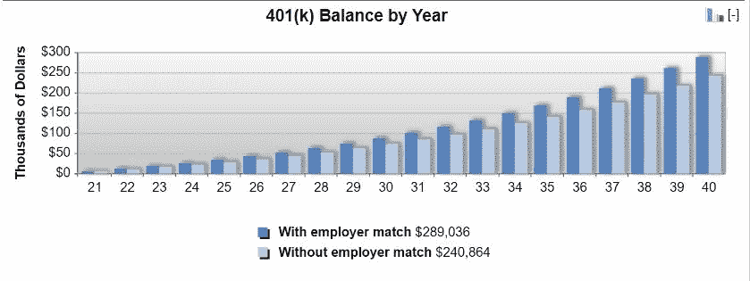

# 关于财富积累，我给 21 岁的自己的一条财务建议是

> 原文：<https://medium.datadriveninvestor.com/the-1-piece-of-advice-id-give-to-my-21-year-old-self-about-wealth-accumulation-a4eb4820d79?source=collection_archive---------22----------------------->

未来永远是现在

Photo by [Sharon McCutcheon](https://unsplash.com/@sharonmccutcheon?utm_source=medium&utm_medium=referral) on [Unsplash](https://unsplash.com?utm_source=medium&utm_medium=referral)

# 21 岁

21 岁时，我对时间会以多快的速度流逝并把我甩在身后没有真正的认识。但如果我能时光倒流，与年轻时的自己交谈，我会告诉她，在经济上，她能做的最重要的一件事是让自己的人生轨迹朝着繁荣、财富和富足的方向发展。

我会让她知道在她未来的现实变成现在的现实之前，在画布上写下最好的故事的重要性。

那就是进入一家有 401(k)、利润分享或其他退休计划的公司，投入最多 15%(加上公司匹配)，不要退出。我会告诉她，当她换工作的时候，把它翻过来。而且，在 15 年或 20 年后，她会存下 100 英镑中的 100 英镑，她甚至不会错过从支票中扣除的部分，因为它们是税前的。

对于一个或多或少可以被动积累的收入流来说还不错！当然，如果在退休年龄前被降级，会有[惩罚](https://www.irs.gov/retirement-plans/hardships-early-withdrawals-and-loans)，但还是不错的。

Image by author, generated from [BankRate.com 401k Calculator](https://www.bankrate.com/retirement/calculators/401-k-retirement-calculator/)

我希望我做了那件事(还有许多许多其他的事)。**未来变成现在的速度比你想象的要快。你的现在很快就会成为你的过去。**

你*会*后悔什么？

生活就是这样。但是，生活中的许多问题都可以追溯到缺乏足够的资金和资源，以某种方式。

不要让这种情况发生在你身上。最好从年轻的时候开始，但是无论你多大，开始用你处理财务的方式做得更好都不晚。

Photo by [Michael Longmire](https://unsplash.com/@f7photo?utm_source=medium&utm_medium=referral) on [Unsplash](https://unsplash.com?utm_source=medium&utm_medium=referral)