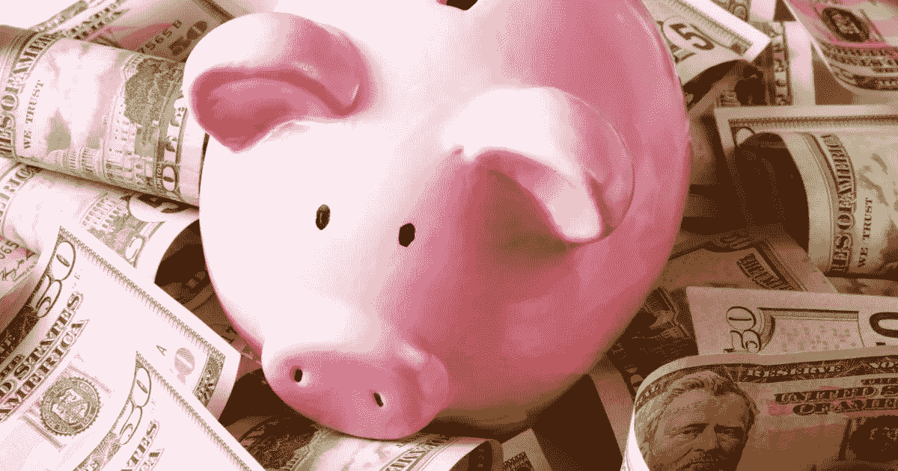

# 节俭人士的 10 个习惯

> 原文：<https://medium.datadriveninvestor.com/the-10-habits-of-frugal-people-fd74f6d835f2?source=collection_archive---------2----------------------->

*每年为我节省数千美元的简单交换*

**他们从每次使用成本的角度考虑所有事情**

> 真正节俭的人不会只关心找到最便宜的价格，他们会考虑一件物品在整个生命周期中相对于今天价格的总价值。

例如，去年当我需要为工作购买新衬衫时，我没有去 H&M 或 Zara 这样的快时尚零售商，而是选择了一件 Everlane 制造的打折衬衫，并购买了五种颜色。虽然我的购物车在 Everlane 比在更便宜的零售商那里要贵 30%,但我熟悉 Everlane 的质量，知道至少几年内我都不用更换我买的东西。虽然当时每件被蛰的衬衫要多花 12 美元，但在过去的一年里，我每周都穿五件衬衫——没有任何迹象表明它们会很快穿破。

鉴于我过去穿快时尚工作服的经验，在过去的一年里，我不得不至少更换一次所有的五件衬衫。这相当于必须购买五件 40 美元的衬衫，或者保证每年至少 200 美元的经常性成本。通过预付更多的钱购买 Everlane 衬衫，假设我需要每三年更换一次，我每年只需为我的大部分职业服装支付大约 87 美元。选择“便宜”的衣服实际上每年要花我两倍多的钱。

作为一个讨厌花钱的人，养成提前支付的习惯是很困难的。然而，当我意识到，从长远来看，我要花更多的钱来替换更便宜的衣服时，我开始购买更耐穿的商品，从那以后再也没有回头。

**他们在购物时睡觉**

像大多数节俭的人一样，我喜欢交易。但营销人员知道这一点。由于我们几乎每到一个地方都会受到定向广告的轰炸，看起来像是偷了一件你一直关注的产品，当你购买的东西送到你家门口时，可能已经成为遥远的记忆了。

当我在大学的时候，我特别有罪恶感，一看到任何感兴趣的东西就买，主要是因为我要么认为我的钱花得值，因为我担心交易会到期或产品会卖光，要么因为我太心急了，以至于以后不会再去购买。

> 结果，当我第一份工作要横跨半个国家的时候，我意识到这些年来我浪费了多少钱，因为我一直在寻找我几乎已经忘记的冲动购物。看到我在短短几年内浪费的所有钱的可视化表示，是我需要的警钟。

现在，每当我第一次考虑购买时，我至少会等一天再回到我的购物车。十有八九，我决定没有前一天被完全卖掉的东西我也能活下去。当我决定放弃购买时，我会奖励自己，把我本该花掉的钱存入我的经纪账户。

他们不认为购物是一种爱好或压力的发泄方式

> 节俭的人从严格的功利主义角度看待购物。虽然他们可能喜欢做一些研究和货比三家，以获得他们所需的最佳交易，但购物不能代替他们的主要爱好。

在我十几岁和大学期间，当我面临负面情绪或紧张局势时，我养成了一个颇具破坏性的习惯，那就是冲动购物来自我安慰。因为我的习惯开始时很小，多年来不断加深，直到我开始一份有毒的工作，我才意识到这对我的经济和情感健康有多危险。

我没有马上意识到这是一个有害的环境，而是把我新发现的压力归因于为一家大型科技公司工作，只是不得不更加努力地工作。此外，我认为自己很幸运，大学一毕业就被这样一个受欢迎的雇主雇用。

我没有意识到几个健康问题的出现，对工作的深深恐惧，以及高度失调的办公室动力——所有这些都是我需要离开工作的明确迹象，我求助于购物，绝望地试图屏蔽掉我发现自己每天都在处理的严重焦虑。不幸的是，花钱带来的多巴胺冲击不仅是短暂的，而且还会让我无法专心处理工作上的问题。

与此同时，每个月花越来越多的钱来麻木疼痛，只会让我觉得自己更加被一份有毒的工作所束缚。换句话说，工作的压力导致我不计后果地花钱。与此同时，支出的增加让我觉得我需要继续做那份工作，以便跟上一种甚至没有让我快乐的生活方式。

一旦我决定辞职，我就意识到量入为出的真正力量。通过不买东西，并学会以更有成效和可持续的方式处理我的压力，我开始把钱视为购买未来财务自由的工具。自从我和有毒的工作吻别后，我就无情地过着量入为出的生活。通过这种方式生活，如果我再次发现自己在有毒的工作环境中挣扎，我将有储蓄离开。

**他们追踪自己的支出**

> 因为节俭的人今天存钱是为了明天能买得起真正重要的东西，所以他们对每笔收入和支出都有很好的理解。

一个快速了解你财务状况的好方法是根据你的税后月收入追踪每一笔购物和经常性账单。这可以在 Excel 中完成，或者简单地打印出你当月的银行和信用卡账单。我喜欢在 Excel 中按日期记录每笔账单和交易，然后按类别对费用进行分类。然后，在月底，我会查看我的总支出，以及分类支出，以找出需要改进的地方。我没有尝试一下子削减我所有的开支，而是一次专注于一个类别。

当我第一次开始我的个人理财之旅时，在我的银行和信用卡账单上标出我不记得的任何交易，帮助很大。这个简单的练习让我不仅能很快看到每个月冲动购物花费了我多少钱，还能通过改变我的行为节省多少钱。

**他们不断寻找新的方法来进一步扩展他们的资金**

> 节俭的人不满足于仅仅知道他们如何花钱和在哪里花钱。相反，他们利用这些数据无情地逐月削减开支。不管他们是完全取消行式项目，还是为日常采购找到更划算的替代品，节俭的人永远不会停止重复他们的每月预算。

每个月，在我完成预算并输入上个月的所有支出数据后，我会选择一个购买类别，并集中精力在下个月削减。我从影响最大的类别开始这个过程，比如非必需品和食品，然后我完成了在家庭用品上的支出，比如洗衣液和垃圾袋。虽然我一次只专注于一个类别，但有无数种方法可以做到这一点。

这里的关键是要摆脱把你预算中的任何和所有类别都视为固定不变的习惯。虽然像外出就餐、新衣服和漂亮的美容产品这样的可自由支配的购买通常比每月的账单更容易削减或限制，但如果你愿意付出一点努力，重新审视你的经常性支出也可以带来大量的额外节省。

例如，如果你的租约快到期了，考虑和你的房东协商降低租金，或者在经常性的基础上获得更便宜的租金。不管你的生活状况如何，还有一些其他的“固定”费用可以通过打电话给你的服务提供商和/或货比三家寻找更好的价格来降低。

 [## 首次创业的 4 个资金管理技巧|数据驱动的投资者

### 超过 82%的企业倒闭是由于财务管理不善和现金流问题。开始新的…

www.datadriveninvestor.com](https://www.datadriveninvestor.com/2020/10/23/4-money-management-tips-for-first-time-entrepreneurs/) 

这类费用的几个例子包括你的互联网账单、汽车保险和电话计划。虽然能源账单并不总是可以直接协商的，但是许多能源供应商确实提供了一些免费的项目来帮助你降低能耗。如果你想进一步降低电费，在非高峰用电时间运行电器也值得一试。

他们不怕自己动手做

在将专业理发和染发的费用视为法律的几个月后，我对经常性费用的蔑视战胜了，我学会了修剪和染发。这个过程需要一点学习曲线，但是我现在通过自己做头发，一年节省了 800 多美元——更不用说很多时间了。

我也打算几个月后搬家。我没有付钱给搬家公司来打包和搬运我所有的物品，而是通过逐步打包我自己的箱子(我当然可以通过去当地的酒类商店免费获得)，每周清理一点杂物，出售和/或捐赠新地方不需要的任何物品，以及与朋友和家人一起储存几箱物品，来节省数百英镑。通过提前计划，尽我所能做好前期准备，我只需要搬运工搬几件家具就行了——比买全套公寓便宜多了。我也在考虑干脆跳过搬运工，只租一辆 U 型车来完成这项工作。

虽然在某些情况下，由于材料成本和给定项目的失败率，DIY 可能会更贵，但这真的取决于你想做什么，你可能会节省多少钱，以及你已经擅长什么。也就是说，从长远来看，在你的生活中找到一些你可以实际做的事情，会对你的财务状况产生巨大的影响。

**他们战略性地购物**

> 节俭的人会盘点他们需要的东西，然后计划在正确的时间和正确的地方购买这些东西，以获得最划算的交易。简而言之，节俭的人是从不支付全价的专家。

我不经常购物。事实上，我甚至不考虑买任何东西，直到我在生活中至少五次发现它的用途。然后，我会把它添加到我的清单上，并计划在一年中我能获得最大折扣的时候购买它。虽然这看起来有点极端和非常不方便，但它确保了我不再浪费钱在那些不能给我的生活增加价值的东西上。

一旦我有了我想买的物品清单，我会做一些初步的研究，以确定我是否可以灵活选择品牌、款式、尺寸或其他产品属性。我通常更喜欢从大品牌购买，因为它们的广泛分布使我能够利用多家零售商的销售和优惠。在某些情况下，使用 honey 这样的在线浏览器扩展还允许我结合折扣来进一步节省费用。

然后，我会根据清单上每件商品的销售时间，计划一个暂定的购买日期。因为这些年来我的口味没有太大变化，所以我能够根据我过去的经验可靠地估计出最佳的购买时机。

只要有可能，他们就会借而不买

我过去认为购买昂贵的服装参加婚礼、工作活动和其他特殊场合没有问题，尽管它们的用途有限。然而，一旦我接受了节俭的生活，我意识到这些购买实际上是多么的不必要和可避免。一个更好的——更不用说更环保的——方法是在去商店之前确定你是否可以从朋友或邻居那里借。只要你愿意偶尔借出一两件物品，这种策略是一种被严重低估的储蓄方式。

无论是从你最好的朋友那里借来的参加婚礼的装备，还是隔壁邻居借给你的塑料桌子，拥抱借而不是买，随着时间的推移，可以积累一大笔财富。仅仅在一年左右的时间里，通过与朋友和邻居交换草坪家具和衣物，我已经节省了 500 多美元。

**他们在购买之前会先试一试**

在过去的一年里，我采取的另一个防止过度消费的措施是，在做出最终购买决定之前，尝试所有我想买的东西。无论是充分利用订阅服务的免费试用，获取美容和个人护理产品的样品，还是在商店里试穿几次衣服，购买前的试穿让我更好地了解我可能会花钱购买的产品的价值。

如果我尝试了一种更便宜的替代品，或者在尝试后放弃了该产品，并且没有发现我的生活质量有太大的变化，那么我就避免了在不明智的购买上浪费我辛苦赚来的钱。如果试用产品能让我一劳永逸地相信产品的价值，我会购买并充分欣赏它。

**他们坚持长期投资**

> 说到底，低开销生活的主要好处是拥有提前退休的财务自由，从事更有成就感的工作，并随着时间的推移积累财富。

作为一个曾经因为害怕失去一切而避开股市，在高收益储蓄账户中囤积现金，并且只为我雇主的 401k 计划捐款以获得全额匹配的人，我在这里要说的是，存钱而不投资本质上是毫无意义的。

虽然我会留出几个月的开销以备不时之需，但我已经过了基于恐惧的现金囤积期。相反，我现在坚定地养成了每两周自动向我的税收优惠退休账户转账的习惯。我现在不再把钱花在无意义的购买上，也不再囤积由此产生的储蓄，而是用它在股票市场上为我工作——用我的方法中的一点耐心和一致性保证我未来的财务独立。

## 访问专家视图— [订阅 DDI 英特尔](https://datadriveninvestor.com/ddi-intel)