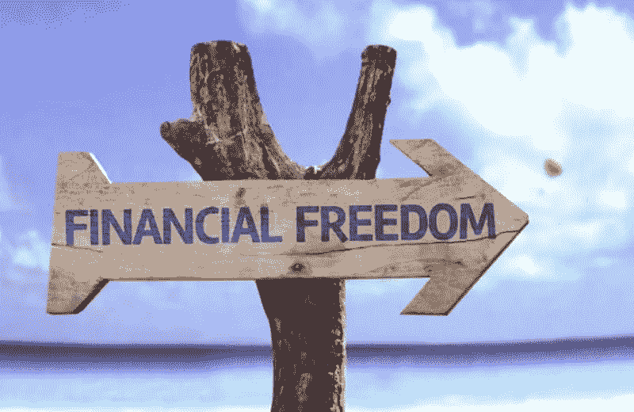

# 阻碍你变得富有的 10 个习惯

> 原文：<https://medium.datadriveninvestor.com/the-10-habits-that-pulls-you-from-being-financially-rich-d72479c25095?source=collection_archive---------19----------------------->

## 你有没有想过你的财务突破会在什么时候？是否有外部因素阻止你实现它？

[PHOTO](https://frugalentrepreneur.com/2019/03/become-financially-independent/)

一些人认为，“如果你注定要成为下一个杰夫·贝索斯或比尔·盖茨，你只需要坐下来放松，等待你的突破”———我部分不同意这一点，因为没有努力工作的耐心什么都不是。根据斯坦福大学心理学家[卡罗尔·德韦克](https://journals.sagepub.com/doi/10.1177/0956797618780643)的说法，你的信念在你想要什么或者你能否实现它的过程中起着至关重要的作用。但是最能说明成功的是你的习惯。

## 根据生活教练和专业导师 [Chinkee Tan](https://chinkeetan.com/) 的说法，以下是 10 个让你远离成功的习惯

## 1.投机

白手起家的百万富翁从不追求“快速致富”的计划，他们的目标不是一眨眼就变得富有，因为他们相信成功没有捷径。一切都伴随着挣扎和痛苦。

但是有人会说，“我已经接受了很长时间的考验。我穷了这么长时间。突破有可能吗？”是的，你突破的路太长，走不动。

对于那些靠赌博来一夜暴富的人来说，你不会。为什么？因为你没有变得富有，而是进一步缩减了你的资源来资助你的赌博问题。

> 不要求助于“宽松货币”计划

## 2.吸烟和饮酒习惯

你一天花多少钱买一包烟？仅在美国最贵香烟的故乡纽约市，一包香烟的平均价格就高达 13 美元。比方说，一个人每天消费 5 支雪茄——假设一支雪茄的价格是 0.65 美元，那么一个人一天要花多少钱买一支雪茄呢？$3.25

## 每天 3.25 美元 x 30 天= 97.5 美元

## 每月 97.5 美元 x 12 个月= 1，170.00 美元

这是出了名的昂贵的香烟！所以让我们来看看你的饮酒习惯让你付出了多少代价…

让我们假设一个人每周至少喝两瓶**斯米尔诺夫 80 伏特加** (1.75 升)，一瓶价格为 **$23.99，**算一算，就是每周**$ 47.98**——从**$ 191.92/月**到**$ 2303.04/年**

看到了吗？小习惯的小开销积少成多。

> 改掉坏习惯的第一步是看看为什么你觉得这个行为如此有吸引力。

## 3.冲动购买

冲动型购买者的比喻是“先买，后想”——[冲动型购买](https://www.verywellmind.com/shopping-addiction-4157288)简直是上瘾。摆脱这种冲动行为循环的第一步是认识到这是一个问题。

永远不要把钱花在对你没有价值的东西上。不要让你的情绪为你做决定，因为如果你这样做，它可能会导致严重的后果。

> 花钱前要三思

## 4.吃得过多

暴饮暴食是不健康的，它也会耗尽你的钱包。但是一个人不得不面对的短期和长期后果包括胃灼热和肥胖。

当我们吃我们喜欢的食物时，身体会释放多巴胺，多巴胺与快乐或奖励的感觉有关，它会鼓励我们吃得更多。因此，即使暴饮暴食导致疼痛和不适，我们可能会感到被迫继续暴饮暴食。

## **5。马**安娜的习惯

[maana](https://ayajoaquin09.wordpress.com/2014/10/20/manana-habit-is-a-disease/)习惯，源自菲律宾语中的“ *mamaya na* ”(稍后)，是[拖延](https://www.verywellmind.com/the-psychology-of-procrastination-2795944)的一种形式——这是一种拖延的行为，将任务暂停到最后一分钟。

事实上，拖延阻止我们现在或按照既定的时间表做某件事，这可能不是完成某件事的正确时间。

> 拖延损害了一个人取得好成绩的能力。

## 6.和错误的人混在一起

你有没有注意到，如果一个人与成功人士交往，他也会变得成功？然而，如果你和错误的人联系在一起，你的生活可能会转向错误的方向。

友谊、亲戚、家庭、关系是我们生活的重要组成部分。这些人能以某种方式为你加油，激励你，推动你走向成功的巅峰。然而，这些也会对你的生活产生负面影响，[雪莉·戈登](https://www.verywellfamily.com/sherri-gordon-460467)列举了我们一生中可能遇到的 7 种不同类型的有害关系，它们是:使用者、吸血鬼、消极的内莉、戏剧女王、批评家、八卦者和叛逆者。

> 这些人有时会阻碍我们的发展，所以重要的是要注意，选择合适的人是一个人一生中必须做出的最大决定之一。

## 7.YOLO 心态

我们有时用我们所拥有的或已经取得的来衡量生活，而**你只活一次**哲学的潜在特征是趁现在还来得及，好好生活。一个人有时会匆匆忙忙地让事情发生，以看到努力工作的明显结果，却没有意识到在加快速度的同时自己已经获得了相应的损失。

 [## 如何在不牺牲孩子或财务的情况下安全理智地离婚|数据驱动…

### 在美国，七月是以孩子为中心的离婚月。作为 cdfaⓡ的专业人士，我可以向你保证，从长远来看…

www.datadriveninvestor.com](https://www.datadriveninvestor.com/2020/07/28/how-to-divorce-safely-and-sanely-without-sacrificing-your-children-or-your-finances/) 

当一个人拿到第一份工资时，他通常会现在消费，以后再储蓄。但是生命周期与“财务独立”的现实不同——我们永远不知道匮乏何时会降临到我们头上。所以抛弃 YOLO 心态的想法，开始展望未来，你。

> YOLO 哲学的缺点是，用债务来资助我们想要的生活方式或超出我们的能力范围的支出似乎意义重大。

## 8.给别人留下深刻印象

[社会心理学](https://www.sciencedirect.com/science/article/abs/pii/S0304394017310194?via%3Dihub)断言，我们对他人的结论是基于我们的感知——这不同于印象。

我们擅长在数字社区中描绘生活是美好的，即使我们很沮丧——这根本不是积极的。积极是能够认识到你正在遭受痛苦的事实，而不是停留在痛苦中，并通过积极的态度找到前进的方法。

*“人们这样做的一些原因可能是他们感到不安全，对自己不太自信，并且总是试图证明一个没有实际意义的观点。”* [*迈克尔·迟多泽*](https://medium.com/u/483217ce0f41?source=post_page-----d72479c25095--------------------------------) *在他的博客上写道*，[克服总想给别人留下深刻印象的冲动的 6 个步骤](http://6 Steps To Overcome The Urge To Always Want To Impress Others)

> 我们有时会向他人展示我们的黑暗面，因为人们是通过我们所描绘的来定义我们的。

## 9.消极思维

我们的思想有助于我们整体的幸福。我们如何思考决定了我们对特定情况的态度。

避免阻止你的想法去想消极的想法，你越是强迫自己不去想消极的想法，它就越会浮出水面。正念是最好的方法，因为它赋予你的想法以重量，并减少它们对你的影响。

根据梅洛迪·威尔丁和 LMSW·威尔丁的说法，一种有效处理消极想法的方法是通过简单的正念练习:[意识到](https://medium.com/mind-cafe/how-to-silence-negative-thinking-449899b93482)，代表允许、观察、承认、释放、期待。

## 10.你害怕冒险

你需要成长和学习——冒险是其中的一部分。是的，冒险是可怕的，但是你怎么知道这是一个机会还是一场灾难呢？如果你不允许自己独立流浪，你将如何到达路的尽头？这条路可能并不好，你受伤的可能性更大，但它带给你的潜在教训是成长和自信。

> 要做大并获得自信，你需要尝试做大。如果你失败了，再试一次，或者继续下一步。

传统智慧告诉我们，养成一个习惯需要四周时间，但如果一个坏习惯在我们的生活中扮演了一个长期的角色呢？实话告诉你，没有什么魔术能让你改掉坏习惯。脱离它的做法还是关键。

> 如果这些行为持续存在，不要犹豫寻求专业帮助，因为你可能需要心理干预。

CONNECT WITH ME: [Joshua Romero](https://www.linkedin.com/in/joshua-p-romero-clssyb-136494170/)

获取专家视图— [**订阅 DDI 英特尔**](https://datadriveninvestor.com/ddi-intel)