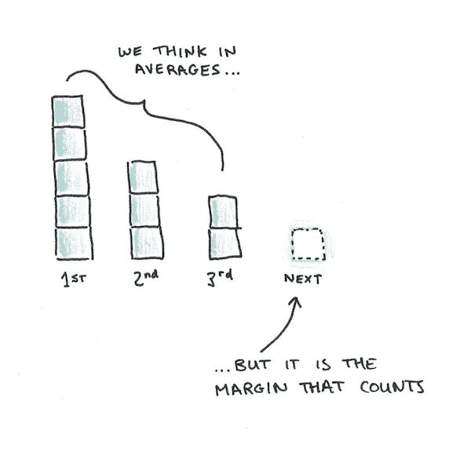
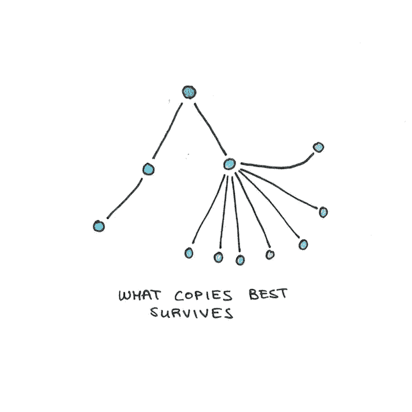
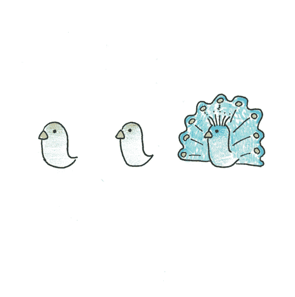
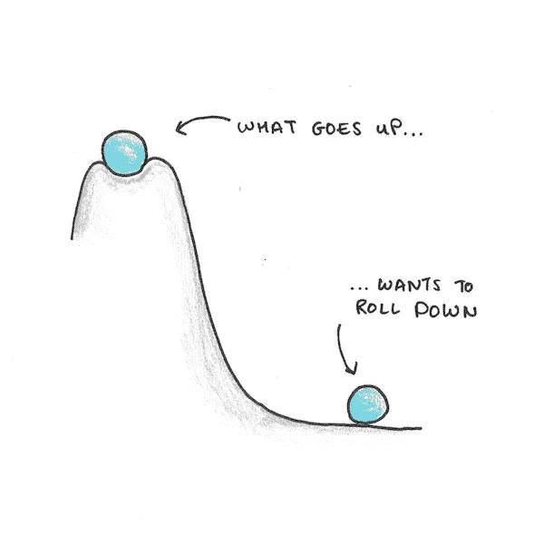
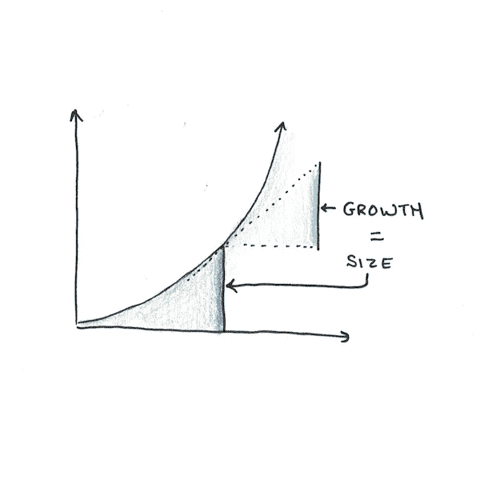
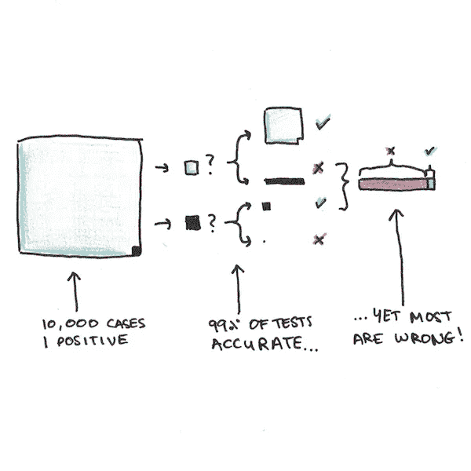
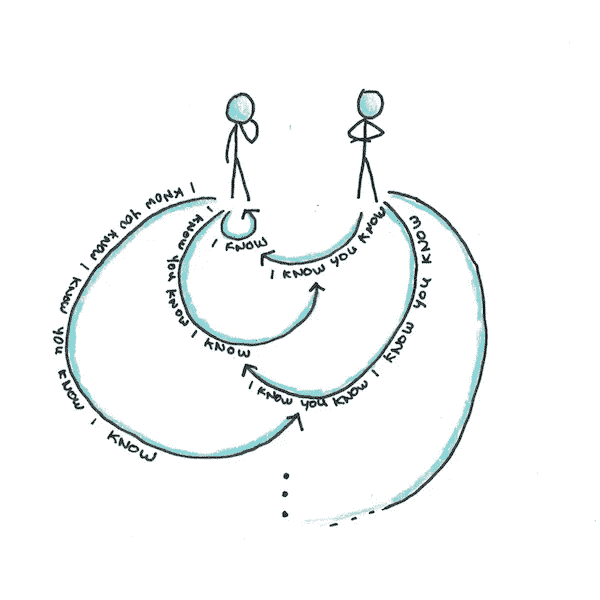
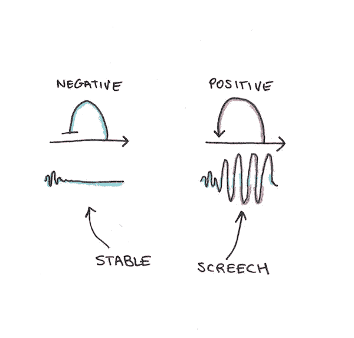
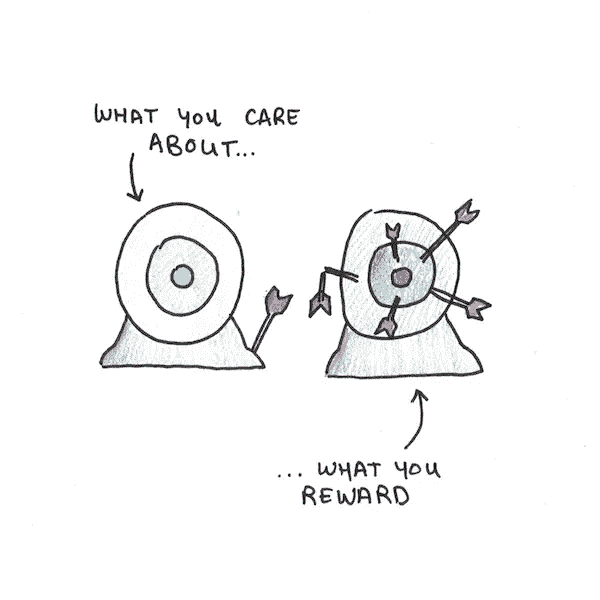
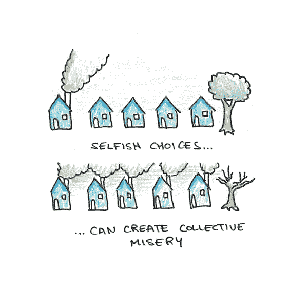

# 10 个最有用的心智模型

> 原文：<https://medium.datadriveninvestor.com/the-10-most-useful-mental-models-79fda1632637?source=collection_archive---------0----------------------->

心智模型是现实中一次又一次出现的模式。一旦你认出了一个，它就开始到处出现。了解它是如何工作的，你就能认识到宇宙深处的一些东西。

以下是对我的思考影响最大的十个心智模式:

# 1.保证金

我们以平均数思考，但现实在边际上起作用。

经济学家喜欢谈论边际变化。这意味着多做一件事要花多少钱。之所以重要，是因为做某事的成本很少是恒定的。

边际收益往往会经历[收益递减](https://en.wikipedia.org/wiki/Diminishing_returns)。吃第二十块蛋糕不如第一块好。相比之下，边际成本往往会下降。写第二十篇文章比第一篇更省力，因为通过练习，它变得[更容易。](https://policonomics.com/economies-of-learning/)

错误在于用平均值来思考。我们问过去发生了多少，而不是问下一次可能会发生多少。

# 2.自然选择

达尔文不仅仅解释了物种的起源[。他展示了任何有用的复杂性是如何机械地产生的。](https://en.wikipedia.org/wiki/On_the_Origin_of_Species)

你所需要的是忠实的复制，这种复制保留了很少的错误，并且复制的内容对其自身的生存有一些影响。这不仅适用于生活，也适用于思想、技术和传统。

 [## 如何让人们真正倾听你|数据驱动的投资者

### 没有神奇的五步公式。这可能不是你现在想听到的，但相信我，从长远来看，这是…

www.datadriveninvestor.com](https://www.datadriveninvestor.com/2020/03/22/how-to-get-people-to-really-listen-to-you/) 

理解自然选择可以告诉你很多关于哪些东西会传播。这可以解释为什么当疾病感染更多的人时会变得不那么致命。这说明了为什么社交媒体上的新闻最能激起公愤。我们甚至可以用它来解释文化是如何随着时间发展的。

# 3.发信号

为什么酒店床上用品是白色的？为什么我们在医药上的花费比预防多？为什么大多数人宁愿要证书也不要教育？答案是[发信号](https://en.wikipedia.org/wiki/Signalling_theory)。

信号是采取可见的行动来改变别人的想法。事实上，你可以撒谎，这给潜在的信号员创造了奇怪的动机，让他们选择更难撒谎的东西。酒店里的床单通常是白色的，因为有图案的床单会隐藏污渍。如果你担心清洁，一个原始的白色床单很难伪造。

我们倾向于怀疑信号，因为它感觉不太真实。但它很可能在非常基础的层面上嵌入到我们的心理之中。我们的许多行为可能是为了发送信号而优化的，而不仅仅是为了达到直接的目的。

# 4.潜在的

东西掉下来。[潜力](https://en.wikipedia.org/wiki/Potential_energy)是一个物理概念，扩展了高度的概念。高空中的球有引力势。放开它，它就会掉下来。

电压是电的类似量。高压线就像高高在上的球，它想要下降到更低的电位。在两者之间放一台机器，你就可以完成有用的工作。

势的概念比物理学更有用。机器学习使用[梯度下降](https://en.wikipedia.org/wiki/Gradient_descent)，这在数学上相当于试图滚下一座高维度的小山。我认为许多[习惯可能是亚稳态的](https://www.scotthyoung.com/blog/2015/03/25/permanent-habits/)，引用坠落的比喻来解释为什么很少有习惯会永远持续下去。

# 5.合成

指数增长既罕见又惊人。

复利之所以有效，是因为增长率取决于你已经拥有的金额。金钱复利是因为你已经拥有的每一美元都贡献了利息。不加检查的兔子会成倍增加，因为每对兔子会产生更多的兔子。

我们不是为了指数增长而生的。当它发生时，我们通常会感到惊讶。

# 6.贝叶斯法则

想象你是一名医生，正在检测一种罕见的疾病。只有万分之一的人有。你用一种每 100 次测试中只有一次出错的测试来检查这种疾病。一个病人进来，你做测试，得到的答案是:阳性。

问:病人得这种病的可能性有多大？

如果你说 99%你并不孤单。大多数医生也会答错[类似的问题](http://yudkowsky.net/rational/bayes/)。但是他们错了。

他们错了，因为他们没有使用这个心理模型。每当你得到新的信息(比如一个测试结果)时，你需要调整它以适应你已经有的背景信息——不要从头开始。

如果我们用我们提到的测试对 10，000 人进行测试，平均 9999 名没有患病的人会得到 9899 个阴性和 99 个阳性，其中一个是真阳性。因此，一个 99%准确的测试在将近 99%的情况下都是错误的！

# 7.常识

常识是每个人都知道的事情。但不仅仅是这些，它们是每个人都知道的事情。更重要的是，每个人都知道每个人都知道每个人都知道。无限重复，你就有了[常识](https://en.wikipedia.org/wiki/Common_knowledge_(logic))。

最能说明常识的是*皇帝的新衣*。皇帝是裸体的，每个人都知道他是裸体的。但是因为他一丝不挂不是*人所共知的，所以每个人都装模作样，表现得好像他穿得很棒。需要一个天真的孩子大声说出每个人心中的想法。*

常识很重要，因为它可以围绕任意决策创造稳定点。例如，钱是有价值的，因为每个人都认为它有价值。如果钱的价值不是常识，它就不会作为钱使用。

# 8.反馈

反馈只是更广泛的系统思维集合中的一种模式。

系统思维适用于神经科学、分子生物学、政治学、经济学等等。这个想法是，抽象的信息流会导致复杂的行为，而仅仅分析这些部分是无法预测的。

反馈有两种形式:积极的和消极的。负反馈是指输出抑制了自己的输入。结果是稳定。正反馈是指输出放大输入。结果是取决于起点的爆炸。

我们的许多行为都受到负面反馈的支配。你饿了，你吃东西，感觉不那么饿了。你非常努力地工作，感到满意，然后休息一下。但其他循环是积极的— [成功能带来自信，自信带来更多成功](https://www.scotthyoung.com/blog/2019/01/13/how-to-change-your-life/)。恐惧会导致回避，[从而加剧焦虑](https://www.scotthyoung.com/blog/2019/11/25/anxious-review/)。知道哪一个会有很大的不同。

# 9.激励

假设我们在奥运会上增加了一个新项目。一部分是 100 米短跑，一部分是选美。现在想象一下，不管他们跑得多快，获胜者总是最好看的。

如果这样的活动存在，如果你观察到参赛者把大部分时间花在化妆和发型设计上，而很少花时间在实际跑步上，你会感到惊讶吗？

这个例子很傻，但是现实世界中存在类似的情况。绝大多数教授是根据他们的研究成果来评判的，而不是他们的教学能力。那么，即使对于极其昂贵的大学来说，讲座也常常缺乏创意，这有什么好奇怪的呢？

使用这种思维模式需要逆向推理。根据我们所看到的人们的行为，我们可以猜测出引导他们的动机是什么？在你为一场无关紧要的比赛开始训练之前，最好提前注意到这一点。

# 10.纳什均衡

纳什均衡以[约翰·纳西](https://en.wikipedia.org/wiki/John_Forbes_Nash_Jr.)(他们甚至[拍了一部关于他的电影](https://en.wikipedia.org/wiki/A_Beautiful_Mind_(book)))命名，是多人游戏的稳定策略。

稳定的策略意味着，知道其他人在做什么，你不想做一些不同的事情。一个不稳定的策略是，知道其他人在做什么，你想改变你的玩法。

囚徒困境是一个(不幸的)纳什均衡的例子。告密，你就可以自由出狱，但你的犯罪伙伴会在监狱里腐烂。保持安静，你们都会得到轻判。问题是好的结果(保持沉默)是不稳定的。不管你的对手选择什么，你最好的选择是告密。

纳什均衡解释了为什么社会变革是困难的，即使每个人都同意。如果污染比不污染容易，并且污染的成本被分摊，纳什均衡就是每个人都污染。这是真的，即使每个人都宁愿生活在一个没有污染的世界。

# 心智模型的价值是深刻的，而不是肤浅的

展示一个新的心智模型是不够的。要从它们中获得真正的价值，你需要深入了解它们。你需要在许多环境中看到它们，并对它们的工作方式有所了解。

但是，如果你听到一个抽象概念一次又一次地出现，而你不能很好地理解它，这是一个很好的迹象，有一个隐藏的心理模型等待被打开。

**访问专家视图—** [**订阅 DDI 英特尔**](https://datadriveninvestor.com/ddi-intel)