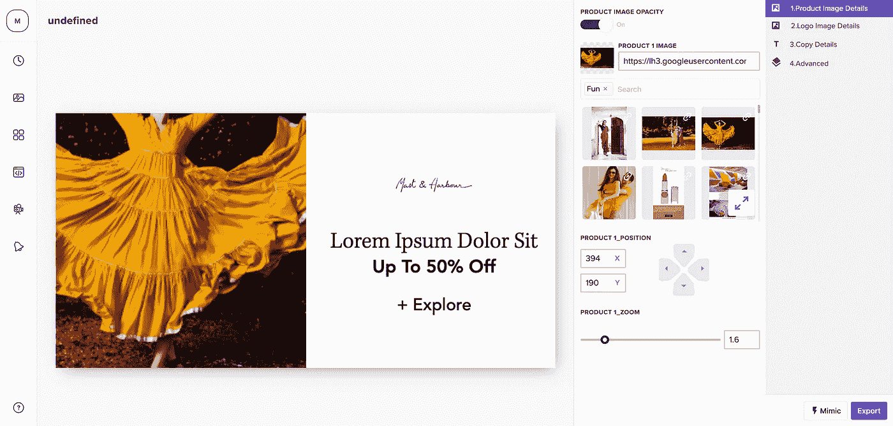
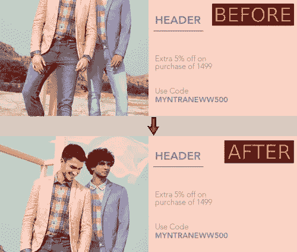
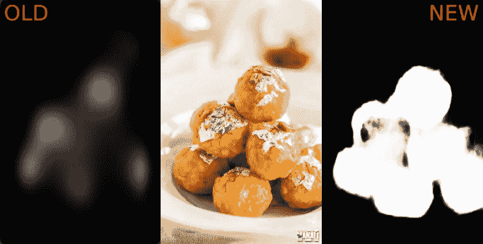
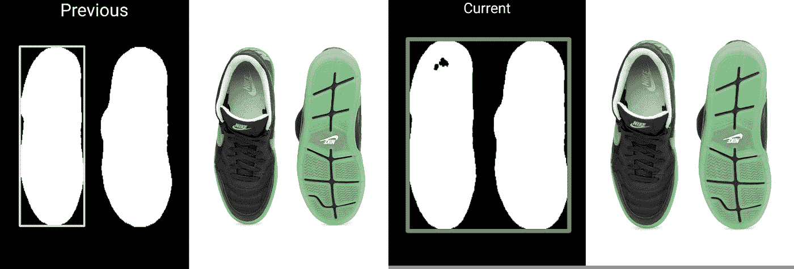
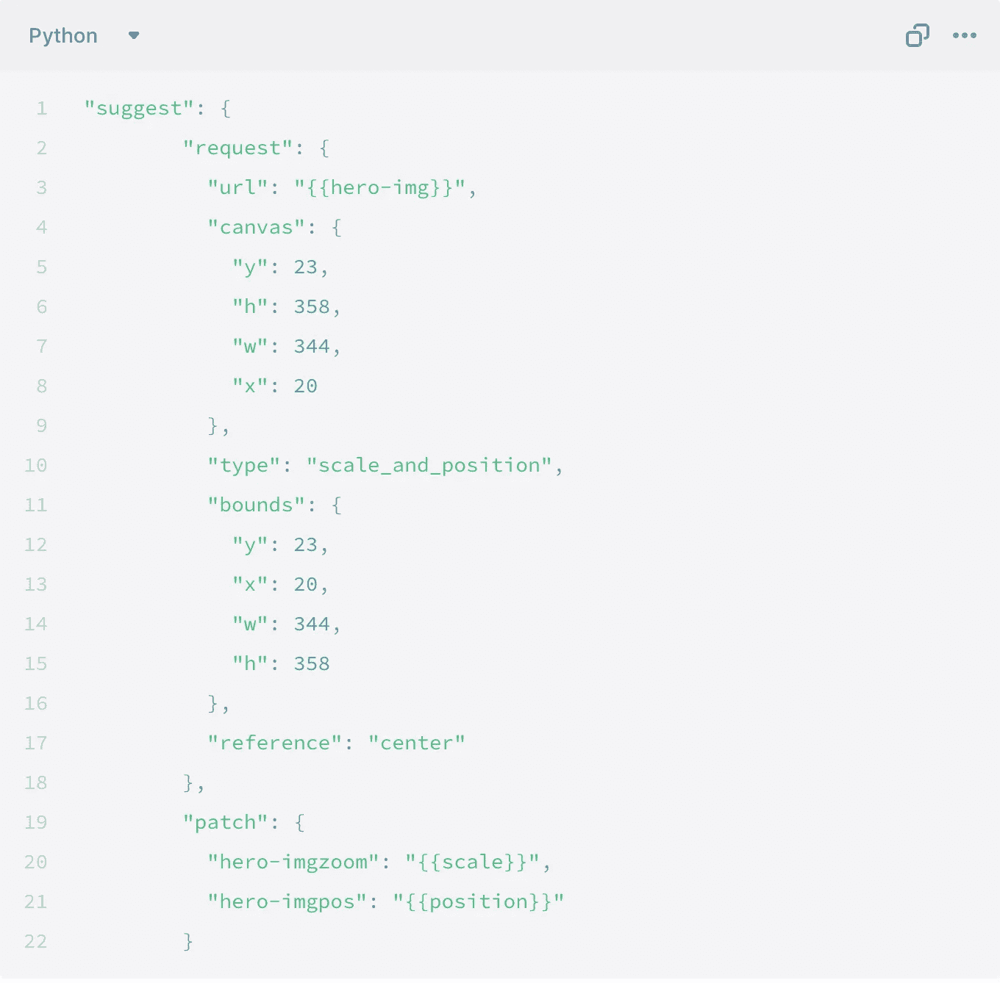
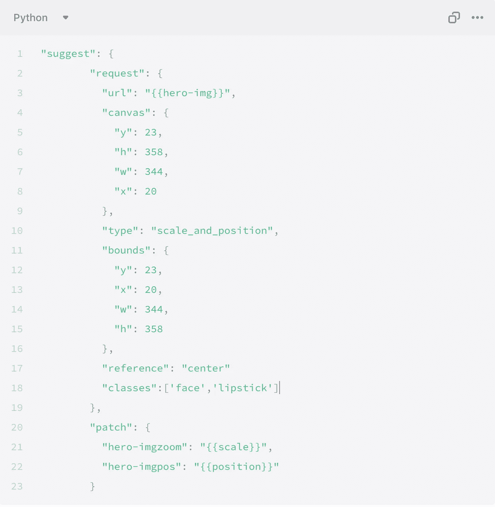

# 10x designer——采用 Kubric 的智能自动化

> 原文：<https://medium.datadriveninvestor.com/the-10x-designer-smart-automation-with-kubric-295b7de20314?source=collection_archive---------10----------------------->

在 Kubric，数据科学团队的最高标准是——“我们如何减少设计师花费在繁重工作上的时间？”。我们希望消除微编辑和质量检查中的繁重工作，以便设计师可以专注于对他们真正重要的东西——设计好的内容。围绕这一点，我们创造了一套微型工具来帮助设计师真正摆脱繁重的工作。如今，这为从食品到时尚等不同客户领域的数千名创意人员提供了动力。在这篇博客中，我将谈论一个这样的功能——自动定位。

**概述问题**

在 Kubric，我们帮助内容团队扩大产量。去年，当我们分析我们的内容制作工作流程时，我们发现一些通过 Kubric 制作的内容是这样初始化的(注意无头模型)

用户必须花费相当多的时间对准焦点对象的中心，然后找到图像的正确比例。大约在那个时候，twitter 推出了他们的[智能作物](https://blog.twitter.com/engineering/en_us/topics/infrastructure/2018/Smart-Auto-Cropping-of-Images.html)，他们解决的问题和我们的非常相似。从博客中获得灵感，我们能够快速实现类似的解决方案。图像开始看起来像这样-

在发布初始版本后，我们收到反馈，虽然它确实为创意提供了更好的初始化，但它只专注于图像中非常小、最显著的部分，并为我们提供了一个非常粗糙的显著区域。他们想要对自动化有更多的控制。他们想控制-

*   边界，
*   控制关注哪个对象而不是整个显著区域的能力
*   指定感兴趣对象的对齐方式

反馈帮助我们更好地了解用户需求，我们带来了增强的实现。

**显著物体检测** -

对于初始版本，我们使用了 [SalGAN 模型](https://github.com/imatge-upc/salgan)，但它只为我们提供了一个非常粗糙的显著图，我们需要一个更细粒度的显著图。因此，我们决定在开源显著性数据集上训练我们自己的模型( [msra](https://mmcheng.net/msra10k/) ，[DUT-欧姆龙](http://saliencydetection.net/dut-omron/))。我们使用了基于 [Unet](https://arxiv.org/abs/1505.04597) 的编码器-解码器 [mobilenetV2](https://arxiv.org/abs/1801.04381) 结构，使用了惊人的[分段模型](https://github.com/qubvel/segmentation_models)库。我们使用焦点损失进行训练，因为类别不平衡与显著性预测的上下文相关，对于显著性预测，地面真实显著性图主要由零或接近零组成，从而产生类似的现象。该方法类似于加权二进制交叉熵，除了权重是局部调整的，并且基于预测显著性的可调伽马幂。我们跟踪像素误差作为度量，这是显著性模型的标准度量。这就是萨尔根和我们的模型之间的结果差异

新模型也快得多 **—我们将单个 cpu 实例的预测时间从平均 1.5 秒降低到 0.3 秒。**

对于对象检测，我们目前想要处理的大多数类都出现在这个[开源 tensorflow 模型](https://github.com/tensorflow/models/blob/master/research/object_detection/g3doc/detection_model_zoo.md#open-images-trained-models)中。因此，我们决定使用这个模型。

 [## 如何使用自动化从您的数据中获得更多价值？数据驱动的投资者

### 去年的新闻故事不停地谈论机器学习变得多么先进。电脑现在…

www.datadriveninvestor.com](https://www.datadriveninvestor.com/2020/02/27/how-to-use-automation-to-get-more-out-of-your-data/) 

# 右侧边界框

我们面临的另一个问题是，图像中有多个显著的区域/对象，我们需要决定是否要组合、拒绝多个框。为此，我们实现了以下算法-

1.  看这个盒子相对于图像有多大。如果小于阈值，则拒绝该盒子。
2.  取最大的盒子，在这个盒子和其他盒子之间创建一个距离矩阵。
3.  拒绝比阈值更远的盒子，并合并剩余的盒子。

这是这样做后的结果

**计算比例和位置-**

在我们得到最大边界框的坐标后，来自自动建议请求的值被用来-

1.  调整图像大小，保持纵横比
2.  对显著图进行阈值处理，并获得边界框的坐标
3.  计算比例，因为我们知道对象的边界以及边界框的坐标。
4.  计算将对象的当前边界框移动到图像中心所需的偏移量。计算后，需要对差异进行缩放。

**部署**

ML 部署的主题将会有自己的博客(订阅我们的博客以便在发布时得到通知！)但是为了完整起见，我们将在这里简要介绍一下它是如何工作的。

我们的 ML 模型部署为独立的微服务。模型被包装在 Flask API 中，gunicorn 作为 fork 前的执行器运行。我们支持同步(调用者同步等待推断并保持 HTTP 连接打开)和异步部署(调用者发送消息请求推断，一旦推断完成，模型 API 引发事件通知调用者)。同步/阻塞 API 对于应用程序面向用户的部分至关重要，比如我们在这里讨论的自动定位功能。另一方面，对于资产丰富这样的事情，pubsub 类型的异步部署更有意义。

我们对这个 API 进行 docker 化，docker 映像通过我们的 CI 系统作为微服务部署到我们的 Kubernetes 集群。这个 Kubernetes 集群免费为我们提供了很多东西，比如基于 CPU 利用率的自动伸缩、滚动部署、A/B 部署等。在我们看来，像 Kubernetes 这样的容器编排工具是任何生产机器学习工作负载的*非常*重要的一部分。这当然要求您有一个 DevOps 团队来维护您的基础架构。

**动作中的自动定位**

为故事板启用这个特性的请求非常简单，并且直接嵌入到我们的编辑器中。

这是一个请求的样子-

哪里-

**Canvas —** 使用 **contain:True** 参数在镜头中包含**的 hero-img 所在区域的坐标。x，Y 是盒子左上角的坐标，w 是盒子的宽度，h 是高度。**

**边界—** 主对象所在区域的坐标。x，Y 是盒子左上角的坐标，w 是盒子的宽度，h 是高度。

要关注一个特定的对象，您需要做的就是将 classes 参数添加到上面的请求中。可以添加多个类来重点关注！

您可以在创建故事板时尝试自动定位的行为-

**结果** -

这是一个视频，展示了自动定位的功能

虽然自动定位仍处于迭代的初级阶段，但我们对它的可能性以及它如何节省繁重的编辑工作感到兴奋。😁

前往我们的[文档](https://docs.kubric.io/docs)了解更多此类功能。

更多有趣的博客，请前往 [Synapse](https://reads.kubric.io/) 。

*我们正在招人！如果你对打造下一代创新科技感到不满，一定要写信给*[*careers @ kubric . io*](mailto:careers@kubric.io)*。*

*原载于 2020 年 5 月 18 日*[*https://reads . kubric . io*](https://reads.kubric.io/p/80339590-cadd-41af-81f9-f5d553b64529/)*。*