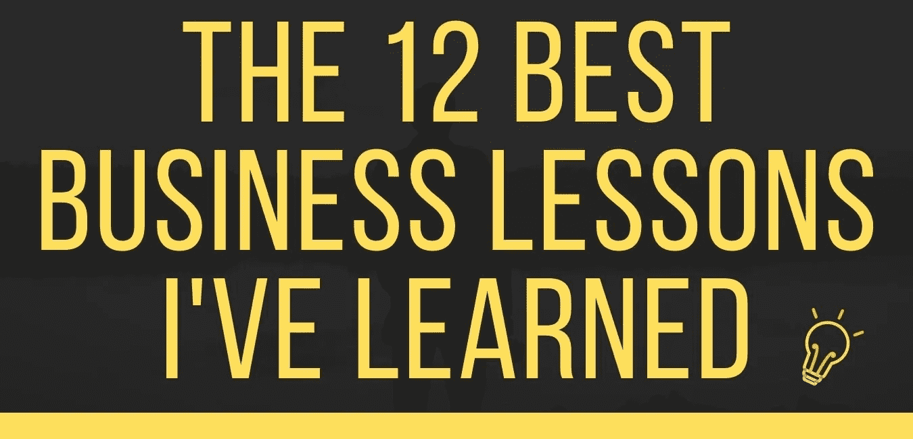

# 迄今为止我学到的 12 条最佳商业经验

> 原文：<https://medium.datadriveninvestor.com/the-12-best-business-lessons-ive-learned-so-far-39ad91c67ca9?source=collection_archive---------27----------------------->

迄今为止我学到的 12 条最佳商业经验。在企业内部和周围工作了 5-6 年后，我学到了无数的经验教训，有些是我所渴望的，有些则不是。然而，这里列出了对我来说最重要的几课。我想指出的是，我有很多东西要学，而且我一直在改变我的想法，考虑到这一点，我希望你能从这些课程中学到一些东西。
最热情的问候，
[*阿涅克汗*](http://aneeqekhan.com)

## 你的想法并不新颖

如果我每次都有一块钱，我就有了一个突破性的商业想法，这个想法将会改变世界。我的名字是杰夫·贝索斯。好的一面是，这个计划不一定要独一无二才能成功。只是必须有所不同。苹果并不是第一个发明便携式音乐播放器的公司。

## 你不能什么都自己做

这家离家很近。很容易认为你需要做所有的事情。组建一个团队至关重要，因为一个人能为一家企业贡献的时间和能力是有限的。学会放手，让别人锻炼自己的技能。

## 被动收入不存在

是&不是。当然，被动收入是存在的，但不是互联网大师们声称的那种被动收入。“如果你想一周挣 10，000.00 美元，请看完这段视频。&注册我的课程以了解更多信息”。如果听起来好得不像真的，那很可能就是真的。这些人赚钱的唯一原因。这是因为每个人都试图逃离“硬院子”好吧，我不想告诉你；没有秘密，只有努力。如果有秘密的话，人们不会为了 399 美元就把它送人。你可以建立自动化的微收入流来支持你，但即使这样也需要数月或数年的工作。以下是一些实际被动收入的例子:

*   自动化电子商务
*   出租物业(假设你已经付清)
*   联盟营销
*   另类投资
*   股市

## 如果你是一个超能力的神就最好了

Excel 好玩！我知道，我知道！请听我说完！Excel 将帮助你组织难以置信的数据。Excel 不仅使这一过程非常快，而且减少了人为错误的空间。

## 你不需要 73 个导师

事实是，你需要导师来帮助你理解这些见解。然而，你不需要人们来指导你生活的方方面面。给创新和犯错留一点空间。我发现那些虔诚地追随他们的“导师”的人只是在复制和粘贴，没有留下创新的空间。

## 沟通是关键

我不得不艰难地学会这一点。事实是，我们都会犯错误；一些大的将花费数千美元，一些可能会以一点点失望而告终。沟通几乎可以预防或解决任何问题。
**注意** : *如果你的项目遇到了复杂的情况:在到期日落后或者不能兑现你的承诺。我发现最好开诚布公地与你的客户交流，讨论可能的解决方案。*

## 你的朋友不会支持你。

这是我学到的最重要的一课。或者正如弗兰克·委拉斯开兹所说:人家不会来的。最疯狂的是当你开始创业的时候。你会认为你的朋友会是第一个支持你的人。我的意思是他们总是在那里喜欢你的狗图片。不管是嫉妒还是他们只是在扮演旁观者，不管是什么。我了解到你的大多数朋友都会视而不见。让我明确地说，我不是在说你所有的朋友。有些朋友会支持你的每一步，甚至激励你。我们喜欢那些朋友。

## 你不必总是同意你的商业伙伴

我和我的商业伙伴特伦斯一直在争论，我们不同意的比我们同意的多。事情是这样的，我发现我们是一个伟大的团队，因为我们可以带来不同的观点。

## 你会经常失望，你会经常失败

不管你知道多少，计划多少，失败总会找上你，你会失望，但没关系，你只需要成功一次。威尔·史密斯说得很好。

> “失败是所有教训的来源。所以早点失败，经常失败，勇往直前。”

## 你将不得不长时间工作

我从中学到的第一课就是没有什么能打败努力工作。一天中没有足够的时间来完成所有的事情，所以让我告诉你一个有趣的事实:8 小时工作日有时可能更像 12 小时工作日。
**注**:忙碌和高效是有区别的。因此，8 小时工作日是多-少 4 小时的实际工作和 4 小时的松散。我一直在学习每当我松垮的时候抓住自己。最好工作 4 个小时，有效率。

## 实现漂亮的系统

我对此感到兴奋，因为这是我最喜欢的话题之一，无论你是在经营自己的企业还是为别人工作，实施一些智能系统和工具将使运营更加高效和有效。以下是我认为对您有价值的几个系统:

**密码管理器**:你手上会有很多密码。密码 1 不好。我用 Dashlane 看看这里。
**CRM:** 我无法告诉你一个简单的 CRM 能在一个企业中解决多少问题。这将有助于达成更多销售，集中沟通并确定改进领域。我一直在用 Hubspot。这是一个一体化的解决方案和直观的使用系统。

## 最后但同样重要的是，享受吧！

最后但同样重要的是，享受吧。我知道这是老生常谈，但它是必不可少的。问题是，我们都可能陷入奢侈的商业计划和忙碌中，但我们不要忘记工作是生活中重要的一部分。所以享受生活是很重要的，不管你是否在工作，留点空间给笑声。享受吧，我想用下面的话来结束我的演讲:

> 没有笑声的地方就没有成功。安德鲁·卡内基