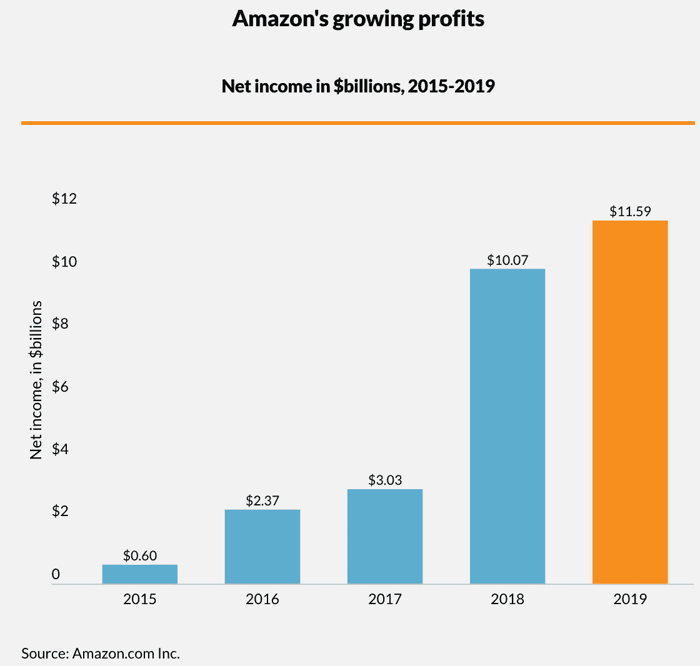

# 这是零售业末日的 120 亿美元的原因

> 原文：<https://medium.datadriveninvestor.com/the-12-billion-reason-why-this-is-the-retail-apocalypse-f250d2fdcbc7?source=collection_archive---------8----------------------->

## 冠状病毒如何在未来五年推出电子商务，以及为什么节俭变得更性感。

Photo by [Kyle Johnson](https://unsplash.com/@kylejeffreys?utm_source=unsplash&utm_medium=referral&utm_content=creditCopyText) on [Unsplash](https://unsplash.com/s/photos/empty-mall?utm_source=unsplash&utm_medium=referral&utm_content=creditCopyText)

任何有脉搏的人都可能告诉你，亚马逊(Amazon)的销售额目前正在飙升，其中一个重要原因是冠状病毒。自冠状病毒爆发以来，亚马逊已经增加了大约 2000 万新用户，以应对全球疫情封锁的扩张。

亚马逊已经证明，一旦你进入他们的一键式购买环境，你会很想留下来。因此，你可以很容易地想象，即使[帕累托法则](https://en.wikipedia.org/wiki/Pareto_principle)成立(也称为 80-20%法则)，并且只有 400 万用户被长期保留，这对亚马逊的用户群来说仍然是一个巨大的增加。

 [## 影响者在聚光灯下表演|数据驱动的投资者

### 影响者营销是一个脱颖而出的游戏。结果是一个令人难忘的-和可信的-连接到一个产品或…

www.datadriveninvestor.com](https://www.datadriveninvestor.com/2020/01/15/influencers-perform-in-the-spotlight/) 

甚至在新冠肺炎之前，亚马逊[的销售额在 2019 年增长了](https://www.digitalcommerce360.com/article/amazon-sales/) 20.5%，反映出 116 亿美元的收入。相比之下，2015 年的收入仅为 26 亿美元。在短短五年内，该公司的净收入从 6 亿美元增长到 115.9 亿美元。相比之下，从 2016 年到 2017 年，实体店销售额[增长了 2%](https://www.thebalancesmb.com/compare-brick-and-mortar-stores-vs-online-retail-sites-4571050) ，而电子商务销售额增长了 16%。尽管中国经济一直在稳步增长，但实体销售相对于电子商务的增长比例表明，电子商务在多大程度上盖过了实体销售的增长。

Amazon’s growing profits, Source: Amazon.com Inc.

# 是什么支撑着这种向电子商务的彻底转变？

67%的千禧一代和 56%的 X 一代更喜欢网上购物。甚至有少数婴儿潮一代更喜欢网上购物(41%的婴儿潮一代和 28%的老年人群体)。亚马逊的一键购买策略正在拉近人们与公司生态系统的距离。

实体店长期以来一直处于低迷状态。西尔斯[于 2018 年宣布破产](https://www.cnn.com/2019/10/15/business/sears-outlook-bankruptcy-anniversary/index.html)。许多老一代人是伴随着西尔斯和罗巴克的目录长大的。西尔斯曾经是这个星球上最大的零售商。为了证明这次衰退的真实性，2010 年，[西尔斯在全球拥有 3500 家店铺](https://www.businessinsider.com/rise-and-fall-of-sears-bankruptcy-store-closings)。10 年后的 2020 年，这个数字已经从 3500 家下降到只有 182 家。2010 年开业的西尔斯商店中，今天还在营业的不到 10%。这并不意味着西尔斯一定会重蹈恐龙的覆辙。毕竟，有时“精益”意味着*高效*，但与此同时，人们看不到那种程度的低迷，并认为“哦，这是健康的。”

如果西尔斯想要在这场我们处理商务方式的全球变革中生存下来，他们还有很多改造的工作要做。继续关注美国的剧院，想想玩具反斗城，这个多产的玩具巨头，到 2007 年已经将 97%的营业利润用于偿还债务。这个令人难以置信的统计数字意味着玩具反斗城只有 3%的收入用于研发、再投资和收购新资产。最终，私募股权收购了玩具反斗城，导致债务膨胀，以拯救该公司。最终，这个玩具巨头破产了。

百视达是另一个例子，说明那些不听煤矿里金丝雀声音的实体企业最终会面临与玩具反斗城和西尔斯同样的问题。Blockbuster 以闪电般的速度被淘汰(Redbox，不久后是网飞),这仅仅是因为消费媒体的基础设施已经到位，所需要的只是一种将内容直接传送到消费者起居室的方法。

Blockbuster 从未放弃物理产品范式，或者至少没有足够快地采取行动来适应当前的时代。今天，亚马逊正在从现有的实体零售商那里拿走大部分蛋糕。

# 购物中心是零售业末日的领头羊。

1970 年至 2015 年间，美国购物中心的数量增长速度是人口增长速度的两倍，如今美国购物中心的数量达到了 1200 家。在大萧条期间客流量遭受重创后，购物中心现在有 10%的零售空置率(T3)。当你考虑这些购物中心占用的土地数量时，这是一个巨大的空置空间，其中大部分正在经历结构性衰退。

新冠肺炎之前的一些购物中心仍然很成功，但总的趋势是购物中心正在消亡。有一整个 [Youtube 频道](https://www.youtube.com/playlist?list=PLNz4Un92pGNxQ9vNgmnCx7dwchPJGJ3IQ)致力于穿越这些 90 年代曾经的幽灵般的外壳的奇怪怀旧。

Dead Mall Series by Dan Bell

像西尔斯和 JC Penney 这样的公司在购物中心的生存中扮演着重要的角色。他们被称为“锚店”，多年来，这些公司要么进入财务困境，要么从这些集中购物中心撤资。当这些锚店将其商业影响力从购物中心撤出时，也会对租赁空间的较小商店产生负面影响，如 Radio Shack 或 Urban Outfitters。锚店为小商店带来了主要的客流量和收入，所以当一个多米诺骨牌倒下时，其他的很有可能会跟着倒下。

# 这不是一个单向趋势:零售不会完全在线。

Scott Galloway [提到了](https://www.bloomberg.com/news/videos/2015-02-23/why-e-commerce-needs-a-brick-and-mortar-presence)小型实体店的可行性，以及所有零售商采用多渠道或“[砖块和点击](https://www.npr.org/2019/09/26/764548415/why-more-online-retailers-are-opening-brick-and-mortar-locations) s”业务模式的必要性。最近的趋势当然支持这些观点。最初作为电子商务企业出现的零售商店，现在正以实体店的形式出现在全国各地。对于一家纯粹基于电子商务的公司来说，这是一个很好的举措，原因有很多。

想象一下，你要订购一条 12 号的裤子，但它们不太合身，然后你转身又订购了一条 10 号的。它们也不合适。如果你是那位顾客，你通常不会负担将裤子运回订购公司的费用。当客户不满意时，电子商务商店通常会支付退回产品的运费。最终，这意味着如果你在一个人口非常密集的大都市地区，对于一家电子商务公司来说，开设一家实体店会更具成本效益，这样客户可以进来并实际退还他们的商品，也许可以试穿不同的裤子，看看哪种最适合他们，然后做出最后的购买决定。对客户来说，这里有一定程度的个性化，如果说有什么不同的话，那就是对业务有好处。

就像网上商店一样，实体店可以以鼓励冲动购买的精明方式向客户营销——人们进来时，他们看到了他们喜欢但不打算购买的产品，客户就在那里做出了购买该产品的冲动决定，或者他们在稍后的日期回来并购买该产品。在这种情况下，实体店的成功很大程度上取决于客户体验的水平。苹果是实体店卓越客户体验的典范。**听听盖洛韦教授的话—**

> "商店是关系的完美体现。"

Professor Scott Galloway talks brand strategy.

JC Penney 是一个很好的例子，说明零售业的末日可能比实体店的死亡更像是一场*革命。以专门采购二手商品的电子商务公司 [Thredup](https://www.thredup.com/) 为例。尤其是千禧一代和 Z 世代，他们对购买二手衣服和其他商品没有任何意见，因为数据显示，年轻一代在环保和金融方面很有头脑(考虑到最近的经济事件，这只是时间上的巧合)。减少浪费，降低成本。像 JC Penny [这样的公司正在加紧](https://www.packagingstrategies.com/articles/95188-re-commerce-online-retail-moves-to-brick-and-mortar)为 Thredup 这样的初创公司提供负担得起的实体零售空间，而所有这些额外的空间都积满了灰尘，JC Penny 为什么不利用这一趋势呢？*

# 当人们奔向主街时，疫情将创造一种节俭的回归

随着冠状病毒引起的封锁开始解除，人们可能会激增到他们最喜欢的餐馆、酒吧，是的，还有实体零售店。社交距离的影响对实体企业来说是毁灭性的，但你可以观察到在封锁软化的地方，实体企业的销售额有时会在一夜之间膨胀 30%。餐饮行业之外的大部分客流量无疑是由于人们强烈渴望简单地走出去，做正常的人的活动，看看他们的朋友和家人，*恢复正常*。原来人际交往很重要，谁能想到呢？

# 结论:

**实体建筑并没有消亡，但它更精简、更节俭、更多样化。**

我将以一个额外的预测来结束这个故事。结合年轻人口中节俭的流行，每个人都将努力适应的检疫后“新常态”，以及向砖头和点击的转变，你只剩下 2020 年的黑帮行动…悬念。

# 经销商将在经济衰退中胜出。

向未来迈进一步，紧急状态结束后的第一个月。人们会想在他们的房子周围出售他们不需要的东西来赚点外快，会有一个庭院销售的爆炸，这不是你典型的 80 年代快餐玩具那种庭院销售。我们不是在谈论咖啡杯和胳肢我埃尔莫。人们将会出售娱乐系统、游戏机、运动器材、*高价商品*。想象一下，在百货商店连续两个月停滞不前之后，零售行业的仓库里充斥着大量的过剩库存。其中一些商店正在关闭。对于那些准备投资的人来说，这两个月的零售封锁为你提供了一个千载难逢的机会。

社会在许多方面都采用了大萧条的思维模式，在这种情况下，这并不是一个糟糕的举动。在 20 世纪 30 年代，口号是…

"用完它，用坏它，将就或不将就。"

也许我们毕竟从历史中学到了一些东西。

# 深入研究

如果你对这篇文章有共鸣，请[订阅我的个人博客](https://bit.ly/2KMXZoA)。我几乎每天都在财经上发帖，偶尔落下一些自我提升的知识。如果你觉得生活有点停滞不前，看看我写的关于写日记的文章。