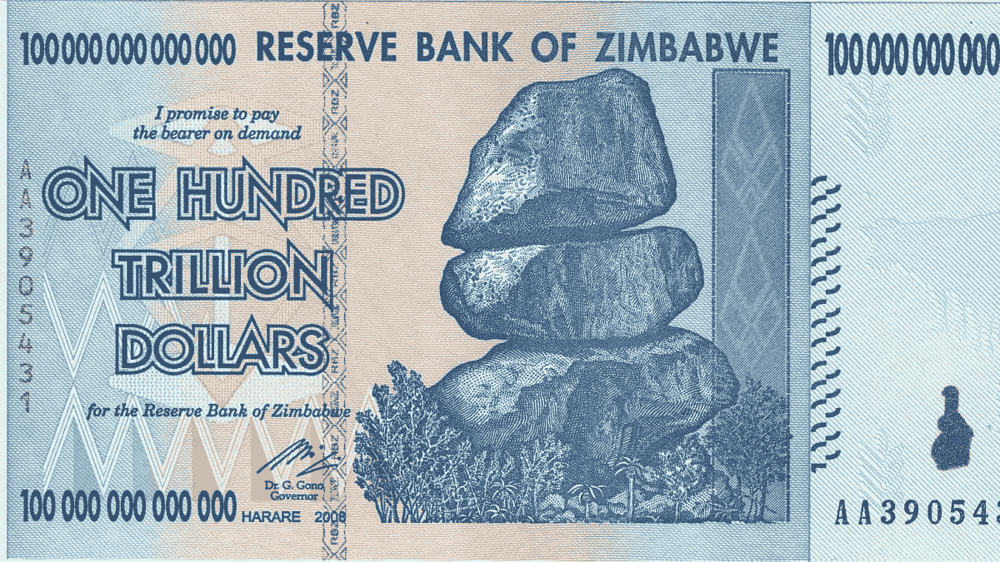

# 第一个万亿富翁将会破坏能源生产

> 原文：<https://medium.datadriveninvestor.com/the-1st-trillionaire-will-be-the-person-that-disrupts-energy-generation-2ad33ea9abb6?source=collection_archive---------3----------------------->

100 Trillion Dollar note from a hyperinflationary period in Zimbabwe

气候变化和转向可再生能源是我们经常听到的事情。狂热分子认为这才是最重要的，因为如果不解决这个问题，地球将会自我毁灭，而否认主义者认为这只是政府和压力集团的又一个议程。

很少有人从金融角度来看待这个问题。亿万富翁 Chamath Palihapitiya 认为对廉价可再生能源的需求是一个万亿美元的问题，一旦解决，将创造第一个万亿美元。我已经想了很久了。查马斯是对的。

现代文明是围绕电能建立的。这是我们每天都在消耗的东西。

如果某个玩家设法降低发电和储存电力的成本，从根本上颠覆这个行业，他肯定会成为万亿富翁。

解决方案将不得不勾选很多框。它必须是清洁能源。它必须是可再生的。前期购买成本必须很低，维护成本必须非常低。

太阳能与普通电力的成本相差甚远。然而，随着时间的推移，它最终会到达那里。彭博估计到 2050 年(30 年后)成本会持平。

值得注意的是，在世界上一些常规电价非常高的地方，太阳能已经实现了成本平价。这是个例外。

发电是垄断行业。国家或国有企业通常有权建造发电站并向其公民出售电力。私人参与者最近进入了太阳能发电厂、水力发电厂和风力发电厂领域。

迟早，某个地方的某人会投入数十亿美元进行研究工作，以获得以下三个结果:

1.  降低太阳能电池板成本
2.  降低电池成本
3.  提高太阳能电池板和电池的寿命

尽管太阳能有终生储蓄，但大多数消费者没有能力花大价钱购买太阳能系统。围绕这个问题的一个巧妙的融资结构将把太阳能送到数百万家庭手中。也许它可以像过去 100 年的汽车金融一样融资。

以下因素在起作用:

*   **颠覆**—将传统上高度集中的行业分割和颗粒化。
*   **赢家通吃**——凭借规模和先发优势垄断市场。一个额外的网络效应将是至关重要的，即能够将家庭与一个高效的互联市场联系起来，在这个市场上，他们可以买卖多余的电力，并在需要时购买。
*   **发电的分散化**——大部分电力将由消费单位(家庭或企业)生产，而不是主要由公用事业单位生产。
*   **能源生产的民主化** —垄断公用事业公司手中的定价权太多了。输电需要垄断，但发电不一定要垄断。垄断性公用事业的收费一直在上涨。
*   **扩大市场**——在消费点生产的低成本可再生能源肯定会改善获取途径，从而为目前还没有用上电的 10 亿人带来电力。
*   **扩大电力市场(用例)** —随着电动汽车取代化石燃料汽车，电动汽车领域的进步将推动电力需求的增长。

成本平价后，分散发电机组将慢慢吃掉垄断公用事业。价值将从公用事业转移到任何一家干扰能源发电的公司。

# 特斯拉领先…

目前，埃隆马斯克(Elon Musk)的特斯拉能源公司(Tesla Energy)在这场竞赛中领先。特斯拉对上述因素表现出了敏锐的理解。特斯拉的伙计们确切地知道需要做什么，以及未来会发生什么。

**特斯拉有:**

1.  最好的电池
2.  最好的面板
3.  最佳集成解决方案(电池板和电池等)，太阳能屋顶为储存能量的电力墙供电。
4.  最佳人工智能驱动的供应预测和需求预测程序

特斯拉很可能从扰乱能源业务中获得比扰乱汽车行业更多的钱，因为发电量大于汽车行业。

特斯拉提供的能源解决方案似乎不是他们从第一天开始就打算做的事情，而是他们在制造最好的电动汽车的过程中遇到的事情。在制造出最好的电池后，他们意识到它也可以用来储存家庭用电，他们意识到传统公用事业的电力成本很高，而且还在不断上涨，然后他们发现他们可以自己发电。然后是“啊哈”的时刻。他们可能会扰乱发电行业。

发电业务是他们独创性的副产品。这是次要的表演。这是一项课外活动。他们是否意识到他们可以从这项业务中获得比汽车市场更多的利润？也许是，也许不是。

# **清洁可再生能源业务会有多大？我们在谈论多少价值？有什么好捕捉的？**

有一个简单的方法来回答这个问题？

1.  你的电费账单有多大，你的邻居和你表弟的电费账单有多大？乘以地球上所有的家庭。
2.  世界上的工厂、工业和所有机械消耗了多少电？
3.  你的汽油费有多少？因为未来的汽车将使用电力而不是汽油。汽油业务有多大？加油站获得了多少价值？石油出口国获取的价值呢？
4.  物联网(IOT)将使多少设备联网，从而需要连接到电源，推动消费和需求？很快你的床将需要连接到电源，这样它就可以跟踪和记录你的睡眠模式和你的沙发，测量你的体重，坐着的时间等，以利于你的全科医生需要你的整体健康数据，以便对你进行正确的诊断。你的门需要安装电子传感器。这些东西以前从来不需要电。

要捕捉的价值是巨大的。谁先找到一个普遍适用的公式，谁就是亿万富翁。

埃隆·马斯克(Elon Musk)不愧是地球上最富有的人。特斯拉在能源行业有所发现。

再见。